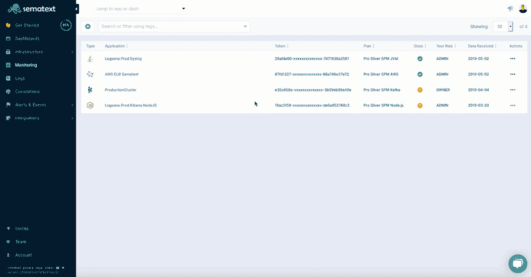
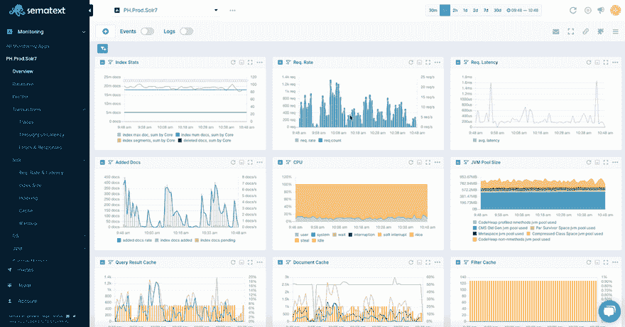
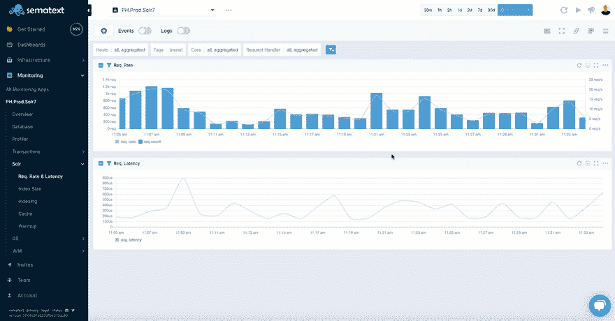

# Sematext 简化了 Solr 监控

> 原文：<https://dev.to/sematext/solr-monitoring-made-easy-with-sematext-45b0>

如第 1 部分[中所示，Solr 监控的关键指标](https://sematext.com/blog/solr-key-metrics-to-monitor/)，Solr 的设置、调优和操作需要深入了解性能指标，如请求速率和延迟、JVM 内存利用率、垃圾收集器工作时间和计数等等。Sematext 为其他 Solr 监控工具提供了一个很好的选择。

# sema text 如何为您节省时间、工作和成本

这里有一些在使用 Sematext 进行 Solr 监控时不必做的事情:

1.  确定收集哪些指标，忽略哪些指标
2.  给指标贴上有意义的标签
3.  在文档中寻找指标描述，这样你就知道每一个指标实际上显示了什么
4.  构建图表以将您真正想要的指标分组到同一个图表上，而不是几个单独的图表上
5.  确定每组指标使用哪种聚合(最少？麦克斯。平均？还有别的吗？)
6.  设置基本警报规则

以上这些甚至都不是一个完整的故事。你想收集 Solr 日志吗？如何构建它们？Sematext 会自动为您完成这一切！

在本帖中，我们将看看 Sematext 如何在您的基础设施中为 Solr 和[其他技术](https://sematext.com/integrations/)提供更全面且易于设置的[监控。通过将事件、日志和指标组合在一个集成的](https://sematext.com/integrations/solr-monitoring/)[全栈可观测性平台](https://sematext.com/cloud)中，并使用 Sematext 开源监控代理及其集成(也是开源的)，您可以监控您的整个基础架构和应用，而不仅仅是 Solr。通过[收集、处理和分析您的日志](https://sematext.com/logsene/)，您还可以更深入地了解您的整个软件堆栈。

# Solr 监控

## 收集 Solr 指标

Sematext Solr integration 为各种缓存、请求、延迟等收集了超过 30 个不同的 Solr 指标。 [JVM 监控](https://sematext.com/java-monitoring)也包括在内。Sematext 维护和支持[官方 Solr 监控集成](https://github.com/sematext/sematext-agent-integrations/tree/master/solr)。此外，Sematext Solr 集成是可定制和开源的。

底线:您不需要为度量收集配置代理，这是第一个巨大的时间节省！

## 安装监控代理

设置监控代理不到 5 分钟:

**第一步。在[集成/概述](https://apps.sematext.com/ui/monitoring-create)(或 [Sematext Cloud Europe](https://apps.eu.sematext.com/ui/monitoring-create) )中创建一个 Solr App** 。这将允许您安装代理并控制对监控和日志数据的访问。短[sema text Cloud](https://www.youtube.com/watch?v=tr_qxdr8dvk&index=14&list=plt_fd32ofypflbfzz_hiafnqjdltth1ns)视频中什么是 App 有更多细节。

**第二步。将您的 Solr 监控应用程序命名为**，如果您也想收集 Solr 日志，可以创建一个日志应用程序。

**第三步。根据 UI 显示的[设置](https://apps.sematext.com/ui/howto/solr/overview) [指令](https://apps.sematext.com/ui/howto/solr/overview)安装语义代理**。

[](https://res.cloudinary.com/practicaldev/image/fetch/s--EB148iB8--/c_limit%2Cf_auto%2Cfl_progressive%2Cq_66%2Cw_880/https://thepracticaldev.s3.amazonaws.com/i/0fq15ov6isetzdmtt6of.gif)

例如，在 Ubuntu 上，使用以下命令添加 Sematext Linux 包:

```
echo "deb http://pub-repo.sematext.com/ubuntu sematext main" | sudo tee
/etc/apt/sources.list.d/sematext.list > /dev/null
wget -O - https://pub-repo.sematext.com/ubuntu/sematext.gpg.key | sudo apt-key add -
sudo apt-get update
sudo apt-get install spm-client 
```

然后通过准备 Solr 服务器连接细节来设置 Solr 监控:

```
sudo bash /opt/spm/bin/setup-sematext  \
    --monitoring-token <your-monitoring-token-goes-here>   \
    --app-type solr  \
    --agent-type javaagent  \
    --infra-token <your-infra-token-goes-here> 
```

最后，调整你的 *solr.in.sh* 文件:

```
SOLR_OPTS="$SOLR_OPTS -Dcom.sun.management.jmxremote
-javaagent:/opt/spm/spm-monitor/lib/spm-monitor-generic.jar=::default" 
```

**第四步。去喝一杯吧…但是要快**–Solr 指标将在不到一分钟内开始出现在你的图表中。

## Solr 监控仪表板

当您打开 Solr 应用程序时，您会发现一组预定义的仪表板，这些仪表板将 60 多个 Solr 指标和常规[服务器监控](https://sematext.com/server-monitoring/)组织在预定义的图表中，这些图表组合成一组直观组织的监控仪表板:

1.  所有关键 Solr 指标的图表概览
2.  操作系统指标，如 CPU、内存、网络、磁盘使用等。
3.  Solr 度量
    *   **请求速率&延迟**:每秒请求数，请求延迟，包括百分位数
    *   **索引大小** : Solr 数据大小，文件系统统计
    *   **索引**:添加文档、按标识符删除、按查询删除、提交事件、其他事件，如更新错误或删除删除
    *   **缓存**:查询结果缓存、文档缓存、过滤器缓存和每段过滤器缓存指标
    *   **预热**:搜索器和缓存预热时间

[](https://res.cloudinary.com/practicaldev/image/fetch/s--z6f3CmGJ--/c_limit%2Cf_auto%2Cfl_progressive%2Cq_66%2Cw_880/https://thepracticaldev.s3.amazonaws.com/i/mbk7v1p26famvh9szboa.gif)

## 设置 Solr 预警

为了节省您的时间，Sematext 会自动创建一组默认的警报规则，例如磁盘空间不足警报。您可以针对任何指标创建附加警报。更多详细信息，请查看语义云中的[警报。](https://www.youtube.com/watch?v=we9xauud28o)

## Solr 指标警报

Sematext 中有三种类型的警报:

*   **心跳警报**，当 Solr 服务器关闭时，它会通知您
*   传统的**基于阈值的警报**，当指标值超过预定义的阈值时会通知您
*   基于统计[异常检测](https://sematext.com/blog/introducing-algolerts-anomaly-detection-alerts/)的警报，当指标值突然改变并偏离基线时会通知您

让我们看看如何在下面的动画中为**请求率**指标实际创建一些警报规则。**请求率**图表显示请求数量下降。我们通常每秒有三个以上的请求，但是我们可以看到它下降到零。我们希望得到有关此类情况的通知。要根据指标创建警报规则，我们需要转到图表右上角的下拉菜单，然后选择“Create alert”。警报规则应用当前视图中的过滤器，您可以选择各种通知选项，如电子邮件或配置的[通知挂钩](https://sematext.com/docs/alerts/#alert-integrations)([page duty](https://sematext.com/docs/integration/alerts-pagerduty-integration/)、 [Slack](https://sematext.com/docs/integration/alerts-slack-integration/) 、 [VictorOps](https://sematext.com/docs/integration/alerts-victorops-integration/) 、 [BigPanda](https://sematext.com/docs/integration/alerts-bigpanda-integration/) 、 [OpsGenie](https://sematext.com/docs/integration/alerts-opsgenie-integration/) 、 [Pushover](https://sematext.com/docs/integration/alerts-pushover-integration/) 、[通用 web 挂钩](https://sematext.com/docs/integration/alerts-webhooks-integration/)等。).通过异常检测、观察给定时间窗口内的指标变化或使用传统的基于阈值的警报来触发警报。

[](https://res.cloudinary.com/practicaldev/image/fetch/s--eiy6E9Mz--/c_limit%2Cf_auto%2Cfl_progressive%2Cq_66%2Cw_880/https://thepracticaldev.s3.amazonaws.com/i/3nx7ktso5uiuuc1r9p5l.gif)

# 监控 Solr 日志

## 发货 Solr 日志

由于在一个平台中拥有[日志和指标](https://sematext.com/metrics-and-logs/)使得故障排除更加简单和快速，所以让我们也发布 Solr 日志。您可以使用[许多日志运送器](https://sematext.com/docs/integration/#logging)，但是我们将使用[日志代理](https://sematext.com/logagent/)，因为它是轻量级的，易于设置，并且因为它可以解析和构造开箱即用的日志。日志解析器提取时间戳、严重性和消息。对于查询跟踪，日志解析器还提取唯一的查询 ID 来对与查询执行相关的日志进行分组。

**第一步。** [创建日志 App](https://apps.sematext.com/ui/integrations) 获取 App 令牌

**第二步。**安装 Logagent npm 软件包

```
sudo npm i -g @sematext/logagent 
```

如果没有 Node，可以轻松安装。例如在 Debian/Ubuntu 上:

```
curl -sL https://deb.nodesource.com/setup_8.x | sudo -E bash -
sudo apt-get install -y nodejs 
```

**第三步。**通过指定日志令牌和 Solr 日志文件的路径来安装 Logagent 服务。

您可以使用-g*'/var/solr/logs/*. log `*仅从 Solr 服务器发送日志。如果你在同一个服务器上运行其他服务，比如 ZooKeeper 或者 MySQL，考虑发送所有日志。默认设置从*/var/log/*/运送所有日志。log*当未指定 *-g* 参数时。

Logagent 检测 init 系统并安装 Systemd 或 Upstart 服务脚本。在 Mac OS X 上，它创建了一个 launchd 服务。只需运行:

`` bash
sudo log agent-setup-I YOUR _ LOGS _ TOKEN-g '/var/Solr/LOGS/*。“日志”`

 `# 为欧盟地区:

# sudo logagent-setup-I LOGS _ TOKEN \

# -u logsene-receiver.eu.sematext.com

# [【g】【var/log/**/【foo】*log](#g-varlogfoolog)

`

 `安装脚本在*/etc/sema text/logagent . conf*中生成配置文件，并将 log agent 作为系统服务启动。

注意，如果你[在容器](https://sematext.com/blog/docker-solr/)中运行 Solr，[为容器日志](https://sematext.com/docs/logagent/installation-docker/)设置日志代理。

## 日志搜索和仪表盘

Sematext 中有一个日志，您可以在故障排除时搜索它们，保存您经常运行的查询或**创建您自己的日志仪表板**。

[](https://res.cloudinary.com/practicaldev/image/fetch/s--Q04BvvM_--/c_limit%2Cf_auto%2Cfl_progressive%2Cq_auto%2Cw_880/https://thepracticaldev.s3.amazonaws.com/i/xjv9rj93wdhed7tctdn5.png)

### 日志搜索语法

如果你知道如何用谷歌搜索，你就会知道如何在 Sematext Cloud 中搜索你的日志。

*   使用 AND、OR、NOT 运算符–例如*(错误或警告)NOT exception*
*   将 AND、OR、NOT 子句分组，例如*消息:(异常或错误或超时)和严重性:(错误或警告)*
*   不喜欢布尔人？使用+和–来包含和排除–例如*+消息:错误-消息:超时-主机:db1.example.com*
*   明确使用字段引用–例如*消息:超时*
*   需要短语搜索吗？使用引号–例如*消息:“致命错误”*

在浏览日志时，你可能会发现自己一次又一次地运行相同的搜索。为了解决这个问题，Sematext 允许您保存查询，这样您就可以快速地重新执行它们，而不必重新键入它们。请注意使用日志进行故障排除是如何简化您的工作的。

## Solr 日志预警

要在日志上创建警报，我们首先运行一个查询，该查询与我们希望获得警报的日志事件完全匹配。要创建警报，只需单击搜索框旁边的“创建保存的查询/警报规则”图标。

[](https://res.cloudinary.com/practicaldev/image/fetch/s--WXPJ8hUI--/c_limit%2Cf_auto%2Cfl_progressive%2Cq_auto%2Cw_880/https://thepracticaldev.s3.amazonaws.com/i/07ojqtgwkz74vtrsphhp.png)

与度量警报规则的设置类似，我们可以根据警报查询返回的匹配日志事件的数量来定义基于阈值的警报或异常检测警报。

[](https://res.cloudinary.com/practicaldev/image/fetch/s--4Wf0QNU6--/c_limit%2Cf_auto%2Cfl_progressive%2Cq_auto%2Cw_880/https://thepracticaldev.s3.amazonaws.com/i/k9cuyrvyfcvpvyxapgvj.png)

更多详情请查看语义云中的[警报。](https://www.youtube.com/watch?v=we9xauud28o)

## 从 Solr 日志中发现常见的 Solr 问题

运行 Solr / SolrCloud 时，您可能需要注意一些常见问题:

*   ZooKeeper 断开连接，你可以用*+ZooKeeper connection+watcher+disconnected*找到

[](https://res.cloudinary.com/practicaldev/image/fetch/s--yyCQdYxJ--/c_limit%2Cf_auto%2Cfl_progressive%2Cq_auto%2Cw_880/https://thepracticaldev.s3.amazonaws.com/i/b60vejxhaxwzdja2nfjx.png)

*   自动提交操作的问题:*+自动+提交+错误*
*   缓存预热问题:。*+错误+期间+自动+预热*
*   提交操作的问题:*+无法+分发+提交*
*   SolrCloud 领袖选举议题:*+符合+例外+放弃+领导*
*   碎片问题:*+无+服务器+托管+碎片*

当然，您可能希望将其中一些保存为警报。

## Solr 指标和日志关联

典型的故障排除工作流程从检测指标中的峰值开始，然后深入日志以找到问题的根本原因。Sematext 让这变得非常简单快捷。您的指标和日志在同一个屋檐下。日志集中，搜索速度快，强大的[日志搜索语法](https://sematext.com/docs/logs/search-syntax/)使用简单。指标和日志的关联只需点击一下鼠标。

[](https://res.cloudinary.com/practicaldev/image/fetch/s--8Fx-Gmcz--/c_limit%2Cf_auto%2Cfl_progressive%2Cq_auto%2Cw_880/https://thepracticaldev.s3.amazonaws.com/i/y5w4mcdwjvmd2ahgm8w5.png)

# Solr&好友的全栈可观测性

Solr 最好的朋友，尤其是在使用其 SolrCloud 模式时，是 [Apache ZooKeeper](https://zookeeper.apache.org/) 。SolrCloud 需要 ZooKeeper 来操作、处理分区和执行领袖选举。[同时监控 ZooKeeper](https://github.com/sematext/sematext-agent-integrations/tree/master/zookeeper) 和 SolrCloud 是至关重要的，这样可以关联两者的指标，并完全观察 SolrCloud 的操作。

[](https://res.cloudinary.com/practicaldev/image/fetch/s---Tistx6q--/c_limit%2Cf_auto%2Cfl_progressive%2Cq_auto%2Cw_880/https://thepracticaldev.s3.amazonaws.com/i/9cgm2vzzwornzyaovzo3.png)

# 用语义文本监控 Solr

对 Solr 的全面监控包括识别 Solr 的关键指标、收集指标和日志，以及以有意义的方式连接一切。在本文中，我们向您展示了如何在一个地方监控 Solr 指标和日志。我们使用 OOTB 和定制的仪表板、指标关联、日志关联、异常检测和警报。借助其他[开源集成](https://sematext.com/blog/now-open-source-sematext-monitoring-agent/)，如 [MySQL](https://github.com/sematext/sematext-agent-integrations/tree/master/mysql) 或 [Kafka](https://github.com/sematext/sematext-agent-integrations/tree/master/kafka) ，您可以轻松地开始监控 Solr 以及基础设施中所有其他技术的指标、日志和分布式请求跟踪。通过[免费 Sematext 试用](https://apps.sematext.com/ui/registration)深入了解 Solr。``