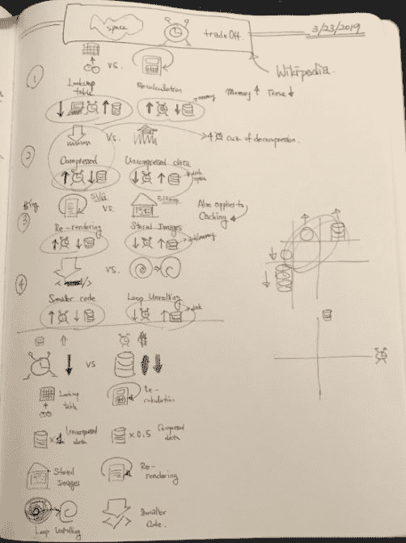

# 时空权衡表情符号笔记

> 原文：<https://dev.to/dance2die/space-time-tradeoff-emoji-note-1n2j>

安东尼分享了在谷歌面试的精彩技巧。

 [## 在谷歌面试？以下是你绝对需要做的 6 件事

### 安东尼 d .梅斯 3 月 23 日 194 分钟阅读

#interview #whiteboarding #career #coding](/anthonydmays/interviewing-at-google-heres-6-things-you-absolutely-need-to-do-22lo)

在第四个技巧[头脑风暴解决方案及其时间/空间复杂度](https://dev.to/anthonydmays/interviewing-at-google-heres-6-things-you-absolutely-need-to-do-22lo#4-brainstorm-solutions-and-their-timespace-complexity)中，Anthony 强调了“[时空权衡](https://en.wikipedia.org/wiki/Space%E2%80%93time_tradeoff)原理”，我对此已经略知一二。

在试图理解它的同时，我画了一张[草图](http://rohdesign.com/sketchnotes/)。

由于不可共享，我想出了表情符号版本。

# 时空权衡表

| *本文件迟交，是因为需要收集最新资料。 | (更快+更多空间) | 相对 | *本文件迟交，是因为需要收集最新资料。 | (较慢+空间较少) |
| --- | --- | --- | --- | --- |
| 🙄📑 | (查阅表格) |  | 🔃💻 | (重新计算) |
| 💾x 1 | (未压缩的数据) |  | 💾x 0.5 | (压缩数据) |
| 🏪🖼 | (存储的图像) |  | 🔃📜 | (重新渲染) |
| 【西班牙语】 | (循环展开) |  | 👨‍💻x 0.5 | (较小的代码) |

# 各取所需的要诀

1.  🙄📑(查找表)与🔃💻(重新计算)
    将计算的数据保存在内存中可以节省时间，但会增加空间的使用。

2.  💾x 1(未压缩数据)与💾x 0.5(压缩数据)
    访问未压缩数据更快，因为不需要解压缩步骤，但需要更多空间。

3.  🏪🖼(存储图像)与🔃📜(重新渲染)
    将图像存储在缓存中比重新渲染更快，但需要更多空间(在磁盘/内存中)。

4.  ➿➡➰(循环展开)与👨‍💻x 0.5(代码更小)
    [循环展开](https://en.wikipedia.org/wiki/Loop_unrolling)可以优化执行速度，代价是增加二进制大小。

这可能有点太多的表情符号，但帮助我更好地理解什么样的权衡是可用的。

欢迎分享您的表格或草图版本🙂