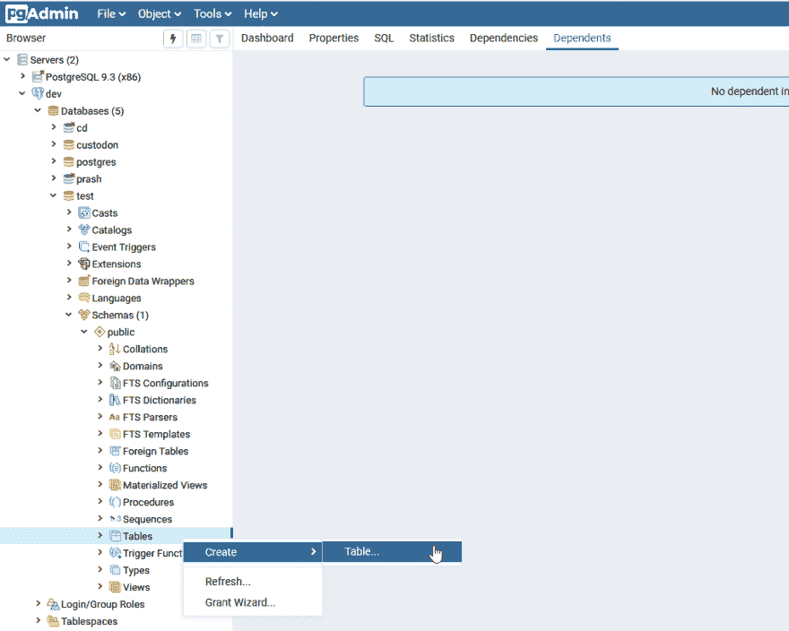
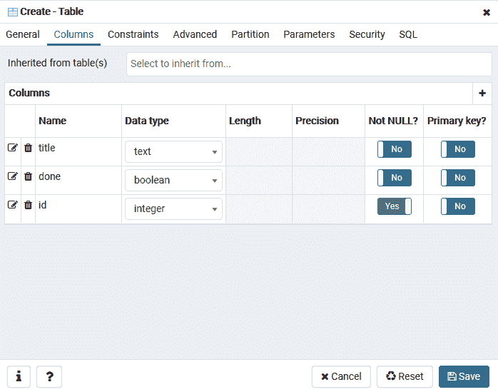
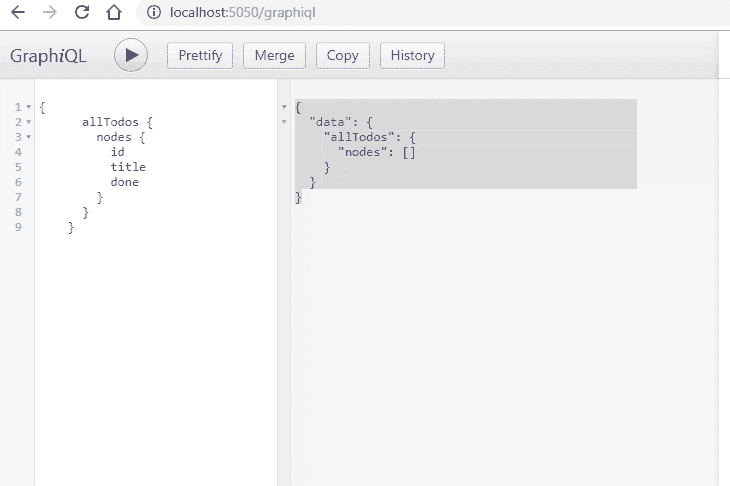

# 在 15 分钟内启动您自己的本地 GraphQL 服务器

> 原文：<https://dev.to/prashanth1k/spin-up-your-own-local-graphql-server-within-15-min-16nc>

使用 Postgres 数据库和 PostGraphile 的一点帮助，在 15 分钟内创建自己的 GraphQL APIs。不需要 GraphQL 服务器配置。

没有一个前端初学者说过“在开发我漂亮的 Vue 应用程序之前，我想尝试一下服务器，用心了解它们的内部结构”。

如果你是在 REST APIs 上构建，你有像 [JSONPlaceholder](https://jsonplaceholder.typicode.com/) 这样的公共服务。这些服务为待办事项、帖子、用户等提供了对广受欢迎的示例 API 的快速访问。

如果您是基于 GraphQL 构建的，那么没有太多的选择。过去一直在努力提供这样的 API，但都没有持续很久。解决方案是在本地创建它们。

本地 GraphQL 可能很麻烦。

当您开始时，可能会对 Express + GraphQL +一点配置+编写几行代码来开始服务任何新的 API 感到疑惑。有像 [json-graphql-server](https://github.com/marmelab/json-graphql-server) 这样的工具声称可以加速这个过程。然而，它们并没有保持最新，而且看起来并不适合 Windows(？).

所以，我做了下一件简单快捷的合乎逻辑的事情。使用 [PostgreSQL](https://www.postgresql.org/) 和[PostgreSQL](https://www.graphile.org/postgraphile/)创建一个你自己的环境。

### 初始设置

1.  [下载并安装 PostgreSQL](https://www.postgresql.org/download/) 。
    或者使用[拉腊贡和](https://laragon.org/download/)——这是一个非常好的地方发展控制中心。

2.  打开 pg admin——Postgres 的数据库管理应用程序。使用现有数据库或创建一个新数据库。右键单击模式>表，然后单击“新建表”。我假设您将使用一个名为“test”的数据库。创建一个名为“todo”的表。
    [](https://res.cloudinary.com/practicaldev/image/fetch/s--P4FDqOXt--/c_limit%2Cf_auto%2Cfl_progressive%2Cq_auto%2Cw_880/https://thepracticaldev.s3.amazonaws.com/i/r1zgwqkey67dq4226gnd.png) 

3.  创建几列
    [](https://res.cloudinary.com/practicaldev/image/fetch/s--3DAseB2b--/c_limit%2Cf_auto%2Cfl_progressive%2Cq_auto%2Cw_880/https://thepracticaldev.s3.amazonaws.com/i/vct03eyk1haeei1ksgb6.png) 

4.  启动您自己的 GraphQL 服务器。默认情况下，服务器使用端口 5000，但为了方便起见，我们将它改为 5050(也因为其他一些前端应用程序也使用 5000)

```
 npx postgraphile -c test --watch -p 5050 
```

Enter fullscreen mode Exit fullscreen mode

[](https://res.cloudinary.com/practicaldev/image/fetch/s--__UO7f76--/c_limit%2Cf_auto%2Cfl_progressive%2Cq_auto%2Cw_880/https://thepracticaldev.s3.amazonaws.com/i/x36h4bmkwlb2jjk3pvb7.png)

### 开始四处游玩

转到[[http://localhost:5050/graphiql](http://localhost:5050/graphiql)。复制/粘贴 GraphQL 语句以执行不同的操作。

##### 查询数据

查询数据。当然，这时候你什么也找不到。

```
{  allTodos  {  nodes  {  id  title  done  }  }  } 
```

Enter fullscreen mode Exit fullscreen mode

输出将是-

```
{
  "data": {
    "allTodos": {
      "nodes": []
    }
  }
} 
```

Enter fullscreen mode Exit fullscreen mode

[](https://res.cloudinary.com/practicaldev/image/fetch/s--JbKrv6bn--/c_limit%2Cf_auto%2Cfl_progressive%2Cq_auto%2Cw_880/https://thepracticaldev.s3.amazonaws.com/i/kheuy9t4ij6rieeycqe1.png)

##### 插入数据

在数据库中插入“待办事项”数据。

```
mutation  {  createTodo(input:  {  todo:  {  title:  "Create GraphQL server",  done:  true  }  })  {  todo  {  id  title  done  }  }  } 
```

Enter fullscreen mode Exit fullscreen mode

该语句将创建一个单独的待办事项，查询回`id`、`title`、&、`done`字段，并将其显示在屏幕的右侧。

[](https://res.cloudinary.com/practicaldev/image/fetch/s--VaUFF8H5--/c_limit%2Cf_auto%2Cfl_progressive%2Cq_auto%2Cw_880/https://thepracticaldev.s3.amazonaws.com/i/46zxspfw0x8a1qv7phuq.png)

输出-

```
{
  "data": {
    "createTodo": {
      "todo": {
        "id": 10,
        "title": "Create GraphQL server",
        "done": true
      }
    }
  }
} 
```

Enter fullscreen mode Exit fullscreen mode

你可以重复`query`操作，发现它也可以显示数据！

### 配置附加 API

到目前为止，您已经有了一个成熟的服务于待办事项的服务器。您可以添加过滤器，使用函数在插入/更新上变魔术，并最终发现世界是极限。

但是，额外的 API 呢？与 to-dos 类似，您可以开始创建实体，并在 GraphQL 中找到它们，而无需任何额外的工作。这就是邮政的魔力。

### 为什么要对本地 GraphQL 环境使用这种设置？

*   更快的设置。输入几个命令+配置数据库表-就完成了
*   设置新 API 的工作量最小——您不局限于标准 API，而是可以随心所欲
*   您也可以将它带到您的生产环境中。我在项目中使用过 Postgraphile，它棒极了！
*   PostGraphile 使用你友好的邻居 Javascript。所以我们就在家里

### 你说什么？

你对这些人有什么看法？极好的..？傻？介于两者之间？或者，简单地说“当这样的人存在时，我在这个星球上做什么”..？

> 最初发布于[https://techformist . com/spin-up-your-own-local-graph QL-server-within-15-min/](https://techformist.com/spin-up-your-own-local-graphql-server-within-15-min/)