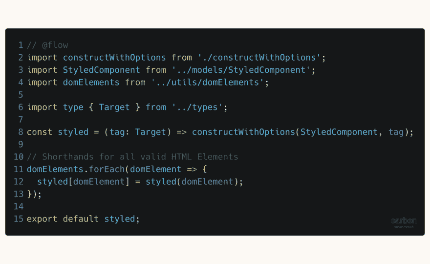
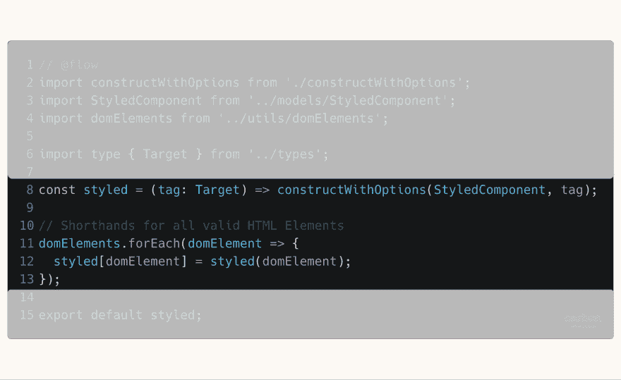
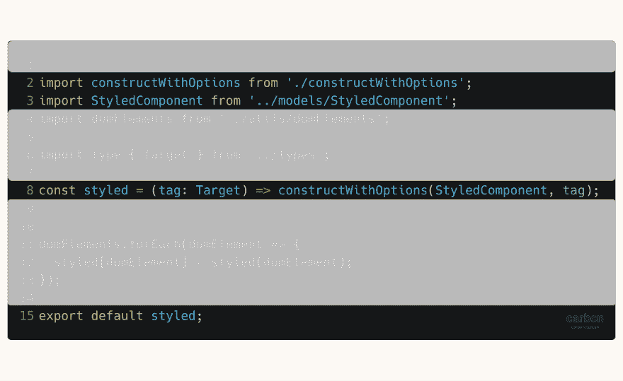
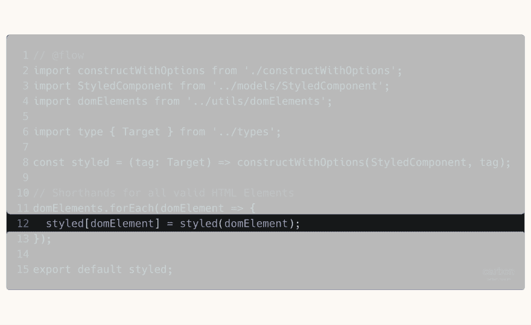

# src/.../styled.js -通往样式组件的 CSS-in-JS 天堂的楼梯

> 原文：<https://dev.to/btdev/srcstyledjs---stairway-to-styled-components-css-in-js-heaven-5cgf>

使用像 [Styled-Components](https://github.com/styled-components/styled-components) 这样的精彩开源库通常会带来越来越多的好处，让你越来越多的意识到你可以用它做什么。如果你像我一样，在某些时候你会对(图书馆)幕后发生的事情感到好奇。我最近查看了样式化组件 Github 库，以便更好地了解使用该库时的情况。正如你所想象的，这个图书馆做了很多很酷的事情，所以在第一次尝试中，我将我的调查限制在图书馆的*实用*入口点。

记住，用样式组件库创建一个样式组件就是这么简单...

```
const Button = styled.a`
    font-size: 14px;
`; 
```

...或者像那样

```
const BorderedButton = styled(Button)`
  border: 2px solid white;
`; 
```

请特别注意上面例子中使用`styled`函数的不同之处。

1.  我们调用`a`作为`styled`对象的方法，将 css 作为参数传递给它
2.  我们调用`styled`函数，将之前创建的样式组件作为参数传递给它，并添加 css 作为下一个参数

那么图书馆是如何为我们提供这种可能性的呢？让我们来看看。

## 名为*的 CSS-in-JS 圣杯，样式为*

理论上，考虑到样式化组件的`package.json`信息，库的技术运行时入口点是 [src/index.js](https://github.com/styled-components/styled-components/blob/7dd09fd595611a5805b76eab2fbae6f90877340f/src/index.js) 文件。但也就是说，使我们能够做所有酷事情的实际入口点是作为`/src/constructors`目录一部分的 [styled.js 文件](https://github.com/styled-components/styled-components/blob/613480a612fe942d1b1298581c94122de880d65e/src/constructors/styled.js)。接下来看看这个文件是什么样子的(状态 01/2019，分支机构主管):

[](https://res.cloudinary.com/practicaldev/image/fetch/s--0nOL7R8l--/c_limit%2Cf_auto%2Cfl_progressive%2Cq_auto%2Cw_880/https://thepracticaldev.s3.amazonaws.com/i/8hrfkganpw1qmb491ekh.png)

简而言之，该文件执行以下操作:

*   一些内部导入(第 2-4 行)
*   一个引用函数的`const styled`声明(第 8 行)
*   一个 forEach 循环(第 11-13 行)
*   我们的圣杯终于出口了🎉(第 15 行)

## 样式化函数及其函数对象的方法

对标题感到困惑吗？记住，在 Javascript 中函数是对象！因此，开发人员可以通过向该函数对象添加方法来利用这一点。样式化组件和由`styled.js`返回的真正入口点大量使用了这一点。第 8 行显示了一个引用函数的`const styled`声明，稍后会详细介绍。现在只要记住由`styled`常量引用的函数已经被创建了。现在特别看一下第 11 行到第 13 行。

[](https://res.cloudinary.com/practicaldev/image/fetch/s--RuR6wK1f--/c_limit%2Cf_auto%2Cfl_progressive%2Cq_auto%2Cw_880/https://thepracticaldev.s3.amazonaws.com/i/0qdlexyccjzdqnoeycsj.png)

**我们看到一个 forEach 循环迭代一个定义了 domElements 的[数组。](https://github.com/styled-components/styled-components/blob/master/src/utils/domElements.js)每次迭代都将一个带有被迭代 dom 元素名称的方法附加到`styled`函数对象上。瞧啊！这就是第一个像老板一样将 dom 元素方法附加到`styled`函数对象上的努力工作的组件工厂。每个附加方法的主体只不过是一个`styled`函数调用的结果，该函数调用为每个 dom 节点返回一个正确构建的组件构造函数。在运行时达到这一点后，我们已经可以在自己的代码库中调用这样一个附加方法:**

```
const Button = styled.a`
    ...this will be the method argument in the form of css to the styled.a call...
`;
const Container = styled.div`
    ...this will be the method argument in the form of css to the styled.div call...
`; 
```

到目前为止，我们知道(某种)当我们在使用样式化组件的代码库中使用`styled.a`或`styled.div`时会发生什么。也就是说，我们已经“走了一半”去揭开 styled.js 为我们输出了什么的神秘面纱。还记得我写*的时候吗，“第 8 行显示了引用函数的`const styled`声明，稍后会详细介绍。”*？这就是我们现在需要更多讨论的功能，来揭开另一半的神秘面纱。开始了。

## *风格*功能:它是如何构造和分布的

*建成*和*分发*？是啊！
正如你在第 8 行看到的，`styled`本身被声明为一个函数。它要么由美国开发人员使用`styled`函数的**分布式**默认导出直接调用，要么通过调用如上所述需要内部**构造**的函数对象方法来调用。具体来说，这对我们来说意味着:

[](https://res.cloudinary.com/practicaldev/image/fetch/s--uzq9lW5A--/c_limit%2Cf_auto%2Cfl_progressive%2Cq_auto%2Cw_880/https://thepracticaldev.s3.amazonaws.com/i/ix5dnqsh624jive341ac.png)

这...

```
const Container = styled('div')` ...css... `; 
```

还有这个

```
const Container = styled.div` ...css... ` 
```

返回完全相同的结果。但是请记住:我们可以在我们的代码库中方便地使用第二个选项，因为 Styled-Components 负责构建适当的组件构造函数，在内部执行第一个选项来添加函数对象方法(这里:`.div`)。

`styled`函数将一个`tag`作为参数，并返回调用函数`constructWithOptions`(第 8 行)的结果，该函数接收两个参数。

1.  **一个`StyledComponent`功能**——你有没有注意到我到目前为止在这个帖子里从来没有提到过`React`？好了，我们开始吧。我们不要忘记样式组件是`React`生态系统的一部分。因此，这个`StyledComponent`参数实际上被用来创建一个 React 组件，该组件提供对 React *事件处理程序*和 React 为我们做的所有其他很酷的事情的访问。
2.  **我们传递给`styled`函数**的`tag`参数是`Target`类型的，要么是 dom 节点字符串，要么是已经样式化的组件。检查[这一行](https://github.com/styled-components/styled-components/blob/master/src/types.js#L16)以找到如何使用 Flow 定义`Target`类型的起源。`tag`参数被简单地传递给`constructWithOptions`，没有任何修改。

收到这两个参数后，`constructWithOptions()`函数执行返回另一个函数，让我们创建一个已经考虑到我们想要在代码库中使用的`tag`的样式化组件。以最基本的形式使用返回的函数，我们唯一需要传递的是一个带标签的模板文本参数中的纯 *css* 。如果你想详细了解 Javascript 的这一部分是如何工作的，请查看[马克斯·斯托伊伯](https://mxstbr.blog/2016/11/styled-components-magic-explained/)的这篇文章。

所以要关闭`styled.js`的循环...现在我们知道了样式化的函数返回什么，以及它是如何分布或用于内部构造的，我们也更好地知道了`styled` function 对象方法的不同方法体做什么。`styled.a`作为 styled.js 第 12 行的`styled(domElement)`执行**分配**一个“标签预定义”的样式化组件构造器给它！🎉

[](https://res.cloudinary.com/practicaldev/image/fetch/s--29Rkgjg2--/c_limit%2Cf_auto%2Cfl_progressive%2Cq_auto%2Cw_880/https://thepracticaldev.s3.amazonaws.com/i/ej1oi2gi6kydqoye62y8.png)

## Thx 为阅读！

可以看到，`styled`提供了很多东西。一方面它是一个函数，另一方面它充当一个对象，为每个 dom 节点提供预定义的方法来构建样式化的组件。在我看来，库提供给我们的设计组件风格的方法是纯金的。

我希望这篇文章能帮助你更好地理解 styled.js 是做什么的，以及它如何公开我们可以使用的东西。请注意，所有信息均基于 2019 年 1 月之前的样式组件主分支。如果有我没有注意到的变化，请随时联系我来更新这篇文章。

这个帖子是[最初贴在这里](https://manpenaloza.dev/stairway-to-styled-components-css-in-js-heaven/)。