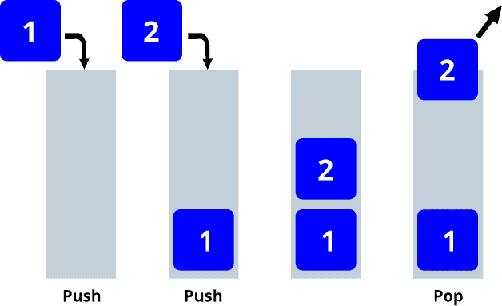

# 盯着堆栈跟踪

> 原文：<https://dev.to/laurieontech/staring-down-a-stack-trace-5e54>

让我们从顶部开始，什么是堆栈跟踪？即使你从未听说过这个术语，你也可能遇到过。堆栈跟踪是当您触发代码错误时，终端或日志中出现的复杂文本块的名称。但是为什么取这个名字呢？

# 将代码理解为一个堆栈

在编程中，您可能很熟悉堆栈这种数据类型。它使用后进先出法(后进先出)进行操作。你从栈中“弹出”一些东西或者“推”一些东西到栈上。当您继续向堆栈中添加时，项目会被推离进入/退出点更远。

[](https://res.cloudinary.com/practicaldev/image/fetch/s--YKgKm8AR--/c_limit%2Cf_auto%2Cfl_progressive%2Cq_auto%2Cw_880/https://thepracticaldev.s3.amazonaws.com/i/fjrhgn2q4wjlqk8i5o22.jpg)

您可能听说过使用堆栈解析的[后缀计算器](https://en.wikipedia.org/wiki/Reverse_Polish_notation)？代码的操作类似，并创建所谓的调用堆栈。当您调用一行代码时，它会推送到堆栈上。这一行代码调用的方法也被推送到堆栈上。这种情况会一直持续到兔子洞，直到它碰到那条线上最低的积木。它解析这段代码，并开始在堆栈中运行。每次它从堆栈中弹出某个东西时，它都会解析它，并将结果用于堆栈中的下一个东西。最终，它到达初始代码行并解析它，留下一个空堆栈。

# 好吧，那么这有什么关系呢？

将代码理解为堆栈对于理解堆栈跟踪至关重要。因为堆栈跟踪向您显示了在试图解析您编写的代码段时进行的所有不同调用。在调用堆栈中的某个地方，触发了一个错误，如果没有可用的结果，系统将无法继续从堆栈中弹出项目。

但是，这意味着堆栈跟踪可能不包括您编写的导致错误的行。等等，什么？！

这么想吧。你写的一段代码触发了一个低级错误。如果该级别在堆栈跟踪中太靠下，消息可能会被截断，以至于您无法判断最初的罪魁祸首。

# 如何读取堆栈痕迹

当你看到这一大堆乱七八糟的文字时，你到底在找什么？实际情况是，堆栈跟踪的每一行都是您“调用”的一段代码。然而，你很可能在不知不觉中这样做了，所以它不是特别有用。

你要找的是你写的一段代码的第一个引用。它通常会包含一个行号，这样您可以更直接地映射到错误。有时堆栈跟踪只引用您编写的代码，但并不总是这样。

# 栈痕迹库代码

最复杂的堆栈跟踪通常是由您编写的代码在第三方库中触发的错误。在这种情况下，您可能要查看许多行才能找到对您所识别的文件的引用。尽管堆栈跟踪的其余部分没有指出您可以更改的代码，但它同样重要。

为什么？它告诉你错误最终来自哪里。你的代码的哪一部分违反了规则。通常，引用的库文件可以在您的 IDE 中查看。如果你深入研究它们，你可能会发现你写的东西哪里出错了。

# 那抓生意呢？

当你写代码的时候，你应该考虑到边缘情况和防御性编程。在很多情况下，这意味着捕捉异常并抛出一个更具体的异常作为原因。

```
public void getPost(int id) {
     try {
        post.getId(id);    // this method throws a NullPointerException
     } catch (NullPointerException e) {
         throw new IllegalStateException("Post has a null property", e)
     }
} 
```

Enter fullscreen mode Exit fullscreen mode

这样做的代码会影响您将看到的堆栈跟踪。它会给你一个带有“链式异常”的堆栈跟踪。

```
Exception in thread "main" java.lang.IllegalStateException: A post has a null property
        at com.example.myproject.Author.getPost(Author.java:38)
        at com.example.myproject.Bootstrap.main(Bootstrap.java:14)
Caused by: java.lang.NullPointerException
        at com.example.myproject.Post.getId(Post.java:22)
        at com.example.myproject.Author.getPost(Author.java:36)
        ... 1 more 
```

Enter fullscreen mode Exit fullscreen mode

不要让这个迷惑你。你仍然在寻找你所认识的事物的最早的参考文献。

# 如果其他都失败了

学习读取堆栈跟踪是一项需要练习的技能。如果你想要其他的调试技巧，我已经在这里写了一篇文章。

[](/laurieontech) [## 不要被错误所迷惑

### 劳丽 Apr 1 ' 19 分钟阅读

#beginners #testing #productivity #javascript](/laurieontech/don-t-get-fooled-by-errors-314c)