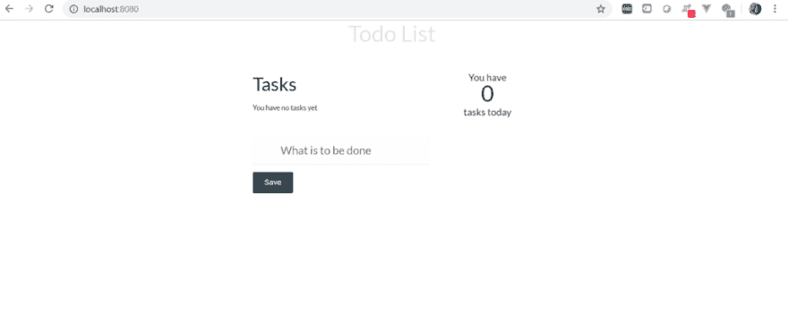
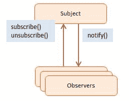
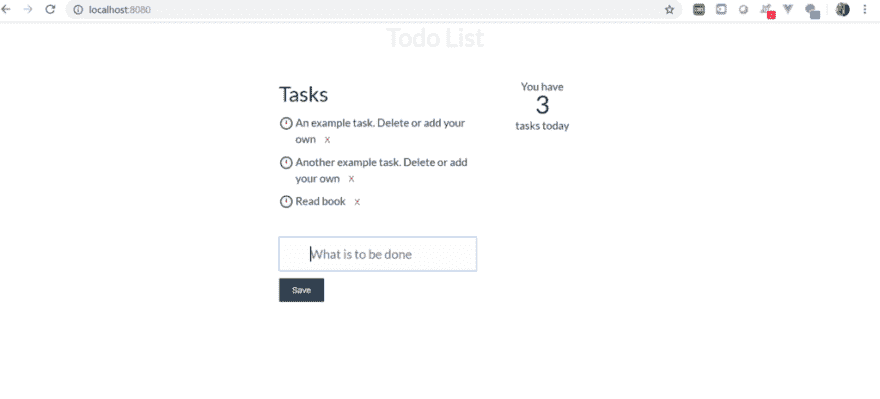

# JavaScript 中的状态管理模式:跨组件共享数据

> 原文：<https://dev.to/bnevilleoneill/state-management-pattern-in-javascript-sharing-data-across-components-2gkj>

### JavaScript 中的状态管理模式:跨组件共享数据

[](https://res.cloudinary.com/practicaldev/image/fetch/s--iXI5l3DW--/c_limit%2Cf_auto%2Cfl_progressive%2Cq_auto%2Cw_880/https://cdn-images-1.medium.com/max/668/1%2Ahcws3Wa6u9IqaEZ_4X04uw.jpeg)

当我们谈论状态管理时，我们真正在谈论的是，我们如何跨 JavaScript 应用程序的组件管理数据？

构建许多应用程序的一个典型挑战是保持用户界面的不同部分同步。通常，状态的变化需要反映在多个组件中，随着应用程序的增长，这种复杂性只会增加。

一个常见的解决方案是使用事件让应用程序的不同部分知道什么时候发生了变化。另一种方法是将状态保存在 DOM 本身中，或者甚至将它分配给窗口中的一个全局对象。现在我们有几个库，比如 Vuex、Redux 和 NgRx，来帮助简化跨组件的状态管理。他们通常使用所谓的**存储模式**,所有改变存储状态的动作都放在一个存储类中。这种类型的集中式状态管理使得理解什么类型的突变可能发生以及它们是如何被触发的变得更加容易。

[](https://logrocket.com/signup/)

### 我们将建造什么

任何状态管理工具只需要几样东西:对整个应用程序可用的全局状态值，以及读取和更新它的能力。大意如下:

```
const state = {};

export const getState = () => state;

export const setState = nextState => {
  state = nextState;
}; 
```

这是一个非常基本的示例，展示了一个表示应用程序状态的全局可用值:state，一个读取 state: getState 的方法和一个更新 state: setState 的方法。我们将使用这个总体思路来构建一个没有 JavaScript 框架或依赖的待办事项列表应用程序。在这个过程中，我们将大致了解这些州立图书馆是如何运作的。该应用程序将如下所示:

[](https://res.cloudinary.com/practicaldev/image/fetch/s--DxoNz4-C--/c_limit%2Cf_auto%2Cfl_progressive%2Cq_auto%2Cw_880/https://cdn-images-1.medium.com/max/1024/1%2AB6l9Tm0jYf5XoGvpjfTNZw.png)

首先，我们要安装 [http-server](https://www.npmjs.com/package/http-server) ，它将在我们完成后为我们的应用程序提供服务。要安装这个，首先确保你的机器上安装了 [Nodes.js](http://nodejs.org) 和 [Nodes.js](http://nodejs.org) 包管理器(NPM)。在 Windows 操作系统上，安装这些程序的步骤如下:

1.  从 [Nodes.js](http://nodejs.org) 网站下载 Windows 安装程序
2.  运行您刚刚下载的安装程序
3.  按照提示操作，接受默认安装设置
4.  通过在终端中运行 node-v 来测试它。这应该会打印出一个版本号，所以您会看到类似于 v8.12.0 的内容。另外，运行 npm -v 来查看 npm 是否安装成功。这应该会打印出 NPM 的版本号，所以您会看到类似于 6.4.1 的内容。
5.  运行命令 npm install http-server -g 在您的机器上全局安装 [http-server](https://www.npmjs.com/package/http-server) 。安装之后，您现在可以通过在索引文件所在的目录中运行 http-server 来为您的应用程序提供服务

现在回到构建我们的应用程序，创建一个如下所示的文件夹结构:

```
/state-management-JS   ├──src      ├── css         ├── global.css      ├── js         ├── main.js      index.html 
```

在 global.css 文件中，输入以下内容:

```
h1 {
    margin-bottom: 15px;
    width: 100%;
    font-size: 100px;
    font-weight: 100;
    text-align: center;
    color: rgba(175, 47, 47, 0.15);
    -webkit-text-rendering: optimizeLegibility;
    -moz-text-rendering: optimizeLegibility;
    text-rendering: optimizeLegibility;
}
@media all and (min-width: 40em) {
    main {
        width: 80vw;
        max-width: 40em;
        margin: 0 auto
    }
}
/**
* Intro 
*/
.intro {
    padding: 0 0 1rem 0;
    margin: 0 0 2rem 0;
    border-bottom: 1px dotted var(--border);
}
.intro__heading {
    font-weight: 400;
}
.intro__summary {
    margin-top: 0.3rem;
    font-size: 1.3rem;
    font-weight: 300;
}
.intro__summary b {
    font-weight: 500;
}
/**
* App 
*/
.app {
    display: grid;
    grid-template-columns: 1fr;
    grid-auto-flow: row;
    grid-gap: 2rem;
}
.app__decor {
    display: block;
    width: 100%;
    text-align: center;
    font-size: 3rem;
    line-height: 1;
}
.app__decor small {
    display: block;
    font-size: 1.3rem;
    font-weight: 400;
    color: var(--text-secondary);
}
.app__decor > * {
    display: block;
}
.app__decor > * + * {
    margin-top: 0.4rem;
}
.app__items {
    list-style: none;
    padding: 0;
    margin: 1rem 0 0 0;
    font-weight: 300;
}
.app__items li {
    position: relative;
    padding: 0 0 0 2rem;
    font-size: 1.3rem;
}
.app__items li::before {
    content: "🕛";
    position: absolute;
    top: 1px;
    left: 0;
}
.app__items li + li {
    margin-top: 0.5rem;
}
.app__items button {
    background: transparent;
    border: none;
    position: relative;
    top: -1px;
    color: var(--danger);
    font-weight: 500;
    font-size: 1rem;
    margin: 0 0 0 5px;
    cursor: pointer;
}
.app__items button:hover {
    color: var(--danger--dark);
}
@media all and (min-width: 40rem) {
    .app {
        grid-template-columns: 2fr 1fr;
    }
}

/**
* New item
*/
.new-item {
    margin: 2rem 0 0 0;
    padding: 1rem 0 0 0;
    border-top: 1px dotted var(--border);
}

/**
* No items
*/
.no-items {
    margin: 1rem 0 0 0;
    color: var(--text-secondary);
}
/**
* Visually hidden
*/
.visually-hidden { 
    display: block;
    height: 1px;
    width: 1px;
    overflow: hidden;
    clip: rect(1px 1px 1px 1px);
    clip: rect(1px, 1px, 1px, 1px);
    clip-path: inset(1px);
    white-space: nowrap;
    position: absolute;
}
.new-todo {
    padding: 16px 16px 16px 60px;
    border: none;
    background: rgba(0, 0, 0, 0.003);
    box-shadow: inset 0 -2px 1px rgba(0,0,0,0.03);
    position: relative;
    width: 100%;
    font-size: 24px;
    font-family: inherit;
    font-weight: inherit;
    line-height: 1.4em;
}
.save-button {
    display: inline-block;
    border: 0;
    padding: 0;
    margin: 0;
    text-decoration: none;
    background: #666;
    color: #fff;
    padding: 11px 25px 10px 25px;
    font-family: sans-serif;
    font-size: 1rem;
    border-radius: 2px;
    cursor: pointer;
    text-align: center;
    -webkit-appearance: none;
    margin-top: 15px;
} 
```

这是我们将在应用程序中使用的样式表。我们不会在本教程中讨论样式，因为对应用程序应用样式没有什么特别的。

### 观察者模式

我们将利用观察者架构设计模式，它是语言不可知的。观察者模式提供了一个订阅模型，在这个模型中，对象订阅一个事件，并在事件发生时得到通知。这种模式是事件驱动编程的基石，包括 JavaScript。观察者模式有助于良好的面向对象设计，并促进松散耦合。

[](https://res.cloudinary.com/practicaldev/image/fetch/s--XVUvJst1--/c_limit%2Cf_auto%2Cfl_progressive%2Cq_auto%2Cw_880/https://cdn-images-1.medium.com/max/258/1%2AjAzlEy_JIYvhYRrrD-DcqA.jpeg) 

<figcaption>观察者模式的再现</figcaption>

**观察者**也被称为**订阅者**，我们把被观察的对象称为发布者(或主体)。**发布者**在事件发生时通知订阅者。

当对象不再对由他们注册的主题通知感兴趣时，他们可以自己取消订阅。然后，主题将依次将它们从观察者集合中移除。

打开 src\js 目录，然后创建一个名为 lib 的新文件夹。在这个文件夹中创建一个名为 pubsub.js 的新文件

```
/js   ├── lib      ├── pubsub.js 
```

在这个文件中，我们创建了允许应用程序的其他部分订阅和发布命名事件的功能。

将以下代码输入到 pubsub.js

```
export default class PubSub {
    constructor() {
        this.events = {};
    }
    subscribe(event, callback) {
        if (!this.events.hasOwnProperty(event)) {
            this.events[event] = [];
        }
        return this.events[event].push(callback);
    }
    publish(event, data = {}) {
        if (!this.events.hasOwnProperty(event)) {
            return [];
        }
        return this.events[event].map(callback => callback(data));
    }
} 
```

在构造函数中，我们将 this.events 实例化为一个空对象来保存我们的事件。

subscribe 方法接受一个字符串事件，它是事件的唯一名称和一个回调函数。然后，它检查 this.events 的属性中是否有匹配的事件——如果没有找到该事件，它将创建一个空数组形式的事件属性。否则，它会将传递的回调方法推入 this.events[event]。

publish 方法检查 this.events 的属性中是否有匹配的事件——如果没有找到该事件，它将返回一个空数组。否则，它将使用数据对象作为参数，遍历每个存储的回调。

### 商店

接下来，让我们创建一个中央对象，它将包含一个 state 对象，该对象又包含我们的应用程序状态。我们还将创建一个 dispatch 方法，当用户输入一个新的待办事项时将调用该方法。这个方法调用我们的动作，动作又调用我们的突变，最终改变状态。

在 js 文件夹中创建一个名为 store 的新文件夹。在那里，创建一个名为 store.js 的新文件，这样您的文件夹结构应该如下所示:

```
/js   ├── lib      ├── pubsub.js   ├── store      ├── store.js 
```

然后将以下内容输入 store.js

```
import PubSub from '../lib/pubsub.js';

export default class Store {
    constructor(params) {
        let self = this;
        self.actions = {};
        self.mutations = {};
        self.state = {};
        self.status = 'default state';
        self.events = new PubSub();
        if (params.hasOwnProperty('actions')) {
            self.actions = params.actions;
        }
        if (params.hasOwnProperty('mutations')) {
            self.mutations = params.mutations;
        }
        self.state = new Proxy((params.state || {}), {
            set: function (state, key, value) {
                state[key] = value;
                console.log(`stateChange: ${key}: ${value}`);
                self.events.publish('stateChange', self.state);
                if (self.status !== 'mutation') {
                    console.warn(`You should use a mutation to set ${key}`);
                }
                self.status = 'resting';
                return true;
            }
        });
    }
    dispatch(actionKey, payload) {
        let self = this;
        if (typeof self.actions[actionKey] !== 'function') {
            console.error(`Action "${actionKey} doesn't exist.`);
            return false;
        }
        console.groupCollapsed(`ACTION: ${actionKey}`);
        self.status = 'action';
        self.actions[actionKey](self, payload);
        console.groupEnd();
        return true;
    }
    commit(mutationKey, payload) {
        let self = this;
        if (typeof self.mutations[mutationKey] !== 'function') {
            console.log(`Mutation "${mutationKey}" doesn't exist`);
            return false;
        }
        self.status = 'mutation';
        let newState = self.mutations[mutationKey](self.state, payload);
        self.state = Object.assign(self.state, newState);
        return true;
    }   
} 
```

让我们来看看这段代码在做什么。首先，我们导入 pubsub.js 文件。然后我们声明一个接受参数的构造函数。在这里，我们为状态、动作和突变实例化一个默认的空对象。我们还添加了一个状态属性，我们将使用它来确定对象在任何给定时间正在做什么。然后，我们创建一个新的 PubSub 实例，并将其分配给属性 events。然后，我们检查传入构造函数的参数是否将属性 actions 和 mutations 作为自己的属性。如果任一条件为真，我们将操作和突变对象设置为传入参数的相应参数。

接下来，我们使用 ES6 的新特性，**代理**到*观察*状态对象。如果我们添加一个 get 陷阱，我们可以监视每次对象被请求数据的时候。类似地，通过设置陷阱，我们可以留意对对象所做的更改。但是在我们的上下文中，我们设置更改，然后将其记录到控制台。然后我们用 PubSub 模块发布一个 stateChange 事件。然后我们检查状态是否不是突变，并在控制台中记录一个警告。

接下来，我们有一个 dispatch 方法，它寻找一个动作，如果存在的话，设置一个状态并在创建登录控制台时调用这个动作。然后，该操作将通过调用 commit 方法来改变我们的更改。在这个方法中，我们检查一个突变是否存在，如果存在，我们运行它并从它的返回值中获得我们的新状态。然后，我们获取新的状态，并将其与现有的状态合并，以创建状态的最新版本。

### 动作和突变

现在让我们创建我们在上一节中提到的动作和突变文件。在 store 文件夹中，创建一个名为 actions.js 的新文件，并向其中添加以下内容:

```
export default {
    addItem(context, payload) {
        context.commit('addItem', payload);
    },
    clearItem(context, payload) {
        context.commit('clearItem', payload);
    }
}; 
```

上下文是 Store 类的实例，有效负载是由 Store 类中的 dispatch 方法传入的实际数据更改。动作 addItem 和 clearItem 将有效负载传递给一个突变 commit 方法，该方法反过来提交要存储的数据。让我们现在创造我们的突变。创建一个新文件，仍然在存储文件夹中，名为 mutations.js:

```
export default {
    addItem(state, payload) {
        state.items.push(payload);
        return state;
    },
    clearItem(state, payload) {
        state.items.splice(payload.index, 1);
        return state;
    }
}; 
```

如前所述，这个变异是由 action.js 文件中的 commit 方法调用的。这里，addItem 接受我们的当前状态和一个有效负载作为参数，然后将有效负载推入 state 对象的 items 属性。第二个方法 clearItem 移除从状态对象传入的有效负载。

接下来，让我们创建一个保存默认项目集的文件，这样在第一次加载时，我们的应用程序就有东西可以显示了。在同一个文件夹中，创建一个文件 state.js 并输入以下内容:

```
export default {  
    items: [
        'An example task. Delete or add your own',
        'Another example task. Delete or add your own'
    ]
}; 
```

在同一个目录中创建另一个名为 index.js 的文件，我们将在其中导入我们的操作、突变、状态和存储。在该文件中输入以下内容:

```
import actions from './actions.js';
import mutations from './mutations.js';
import state from './state.js';
import Store from './store.js';

export default new Store({
  actions,
  mutations,
  state
}); 
```

### 组件

我们的应用程序只有三个功能:显示任务列表、添加任务和显示任务计数。我们将把这些功能分成三个组件文件，但首先我们将创建一个基本组件。在 lib 文件夹中创建一个名为 component.js 的文件。所以你的 lib 文件夹结构看起来像这样:

```
├── lib   ├── pubsub.js   ├── component.js 
```

在 component.js 文件中，输入以下内容:

```
import Store from '../store/store.js';
export default class Component {
    constructor(props = {}) {
        this.render = this.render || function () { };
        if (props.store instanceof Store) {
            props.store.events.subscribe('stateChange', () => this.render());
        }
        if (props.hasOwnProperty('element')) {
            this.element = props.element;
        }
    }
} 
```

这里我们导入了 Store 类，我们将使用它来检查构造函数中的一个属性。在构造函数中，我们要看看是否有一个 render 方法。如果这个组件类是另一个类的父类，那么子类可能已经为 render 设置了自己的方法。如果没有方法集，我们就创建一个空方法来防止东西被破坏。

接下来，我们检查传入的对象是否有一个属性，该属性是我们导入的 Store 类的实例。我们这样做是为了放心地使用它的方法和属性。然后我们调用 subscribe 方法，传入我们订阅的事件的名称——全局 stateChange 事件和回调 render。最后，我们从子组件中获得一个元素属性

现在我们有了父组件，让我们创建子组件。首先，在 js 文件夹中创建一个名为 components 的新文件夹。在这个文件夹中创建一个名为 list.js 的文件

```
/js   ├── lib   ├── components      ├── list.js 
```

在 list.js 文件中，输入以下内容:

```
import Component from '../lib/component.js';
import store from '../store/index.js';
export default class List extends Component {
    constructor() {
        super({
            store,
            element: document.querySelector('.js-items')
        });
    }
    render() {

        if (store.state.items.length === 0) {
            this.element.innerHTML = `<p class="no-items">You have no tasks yet </p>`;
            return;
        }
        this.element.innerHTML = `
      <ul class="app__items"> ${store.state.items.map(item => {
            return `
            <li>${item}<button aria-label="Delete this item">×</button></li>
          `
        }).join('')} </ul>
    `;
        this.element.querySelectorAll('button').forEach((button, index) => {
            button.addEventListener('click', () => {
                store.dispatch('clearItem', { index });
            });
        });
    }
}; 
```

在构造函数中，我们使用 super 关键字来访问和调用父组件(即 components.js 文件)上的函数。我们首先将 Store 实例传递给我们正在扩展的父类。

之后，我们声明一个 render 方法，每次 stateChange 事件发生时都会调用该方法。这也是 parent component.js 检查的方法。在这个渲染方法中，如果没有项目，我们会给出一个项目列表或一个小通知。您还会看到，每个按钮都有一个与之相关的事件，它们会在我们的商店内进行调度和操作。

接下来，让我们创建计数组件。在同一个文件夹中创建一个名为 count.js 的新文件，并输入以下内容:

```
import Component from '../lib/component.js';
import store from '../store/index.js';
export default class Count extends Component {
    constructor() {
        super({
            store,
            element: document.querySelector('.js-count')
        });
    }
    render() {
        let suffix = store.state.items.length !== 1 ? 's' : '';
        this.element.innerHTML = `
      You have ${store.state.items.length} task${suffix} today 
    `;
    }
} 
```

这处理我们的项目计数，它是不言自明的。让我们进入最后一个部分。创建一个名为 status.js 的新文件，并输入以下内容:

```
import Component from '../lib/component.js';
import store from '../store/index.js';
export default class Status extends Component {
    constructor() {
        super({
            store,
            element: document.querySelector('.js-status')
        });
    }
} 
```

### 视图

我们需要做的最后一件事是创建一个 main.js 文件和 index.html 视图。在 js 文件夹中创建 main.js 文件，并输入以下内容:

```
import store from './store/index.js';
import Count from './components/count.js';
import List from './components/list.js';
import Status from './components/status.js';
const formElement = document.querySelector('.js-form');
const inputElement = document.querySelector('#new-item-field');
formElement.addEventListener('submit', evt => {
    evt.preventDefault();
    let value = inputElement.value.trim();
    if (value.length) {
        store.dispatch('addItem', value);
        inputElement.value = '';
        inputElement.focus();
    }
});
const countInstance = new Count();
const listInstance = new List();
const statusInstance = new Status();
countInstance.render();
listInstance.render();
statusInstance.render(); 
```

在这里，我们所做的就是获取我们需要的依赖项。我们已经有了自己的商店、前端组件和一些 DOM 元素。接下来，我们向表单添加一个事件侦听器，并使用 preventDefault 阻止它提交。然后，我们获取文本框的值，并删除其中的任何空白。我们这样做是因为我们想检查接下来是否有任何内容要传递给商店。最后，如果有内容，我们用该内容调度 addItem 操作

然后，我们创建组件的新实例，并调用它们的每个呈现方法，以便在页面上获得初始状态。

在 src 文件夹中创建 index.html 文件，并输入以下代码:

```
<!DOCTYPE html>
<html lang="en">
<head>
    <meta charset="UTF-8">
    <meta name="viewport" content="width=device-width, initial-scale=1.0" />
    <meta http-equiv="X-UA-Compatible" content="ie=edge" />
    <link rel="stylesheet" href="css/global.css" />
    <link rel="stylesheet" href="https://bootswatch.com/4/flatly/bootstrap.css" />
    Todo
</head>
<body>
    <main>
        <header class="intro">
            <h1 class="intro__heading">Todo List</h1>
        </header>
        <section class="app">
            <section class="app__input">
                <h2 class="app__heading">Tasks</h2>
                <div class="js-items" aria-live="polite" aria-label="A list of items you have to done"></div>
                <form class="new-item js-form ">
                  <div>
                    <input type="text" class="new-todo" id="new-item-field" autocomplete="off" placeholder="What is to be done"/>
                    <button class="btn-primary save-button">Save</button>
                  </div>
                </form>
        </section>
          <aside class="app__status">
            <p role="status" class="visually-hidden"><span class="js-status"></span></p>
              <div class="app__decor js-count" aria-hidden="true">
              </div>
          </aside>
        </section>
    </main>
    <script type="module" src="js/main.js"></script>
</body>
</html> 
```

### 本地存储

使用终端，将 cd 放入 src 文件夹并运行命令 http-server。这将在本地 web 服务器中为我们的应用程序提供服务。现在访问 URL[http://localhost:8080](http://localhost:8080)来查看应用程序。继续，在那里添加类似于*【阅读书籍】*的东西。

[](https://res.cloudinary.com/practicaldev/image/fetch/s--4UARCxCS--/c_limit%2Cf_auto%2Cfl_progressive%2Cq_auto%2Cw_880/https://cdn-images-1.medium.com/max/1024/1%2AUhGzBOV8wxnDkNIcdi5tyA.png)

您会注意到，当我们刷新页面时，我们输入的数据丢失了。我们需要一种方法来保存或存储我们输入的数据。LocalStorage 允许我们在浏览器中存储数据，即使当用户关闭或重新加载页面时，也可以检索这些数据。我们还能够从本地存储中写入、更新和删除数据。我们可以使用 localStorage.getItem 方法获取项目，使用 localStorage.setItem 方法设置项目，使用 localStorage.removeItem 方法移除项目。

让我们在应用程序中设置 localStorage。在/src/js/store/mutations.js 文件中，将内容替换为:

```
export default {
    addItem(state, payload) {
        state.items.push(payload);
        localStorage.setItem('items', JSON.stringify(state.items))   
        return state;
    },
    clearItem(state, payload) {
        state.items.splice(payload.index, 1);
        localStorage.setItem('items', JSON.stringify(state.items))
        return state;
    }
}; 
```

在 addItem 方法中，在将有效负载推入 state 对象后，我们将 state.items 转换为一个字符串，并将其存储在带有 key name items 的 localStorage 中。我们在 clearItem 方法中做了类似的事情，此后从 state.items 中删除一个项目，我们用 state.items 的更新值更新 localStorage。

接下来在/src/js/store/state.js 中，将其内容替换为:

```
export default {
    items: JSON.parse(localStorage.getItem('items') || '[]')   
}; 
```

这里我们检查 localStorage 是否存在一个名为 items 的键。如果是，我们要将它设置为变量 items，否则将 items 设置为空数组。现在，即使我们重新加载或关闭页面，我们的应用程序也可以保留我们输入的数据。

### 对于更高级的人来说

如果您还记得在 store.js 文件中，我们利用了一个 ES6 特性，代理来监视状态对象。这实际上是包装一个现有的对象，也称为目标，并拦截对其属性或方法的任何访问，即使它们不存在。代理对象有一些*陷阱*，可以在授权访问目标之前调用。这里我们使用 set trap 来监视状态对象的变化。这意味着当一个突变运行类似 state.name ="Foo "的东西时，这个陷阱会在它被设置之前捕获它。代理的一些用例包括验证、值修正、属性查找扩展、跟踪属性访问等等。

### 结论

我们已经探索了如何在 JavaScript 中实现状态管理。在这个过程中，我们学习了观察者架构设计模式和本地存储。有许多场景需要实现状态管理，其中之一就是用户管理和身份验证。你可以在 [Github](https://github.com/caleboki/state-management-js) 上查看最终产品，如果你有任何问题或评论，请不要犹豫，在下面发表。

* * *

### Plug: [LogRocket](https://logrocket.com/signup/) ，一款适用于网络应用的 DVR

[](https://logrocket.com/signup/)

<figcaption>[https://logrocket.com/signup/](https://logrocket.com/signup/)</figcaption>

LogRocket 是一个前端日志工具，可以让你回放问题，就像它们发生在你自己的浏览器中一样。LogRocket 不需要猜测错误发生的原因，也不需要向用户询问截图和日志转储，而是让您重放会话以快速了解哪里出错了。它可以与任何应用程序完美配合，不管是什么框架，并且有插件可以记录来自 Redux、Vuex 和@ngrx/store 的额外上下文。

除了记录 Redux 操作和状态，LogRocket 还记录控制台日志、JavaScript 错误、堆栈跟踪、带有头+正文的网络请求/响应、浏览器元数据和自定义日志。它还使用 DOM 来记录页面上的 HTML 和 CSS，甚至为最复杂的单页面应用程序重新创建像素级完美视频。

免费试用。

* * *

帖子【JavaScript 中的状态管理模式:跨组件共享数据】([https://Blog . log rocket . com/State-management-pattern-in-JavaScript-Sharing-data-cross-components-f 4420581 f 535/](https://blog.logrocket.com/state-management-pattern-in-javascript-sharing-data-across-components-f4420581f535/)最先出现在 [LogRocket 博客](https://blog.logrocket.com)上。