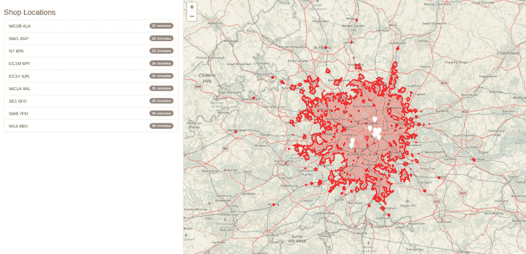
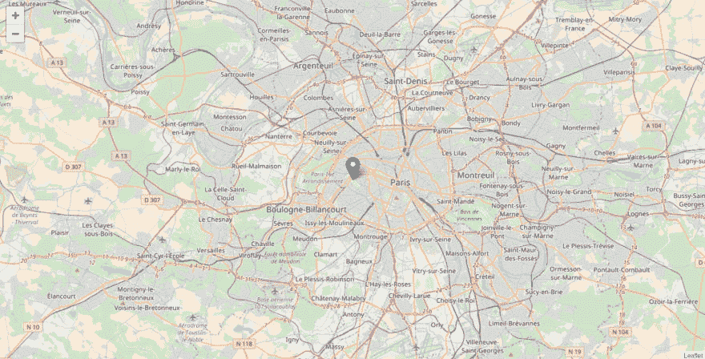

# 逐步免费地理编码的传单

> 原文：<https://dev.to/tomasitraveltime/step-by-step-free-geocoding-for-leaflet-1em5>

传单是一个用于交互式地图的开源 javascript 库。虽然它被设计得尽可能简单易用，但您可以通过使用外部插件来扩展传单功能。有几个插件可以用来对传单进行地理编码。以下示例将向您展示如何使用免费的 [TravelTime 搜索 API](https://docs.traveltimeplatform.com/overview/introduction) 为传单地图创建一个简单的地理编码请求。

这个[地理编码器](https://docs.traveltimeplatform.com/reference/geocoding-search/)允许用户将他们的搜索结果可视化为地图上的图钉，以及地址列表视图。它可以集成到您的应用程序或网站中。

[](https://res.cloudinary.com/practicaldev/image/fetch/s--4pDdaDWP--/c_limit%2Cf_auto%2Cfl_progressive%2Cq_auto%2Cw_880/https://blog.traveltimeplatform.com/hs-fs/hubfs/1-6.png%3Ft%3D1534774773883%26width%3D1600%26name%3D1-6.png)

要开始使用这个[免费地理编码器](https://docs.traveltimeplatform.com/reference/geocoding-search/)对传单进行地理编码，您首先需要请求一个 [TravelTime API 密钥](https://docs.traveltimeplatform.com/overview/getting-keys/)。

## 简单地理编码请求

这个例子将向你展示如何将一个位置字符串地理编码为坐标，并在地图上显示该位置。

[](https://res.cloudinary.com/practicaldev/image/fetch/s--U9IrVeTE--/c_limit%2Cf_auto%2Cfl_progressive%2Cq_auto%2Cw_880/https://blog.traveltimeplatform.com/hs-fs/hubfs/image2.png%3Fwidth%3D1828%26name%3Dimage2.png)

所有这些都将在一个 HTML 文档中完成，使用传单地图库，本地 JavaScript AJAX 调用 jQuery 与 TravelTime 搜索 API 通信。

## 第一步:创建并导入模板

首先我们需要创建一个 HTML 模板:

```
<!DOCTYPE html>
<html lang="en">
<head>
    Geocoding for Leaflet
</head>
<body>
    <!DOCTYPE html>
    <html>
    <head>
        <link rel="stylesheet" href="http://cdn.leafletjs.com/leaflet/v1.3.0/leaflet.css" />
        <link rel="stylesheet" href="css.css" />
        <script src="https://unpkg.com/leaflet@1.4.0/dist/leaflet.js" integrity="sha512-QVftwZFqvtRNi0ZyCtsznlKSWOStnDORoefr1enyq5mVL4tmKB3S/EnC3rRJcxCPavG10IcrVGSmPh6Qw5lwrg==" crossorigin=""></script>
    </head>

    <body>
    <div id="mapid"></div>

    <div id="error" class="">
        <p><b>No API and APPLICATION_ID key inserted </b></p>
        <p><a target="_blank" href="http://docs.traveltimeplatform.com/overview/getting-keys/">Sign up for an API key</a>
            <p>Place it in API and APPLICATION_ID variables</p>
    </div>
    <script>
        // all code will go here
    </script>
    <style>
        // all style will go here
    </style>
    </body>
</html> 
```

在标题中，我们导入了 fleet 的 CSS 模板和 JavaScript 库以及 jQuery。单个`<div>`元素将包含地图。

## 第二步:设置位置名称

为了使示例更简单，我们将位置的名称设置为代码中的一个变量。在现实世界中，这很可能是用户在搜索栏中输入的。

## 第三步:添加表头

TravelTime API 使用头进行认证，因此我们也需要包含这些头:

```
var locationName = "Tour Eiffel, Paris, France";

var APPLICATION_ID = "place your app id here";
var API_KEY = "place your api key here"; 
```

## 第四步:发送请求

现在，我们可以向地理编码 API 发送请求。这是一个非常简单的 GET 请求，只需要一个包含位置名称的`query`字段。您可以在 [TravelTime Search API 地理编码文档](https://docs.traveltimeplatform.com/reference/geocoding-search/)中查看参考。

```
function sendGeocodingRequest(location) {
return fetch(`https://api.traveltimeapp.com/v4/geocoding/search?query=` + location, {
method: "GET",
credentials: "same-origin",
headers: {
"Content-Type": "application/json",
"X-Application-Id": APPLICATION_ID,
"X-Api-Key": API_KEY
}

})
.then(response => response.json()); // parses JSON response into native Javascript objects
} 
```

## 第五步:绘制标记

在 success 参数中，我们引用了一个使用 API 返回的坐标在地图上绘制标记的函数。下面是代码:

```
function drawMarker(response) {  // We need to extract the coordinates from the response.

var coordinates = response.features[0].geometry.coordinates;  // The coordintaes are in a [<lng>, <lat>] format/

var latLng = L.latLng([coordinates[1], coordinates[0]])  // The url template for OpenStreetMap tiles.
var osmUrl = "http://{s}.tile.openstreetmap.org/{z}/{x}/{y}.png";     // Creates the tile layer.

var osmTileLayer = L.tileLayer(osmUrl, {
minZoom: 8,
maxZoom: 15
});  // Adds the tile layer to the map.

var map = L.map("mapid").addLayer(osmTileLayer); 
map.setView(latLng, 11);  // Creates a marker for our departure location and adds it to the map.

var markter = L.marker(latLng).addTo(map);
}; 
```

## 完整代码

最后，我们只需调用“sendGeocodingRequest”函数来运行一切。[完整的代码可以在这里找到](https://gist.github.com/tomasigeolise/4886bbe53b40758851514c820ae4de26)。

## 现场代码编辑环境

使用 CodePen 立即开始测试。你需要注册一个免费的 API 密匙。

[https://codepen.io/igeolise/embed/JVgjKV?height=600&default-tab=result&embed-version=2](https://codepen.io/igeolise/embed/JVgjKV?height=600&default-tab=result&embed-version=2)

## 关于 TravelTime API

TravelTime API 可以做很多事情，也可以免费进行地理编码:

*   根据交通方式，在地图上显示在一定时间内可以到达的地方
*   计算从起点到数千个目的地的行程时间矩阵(通常称为距离矩阵)
*   a 到 B 路由

要开始使用 TravelTime 地理编码器，请注册一个 API 密钥。要了解有关传单地理编码的更多信息，[联系](https://www.traveltimeplatform.com/contact-us)。