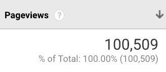
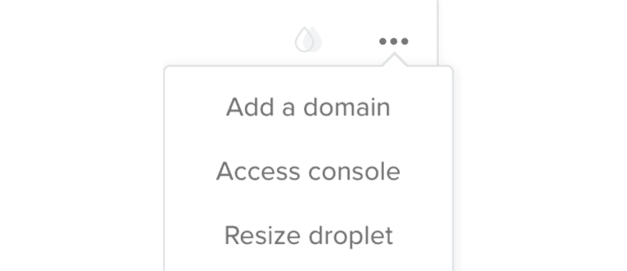
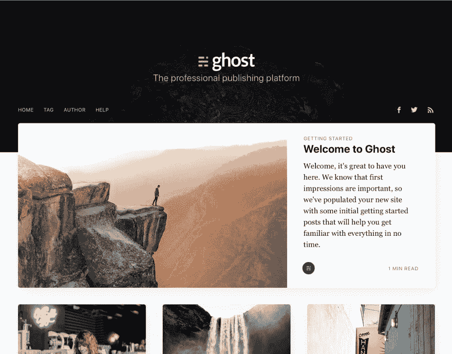
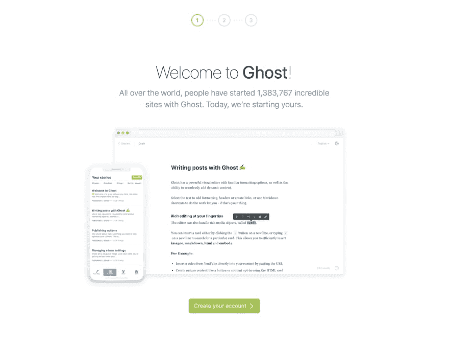
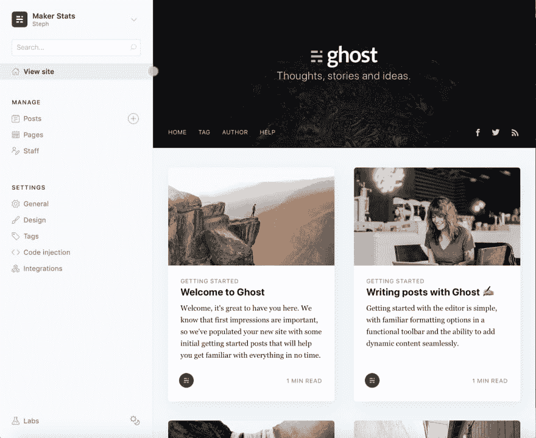
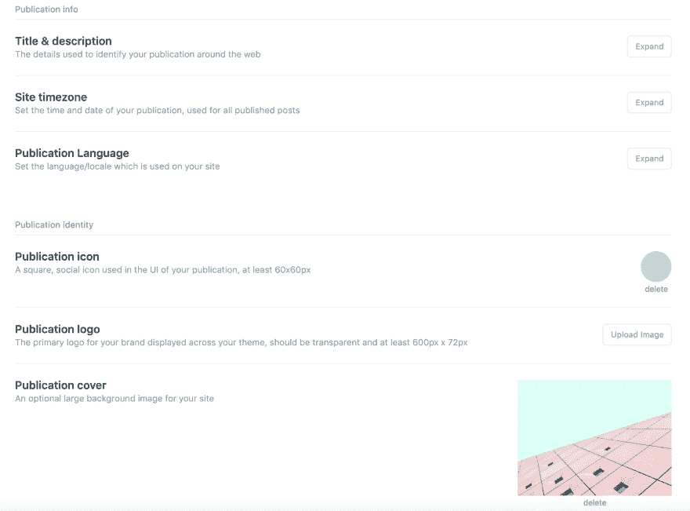
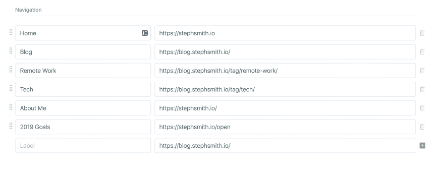
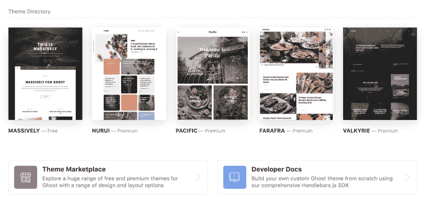
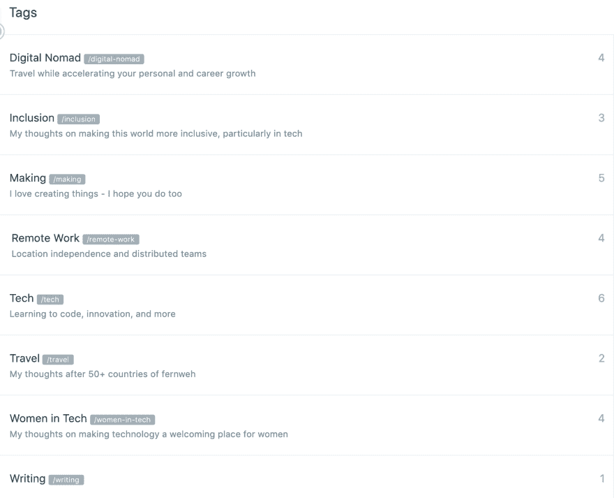
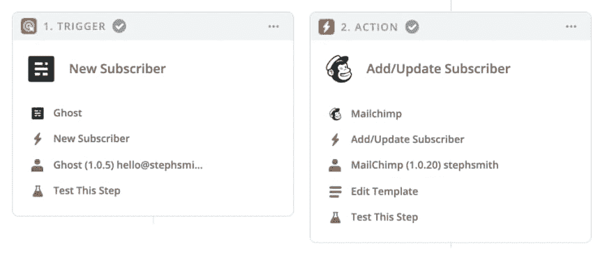

# 一步一步的指南安装一个幽灵博客和 5 美元的数字海洋水滴服务 10 万以上的读者

> 原文：<https://dev.to/stephsmithio/step-by-step-setting-up-ghost-with-a-digital-ocean-droplet-1nb8>

这篇文章最初发表在我的博客上，我经常在这里写远程工作、学习编码和技术领域的女性。在几个朋友问我在什么平台上运行我的博客后，在发现它在头 90 天里有 10 万次浏览量后，我特别决定写这篇文章。

## 博客的回归

今年早些时候，我决定开通一个博客。就像世界上的其他人一样，他们的妈妈，还有他们的狗，我想要一个出口来分享我的想法。

然而，当真正开始我的博客时，我不知道从哪里开始。大约有 2847 个平台准备为你的博客提供动力，我陷入了选择的悖论。我应该选择 Wordpress，一个定制网站，还是把我的出版工作交给 Medium？

我很快确定的唯一一件事是，我想在我自己的领域上托管博客。我开始寻找无头 CMS 工具，但很快就发现设计一个全新的前端并不是对我时间的最佳利用。

我向几个朋友征求建议，幽灵这个名字不断出现。显然，这是一个由独立开发者开发的优化良好的平台，有着中等的用户界面——所有这些都是我喜欢听到的。所以我决定试一试，在做了一些额外的研究后，我决定利用一个 5 美元的数字海洋水滴来服务它。

快进到 3 个月后，我的博客已经有超过 100，000 的浏览量,幽灵和数字海洋的结合完全成立。可以肯定地说，我对自己的选择很满意。

> 斯蒂芬·史密斯[@斯蒂芬·史密斯](https://dev.to/stephsmithio)今天，在决定将我的想法公之于众 3 个月后，我的博客浏览量超过了 10 万次！
> 
> ☀️博客回来了。电子邮件并没有消亡。快乐的星期一世界。感谢阅读。☀️2019 年 3 月 25 日下午 15:01[](https://twitter.com/intent/tweet?in_reply_to=1110195057586589696)[](https://twitter.com/intent/retweet?tweet_id=1110195057586589696)0[](https://twitter.com/intent/like?tweet_id=1110195057586589696)53

最近，有几个读者已经开始寻求帮助，建立同一个出版二人组。这个过程相对来说比较快，但是不一定直观，所以我想我应该把这些说明汇编成一篇简单的博文！

*PS:这篇博文是由任何第三方赞助的**而不是**。*

如果你喜欢写自己的前端，我建议你使用 [Butter](https://buttercms.com) ，这是我在研究过程中偶然发现的一个工具，它可以让你轻松地集成到任何后端。实际上，我在几分钟内就将 Butter 实现到了我的节点应用程序中，因为它们的文档非常可靠，但最终我想要 Ghost 前端。

## 幽灵溢价？

Ghost 是一个“全栈”发布平台，允许您设置博客的前端和后端。如果您愿意，Ghost 还提供服务器支持，您可以通过 Ghost Premium 轻松加入。它很简单，可以快速设置，但最基本的计划[每月需要 29 美元](https://ghost.org/pricing/)，据我所知，Ghost Premium 的大多数其他功能都可以在非 Premium 选项中使用，包括集成、代码注入和主题。主要区别在于缺少服务器设置。

因此，本文假设您不想选择 Premium，而更喜欢更便宜的服务器选项，如 5 美元的 Digital Ocean Droplet One Click setup。尽管不太“一键操作”，以下步骤应该也能让你的新博客在几分钟内启动并运行。让我们跳进来吧！

## Ghost 设置与数字海洋水滴

请注意，本节将逐步介绍为**域(例如:domain.xyz)或子域(例如:blog.domain.xyz)** 设置自托管 Ghost 的过程，但**不是子目录(domain.xyz/blog)**。还有一些与子目录相关的步骤将不会在本文中介绍。

### 设置数字海洋水滴

*   设置 Ghost 的第一步是跳到[数字海洋市场](https://marketplace.digitalocean.com/)。搜索“Ghost”并导航到 Ghost droplet 页面。如果您已经登录，您也可以通过导航到左侧导航中的“市场”在平台中找到它。
*   点击“创建幽灵水滴”。这是“数字海洋一键式”设置，将为您构建和启动一个服务器！
*   在创建之前，数字海洋将带你到一个页面，你需要选择你的水滴大小。我建议您从最低层开始，即:**标准 5 美元/月**。请注意，该选项不会立即显示，因此您需要向左导航才能找到它。除非你已经有了一个**的大型**博客，否则我不会担心流量或服务器的支持。我的每月 5 美元的小滴坚持了超过 24 小时，一篇文章在黑客新闻上流行，有数百名活跃读者，绝对没有故障。
*   至于其他设置条件，您可以根据自己的判断来启用它们，它们大部分是可选的。您需要选择您的数据中心区域，该区域应该最接近您预期的大多数用户/读者所在的位置。我没有选择任何附加组件或 SSH 密钥，因为这不是设置的强制要求，并且我的路由是通过 Cloudflare 完成的，它提供了我的安全层。
*   一旦你为你的 droplet 选择了一个名字(可以是任何名字)，Digital Ocean 将花费几分钟来创建 droplet。创建 droplet 后，您应该会看到一个 IP 地址(例如:134.209.253.151)。

[](https://res.cloudinary.com/practicaldev/image/fetch/s--aRZjD6WF--/c_limit%2Cf_auto%2Cfl_progressive%2Cq_auto%2Cw_880/https://lh6.googleusercontent.com/P4mKOqg6x9sjcDYGai5M2idfVm7Nsrlk7HiUYzxnhR-9SEtvjgqhucIKKq6o-UBczotPZugMNTbkUxGqSAoDonJlwRWfqbQjO2P68HMd2o_z-LWO7I3i5HHZo3ZHgwdGpZ2dNHQ_)

*   如果您在浏览器中导航到该 IP，您将看到 Ghost 安装页面的下图，这意味着 droplet 是由 Digital Ocean 在该 IP 地址安装和托管的。如果您看不到此页面，则 droplet 设置不正确。如果您看到此页面，您已经设置了 droplet，现在可以将其连接到域了！

[](https://res.cloudinary.com/practicaldev/image/fetch/s--Nk9K9DrI--/c_limit%2Cf_auto%2Cfl_progressive%2Cq_auto%2Cw_880/https://lh6.googleusercontent.com/h6rzlKXHtC4owbnGwyVrEr1qNGJoYLzGtG8HZWXzSzKeOWoNJNVAOME5DZoOMMQbd5XuoqybTlKHP_yvj6MxVmkdGwkrEiE-u-MPscDESvjtV0zWXtUq2EvCTcBqQ8Ocuvu_Z_Ss)

### 连接到自定义域

*   如果你还没有为你的 Ghost 博客购买一个自定义域名，你需要先这样做。请记住，这一过程将适用于您希望使用的全新域(例如:blog.xyz)或向其他地方托管的现有域添加子域(例如:blog.domain.xyz)。
*   首先，您需要将域添加到数字海洋，并设置您的数字海洋 DNS 记录。为此，请单击右侧的切换按钮“添加域”。

[](https://res.cloudinary.com/practicaldev/image/fetch/s--6Q3Stf1d--/c_limit%2Cf_auto%2Cfl_progressive%2Cq_auto%2Cw_880/https://blog.stephsmith.io/conteimg/2019/03/image-6.png)

*   在输入字段中键入您的域名，然后单击“添加域”。您应该会看到如下所示的 DNS 记录。

[](https://res.cloudinary.com/practicaldev/image/fetch/s--RyFVFr6J--/c_limit%2Cf_auto%2Cfl_progressive%2Cq_auto%2Cw_880/https://lh3.googleusercontent.com/zXFmtMHSpLwh4hbyKZNFfM4-s_MVz-LVYZLEK9SqfhKn7t9jJ2OYqviXKK86hCgKEBjjfbw4SJ4Pd2FeLIblbp2Zjq56CJ8EIMP9-OnRa-PaF-yY9ZD9Qf2bDymirziNAUVQ2u3Q)

*   一旦在数字海洋端设置了 DNS 记录，就需要在外部域设置中配置 A 记录。这取决于您以前如何设置您的域名，但可能会在您的域名注册商(例如:Namecheap、GoDaddy 等)中找到。)或者，如果您已经将您的 DNS 重新路由到第三方，如 Cloudflare，您将在那里更新 DNS 记录。在您的非数字海洋 DNS 记录中，您需要将您的 A 记录定向到您的 droplet 的 IP 地址，其中“名称”是您希望托管博客主页的域或子域。

例如，如果您希望 blog.domain.xyz 存放博客，您可以为指向 IP 的“blog”设置 A 记录(例如:134.209.253.151)。

使用下面的示例作为示例，但请注意，您应该只设置* *一个* *或另一个。

[](https://res.cloudinary.com/practicaldev/image/fetch/s--tBhAaUB_--/c_limit%2Cf_auto%2Cfl_progressive%2Cq_auto%2Cw_880/https://lh3.googleusercontent.com/QdEU5pMk7MleDxbjYwHxSbzlcYpQjZLAcMiWlfIQZORYfrwThwI2i4dgY3MqgDpw5RDz9t1P0AaGjyihGXjkVUxfZuNKuphyMw05osgJlTO9WdB7D5vBLaNHNa3QKe1rw4f4A3YZ)

*   一旦您在两端设置了 DNS 记录，它们可能需要一些时间来传播。一些第三方指出，这可能需要长达 48 小时，但通常这在几分钟内就会发生。
*   一旦 DNS 记录传播完毕，您将再次在您刚刚配置的域或子域中看到相同的 Ghost 安装页面**。例如，这个页面现在不仅会出现在 134.209.253.15，还会出现在 makerstats.com。如果看不到此页面，您可能需要调查 DNS 设置是否已正确设置和传播。**

[](https://res.cloudinary.com/practicaldev/image/fetch/s--Nk9K9DrI--/c_limit%2Cf_auto%2Cfl_progressive%2Cq_auto%2Cw_880/https://lh6.googleusercontent.com/h6rzlKXHtC4owbnGwyVrEr1qNGJoYLzGtG8HZWXzSzKeOWoNJNVAOME5DZoOMMQbd5XuoqybTlKHP_yvj6MxVmkdGwkrEiE-u-MPscDESvjtV0zWXtUq2EvCTcBqQ8Ocuvu_Z_Ss)

### 安装 Ghost

*   这三步安装过程的最后一步是安装 Ghost 软件。为此，跳回数字海洋，打开右侧的控制台。这将在一个请求登录的新选项卡中打开控制台。

[](https://res.cloudinary.com/practicaldev/image/fetch/s--AtkdVP5A--/c_limit%2Cf_auto%2Cfl_progressive%2Cq_auto%2Cw_880/https://lh5.googleusercontent.com/d_PTZ-EFCqk3PdbgkzGdPepgeiAh0L8XQDA7EReLdRJ9OjYaBGaWCqWc4LZ2Jqorm9_zQMlH9CrAj-_Sf4qK8yFlsfYFIXvi0XAN3XJpuLbovByA3_FuCkW0vPJZy855avqwGNn4)

*   当您启动 droplet 时，输入您的用户名(始终为“root”)，然后输入数字海洋通过电子邮件发送给您的密码。

[](https://res.cloudinary.com/practicaldev/image/fetch/s--WyoONS8L--/c_limit%2Cf_auto%2Cfl_progressive%2Cq_auto%2Cw_880/https://lh4.googleusercontent.com/VDP-l_1P2JKQGLVSDubllNSCLKCzF1Ti2ONKVPefynN7DzFODmhar8xkGFN8T9FzwFTASOA-pBD8O58PUuxKJWF_2Hum2Wn1L-Ijg01kVJxITIUeenmZ2JNzpO2IDFVzeJAWVrQg)

*   然后，终端会提示您立即更新密码。这是强制性的。它会首先提示您输入当前的 UNIX 密码(与您电子邮件中的密码相同)，然后添加两次新密码。如果这是正确的，你应该看到安装初始化，几秒钟后，你应该看到下面的屏幕。

[](https://res.cloudinary.com/practicaldev/image/fetch/s--DVnmZHbE--/c_limit%2Cf_auto%2Cfl_progressive%2Cq_auto%2Cw_880/https://lh6.googleusercontent.com/3zM9ritj_7_vU2lYnnnb1iuC-jxmez_s6_IaiqW0gS_sLXO8uWdogbyP5EWHOMeZjNJLMmF_TSEm902cvOnzxQ3MDjxvIqpFTpvRVmUHxjExbu8B0HIdpX7-aKOFhwpRGhtT46RL)

*   按回车键开始安装，你应该看到程序下载。

[](https://res.cloudinary.com/practicaldev/image/fetch/s--shHTWl-J--/c_limit%2Cf_auto%2Cfl_progressive%2Cq_auto%2Cw_880/https://lh3.googleusercontent.com/_Af5MB6xIKSrrc524Wbf7NV0mvSh13pRe3myaBYrDd6zmFBPoHvWBdDXzgumwo4arzuLsfwX7xElk0v6mL7TTstxgZhOCogsUsrSodX5uRTz3FTBf7A_FpKbkh2JKlpyYAs3kNci)

*   该程序将提示您输入您的域(在这种情况下-确保它是您的实际域或子域，而不是 IP)和您的电子邮件地址。该电子邮件地址可以是您的任何电子邮件，并且仅用于 SSL 流程。
*   如果一切都做对了，这就是你会看到的！

[](https://res.cloudinary.com/practicaldev/image/fetch/s--IiU6Oijx--/c_limit%2Cf_auto%2Cfl_progressive%2Cq_auto%2Cw_880/https://lh3.googleusercontent.com/DnURN3yqibeTfcwqHeF8o5VXKzISJTBfNSPuJcMXusI2CEV3Gdwj_dOdGwFPB3GjNXXa4eOF8ILhGiMezCrN54N9T-phbh52GWxkPFK87vEcbljeczB8VJ14CAzFmmshh3YKeTWD)

*   为了确保一切都设置正确，你现在可以去你的域或子域，你应该会看到一个来自 Ghost 的基本博客模板(如下例)。请注意，如果您通过 Cloudflare 进行路由，并且您遇到了与路由或太多重定向相关的问题，则您可能遇到了与 SSL 相关的问题。我可以在 Crypto 选项卡中修复这个问题，方法是将 SSL 从灵活设置为完全设置。

[](https://res.cloudinary.com/practicaldev/image/fetch/s--EoqhH5qT--/c_limit%2Cf_auto%2Cfl_progressive%2Cq_auto%2Cw_880/https://lh5.googleusercontent.com/RSu80GjOcz9UUmNwyedGRti2VXKfSZvuPj3Tp_ZYT4GTV8iAXHoW47V3c7Bj01x_iB2bMRySGaot7ec8gX8BHbJCrqOK3mvuTuQPFvMQRRSfzK3KU58XVfZ-s2tEoSSU6ECkMWSG)

*   现在，如果您导航到 yourdomain.xyz/ghost 或 subdomain.domain.xyz/ghost,，您应该会看到设置页面。

[](https://res.cloudinary.com/practicaldev/image/fetch/s--ALg2knrG--/c_limit%2Cf_auto%2Cfl_progressive%2Cq_auto%2Cw_880/https://lh5.googleusercontent.com/CwomhZUa6BRyc4YxaWg3QVq3HQH0G7Dd3xItmtN86_kc_a6OJ30x_eQgSuM8F6h6axjGtrgcAn5X-G-9zDKJYHh6ZyUHOWQ1ie3jXXXQHRhJbOMlM6ffeF7dd_LgsjAJz__IY_S4)

*   一旦您完成了注册过程的各个步骤，您应该会看到这个页面！这是您的 Ghost 门户，您可以在其中自定义、上传内容、添加集成等等。

[](https://res.cloudinary.com/practicaldev/image/fetch/s--4n9pJR-K--/c_limit%2Cf_auto%2Cfl_progressive%2Cq_auto%2Cw_880/https://lh6.googleusercontent.com/x7FQJkCzdGSM-TSPwcWKJtwLEBKOyMsjSrlLqecP0vvZbLT5GpaSJJGrljFUIxclkhqpN2Yu45ZZFeCL77vtVAo75gtV9viByNobpgS6A3MbssIcH1WsaoTjleCdigGUQOrdb94t)

恭喜你。您已经成功设置了 Ghost。您将能够通过您的链接 yourdomain.xyz/ghost 或 subdomain.domain.xyz/ghost.随时访问您的编辑平台是时候让您的博客开始运行了！

## Ghost 入门:定制

在您的门户中，左侧边栏中有多个选项卡，允许您进一步定制您的博客。我将在下面逐一介绍一些技巧。

### 通用

在这个选项卡中，您将输入一组非常标准的信息，包括您的出版物名称、封面、徽标(favicon)、时区等等。不要忘记更新你的社交账户！我一开始忘了这么做，把 Ghost 社交账号作为默认账号用了一个多星期。

另一件值得注意的事情是，Ghost 会自动在较亮的封面图像上添加滤镜，以便文本清晰显示。您可以稍后在代码注入部分对此进行编辑。

[](https://res.cloudinary.com/practicaldev/image/fetch/s--YGre4cyJ--/c_limit%2Cf_auto%2Cfl_progressive%2Cq_auto%2Cw_880/https://lh5.googleusercontent.com/ryOhpxUR21K-hzuCkICV6-FbWaMBJj0rLHOacwOhQAKlWEK7TxtC5UOnXAQHEoaKuxybqv3-frCzD0XG_0LBiOt2s5iEfEQRto_l0woje8SHKQ3a050-EofqG6DT_OyPvnX7Cm1H)

### 设计

#### 导航

导航部分非常简单明了，允许你设置导航栏，它出现在你博客的所有页面上。你可以建立到任何页面的链接，无论是内部的还是外部的，但是大多数人利用这个来导航到标签/分类页面。

[](https://res.cloudinary.com/practicaldev/image/fetch/s---cqtyHcJ--/c_limit%2Cf_auto%2Cfl_progressive%2Cq_auto%2Cw_880/https://lh3.googleusercontent.com/NhxlEB60f-agz3p6Qp6gwVqo4tgDxKBIgPvSWb3MTz704oYKjNxd1BW_UZiG2igyfv3dMjcpJvIT-oML3qk5nTFtHE4w1e3Mt2a4qjZtMHEty2G765hAXOoFscP2Ffy2hD2L7bkj)

[](https://res.cloudinary.com/practicaldev/image/fetch/s--vC4hq1Ft--/c_limit%2Cf_auto%2Cfl_progressive%2Cq_auto%2Cw_880/https://lh3.googleusercontent.com/zyHdXMGY4z_M26iuhLyy323-sfLiwisuyCo1nXjIYJ8tQ9BikiPRpKpgn-L9exXa4emtalvoeB6uvAx5QrBafSC9JE_HPbTA-faHUKYyXqKdyeR7gzy2bsbY16YEb5MUX__o_ufs)

#### 幽灵主题

我认为 Ghost 目前的一个小缺陷是，从设计的角度来看，定制是有限的。您*可以*下载整个模板，进行修改，然后重新上传。我决定不采用这种方法，我有一种感觉，许多阅读本教程的人也会这样做。

[](https://res.cloudinary.com/practicaldev/image/fetch/s--LSrooDRM--/c_limit%2Cf_auto%2Cfl_progressive%2Cq_auto%2Cw_880/https://lh3.googleusercontent.com/j5nYPkcJvPuc2DB8L_mgZCz2TSdbQDWhW-yYkl5huusDXgES5jOVLl57ZndtV3-LUm4BM2QcaMPlR-4VRk2CQAzzamzFAK088MwahkGwYjrfesfUvqTH74yce5p-U-fYJ5zrb6KL)

对于那些不想编辑整个模板的人，你可以选择探索[幽灵主题市场](https://marketplace.ghost.org/#)。除了六个免费主题之外，还有几十个付费的幽灵主题，价格从 19 美元到 59 美元不等:

*   卡斯帕(本博客)
*   [大规模](https://massively.ghost.io/)
*   伦敦
*   [社论](https://editorial.ghost.io/)
*   [Zvikov](https://zvikov.hauntedthemes.com/)
*   [阿提拉](http://v)

总的来说，付费主题的成本是可以承受的，可以和 Wordpress 等其他网站的付费主题相媲美，但是用 Ghost 安装要容易得多。

### 标签

你需要为你的文章选择标签。这些类别包括:

1.  文章按以下方式分组
2.  可以添加到您的导航栏中

[](https://res.cloudinary.com/practicaldev/image/fetch/s--6Ad8YhD9--/c_limit%2Cf_auto%2Cfl_progressive%2Cq_auto%2Cw_880/https://lh3.googleusercontent.com/JRyEOKypcVp1vNoCtVLZ7RD0XgTiH2aAIITfTUmvdkMUR-m4bxnQ95zuXpVzMrI_jpeZUaM0Br6c-5HlmGzFHQesADTbvP7rqoqL3RTohUGF0C_5e28sgwYoBWrdqObGAEqQyUH4)

您可以添加任意数量的标签，以及唯一的 URL 和描述。例如，[这里是我博客的远程工作类别](https://blog.stephsmith.io/tag/remote-work/)。您还可以设置元数据，即当页面被共享或显示在搜索结果中时会出现的信息。

我个人选择为我所有的类别页面选择相同的背景图片。我决定在平台的代码注入部分使用 CSS 对图像进行全局设置，而不是单独上传。

```
.site-header {
background-image: -webkit-image-set(
    url(https://images.unsplash.com/photo-1501769214405-5e5ee5125a02?ixlib=rb-1.2.1&ixid=eyJhcHBfaWQiOjEyMDd9&auto=format&fit=crop&w=998&q=80) 1x,
       url(https://images.unsplash.com/photo-1501769214405-5e5ee5125a02?ixlib=rb-1.2.1&ixid=eyJhcHBfaWQiOjEyMDd9&auto=format&fit=crop&w=998&q=80) 2x
)} 
```

### 代码注入

说到代码注入，还有一些其他的方法来定制你的设计，不需要直接编辑主题，而是在你的页眉/页脚中设计或者添加脚本。以下是我选择用代码注入做的一些事情。

#### 谷歌分析

确保在标题中添加您的 Google Analytics 跟踪 ID。你可以直接从谷歌分析复制脚本。

```
<script async src="https://www.googletagmanager.com/gtag/js?id=UA-ID"></script>
<script>
      window.dataLayer = window.dataLayer || [];
      function gtag(){dataLayer.push(arguments);}
      gtag('js', new Date());
      gtag('config', 'UA-ID');
</script> 
```

#### 附加脚本

我还在我的 Mailchimp 模型中添加了一个脚本，我相信您可以发挥您的想象力来添加其他可能值得添加的脚本。

#### 信任栏

我决定添加一个我去过的地方的信任栏。为此，我在标题底部添加了一个 div(在样式和脚本标签下)。下面是一些基本的 HTML，让你开始使用下面的样式。

```
<div id="trustbar">
As seen in:
<a href="https://www.producthunt.com/@stephsmith" target="_blank"></a>
<a href="https://news.ycombinator.com/item?id=19163316" target="_blank"></a>
<a href="https://hackernoon.com/a-year-of-sponge-3b4f48d00042" target="_blank"></a>
</div> 
```

#### 附加造型

```
<style>
/* Styling the trust bar */
    .trust-img{
        height: 20px;
        margin: 0 5px;
    }
    .trust-img:hover {
    height:22px;
    opacity: 0.8;
    }
    #trustbar{
        text-align: center;
        padding: 20px 0;
    }

/* Editing styles for description and nav bar */
    .site-description
    {
        font-weight: 500 !important;
    }    
    .site-nav {
        font-weight: 800 !important;
        text-shadow: 1px 1px rgba(0,0,0,0.3) !important;
    }    
/* Editing colour of bottom footer */
   .site-footer {
       background-color: rgb(245, 248, 251);
    }
    .site-footer-content, .site-footer-content a {
        color: grey;
    }
    }
/* Editing filter over cover image */
    .site-header:before{
        background: rgba(0, 122, 237, 0.23);
    }
</style> 
```

#### 页脚

我唯一放在页脚的是我的 Disqus 评论的脚本。它看起来会像这样:

```
<!-- disqus -->
<script>
    // Only inject comments if you're on a post page.
    var article = $('.post-template main article');
    var disqusSite = 'YOUR_ACCOUNT';
    if (article.length) {
        article.after('<div id="disqus_thread"></div>');
        // this is the code you get from disqus
        (function() {
            var d = document, s = d.createElement('script');
            s.src = '//' + disqusSite + '.disqus.com/embed.js';
            s.setAttribute('data-timestamp', +new Date());
            (d.head || d.body).appendChild(s);
        })();
    }
</script> 
```

### 集成

众所周知，Ghost 对开发人员非常友好，并且易于集成。在 Integrations 选项卡中，您可以找到一套集成。你可以自己探索它们，但是我会特别鼓励你设置与 Zapier 的集成，这可以帮助你将任何新订户从 Ghost 直接“转移”到你的第三方列表(例如:MailChimp)。只需点击配置 Zap，您将直接进入 Zapier 进行设置。一旦设置好了，你的步骤应该是这样的。

[](https://res.cloudinary.com/practicaldev/image/fetch/s--0e7cGIoz--/c_limit%2Cf_auto%2Cfl_progressive%2Cq_auto%2Cw_880/https://blog.stephsmith.io/conteimg/2019/03/image-3.png)

## 结论

就是这样！希望，如果你经历了这个过程的每一步，你会有一个完全设置好的 Ghost 博客应用程序运行在一个 5 美元的数字海洋水滴上。从这里开始，由你来决定用一些材料填充你美丽的新博客。如果有任何步骤不清楚或不起作用，请随时给我发消息-我很乐意帮忙！

快乐写作！

PS:如果你喜欢这篇文章，来 Twitter 打个招呼，或者考虑订阅我的 T2 每周博客。