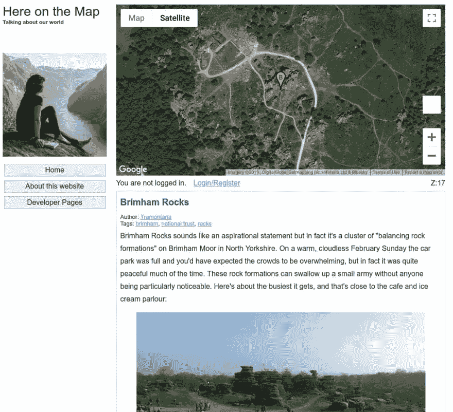
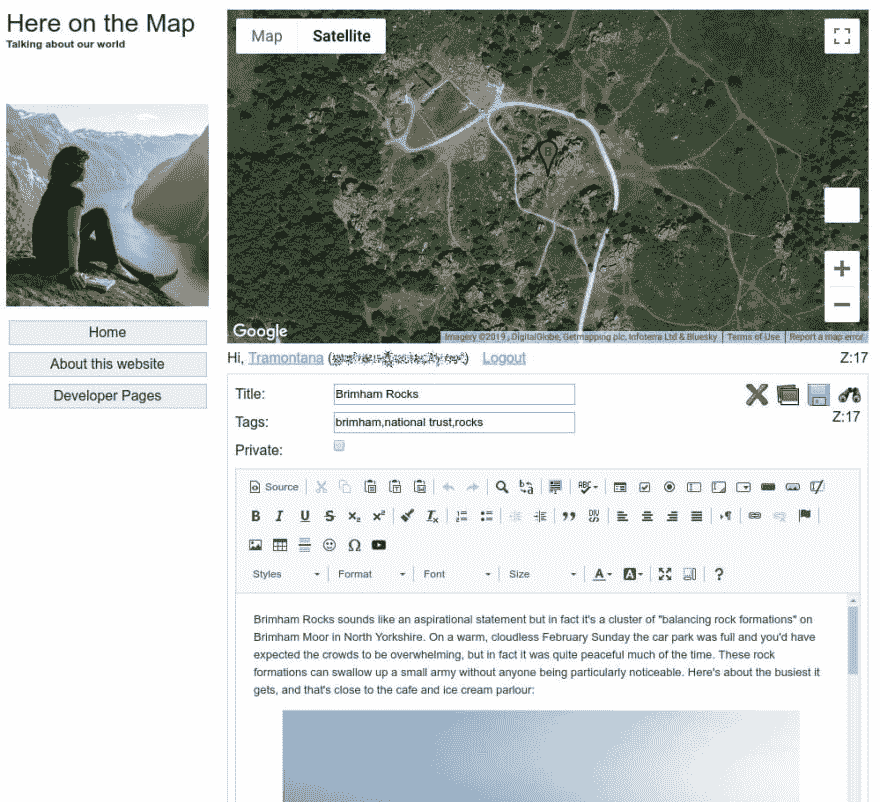

# 故事驱动设计

> 原文：<https://dev.to/gtanyware/story-driven-design-4c49>

关于构建交互式、内容丰富的网站的文章通常侧重于软件结构，并展示了高级 JavaScript 与 Angular、React 或 Vue 等现代框架的结合使用。这篇文章不是其中之一。相反，我想从技术上退一步，看看更大的图景。

网站一般不会从技术项目开始，而是从 ***故事*** 开始；描述，有时伴随着图片，网站应该做什么。故事是领域专家写的，不是程序员写的。这些客户委托我们通过构建一个新网站来满足他们的现实需求，而成功取决于我们的解决方案与他们故事中表达的期望的匹配程度。

为了解释这一点，我举了一个地图上的例子，你可以看到在[https://hereonthemap.com](https://hereonthemap.com)工作。这是一个演示网站，旨在说明一些特定的技术功能，而不是满足任何特定的需求。从设计角度来说，这很简单；最重要的是它的功能和描述它的故事。

## 地图上这里的‘故事’

地图上有一个非常简单的用户故事，大概是这样的。我们有一张活地图，上面有彩色大头针。用户可以缩放和平移来显示地球表面的任何部分，当他们单击一个大头针时，会出现一个面板，其中包含有关该大头针位置的信息。用户可以在网站上注册；然后，他们可以添加自己的 pin，并使用富文本编辑器编写相关内容。图像可以通过 URL 访问或使用提供的文件管理器上传到系统。以下是查看时的样子:

[](https://res.cloudinary.com/practicaldev/image/fetch/s--K6OgNsRU--/c_limit%2Cf_auto%2Cfl_progressive%2Cq_auto%2Cw_880/https://thepracticaldev.s3.amazonaws.com/i/gmbxe97qe2n16wt8zh88.jpg)

编辑时:

[](https://res.cloudinary.com/practicaldev/image/fetch/s--ZfrSgimy--/c_limit%2Cf_auto%2Cfl_progressive%2Cq_auto%2Cw_880/https://thepracticaldev.s3.amazonaws.com/i/6alghmupactz3ir6f38d.jpg)

以上只是几个故事中的一个，从用户的角度来看，这些故事共同构成了网站功能的完整规范。大多数项目都是从类似的大纲描述开始的；可以交给工程团队实施的“项目概要”。但是在我们开始编码之前，这里有一些一般性的问题。

## 一般实现问题

首先，这里使用的平台是 WordPress。为什么？因为这是获得基本功能的最简单的方法，在此基础上我们可以建立我们的网站。提供了大量有用的功能，我们可以随意使用或忽略它们。主题是相当不相关的；我选择了一个名为 No Header 的主题，这是一个非常基本的主题，它只提供了一个侧边栏，将屏幕的三分之二留给我自己的内容。它还通过调整字体大小和移动侧边栏来为移动兼容性提供一些响应。HOTM 应用程序对主题一无所知，事实上根本不与 WordPress 交互。

网站是前端驱动的。这部分是偏好，部分是实际。用传统的服务器端代码来交付一个类似的站点并不是不可能的，但是对用户行为的良好响应可能更难实现。此外，视觉结构是非常基本的，因此完全用浏览器代码实现它是非常可行的——甚至可能更好。网页和浏览器应用程序之间的界限相当模糊；前者建议更注重内容，后者更注重功能。这里我们更倾向于浏览器应用。

当看这个网站时，有一点很突出，那就是它是由功能块组成的。事实上，相当大的一个。特别是:

谷歌地图
用户注册/登录模块
富文本编辑器组件
图片上传和存储

网站的可用性在很大程度上取决于这些模块之间的交互方式，但是如果不先建立一个网站的轮廓原型，很难预测所有的细节。一旦它开始运行，一些交互的本质将变得更加清晰。这里有一个“第 22 条军规”,如果不知道所有的交互，就很难建立一个包含所有交互的框架，但是在它建立起来之前，你不会知道所有的交互可能是什么，你可能需要再次回到起点。正如您将看到的，解决方案——也是本文的要点——在于使用 API(应用程序编程接口)将故事从组件中分离出来。

以下是一些交互，即业务逻辑:

当你点击一个大头针时，你会看到相应的文章。您还可以获得作者的链接和标签列表。当单击其中任何一个时，地图会更新，仅显示与所选内容匹配的图钉。”

在地图下面会出现一行文字，告诉你你当前使用的过滤器

当你缩放地图时，当前的缩放级别显示在地图下方一行文字的末尾

*“当您通过点击地图下方的链接退出时，查看器或编辑器面板会消失，以防您正在查看只有注册用户才能看到的内容。”*

如果您正在查看自己创建的 pin，它将显示为绿色。当你注销时，它会变成黄色。”

还有各种各样的规则，比如当应用程序运行时什么状态信息被持久化。我们保存当前的纬度、经度和缩放，以及我们正在查看的大头针的名称。在文件管理器中，我们保留目录路径，这样用户下次可以返回那里。诸如此类。

这些交互和规则共同形成了属于领域专家的 ***故事*** 。由于应对竞争、引入新产品类型或需要满足不断变化的法规等因素，它们往往具有相当的流动性，并且会在短时间内发生不可预测的变化。

故事很少涉及组件如何工作的细节，只涉及它如何与其他组件交互。它们应该以这样一种方式来表达，以确保领域专家和程序员都能快速理解，并放在容易访问以进行更改的地方，而不是隐藏在晦涩难懂的代码中。理想情况下，它们应该被编码成至少与最初的项目提案或导致变更请求的讨论有一点相似之处。从长远考虑，想想网站维护者，他们通常不是最初的网站建设者。

这里有两种不同的程序。组件是高度优化的，包含众所周知的、不变的接口的功能，但是故事是随机的“粘合”逻辑，表达组件之间频繁变化的关系。一个组件可以像你喜欢的那样复杂，因为很少有人会看到它的内部，但是一个故事应该不惜一切代价力求清晰。这两个目标在应用于同一个实体时是直接矛盾的，但如果实体本身是分离的，则不是这样。

## 故事和组件

从上面我们可以看到一个结构开始出现，一个由故事连接在一起的功能组件。如果我们能找到一种方法来独立管理这两件事，网站将会比我们把所有的事情混在一起更容易运作。对于交互式网站，维护是一个严重的问题。如果故事不容易在代码中找到，未来的维护者将很难理解应该发生什么，很可能会破坏事情。

有些组件只是大型第三方 JavaScript 库。这里我们有两个特别的例子。Google Maps 和 CKEditor，它是提供富文本编辑器的组件。这些都可以从 CDN 上免费获得，也可以和网站的其他部分一起安装。关键是它们都是黑盒。我们对它们是如何实现的不感兴趣，只对它们呈现给世界的接口感兴趣。

其余的组件可能以标准库、WordPress 插件、为这个项目专门编写的一次性代码或者代码和库的某种组合的形式提供。无论是哪种情况，我们都应该设计我们的应用程序，以干净和一致的方式使用组件。

那就只剩下故事了。正如我已经解释过的，这些应该以尽可能接近原始的形式保持可见，并且这方面的一个好的先例以 SQL 的形式存在。数据库应用程序可以对数据做各种各样的事情，无论是为了显示而转换数据还是使用数据来控制布局，但是从数据库中提取数据的实际过程是以一种数据库领域专家和程序员都容易理解的方式完成的。我们可以用类似的方式来表达我们的故事吗？

## 级别编码

通用计算机语言是给程序员用的。我们其余的人用英语或另一种人类语言说和写，并且我们完全使用单词。人类语言看起来一点也不像 JavaScript 代码；没有花括号、粗箭头或三重等号，但我们人类很好地处理了它们，甚至设法用它们来组织整个社会。人类语言和计算机语言的另一个明显区别是你能说的语言；另一个你不能。这听起来有点愚蠢。这似乎是一个微不足道的观点，但大多数人类交流是口头的，而不是书面的，在大多数语言中，我们书写的方式密切反映了我们思考和说话的方式。一旦你背离了这一原则，你就会失去一部分听众，交流就会受到影响，项目也会失败。许多程序员认为任何人都可以通过“阅读代码”来了解他们的工作，但事实上这是一种罕见的技能，即使在程序员中也是如此。假设其他人，甚至是你未来的自己，能够不费吹灰之力理解你今天写的东西，这是非常不明智的。

当我们在日常生活中遇到一个不熟悉的实体时，我们会给它起一个名字，如**凉亭**或**除颤器**，而不是每次遇到它都冗长地拼写出来。或者，回到 HOTM 的上下文，一个**地图**和一个 **RTF 编辑器**。我们不关心项目如何工作，只关心它做什么，也就是它呈现给我们的界面。这也适用于计算机世界。你可以用三条信息画一张地图，比如说

*“在盒子里画一张地图，纬度 45.234，经度 5.82，缩放 5.5”*

对于一种可行的计算机语言，唯一的绝对要求是它必须是明确的，所以上面的指令是有效的计算机语言语句，同时保持完全可读的英语。

当然，我们需要一个编译器和运行时。HOTM 使用 WordPress 生态系统中已经存在的工具，但它们可能并不适合所有人。一个有能力的程序员只需要几个月的时间，就可以使用传统的系统编程语言构建一个基本的高级脚本处理器。许多公司构建定制工具来帮助他们自己的过程；这只是另一个例子。让编译器在浏览器中运行可以获得最大的回报，因此 JavaScript 将是显而易见的选择，但有些人可能更喜欢用 Python 或 Java 编写的独立应用程序，其中只有编译后的代码被发送到浏览器。任何能够掌握 React 的程序员都能够胜任这项工作，一旦完成，就可以反复利用，为未来的项目节省大量时间。

实现故事的人看不到这些。他们所看到的只是一个语法，这个语法允许他们表达他们想要使用的所有特性，并提供对主要组件的 API 的访问。

通过以这种方式对我们的应用程序进行分层，我们可以保持高可读性，这给了我们一些信心，即未来的修改可以由任何可以做这项工作的人快速而安全地进行。

## 怎么做

这里的地图是为了演示上述原理而构建的。它完全是用高级脚本编写的，使用源自英语的语法和包含所有必要概念和活动的词汇。编译器和运行时包是一个名为 easy coder([https://easy coder . software](https://easycoder.software))的 WordPress 插件，可以从 WordPress 插件库中获得。为了说明一般情况，这里有一个来自用户故事的简单片段:

*“当给定数据库中特定 pin 记录的 id 时，读取该记录，设置地图并显示该 pin 的商品”*

这里是 EasyCoder 脚本的相应部分:

```
rest get Record from `_/ec_markers/id/` cat RequestedID or
begin
    print `Failed to load the requested pin.  Error: ` cat the error
    stop
end
if property `id` of Record is not 0
begin
    set the latitude of Map to property `latitude` of Record
    set the longitude of Map to property `longitude` of Record
    set the zoom of Map to property `zoom` of Record
    update Map
    fork to ShowStory
end 
```

如你所见，因为一切都是用英语单词表达的，所以不需要学习计算机代码。诚然，语法有点笨拙，但还是可以理解的。事物的名称是骆驼大小写，而语言命令保持全部小写。

第一个命令通过调用 REST 服务器向数据库请求记录。插件中有一个基本的插件，它有一个扩展功能，可以提供额外的代码来处理与地图相关的特定命令。如果出现错误，会记录一份报告，但不会发生任何其他情况，屏幕保持不变。

假设返回了一个有效记录，它将有一个非零 id，因此我们可以提取 3 个映射参数并更新映射。这里我们使用的是谷歌地图模块，包装在简单的命令中，让我们不用担心细节就可以访问它的 API。

最后，我们去展示大头针的文章。“fork”命令只是确保故事在这个线程中继续处理时并行显示。(不，我们还没有发现 JavaScript 中迄今未知的线程特性；这个上下文中的线程是由语言引擎内部的协作多任务提供的。)

HOTM 网站记录了应用程序使用的所有 EasyCoder 脚本，以及 PHP REST 服务器扩展。无论有没有 React 框架的帮助，代码总量都比同等的 JavaScript 要少得多。当然，驱动这一切的是一个大约 50kB 的编译器/运行时 JavaScript 引擎和其他组件，如果全部使用，总容量将接近 200kB。加上脚本本身，从 GitHub 加载，包含在开源的 EasyCoder 项目中。网站加载不到 3 秒钟，但超过一半的时间只是从服务器获取初始的 WordPress 页面，之后事情就进展顺利了。脚本编译只需几十毫秒，编译通常与图像下载等其他事情并行进行。

使用 EasyCoder 可以非常快速地构建一个网站，部分原因是每个命令都做了大量的工作，部分原因是脚本表达的概念直接映射到你在屏幕上看到的内容，还因为网站所需的许多常用基础设施已经提供。HOTM 的大部分从最初的想法到一个完全正常工作的网站花了不到 2 周的时间。错误很少发生，因为内部函数被反复使用，使得 bug 无处可藏。然而，不得不承认，这是一个使用现成技术的相当小的网站，那么如果您需要构建一些真正复杂的功能呢？

## 混合技术

人们有偏好特定工作方式的倾向，程序员也不例外。当前最热门的话题是 JavaScript 框架，React 是其中的佼佼者，它的追随者经常建议它应该被用于任何事情。我不同意。React 没有错，但是我不希望它出现在任何可能被我的客户修改甚至看到的代码中。所有这些复杂的东西都属于组件级别。

原因是我希望让这些故事看得见。JavaScript 代码无论写得多么仔细，通常都无法以一种甚至可以找到的形式揭示用户故事，更不用说让除了最初的程序员之外的任何人都容易理解了。没有理解，更多的问题很快就会接踵而至。我已经在上面演示了功能可以分为故事的一个层次和基础设施的另一个层次，而 React 和 JavaScript 属于后者。

React 的一个关键特性是它是一种组件技术。这在这里描述的环境中工作得很好，在这里，主要的功能单元被构建为组件，并通过随机的故事连接在一起。任何定义良好的 API 都可以成为组件，包括使用现代框架构建的复杂的可视元素。

至于胶水，HOTM 使用的 EasyCoder 高级脚本语言是由单独的插件模块构建而成的，每个插件模块执行一定范围的任务，或者用于特定的领域，或者用于特定的技术。例子是 DOM 和谷歌地图插件或与 DropBox 接口的命令。它的核心只是提供任何地方都需要的基本语言特性。编写新插件很简单；您对它们进行编码，以处理为处理组件通过其 API 公开的功能而选择的语法，API 本身通常作为 CDN 的最小化 JavaScript 来交付。这些组件是如何设计的完全取决于它们的作者，如果他们最习惯使用 React，那么它就是这样。

请始终记住，我们所做的是创建一个顶级语法，让说英语的人和领域专家容易理解。实现这种语法所需的复杂性由程序员来处理，然后他可以自由地选择最适合这项工作的工具。如果你愿意，你可以构建一种只有一个单词的语言；“doit”，其他所有东西都隐藏在这个命令中。这就是今天网站实际上是如何建立的，但我不提倡这样做。我们可以做得更好。

在一定程度上，采用这种策略往往会将注意力集中在构建更好的可重用组件上。当您与使用组件的代码一起构建组件时，有一种趋势是添加专门的接口来解决短期需求，这使得在最初构建组件的上下文之外使用组件变得越来越困难。必须以只能通过已发布的接口访问的方式构建组件，这一原则迫使我们重新评估组件向世界提供了什么，并在此过程中使其成为更好的组件。更好的组件带来更好、更可靠、成本更低的网站。

西蒙·达乌迪在 [Unsplash](https://unsplash.com/search/photos/story?utm_source=unsplash&utm_medium=referral&utm_content=creditCopyText) 上拍摄的标题照片