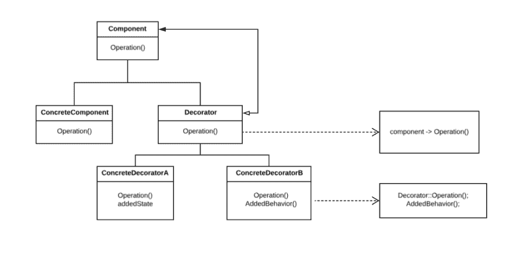
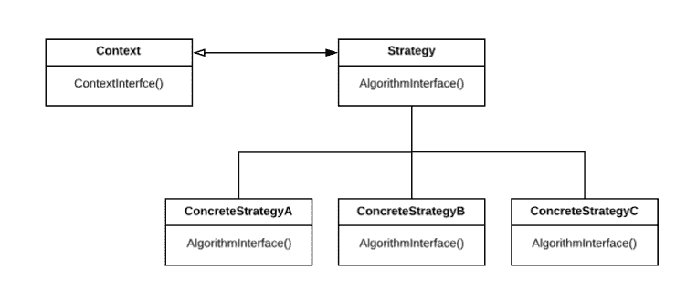

# 策略和装饰设计模式

> 原文：<https://dev.to/micahshute/strategy-and-decorator-design-patterns-20j6>

# 我为什么要用装饰器或者策略？

或者任何设计模式？总的来说，设计模式被创建并用于促进[对象组合超过继承](https://en.wikipedia.org/wiki/Composition_over_inheritance)，允许[(黑盒)代码重用](https://stackoverflow.com/questions/98984/black-box-vs-white-box-reuse)，更好地执行[单一责任原则](https://en.wikipedia.org/wiki/Single_responsibility_principle)，并总体上减少代码类的大小和笨拙。像任何设计模式一样，装饰者和策略都有特定的使用场景。这两种模式可以有相似的用例，当您应该使用其中一种时，很容易混淆。根据[1]，当你的目标是“通过子类化扩展功能的替代方案”时，装饰器和策略都可以使用。当您的类具有算法依赖性时，也可以使用策略，并且可以使用 Decorators 轻松地改变类本身不容易改变的功能。

那么它们到底是什么，你如何使用它们呢？让我们具体点。装饰器和策略只是我编写的额外的类，用来改变/扩展我已经编写的类的功能。它们改变该功能的方式是不同的，因此它们在不同的场景中是有用的。首先，让我们看看类图[1]:

#### 装饰工

[](https://res.cloudinary.com/practicaldev/image/fetch/s--qi2_FvJp--/c_limit%2Cf_auto%2Cfl_progressive%2Cq_auto%2Cw_880/https://thepracticaldev.s3.amazonaws.com/i/q7flol9hz6ryy89ifxgw.png)

这是什么话？如果你没有看过太多的类图，或者只熟悉[动态类型语言](https://stackoverflow.com/questions/1517582/what-is-the-difference-between-statically-typed-and-dynamically-typed-languages)，可能会比较混乱。每个带有粗体标题的框代表一个类。例如，在 Ruby 中，我们实际上不会用 Java 或 C++编写所有的类。

所有没有具体说明的框都是我们正在设计的类间 API 的架构。在静态类型语言中，我们必须在代码中将它们定义为接口、原型、抽象类等。取决于语言。在动态类型语言中，它们在文档中被定义，在我们的头脑中，它们是类生态系统的工程师。静态类型语言和动态类型语言都有好有坏；静态类型的类为您进行错误检查，帮助您在代码中更加精确和清晰，并确保您正确地设计您的系统，而动态类型的语言需要更少的代码，如果设计良好并正确记录，创建和阅读起来会简单得多。如果设计得不好，它们会更难阅读和调试。
但是现在回到`Decorator`类图；基本上，这个图告诉我们，我们有一个类`ConcreteComponent`，我们想要扩展它的功能。该类具有`Component`定义的功能和属性。因此，我们用与`ConcreteComponent`相同的 API 创建了另一个类(也就是说，它符合`Component`的设计)，除了它有一个额外的引用:a `Component`(它将是您想要扩展其功能的原始类或它已经穿上的任何装饰器)，我们称这个新设计为`Decorator`。我们可以制造尽可能多的不同类型的`Decorator`类，只要它坚持这种设计。

上面你可以看到`Component`可以做一个`Operation()`。所以，我们的`Decorator`也必须能够做一个`Operation()`。因为我们的`Decorator`引用了`Component`，所以它只是查看`Component`如何做`Operation()`，模仿那个输出，然后根据需要进行修改，并从它的`Operation()`方法返回这个新的和改进的输出。这就是上面虚线向你展示的。

伪代码:

```
class NumberComponent
   func operation(x){
      return x
   }
end

class BinaryNumberDecorator
   constructor(component){
      this.c = component 
   }  
   func operation(x){
      return this.c.operation(x).toBinary()
   }
end

c = new NumberComponent()
d = new BinaryNumberDecorator(c)
x = 2
c.operation(x) // outputs what your original class returns
d.operation(x) // extends functionality of NumberComponent using the same function call 
```

下面我将展示更复杂的 ruby 工作代码。

#### 策略

[](https://res.cloudinary.com/practicaldev/image/fetch/s--h3S0ZHUq--/c_limit%2Cf_auto%2Cfl_progressive%2Cq_auto%2Cw_880/https://thepracticaldev.s3.amazonaws.com/i/w7ai56qi1eilovnau2am.png)

这里，`Context`是我想要扩展其功能的类。因此，我创建了一个能够执行该功能的`Strategy`类。因为每个`ConcreteStrategy`符合相同的`Strategy`接口，所以它是可互换的。注意，与`Decorator`不同的是，`Strategy`不需要与`Context`共享一个接口。当我想要的功能很复杂并且可以用不同的算法实现时，这种设计模式很方便。假设我正在创建一个需要执行[快速傅立叶变换(FFT)](https://medium.com/@micah.shute/divide-and-conquer-the-fast-fourier-transform-f61cb060710b) 的类。由于 FFT 可以用不同的方式计算，并且我将来可能希望切换到更快/更好的算法，因此我可以实施一种策略来执行计算。

伪代码:

```
class DataContext
   constructor(data, fftStrategy = new Radix2Strategy()){
      this.data = data
      this.fftStrategy = fftStrategy
   }
   func fft(){
      return this.fftStrategy.fft(this.data)
   }
end

class BruteForceFFTStrategy
   func fft(data){
      ...perform brute force fft
      return calculated_fft
   }
end

class Radix2Strategy
   func fft(data){
      ...perform radix 2 strategy
      return calculated_fft
   }
end 
```

#### 直觉

有点像俄罗斯套娃。你得到一个你想要的对象，并把它嵌套在你的类中，这个类使用了内部的功能，并增加了它的功能。所以实际上，`decorators`更像是在 MIB 里面，小阿奎利安人在控制头部里面的人形身体。他像原来的`Component`，身体像一只`Decorator`。然后，他可以通过让他的人类装饰操作某种外骨骼来进一步装饰自己。在这一点上，小外星人和他的外表会有相同的方法，像`moveArm()`或`push()`，但装饰后的外骨骼会有很大不同的输出(即他可以更用力)。因此，`decorator`必须拥有与底层类相同的接口。它吃掉原来的`Component`，并允许世界与它互动，就像它与原来的`Component`互动一样。另一方面，策略有点像机器人中可替换的卡片。想象一下，你拉开后板，那里有插着数字卡的插槽，可以实现各种功能，比如吃饭、走路、说话等等。当一个算法被更新或者你想改变机器人的行为时，你可以把它们中的任何一个取出来替换掉。
一般来说，如果你想知道是使用`Strategy`还是`Decorator`设计模式，一个经验法则是在`decorator`中保持基类简单。如果`Component`太复杂，你将不得不在每个`decorator`中镜像太多的方法，最好使用一个`strategy`。
另外，当你想动态地给一个对象添加功能，而不一定是整个类(也许以后会撤销这个功能)时，装饰器会被广泛使用。策略通常用于执行非常复杂的功能，并且可以以不同的方式执行(可能具有不同的时间/空间复杂性)。

## 代码示例

#### 装修工:

```
 class IceCream

    def initialize(price: 1.0)
        @price = price
    end

    def price=(amt)
        @price = amt
    end

    def price
        return @price
    end

    def ingredients
        "Ice Cream"
    end

end

class WithJimmies
    def initialize(item)
        @item = item
    end
    def price
        @item.price + 0.5
    end

    def ingredients
        @item.ingredients + ", Jimmies"
    end
end

class WithChocolateSyrup
    def initialize(item)
        @item = item
    end
   def price
        @item.price + 0.2
    end

    def ingredients
        @item.ingredients + ", Chocolate Syrup"
    end
end

class WithOreos
    def initialize(item)
        @item = item
    end
    def price
        @item.price + 1.0
    end

    def ingredients
        @item.ingredients + ", Oreos"
    end
end

class FroYo

    def initialize(price: 1.5)
        @price = price
    end

    def price=(amt)
        @price = amt
    end

    def price
        return @price
    end

    def ingredients
        "Froyo"
    end
end

treat = IceCream.new
treat = WithJimmies.new(treat)
treat = WithOreos.new(treat)
treat = WithChocolateSyrup.new(treat)
puts treat.ingredients # "Ice Cream, Jimmies, Oreos, Chocolate Syrup"
puts treat.price # 2.7
another_treat = FroYo.new
another_treat = WithJimmies.new(another_treat)
puts treat.ingredients # "Froyo, Jimmies"
# Froyo and Ice Cream (Components) and all of the Decorators have #price and #ingredients
# methods, making them conform to the same interface. 
```

#### 策略:

```
class ChocolateSyrup
    def price
        0.2
    end 
    def ingredients
        "Chocolate Syrup"
    end
end

class Jimmies
    def price
        0.5
    end
    def ingredients
        "Jimmies"
    end
end

class Oreos
    def price
        1.0
    end
    def ingredients
        "Oreos"
    end
end

class IceCream

    attr_accessor :toppings, :price_strategy

    def initialize(toppings: , price_strategy: CalculatePriceStandardStrategy )
        @toppings = toppings
        @price_strategy = price_strategy.new
    end

    def price
        self.price_strategy.calculate(self.toppings)
    end

    def ingredients
        self.toppings.length > 0 ? "Ice Cream, " + self.toppings.map(&:ingredients).join(", ") : "Ice Cream"
    end

end

class CalculatePriceStandardStrategy
    def calculate(toppings)
        return 1.0 + toppings.reduce(0){ |cum, curr| cum + curr.price }
    end
end

class CalculatePriceRewardsMemberStrategy
    def calculate(toppings)
        return 0.5 + 0.8 * (toppings.reduce(0){ |cum, curr| cum + curr.price })
    end
end

toppings = [ChocolateSyrup.new, Jimmies.new, Oreos.new]
strategy = CalculatePriceStandardStrategy
treat = IceCream.new(toppings: toppings, price_strategy: strategy)
puts treat.ingredients # Ice Cream, Chocolate Syrup, Jimmies, Oreos
puts treat.price # 2.7
treat.price_strategy = CalculatePriceRewardsMemberStrategy.new
puts treat.price # 1.86 
```

这包括了基本的内容。您可以在下面的参考资料中看到更深入的描述和讨论。

##### 参考文献:

[1]可重用面向对象软件的设计模式元素，Gamma，Helm，Johnson，Vlissides