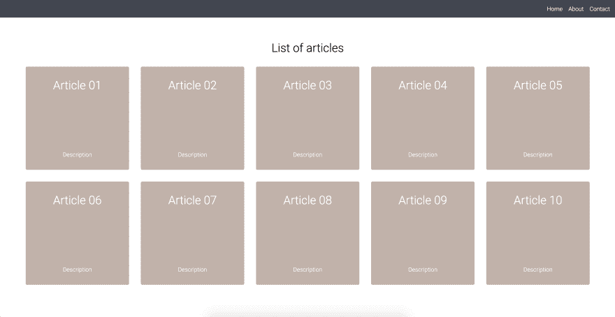

# 样式化组件:什么，为什么和如何？

> 原文：<https://dev.to/christopherkade/styled-component-what-why-and-how-5gh3>

[样式化组件](https://www.styled-components.com/)是一种使用 CSS 样式化 React 组件的方式**和**ES6 提供的优势，它们在官方文档中有最好的解释:

> 利用带标签的模板文字(JavaScript 的新功能)和 CSS 的强大功能，styled-components 允许您编写实际的 CSS 代码来设计组件的样式。它还消除了组件和样式之间的映射——使用组件作为底层样式构造再简单不过了！

### 以下是我们今天要讲的内容:

*   什么是样式组件？
*   [优势](#advantages)
*   [缺点](#disadvantages)
*   [一次具体的演习](#example)
*   [良好的文档记录](#documentation)

## 什么是风格化组件？

下面是一个样式化组件的例子:

```
import styled from "styled-components"

// Creates a StyledButton component of a button with the given style
const StyledButton = styled.button`
  background-color: #710504;
  color: #FFC700;
  border: 2px solid #6A686A;

  &:hover {
    cursor: pointer;
    color: white;
  }
`

// StyledButton can now be used like any other component
const Button = ({ children, onClick }) => {
  return (
    <StyledButton onClick={onClick}>
      {children}
    </StyledButton>
  )
} 
```

Enter fullscreen mode Exit fullscreen mode

如您所见，它们是 React 组件，就像您目前所知的组件一样。它们是通过调用`styled`并调用一个方法来创建的，该方法带有您希望使用的 HTML 标签的名称，同时向它传递它的样式。这里有一个[可用标签的完整列表](https://github.com/styled-components/styled-components/blob/v3.3.3/src/utils/domElements.js#L4)。

> `styled.button`只是`styled('button')`的快捷方式，这是 ES6 的一个特性，叫做[标记模板](https://developer.mozilla.org/en-US/docs/Web/JavaScript/Reference/Template_literals#Tagged_templates)😄

样式化组件最好的一点是，你可以根据组件的属性来调整你的样式，例如:

```
// https://www.styled-components.com/docs/basics#adapting-based-on-props

const StyledButton = styled.button`
  background: ${props => props.primary ? "palevioletred" : "white"};
  color: ${props => props.primary ? "white" : "palevioletred"};
`;

render(
  <div>
    <Button>Normal</Button>
    <Button primary>Primary</Button>
  </div>
); 
```

Enter fullscreen mode Exit fullscreen mode

## 优点

### 可复用组件

样式组件允许我们创建非常容易重用的组件，因为它们直接包含样式值。

所以接下来的 JSX:

```
<h1 className="title">Christopher Kade</h1> 
```

Enter fullscreen mode Exit fullscreen mode

可以翻译成以下成分:

```
const Title = styled.h1`
  color: white;
  font-size: 3rem;
` 
```

Enter fullscreen mode Exit fullscreen mode

并且可以这样使用:

```
Christopher Kade 
```

Enter fullscreen mode Exit fullscreen mode

这消除了组件和它们各自的 CSS 之间的映射的需要，并使样式成为每个组件的组成部分。

### 作用域样式

CSS 本质上是全球化的，David Khourshid 说得很好:

> 你有没有停下来想过为什么 CSS 有一个全局范围？也许我们想使用一致的版式、颜色、大小、间距、布局、过渡等。让我们的网站和应用感觉像一个整体？

然而，它的本质是很多人不喜欢的东西，因为在某个地方改变一个值可能会“破坏”其他地方的一些东西。这就是 CSS 作用域发挥作用的地方。

CSS 作用域允许我们通过限制 CSS 对其组件的影响来避免这些问题，样式化组件也不例外。

限定了作用域的样式使维护变得不那么痛苦，在这种情况下，您不必为了弄乱视图的那一片 CSS 而在多个文件中搜寻。

### 轻松创建动态 CSS

我已经提到了样式组件如何允许您使用组件的属性来动态设置样式值。

例如，我目前正在做一个[项目](https://christopherkade.com/ReactCraft)，在那里我正在基于魔兽世界的 UI 构建一个组件库，我有一个`ProgressBar`组件，它有一个默认的大小和一个可以用道具改变的完成百分比，就像这样:

```
<ProgressBar text="Loading..." percent={25} width={500} /> 
```

Enter fullscreen mode Exit fullscreen mode

然后，我将在样式组件中设置栏的大小和前进，如下所示:

```
// Set the bar's width based on the width prop
const Wrapper = styled.div`
  width: ${props => props.width}px;
  // ...
`

// Set the bar's advancement based on the percent prop
const Bar = styled.div`
  width: ${props => props.percent}%;
  // ...
`

const Label = styled.span`
  // ...
`

const ProgressBar = ({ width, text, percent }) => {
  return (
    <Wrapper width={width}>
      <Label>
        {text}
      </Label>
      <Bar percent={percent} />
    </Wrapper>
  )
} 
```

Enter fullscreen mode Exit fullscreen mode

### 支持服务器端渲染

SSR 被广泛使用，特别是由于像 [Next](https://nextjs.org/) 、 [Gatsby](https://www.gatsbyjs.org/) 或 [Nuxt](https://nuxtjs.org/) 这样的工具，所以 styled components 团队确保用一个叫做样式表再水化的概念来支持这个特性。

> 基本思想是，每次在服务器上呈现应用程序时，都可以创建一个 ServerStyleSheet 并向 React 树添加一个提供程序，该提供程序通过上下文 API 接受样式。
> 
> 这不会干扰全局样式，如关键帧或 createGlobalStyle，并允许您将样式组件与 React DOM 的各种 SSR APIs 一起使用。

关于[官方文件](https://www.styled-components.com/docs/advanced/#server-side-rendering)的更多信息。

### 性能提升

样式化组件跟踪给定页面上呈现的组件，并注入它们的样式和其他内容**。这意味着用户为给定的组件加载最少的样式。**

 **### 其他优点

其他优势包括原生移动支持和单元/快照测试工具，但我相信这三个可能是最需要记住的。

## 弊端

### 学习曲线

样式化的组件需要一些时间来适应，它们的语法和它们引入的新的思维方式需要一些耐心，但是在我看来回报是值得的。

### 更小的社区

在撰写本文时，风格化组件库拥有 23k ⭐on [Github](https://github.com/styled-components/styled-components) 。尽管如此，有时获得快速支持可能很困难。虽然我还没有真正遇到过无法找到任何解决某个问题的方法的情况。

### 长寿

就像 JS 生态系统中的任何工具一样，样式化组件有一天可能会消失，这将涉及到重构您的代码库。因此，在投入生产之前，记住这一点很重要。

## 一次具体的锻炼

> 注意:为了做这个练习，你需要很好地掌握 CSS 和 React(如果你在使用`flexbox`时有困难，请随意查看[我的文章](https://dev.to/christopherkade/flexbox-101-4hl6)，它涵盖了你需要的所有基础知识)。

好吧，让我们把手弄脏。

打开 [codesandbox](https://codesandbox.io/s/) ，选择`create-react-app` starter，导入`styled-components`依赖。

我们将创建一个非常简单的布局，显示一个导航栏和卡片，练习的每一步都将由一个要创建的组件(及其关联的样式组件)组成。试着从头开始编写代码，一旦你完成了(或者最终卡住了)，就可以随意检查代码片段。

[](https://res.cloudinary.com/practicaldev/image/fetch/s--u9QDHjZc--/c_limit%2Cf_auto%2Cfl_progressive%2Cq_auto%2Cw_880/https://user-images.githubusercontent.com/15229355/57724548-5465cc00-768b-11e9-8425-b09cdf8d9d4e.png)

结果代码可以在[这里](https://codesandbox.io/s/7k93lz791j)找到。

### 1。导航栏组件

该组件将只包含其右侧的 3 个链接，并显示在我们的视图顶部。

首先在`/src/components/`下创建一个`Navbar.js`文件。
分别从`React`和`styled-components`进口 react 和 styled。最后，创建并导出一个`Navbar`组件，它还没有返回任何东西。

```
// Navbar.js

import React from "react";
import styled from "styled-components";

const Navbar = () => {
  return (

  );
};

export default Navbar; 
```

Enter fullscreen mode Exit fullscreen mode

我们现在想要创建一个`Wrapper`样式的组件来包装我们的链接。确保设置它的样式，包括`flexbox`以便在容器的末尾对齐你的项目。

最后，确保你的`Navbar`组件返回了`Wrapper`。

```
// Navbar.js

import React from "react";
import styled from "styled-components";

const Wrapper = styled.div`
  display: flex;
  justify-content: flex-end;
  align-items: center;  
  background-color: #424651;
  height: 3rem;
`;

const Navbar = () => {
  return (
    <Wrapper>
    </Wrapper>
  );
};

export default Navbar; 
```

Enter fullscreen mode Exit fullscreen mode

接下来，我们想要创建一个样式化的组件来显示我们的链接。使用`a`标签创建`NavbarItem`，不要忘记设置它的`:hover`样式！

```
// Navbar.js

// ...

const NavbarItem = styled.a`
  font-size: 1rem;
  margin-right: 1rem;
  color: white;

  &:hover {
    opacity: 0.5;
    cursor: pointer;
  }
`;

const Navbar = () => {
  return (
    <Wrapper>
      <NavbarItem>Home</NavbarItem>
      <NavbarItem>About</NavbarItem>
      <NavbarItem>Contact</NavbarItem>
    </Wrapper>
  );
};

//... 
```

Enter fullscreen mode Exit fullscreen mode

好吧！您已经从头开始创建了`Navbar`组件，样式化组件背后的思维过程起初可能看起来有点难以理解，但是在每一步之后，它会变得越来越直观。

现在让我们创建与卡片相关的元素😃

### 2。卡片列表组件

让我们创建一个包含我们的卡片的`CardList`组件。

`CardList`将采用一个简单的`Wrapper`组件的形式，并将通过一个数据列表`.map`(例如，您可以使用一个包含一组博客文章的`.json`文件)呈现每张卡片。

首先创建`CardList`组件，返回一个`Wrapper`样式的组件，不要忘记使用`flexbox`来获得一个漂亮的布局。

```
// CardList.js
import React from "react";
import styled from "styled-components";

import data from "../data";

const Wrapper = styled.div`
  display: flex;
  flex-wrap: wrap;
  justify-content: center;
`;

const CardList = () => {
  return (
    <Wrapper>
    </Wrapper>
  );
};

export default CardList; 
```

Enter fullscreen mode Exit fullscreen mode

一旦我们的`Card`组件完成，我们将回到这个组件。

### 3。该卡组件

`Card`组件将以其标题和描述的形式获得道具，并将由 3 个样式组件组成:`Title`、`Description`和一个`Wrapper`。

继续创建它，给它任何你想要的风格。我个人确保使用`flexbox`作为我的包装器，以便将每张卡片的内容显示为一列。🤷‍♂️

```
// Card.js
import React from "react";
import styled from "styled-components";

const Wrapper = styled.div`
  display: flex;
  flex-direction: column;
  justify-content: space-between;
  width: 250px;
  height: 250px;
  background-color: #c4b2a9;
  border-radius: 4px;
  padding: 1rem;
  margin: 1rem;

  &:hover {
    opacity: 0.5;
    cursor: pointer;
  }
`;

const Title = styled.h1`
  font-size: 2rem;
  font-weight: 300;
  margin: 1rem;
  color: white;
`;

const Description = styled.p`
  color: white;
`;

const Card = ({ title, description }) => {
  return (
    <Wrapper>
      {title}
      <Description>{description}</Description>
    </Wrapper>
  );
};

export default Card; 
```

Enter fullscreen mode Exit fullscreen mode

现在让我们回到`CardList`并确保通过我们的数据的`.map`来呈现我们新创建的组件。

```
// CardList.js

// ...

// data is simply an imported .json file containing an "articles" array
const CardList = () => {
  return (
    <>
      <Wrapper>
        {data.articles.map(article => (
          <Card title={article.title} description={article.description} />
        ))}
      </Wrapper>
    </>
  );
};
// ... 
```

Enter fullscreen mode Exit fullscreen mode

### 奖励:使用样式组件的动态样式

更进一步，让我们创建一个将在我们的`Card`和`CardList`组件中使用的`Title`样式的组件。例如，我们可以使用相同的组件在前者中显示文章的标题，在后者中显示“文章列表”!

但是有一个扭曲:它应该在我们的卡片上显示为白色，在我们的卡片列表上显示为黑色。

提示:使用道具有条件地设置我们在`Title`样式组件中的颜色！

```
 // Title.js
  import React from "react";
  import styled from "styled-components";

  const Title = styled.h1`
    font-size: 2rem;
    font-weight: 300;
    margin: 1rem;
    color: ${props => (props.main ? "black" : "white")};
  `;

  export default Title; 
```

Enter fullscreen mode Exit fullscreen mode

```
 // CardList.js

  // ...
  const CardList = () => {
    return (
      <>
        List of articles
        <Wrapper>
          {data.articles.map(article => (
            <Card title={article.title} description={article.description} />
          ))}
        </Wrapper>
      </>
    );
  };

  // ... 
```

Enter fullscreen mode Exit fullscreen mode

恭喜，您已经使用样式组件创建了一个布局！🎉

## 好文档

如果你想了解风格化组件是如何工作的，你一定要看看 Eugene Gluhotorenko 的这篇文章:[链接](https://medium.com/styled-components/how-styled-components-works-618a69970421)。

Robin Wieruch 的这篇伟大的介绍性文章:[链接](https://www.robinwieruch.de/react-styled-components/)。

但是当然，没有什么能打败官方文档:[链接](https://www.styled-components.com/docs)。

## 包装完毕

我越来越多地在我的 React 项目中使用样式化的组件，并且发现它们超级直观和优雅。我希望这篇文章能推动你们中的一些人开始使用它们😄

> 这篇文章最初发表在[christopherkade.com](https://christopherkade.com)上，如果你喜欢它或者有任何问题，请确保在 Twitter 上关注我 [@christo_kade](https://twitter.com/christo_kade) 以便提前了解我将来会发表的任何其他文章。❤️**