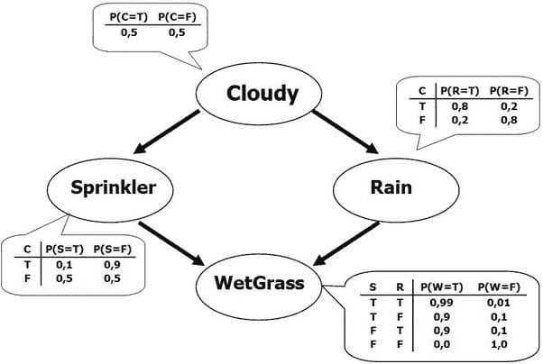
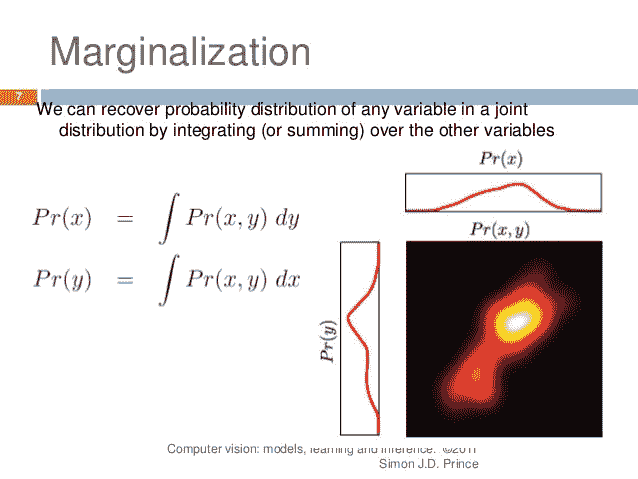
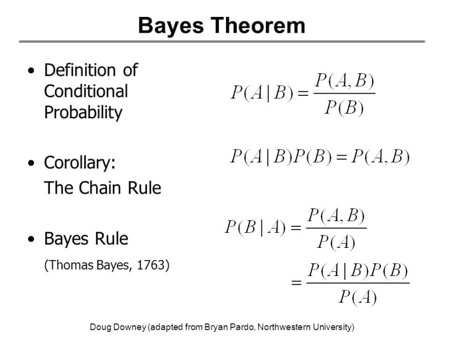
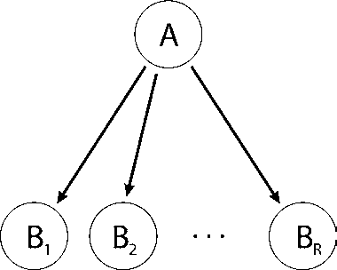

# 监督学习:贝叶斯推理

> 原文：<https://dev.to/swyx/supervised-learning-bayesian-inference-4l72>

*这是我学习[佐治亚理工学院/优达城机器学习课程](https://www.udacity.com/course/machine-learning--ud262)的一系列课堂笔记中的第 11 篇。课堂教材是汤姆·米切尔的[机器学习。](https://www.cs.ubbcluj.ro/~gabis/ml/ml-books/McGrawHill%20-%20Machine%20Learning%20-Tom%20Mitchell.pdf)*

> 这一章建立在前一章贝叶斯学习的基础上，因为我们跳过了许多基本的概率内容，所以显得不够全面。
> 
> 这也是一个关于监督学习的迷你系列的结尾，[机器学习](https://dev.to/swyx/machine-learning-an-overview-216n)中 3 个子学科的第一个。

## 什么是贝叶斯推理？

表示概率，并计算它们。比如给定 Y，X 发生的概率是多少？但是用了类固醇。

## 贝叶斯网络

> 也称为信念网络或图形模型。

其思想是将条件关系表示为有向无环图上的节点。因此，边是模型中要考虑的依赖项。

这看起来像一个神经网络。依赖性可以跳过级别，因此网络的连接可以随着每个变量呈指数增长:

这使得在复杂的贝叶斯网络中很难进行推理。

关于依赖，需要注意的一点是，它们不一定反映因果关系，只是有条件地依赖于对方。也许更重要的是，*缺乏*的依赖性非常好，因为它们体现了[的条件独立性](https://en.wikipedia.org/wiki/Conditional_independence)。

信念网络的非循环性质意味着你可以对节点进行拓扑排序来排序你的计算。

## 推理规则

我们在贝叶斯推理中使用的三个方便的规则是:

*   边缘化(直觉上，将条件概率相加)

*   链式法则(两个属性的联合分布是属性 1 的概率乘以给定属性 1 的其他属性的概率)
*   贝叶斯规则(重新表达条件概率)

## 朴素贝叶斯

朴素贝叶斯是贝叶斯网络的一种特殊情况，它假设所有属性有条件地相互独立，即只有一层的非常非常简单的网络:

如果将顶层节点作为一个类，并将所有子节点作为属性，则可以反转贝叶斯网络的方向，并从属性中推断出该类，从而得到朴素贝叶斯分类器:

## 朴素贝叶斯:利弊

这种方法有许多好处:

*   它使得推理(通常是 np 难问题)变得廉价
*   在属性数量上，它是线性的，而不是指数的
*   用标记的数据(通过简单的计数)很容易估计这些参数
*   连接推理和分类——除了生成属性的概率，您还可以翻转它并生成分类
*   从经验上看，这是非常成功的- [谷歌有一个用于垃圾邮件过滤的朴素贝叶斯的专利版本](https://patents.google.com/patent/US8364766)。

然而:

*   它的“天真”来自于假设任何属性之间都没有相互关系，这很难让人相信
    *   答案是:是的，它是不准确的，但是[就像我们在上一课中所说的](https://dev.to/swyx/supervised-learning-bayesian-learning-403l)我们不在乎得到准确正确的假设来估计概率，我们只在乎得到正确的分类答案。所以你只需要保持方向正确。
*   依赖经验计数意味着缺失属性的估计概率为零
    *   这使你暴露于归纳偏见和过度拟合你的数据
    *   是的，这是一个问题，所以在实践中人们通过初始化一个非零的小权重来“平滑概率”。

## 我们系列的下一个

关于此主题的更多说明:

*   [维基百科上的贝叶斯推断](https://en.wikipedia.org/wiki/Bayesian_inference)

希望这是对贝叶斯推理的一个很好的介绍。我正在计划更多的初级读本，希望您能就以下方面提供反馈和问题:

*   [概述](https://dev.to/swyx/machine-learning-an-overview-216n)
*   监督学习
    *   [决策树](https://dev.to/swyx/machine-learning-classification-learning--decision-trees-1mbh)
    *   [回归](https://dev.to/swyx/supervised-learning-regression-4d17)
    *   [神经网络](https://dev.to/swyx/supervised-learning-neural-networks-mpo)
    *   [基于实例的学习(K 最近邻)](https://dev.to/swyx/supervised-learning-instance-based-learning-and-k-nearest-neighbors-kge)
    *   [集成学习(AdaBoost)](https://dev.to/swyx/supervised-learning-ensemble-learning-lim)
    *   [内核方法&支持向量机](https://dev.to/swyx/supervised-learning-support-vector-machines-3mgk)
    *   [计算学习理论](https://dev.to/swyx/supervised-learning-computational-learning-theory-160h)
    *   [VC 尺寸](https://dev.to/swyx/supervised-learning-vc-dimensions-10b)
    *   [贝叶斯学习](https://dev.to/swyx/supervised-learning-bayesian-learning-403l)
    *   [贝叶斯推理](https://dev.to/swyx/supervised-learning-bayesian-inference-4l72)
*   无监督学习
    *   [随机优化](https://dev.to/swyx/unsupervised-learning-randomized-optimization-4c1i)
    *   [信息论](https://dev.to/swyx/unsupervised-learning-information-theory-recap-4iem)
    *   聚类-2 月 25 日这一周
    *   功能选择-3 月 4 日开始的一周
    *   功能转变-3 月 11 日开始的一周
*   强化学习
    *   马尔可夫决策过程-3 月 25 日的一周
    *   “真实”RL-4 月 1 日开始的一周
    *   博弈论-4 月 15 日的一周