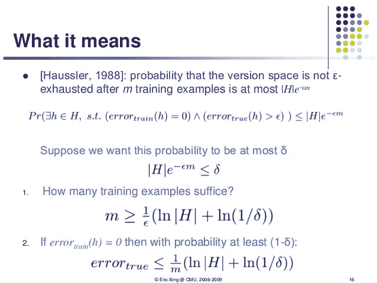
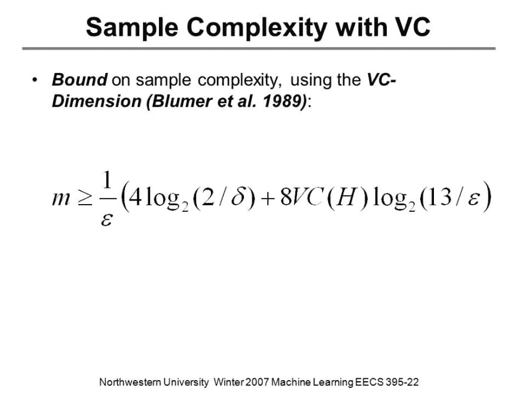

# 监督学习:VC 维度

> 原文：<https://dev.to/swyx/supervised-learning-vc-dimensions-10b>

*这是我学习[佐治亚理工学院/优达城机器学习课程](https://www.udacity.com/course/machine-learning--ud262)的系列课堂笔记中的第九篇。课堂教材是汤姆·米切尔的[机器学习。](https://www.cs.ubbcluj.ro/~gabis/ml/ml-books/McGrawHill%20-%20Machine%20Learning%20-Tom%20Mitchell.pdf)*

> ⚠️:这一章比其他章节理论性更强，但为机器学习奠定了理论基础——跳过或坚持，你自己选择，但要小心

## 核心问题

在前一章中，我们学习了使用[豪斯勒定理](https://dev.to/swyx/supervised-learning-computational-learning-theory-160h)来限制我们的真实误差，作为抽取的例子数量的函数。

然而，这个公式依赖于假设空间是有限的(即冒着“真实”假设是我们没有考虑的东西的风险)。在这一章中，我们考虑有无限个假设空间的问题。

## 无限的空间无处不在

如果前一章让你兴奋，这一章会让你沮丧。无限空间无处不在。不是每个问题都有二元输入空间。任何具有连续值的事物都有无限个空间。

然而，我们可以区分一个*句法*假设空间(所有你可能猜到的东西)和一个*语义*假设空间(所有你可能表示的函数),并将无限空间压缩成离散空间。我们用连续值的决策树来做这件事，尽管理论上有无限可能的值，但我们基于具有有意义的差异来为连续值选择分裂点。

在数轴上选择两个点进行分割不会显著增加假设空间的复杂性，因为一个数必然大于另一个数，反之亦然。你可以小于或大于 5，但不可能小于 3 大于 7。所以数线是一个相当“弱”的假设空间。

## VC 维与假设空间的幂

事实上，在一条连续的数字线上选择一个分割点是如此容易，以至于我们可以概括这个想法并问:

> 假设类可以用所有可能的方式标注的最大输入集是什么(也称为粉碎)？

换句话说，你可以用来在语义上表达与真实(无限)假设空间相同的假设空间的最大*个变量是多少？这个量称为 VC 维。*

VC 代表 [Vapnik](https://en.wikipedia.org/wiki/Vladimir_Vapnik) (发明支持向量机的同一个人)和 [Chervonenkis](https://en.wikipedia.org/wiki/Alexey_Chervonenkis) 。 [VC 理论](https://en.wikipedia.org/wiki/Vapnik%E2%80%93Chervonenkis_theory)将一个班级的 VC 维度与你需要在那个班级中有效学习的数据量联系起来。

## VC 维的间隔

这是一个非常简单的例子，仅供学习使用。

If H:从`[a,b]`开始的所有区间的集合；

*   X 是一维实数的集合
*   所以这是一个无限的假设空间
*   VC dimension 提问:假设类可以使用来自 h 的假设以所有可能的方式标注的最大输入集是什么？
    *   您可以仅用一个输入点来拟合一个区间(仅拟合其周围或外部)
    *   您可以用两个输入点来拟合一个区间(只需拟合一个或两个输入点，或者两个都不拟合)
    *   但是你不能用有一个`+ - +`序列的三个输入点来拟合一个区间，因为区间必须是连续的
    *   因此，VC 维是 2。

[**粉碎**](https://www.quora.com/Explain-VC-dimension-and-shattering-in-lucid-Way) 是一个小而关键的概念，表示给点分配不同的标签。例如，如果所有的点都在彼此之上，它们就不会被粉碎。

## VC 线性分隔符的尺寸

线性分隔符，就像我们在[中看到的最基本的 SVM 例子](https://dev.to/swyx/supervised-learning-support-vector-machines-3mgk)一样，将一个平面分成正反两面。我们已经建立了无限的假设空间。

If H:从`y=mx+b`开始的所有分隔符(行)的集合；

*   X 是二维实数的集合
*   所以这是一个无限的假设空间
*   VC dimension 提问:假设类可以使用来自 h 的假设以所有可能的方式标注的最大输入集是什么？
    *   您可以仅用一个输入点拟合一条线
    *   您可以用两个输入点拟合一条线(仅拟合一个或两个输入点，或者两个都不拟合)
    *   您可以用三个输入点拟合一条线(除非它们都在同一条线上，也就是不可改变的)
    *   但是你不能用一条有四个输入点的线来拟合一个`+ - + -` 2x2 矩阵，因为这些线分割了一个必须相连的平面
    *   因此，VC 维是 3。

## 更多维度

这里有一个模式:

| 分离器 | VC 维度 | 输入 |
| --- | --- | --- |
| 0d 点 | one | 希腊字母的第八字 |
| 一维线条 | Two | 甲，乙 |
| 二维表面 | three | w1，w2，θ |
| 三维空间 | four | w1，w2，w3，θ |

事实上，VC 维通常是假设输入所在空间的维数。对于任何 d 维超平面假设类，VC 维是`d+1` -每个维的权重 theta(对于大于或等于重叠)

更多分隔符及其 VC 维示例以及它们背后的推理[可以在这里找到](https://www.spsc.tugraz.at/system/files/vc_examples.pdf)。

我们也可以使用非线性分隔符——例如，2d 圆的 VC 维为 3。

## 无限维 VC

尽管将对话从无限空间重铸到维度，仍然有可能形成具有无限维度的假设。一个简单的例子是凸多边形内点的假设类:

[https://www.youtube.com/embed/TYHFOpgCBek](https://www.youtube.com/embed/TYHFOpgCBek)

(最好观看以便理解)

因此，圆的 VC 维数为 3，而凸多边形的 VC 维数为无穷大(因为它可以有任意多个输入点)

## 样本复杂度(无限情况)和 VC 维数

现在我们已经开发了 VC 维的概念，我们可以把它连接回我们以前的样本复杂度公式(完全跳过证明...):

## 有限假设空间的 VC

如果我们用`d`来表示有限假设空间的 VC，则必须有`2^d`个不同的概念(因为每个不同的标记可以被一个类别中的不同假设所捕获)——因此`2^d`小于或等于假设的数量`|H|`。

重新整理，`d <= log2 (|H|)`。所以一个有限的假设类给了我们有限的 VC 维，因此使事情“PAC 可学习”。还有一个进一步的证明是相反的- `H`是 PAC 可学习的*当且仅当*VC 的维数是有限的。VC Dimension 在一个概念中抓住了 PAC 可学性的概念。

## 我们系列的下一个

关于此主题的更多说明:

*   汤姆·米切尔关于这个话题的演讲

希望这是对 VC 维度的一个很好的介绍。我正在计划更多的初级读本，希望您能就以下方面提供反馈和问题:

*   [概述](https://dev.to/swyx/machine-learning-an-overview-216n)
*   监督学习
    *   [决策树](https://dev.to/swyx/machine-learning-classification-learning--decision-trees-1mbh)
    *   [回归](https://dev.to/swyx/supervised-learning-regression-4d17)
    *   [神经网络](https://dev.to/swyx/supervised-learning-neural-networks-mpo)
    *   [基于实例的学习(K 最近邻)](https://dev.to/swyx/supervised-learning-instance-based-learning-and-k-nearest-neighbors-kge)
    *   [集成学习(AdaBoost)](https://dev.to/swyx/supervised-learning-ensemble-learning-lim)
    *   [内核方法&支持向量机](https://dev.to/swyx/supervised-learning-support-vector-machines-3mgk)
    *   [计算学习理论](https://dev.to/swyx/supervised-learning-computational-learning-theory-160h)
    *   [VC 尺寸](https://dev.to/swyx/supervised-learning-vc-dimensions-10b)
    *   [贝叶斯学习](https://dev.to/swyx/supervised-learning-bayesian-learning-403l)
    *   [贝叶斯推理](https://dev.to/swyx/supervised-learning-bayesian-inference-4l72)
*   无监督学习
    *   [随机优化](https://dev.to/swyx/unsupervised-learning-randomized-optimization-4c1i)
    *   [信息论](https://dev.to/swyx/unsupervised-learning-information-theory-recap-4iem)
    *   聚类-2 月 25 日这一周
    *   功能选择-3 月 4 日开始的一周
    *   功能转变-3 月 11 日开始的一周
*   强化学习
    *   马尔可夫决策过程-3 月 25 日的一周
    *   “真实”RL-4 月 1 日开始的一周
    *   博弈论-4 月 15 日的一周