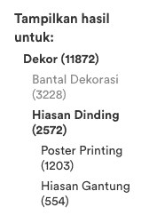
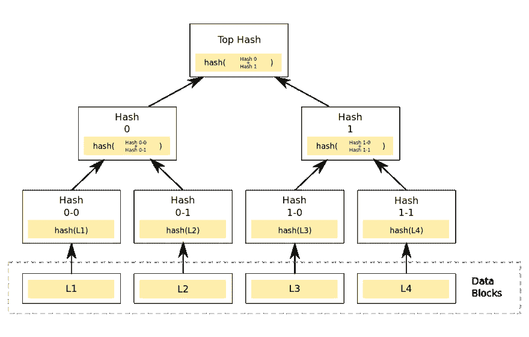

# 用 Merkle 树同步你的分层数据

> 原文：<https://dev.to/rkkautsar/synchronizing-your-hierarchical-data-with-merkle-tree-2621>

如果你还没有注意到的话，你在计算机科学课上遇到的这种叫做树的数据结构其实无处不在。你在寻找你多年前安装的游戏的卸载程序，却忘记玩了？文件系统是一棵树。你在数以百万计的电子商务网站中寻找替换旧耳机的选项？类别是一棵树。你知道吗，这个网站也是一棵树，因为 HTML 是一棵树。见鬼，连你全家都是一棵树！...对不起，我的意思是说你的家谱是一棵树。不管怎样，我们生活在一个树木的世界里！

因为我们生活在一个树的世界里，所以我们经常会发现我们需要用树来表示数据，或者我们也可以称之为分层数据。

你看，我过去所有的实习都是在两家初创公司完成的: [Dekoruma](https://dekoruma.com) 和 [STOQO](https://www.stoqo.com) ，这两家公司的产品类别都有这样的层级:

[](https://res.cloudinary.com/practicaldev/image/fetch/s--tL6o4Goe--/c_limit%2Cf_auto%2Cfl_progressive%2Cq_auto%2Cw_880/https://i.imgur.com/eE1LDw0.png)

[](https://res.cloudinary.com/practicaldev/image/fetch/s--7iXrdKr8--/c_limit%2Cf_auto%2Cfl_progressive%2Cq_auto%2Cw_880/https://i.imgur.com/FlPNKoA.png)

在一种情况下，它有三层，表示为实际树，而在另一种情况下，它只有两层，表示为嵌套的选项卡。

让我们举个例子:在一个杂货店应用程序中，一个*香蕉*🍌可能会被归入以下等级类别:**食物>水果>黄色水果**。所以让我们看看如何存储它。

存储分层数据有很多种方法，一种方法可能是存储其父数据:

```
[  {  "id":  1,  "category":  "Foods",  "parent":  null  },  {  "id":  2,  "category":  "Fruits",  "parent":  1  },  {  "id":  3,  "category":  "Yellow Fruits",  "parent":  2  }  ] 
```

另一种可能是存储其子节点:

```
[  {  "id":  1,  "category":  "Foods",  "children":  [  2  ],  },  {  "id":  2,  "category":  "Fruits",  "children":  [  3  ]  },  {  "id":  3,  "category":  "Yellow Fruits",  "children":  []  }  ] 
```

或者甚至用路径属性展平:

```
[  {  "category":  "Foods",  "path":  "Foods"  },  {  "category":  "Fruits",  "path":  "Foods > Fruits"  },  {  "category":  "Yellow Fruits",  "path":  "Foods > Fruits > Yellow Fruits"  }  ] 
```

而且有更多的方法来存储这些数据，各有利弊。虽然这是一个有趣的主题(您应该阅读该链接)，但本文与此无关，所以让我们跳过它。

这些类别不应该改变太多，对吗？如果不会有太大的改变，我们为什么要一次又一次地要求呢？将它们保存在 web 中的`localStorage`或 mobile 中的`AsyncStorage`中不是更好吗？如果应用程序应该先离线，这就更重要了，因为在 PWA 和移动应用程序中经常出现这种情况。幸运的是，如果你正在使用 redux，有一个很棒的 [redux-persist](https://github.com/rt2zz/redux-persist) 库会为你保存数据。如果你没看过，就去看看吧。

现在有了它，我们做的请求更少了，我们的应用程序变得更快了。我们的服务器开心，我们的用户开心，我们也开心。但是等等。销售团队来找你问为什么他们新的闪亮的🥑顾客应用程序上没有显示真正绿色的水果类别，因此重新分类的水果销量直线下降。哦，不，我们已经保留了整个类别，不再麻烦向服务器请求，因为我们认为它不会改变。

例如，一个快速的解决方法是在刷新时再次请求整个类别。但是这违背了存储类别树的目的，并且请求整个树是非常昂贵的，就像一些兆字节昂贵的东西。我们还可以在用户每次浏览到一个子类别时逐层请求子树。让我们假设一个平均级别有大约五个节点，每个节点平均有 200 字节的数据，这将为每个请求消耗额外的千字节，考虑到到到服务器的额外往返，这可能需要大约 200 毫秒。正如技术面试官会说的，我们能做得更好吗？

我来介绍一下 Merkle Tree(图片取自[维基百科](https://en.wikipedia.org/wiki/Merkle_tree)页面):

[](https://res.cloudinary.com/practicaldev/image/fetch/s--VPpvD_Vv--/c_limit%2Cf_auto%2Cfl_progressive%2Cq_auto%2Cw_880/https://i.imgur.com/rPFoJ0T.png)

Merkle 树是一种特殊的树。它是一种基于哈希的数据结构，因其在加密货币领域的使用而普及，如中本聪在比特币中的使用。嗯，快速谷歌一下 merkle tree 就会发现它在加密货币中的应用。但是我们将使用这种时髦的数据结构作为我们的层次分类，这多酷啊。

基本上，merkle 树中的叶子存储相关数据的散列。然后父节点将获取其子节点的哈希值并对其进行哈希处理。这重复到顶部，直到我们得到根节点的散列。这样，树中某处数据的变化将反映到它的父节点，并且根节点中的散列将总是变化的。

酷，那么我们如何将它应用到我们的应用程序中呢？在我们的例子中，当销售团队决定在水果类别下创建一个新的类别时，水果的散列将会改变，因此食物的散列将会改变，因此我们的根的散列将会改变。这样，我们的应用程序可以检查根的哈希是否改变，以决定我们是否应该同步我们的类别。

存储和计算散列的简单实现如下所示(在 Django 中):

```
class Category(models.Model):
    # ...
    hash = models.CharField(max_length=64)

    def get_hash(self):
        SEPARATOR = b"\x00\x00"
        h = hashlib.sha256()
        h.update(str(self).encode())
        for child in self.children.all():
            h.update(SEPARATOR)
            h.update(child.hash.encode())
        return h.hexdigest()

    def save(self, *args, **kwargs):
        self.hash = self.get_hash()
        super().save(*args, **kwargs)
        if self.parent:
            self.parent.save() 
```

我们使用 SHA256 作为散列。对于每一次插入/更新，我们需要一次额外的节点深度旅行。在我们的例子中，它只有两三层深。虽然应用程序的实现会是这样的(使用 Redux Thunk):

```
export const syncCategories = categories => async (dispatch, getState, { api, schema }) => {
    try {
        const state = getState();
        const currentCategories = selectCategories(state, categories);
        const remote = await api.getCategories({ categories, depth: 0 });
        const diff = remote.filter((tree, idx) => tree.hash !== currentCategories[idx].hash);
        const { entities } = normalize(diff, [schema.category]);
        dispatch(addEntities(entities));
        const subCategories = [].concat(...diff.map(tree => tree.children));
        if (subCategories.length > 0) {
            dispatch(syncCategories(subCategories));
        }
    } catch (err) {
        console.error(err);
    }
}; 
```

这样，我们只能请求 sync categories([rootCategoryId])一次，可能是在每次刷新时，或者只是偶尔(你知道，它毕竟没有太大变化)。然后，如果检测到散列是不同(见过滤器的东西)，我们递归到它的孩子，只有当散列也是不同的。

就是这样，我们不必请求整个类别树，只更新那些真正改变的。因此，我们的销售时间也很愉快，我们的用户再次看到了重新分类的产品，产品销售也再次回升。现在我们可以幸福地生活在一起了。

* * *

这篇文章最初发表在我的个人博客上。