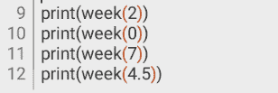
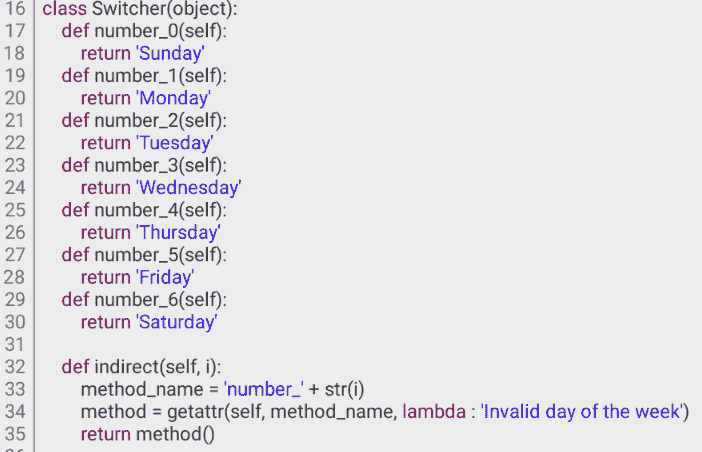
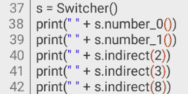

# 自学编码(二)

> 原文：<https://dev.to/iheartbenzene_20/teaching-yourself-to-code-ii-2e6b>

在我们开始之前，让我们快速回顾一下一些基础知识。随着我们的深入，将列出一些 C#的东西，它们可能与 Python 相关，也可能不相关。通过这种方式，我希望在类、对象、方法、变量和语言的其他特性之间建立一种函数关系。

现在，你可能会说这实际上很困难，因为 python 和 C#是根本不同的，我通常会倾向于同意(显示我缺乏经验)。然而，如果我们首先假设“是程序员让[语言]看起来简单”这句话是对的，那么肯定在两种语言之间至少会有相关的主题/领域/思想。因此，通过归纳，我们可以将可联系性的概念扩展到任何其他两种语言的比较。在这种情况下，我们将保持 Python 语言不变，并对其进行比较。

也就是说，像变量和变量赋值这样的事情在两种语言中是一样的。这可能只是我学习这种语言的一个结果(SoloLearn 对于快速教程来说很棒)，但是我开始注意到的区别是从命令和赋值操作符开始的。值得注意的是，尽管在 C#和其他一些语言中，使用“x++”这样的语句是可以的，但是这种简写在 Python 中是不可接受的；你必须造一个句子，如“x+=1”或“x=x+1 ”,即使是单位增量。除此之外，大部分还是老样子。也就是说，即使命令明显不同，控制台。Writeline("这是一个字符串")；与 print(“这是一个字符串”)有一定的相似之处。在继续之前，我确实想花点时间观察一下 Python 缺少分号的情况。是的。正如我所说的，语言的结构很大程度上是相似的。虽然有一定的区别。

举例来说，在这两种语言中，常见的是“for”和“while”，在 Python 中很少(也很少)看到“do { } while { }”或“foreach”部分；它不需要它们。要实现这些，就变成了“虽然:...如果:……”或者“为了...在……”相反。同样重要的是，Python 没有默认的“切换”大小写比较。为了实现这一点，您可能需要使用一个字典，在字典中我们将每个部分映射到它们各自的函数，或者您可以定义一个特定的类(或多个类),在运行时选择特定的方法。以下示例最初列在 [data-flair](https://data-flair.training/blogs/python-switch-case/) 上。

使用字典:

如果我要求打印信息，

结果是:

然后，使用类:

当它被打印出来时，

给了我们一个相似的结果:

我想在这里简要说明两件事，我使用空格" "插入空格，纯粹是为了输出格式的目的，如果您从命令行调用函数，结果也是一样的。

此外，条件的简单用例在很大程度上是相同的；x > 0，y <= a，甚至是“x==y”、“x！=y”、“x&&y”、“x||y”，是相对可互换的。但是，对于 Python 来说，很多时候这些逻辑运算可以按字面意思写成“x 和 y”或者“x 或 y”，虽然在某些情况下，少数保持不变，比如“x==y”，“x！=y”。至于如何解释逻辑运算，任何布尔语句的传统论点仍然存在。也就是说，请遵守以下规定:

如果 x 和 y 都为真，则“x 和 y”为真。如果 x 或 y 为真，则“x 或 y”为真。
如果 x 或 y 为假，则“x 和 y”为假。
“x！= y”与“x == y”一起，当分别适当地读作“x 不等于 y”、“x 正好等于 y”时，保留了它们的逻辑真实性，正如您自然期望的那样。

同样，对于某个常数 a，或者对于某个函数 g；其中 g 可以被评估为某个常数值；任何比较陈述，“x > a”，“y < g”，都遵循你所期望的价值比较的期望。