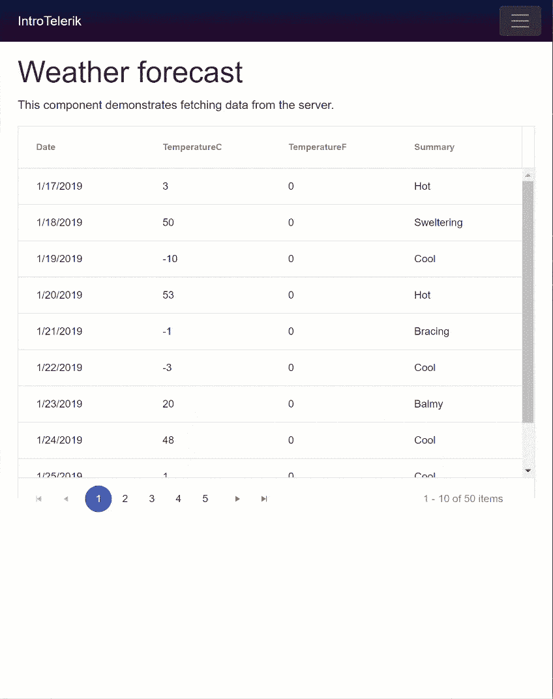
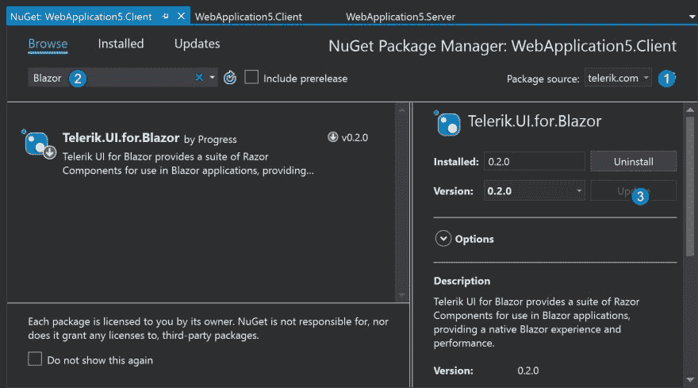
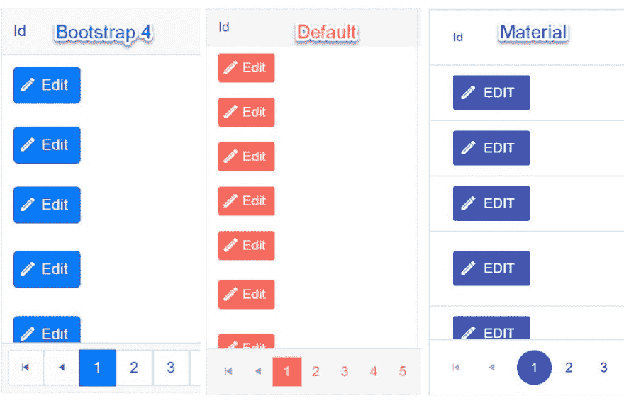
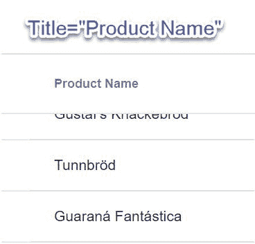
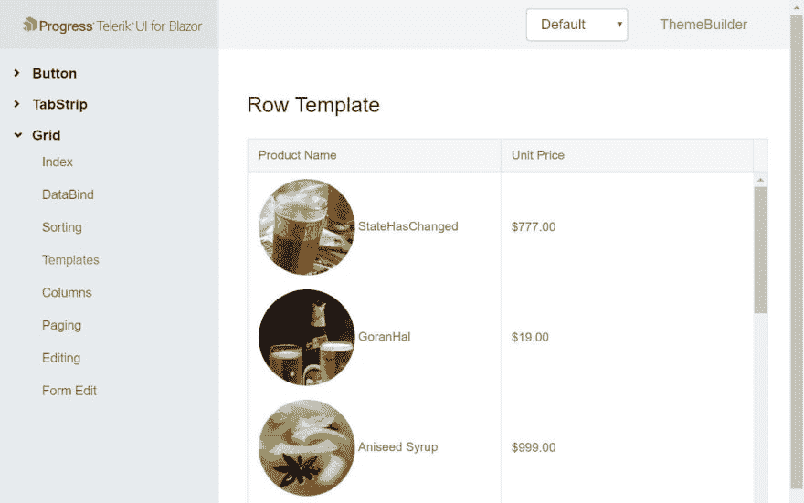

# Blazor 的 Telerik UI:网格组件基础

> 原文：<https://dev.to/progresstelerik/telerik-ui-for-blazor-grid-component-basics-3180>

用于 Blazor 数据网格的 Telerik UI 具有分页、排序、模板和开箱即用的主题等功能。了解如何立即开始使用网格的基本特性。

Telerik UI for Blazor 是一个全新的 UI 组件库，用于 Razor 组件和 Blazor 框架。尽管用于 Blazor 的 Telerik UI 处于“早期预览”阶段，但它附带了最流行和最通用的 UI 组件之一——数据网格。数据网格具有现成的功能，如分页、排序、模板和主题。在本文中，我们将关注如何开始使用网格的基本特性。

[](https://res.cloudinary.com/practicaldev/image/fetch/s--ENBwgbfu--/c_limit%2Cf_auto%2Cfl_progressive%2Cq_66%2Cw_880/https://d585tldpucybw.cloudfront.net/sfimages/default-source/default-album/jnf5sei.gif%3Fsfvrsn%3D8f4eab1_1)

## 先决条件

由于 ASP.NET 预览版进展迅速，所以最好更新一下你的信息。确保你使用的是 Razor 组件(服务器端)和 Blazor(客户端)的最新版本，因为我们将同时使用这两个版本。两个框架的详细安装说明可以在 [Blazor 入门页面](https://docs.microsoft.com/en-us/aspnet/core/razor-components/get-started?view=aspnetcore-3.0&tabs=visual-studio)上找到。

还要确保你已经为 Blazor 免费早期预览启用了 [Telerik UI。即使您之前已经注册了预览版，您也可能需要重新访问此页面，以便在您的订阅源中显示最新版本。有了这个免费账户，你就可以添加](https://www.telerik.com/download-trial-file/v2-b/ui-for-blazor) [Telerik NuGet 包源](https://docs.telerik.com/aspnet-mvc/getting-started/nuget-install#set-up-nuget-package-source)。

在我们开始之前，你可能想知道为什么在为 Blazor 使用 Telerik UI 时会出现**剑道**名称空间。这是因为用于 Blazor 的 Telerik UI 与我们的**剑道 UI** 品牌的组件共享网络资源(HTML & CSS)。

## 安装

为 Blazor 安装 Telerik UI 只需要几个简单的步骤。首先我们需要安装软件包二进制文件。我们将使用 Telerik NuGet 软件包源来安装该软件包。如果您还没有 Telerik 软件包源代码，请参见上面的**先决条件**部分。

如果您的项目中有多个解决方案，请将包安装到包含“Pages”文件夹的项目中。这些是您的应用程序的视图。

我们可以使用包管理器对话框，命令行，或者直接编辑。应用程序的 csproj 文件。

**NuGet**

[](https://res.cloudinary.com/practicaldev/image/fetch/s--jJK7HeW4--/c_limit%2Cf_auto%2Cfl_progressive%2Cq_auto%2Cw_880/https://d585tldpucybw.cloudfront.net/sfimages/default-source/default-album/telerik-blazor-nuget.jpg%3Fsfvrsn%3D48d9e6d_1)

**命令行**

```
$ dotnet add package Telerik.UI.for.Blazor 
```

**编辑。csproj**

```
<PackageReference Include="Telerik.UI.for.Blazor" Version="0.2.0" /> 
```

一旦安装了 Blazor 包的 Telerik UI，我们将需要引用包中的组件。这将作为我们应用程序的一个全局`using`语句。打开 root _ViewImports 文件并添加`@addTagHelper *, Kendo.Blazor`指令。

**_ViewImports.cshtml**

```
@addTagHelper *,Kendo.Blazor 
```

我们还需要用依赖注入注册这个库。这将解决组件所需的任何依赖关系。在同一个解决方案中，打开`Startup`类并注册`AddKendoBlazor`服务。

```
services.AddKendoBlazor(); 
```

接下来，我们需要将 CSS 主题文件添加到应用程序中。在编写的时候，用于 Blazor 的 Telerik UI 支持三种剑道 UI 主题:默认、引导 4 和材料设计。

[](https://res.cloudinary.com/practicaldev/image/fetch/s--G3rKt6_h--/c_limit%2Cf_auto%2Cfl_progressive%2Cq_auto%2Cw_880/https://d585tldpucybw.cloudfront.net/sfimages/default-source/default-album/grid-themes.jpg%3Fsfvrsn%3Ddf1127bb_1)

如果您的项目中有多个解决方案，请找到包含“wwwroot”文件夹的项目。这些是应用程序的静态资源。在项目的根目录下，添加一个名为`libman.json`的文件。LibMan 是一个内置于 Visual Stuido(带 CLI 支持)的客户端库管理器，它将获取静态资源并将它们保存到您的项目中。

将以下配置添加到您的`libman.json`文件中。保存文件，所有三个组件主题将被复制到您的`wwwroot`文件夹中。

```
{
  "version": "1.0",
  "defaultProvider": "unpkg",
  "libraries": [
    {
      "library": "@progress/kendo-theme-default@3.0.0",
      "destination": "wwwroot/css/kendo-themes/default",
      "files": [
        "dist/all.css"
      ]
    },
    {
      "library": "@progress/kendo-theme-bootstrap@3.0.0",
      "destination": "wwwroot/css/kendo-themes/bootstrap",
      "files": [
        "dist/all.css"
      ]
    },
    {
      "library": "@progress/kendo-theme-material@2.0.0",
      "destination": "wwwroot/css/kendo-themes/material",
      "files": [
        "dist/all.css"
      ]
    }
  ]
} 
```

安装好主题后，从应用程序的`index.html`文件中引用所需的主题。

**wwwroot/index . html**T2】

```
<head>
    ...
    <!-- <link rel="stylesheet" href="/css/kendo-themes/material/dist/all.css" />
    <link rel="stylesheet" href="/css/kendo-themes/default/dist/all.css" /> -->
    <link rel="stylesheet" href="/css/kendo-themes/bootstrap/dist/all.css" />
</head> 
```

就是这样！现在我们准备开始使用 Telerik UI 为 Blazor 构建 Razor 组件或 Blazor 应用程序。

## 网格组件

用于 Blazor KendoGrid (Grid)的 Telerik UI 是一个数据网格组件，它与 Razor 组件和客户端 Blazor 都兼容。多亏了这些新的突破性框架，网格不需要任何 JavaScript。网格组件实现起来很简单，但是有一组健壮的特性，比如数据绑定、分页、排序和模板。此外，Razor 组件和 Blazor 提供了将数据引入网格的独特功能。根据操作模式的不同，数据源可以直接从实体框架(Razor 组件)获取，或者通过远程 HTTP 请求(Blazor)获取。

基本网格由几个定义网格及其列的组件组成。网格本身及其列具有用于启用/禁用功能的参数。

```
<KendoGrid parameters...>
    <RowTemplate/>
    <KendoGridColumns>
       <KendoGridColumn parameters.../>
    </KendoGridColumns>
</KendoGrid> 
```

让我们从基本属性开始，然后我们将了解我们可以使用的不同数据源。

### 属性

**高度**

设置好网格的高度后，它会计算其可滚动数据区的适当高度，以便标题行、筛选行、数据、页脚和页导航的总和等于组件的预期高度。如果网格的高度在创建网格后通过代码改变，它将重新计算数据区的高度。

在一些特殊的场景中，可以通过外部 CSS(一个`div.k-grid-content`元素)为网格的可滚动数据区设置高度样式。

```
<KendoGrid Height=@Height ... > 
```

**数据**

网格的数据在几乎所有使用 Telerik UI for Blazor 构建的 web 应用程序中扮演着核心角色。Data 参数接受实现 IEnumerable 接口的任何数据源。数据可以由实体框架、本地数组和列表等来源提供，也可以由 HTTP 请求等远程来源通过`HttpClient`提供。

```
@inject WeatherForecastService ForecastService
<KendoGrid Data=@GridData ... >
    <KendoGridColumns>
    ...
    </KendoGridColumns>
</KendoGrid>

@functions {
    public IEnumerable<WeatherForecast> GridData { get; set; }
    protected override async Task OnInitAsync()
    {
        GridData = await ForecastService.GetForecastAsync(DateTime.Now);
    }
} 
```

**列**

`KendoGridColumns`组件是网格列的根级配置。嵌套在`KendoGridColumns`下面的是单独的`KendoGridColumn`组件。这些组件被解释为列配置，其中`Field`参数是列绑定到的字符串。默认情况下，该列将使用属性名作为列标题，但是这可以使用`Title`参数显式设置。在下面的例子中，`nameof`操作符用于获取`ProductName`属性的字符串表示。因为我们在处理 C#，所以`nameof`操作符为重构提供了更好的工具支持。

```
<KendoGrid parameters...>
     <KendoGridColumns>
       <KendoGridColumn Field=@nameof(Product.ProductName) Title="Product Name"/> 
```

[](https://res.cloudinary.com/practicaldev/image/fetch/s--eKGGfeDa--/c_limit%2Cf_auto%2Cfl_progressive%2Cq_auto%2Cw_880/https://d585tldpucybw.cloudfront.net/sfimages/default-source/default-album/title-set.jpg%3Fsfvrsn%3D57d16ac4_1)

**可分类**

要对所有网格列进行排序，只需设置`Sortable`参数。当`Sortable`参数设置为`true`时，用户可以很容易地点击列标题来改变数据在网格中的排序方式。

```
<KendoGrid Sortable=bool parameters...> 
```

**寻呼**

有了网格，我们可以完全控制传呼机。可以通过`Pageable`参数启用/禁用寻呼机。我们也可以定义一个`PageSize`并设置初始的`Page`值。

```
<KendoGrid Pageable=bool PageSize=int Page=int parameters...>` 
```

[](https://res.cloudinary.com/practicaldev/image/fetch/s--MbA7VAor--/c_limit%2Cf_auto%2Cfl_progressive%2Cq_auto%2Cw_880/https://d585tldpucybw.cloudfront.net/sfimages/default-source/default-album/pager.jpg%3Fsfvrsn%3Dd70ff853_1)

**模板**

当我们希望数据显示更加灵活时，我们可以利用网格的模板特性。在任何列中，我们可以简单地打开一个`Template`组件，并访问绑定到给定行的当前项目的对象引用。`Template`内容可以包含 HTML 标记、Razor 代码，甚至其他组件。

```
<KendoGrid Data=@GridData>
    <KendoGridColumns>
        <KendoGridColumn Field=@nameof(Product.ProductId) Title="Id"/>
        <KendoGridColumn Field=@nameof(Product.ProductName) Title="Product Name"/>
        <KendoGridColumn Field=@nameof(Product.UnitPrice) Title="Unit Price">
            <Template>
                @(String.Format("{0:C2}", (context as Product).UnitPrice))
            </Template>
        </KendoGridColumn>
    </KendoGridColumns>
</KendoGrid>

@functions {
    public IEnumerable<Product> GridData { get; set; }

    protected override async Task OnInitAsync()
    {
        GridData = await nwContext.Products.ToListAsync();
    }
} 
```

## 获取数据

因为网格使用 IEnumerable 接口作为其数据源，所以它具有非常灵活的数据绑定。根据应用程序运行的环境，无论是 Razor 组件(服务器端)还是 Blazor(客户端)，您可能对连接数据有不同的要求。让我们看看依赖注入是如何帮助我们将网格连接到数据源的。

**Razor 组件(服务器端操作)**

由于 Razor 组件运行在服务器的上下文中，我们可以通过实体框架直接连接到数据。使用 Razor 组件的好处之一是我们的应用程序不需要创建 HTTP 请求来连接数据。

我们将使用依赖注入来引用数据库上下文的一个实例，所以我们需要在启动时注册我们的服务。在启动类的 ConfigureServices 方法中:

```
public void ConfigureServices(IServiceCollection services)
{
    var connection = "my-connection-string";
    var options = new DbContextOptionsBuilder<NorthwindContext>()
                        .UseSqlServer(connection)
                        .Options;
    services.AddSingleton(new NorthwindContext(options));
    ...
} 
```

使用依赖注入注册了 DbContext 之后，我们现在可以使用`@inject`指令在页面上注入上下文。Inject 将解析对 NorthwindContext 实例的引用，并将其赋给`nwContext`变量。当页面初始化时，我们对产品数据集调用`ToListAsync`,并用结果更新 GridData 属性。因为 GridData 属性被绑定到网格，所以它将在`OnInitAsync`完成时更新。

```
@using TelerikBlazor.App.Models // Product is defined here
@inject NorthwindContext nwContext

<KendoGrid Data=@GridData>
    <KendoGridColumns>
        <KendoGridColumn Field=@nameof(Product.ProductId) Title="Id"/>
        <KendoGridColumn Field=@nameof(Product.ProductName) Title="Product Name"/>
        <KendoGridColumn Field=@nameof(Product.UnitPrice) Title="Unit Price">
            <Template>
                @(String.Format("{0:C2}", (context as Product).UnitPrice))
            </Template>
        </KendoGridColumn>
    </KendoGridColumns>
</KendoGrid>

@functions {
    public IEnumerable<Product> GridData { get; set; }
    int PageSize = 10;
    bool Pageable = false;
    bool Sortable = false;
    decimal Height = 400;

    protected override async Task OnInitAsync()
    {
        GridData = await nwContext.Products.ToListAsync();
    }
} 
```

现在我们已经看到了服务器端操作是如何工作的，让我们来看看如何使用 Blazor 的网格。

**Blazor(客户端操作)**

用于 Blazor 的 Telerik UI 在客户端上是兼容的，但是目前存在一个已知问题，需要禁用 Blazor IL 链接器。如果不深入研究 IL 链接，禁用它只会导致更大的有效负载。这是一种临时情况，将在框架的后续版本中解决。

若要禁用 IL 链接器，请打开。csproj 文件并将`<BlazorLinkOnBuild>false</BlazorLinkOnBuild>`添加到最顶端的属性组。

```
 <PropertyGroup>
    ...
    <LangVersion>7.3</LangVersion>
    <!-- add the line below to disable IL Linker -->
    <BlazorLinkOnBuild>false</BlazorLinkOnBuild>
  </PropertyGroup> 
```

类似于服务器端操作，我们将使用`@inject`指令。在客户端，我们的应用程序与数据库断开连接，我们需要发出 HTTP 数据请求。我们将解析 HttpClient 的一个实例，而不是注入 DbContext。当页面初始化时，我们将使用`GetJsonAsync`发出一个 HTTP 请求，并用结果更新 GridData 属性。因为 GridData 属性被绑定到网格，所以当`OnInitAsync`完成时，它会更新。

```
@using WebApplication6.Shared // WeatherForecast is defined here
@inject HttpClient Http

<KendoGrid Data=@forecasts>
    <KendoGridColumns>
        <KendoGridColumn Field="@nameof(WeatherForecast.TemperatureC)" Title="Temp. ℃"/>
        <KendoGridColumn Field="@nameof(WeatherForecast.Summary)"/>
    </KendoGridColumns>
</KendoGrid>

@functions {
    WeatherForecast[] forecasts;

    protected override async Task OnInitAsync()
    {
        forecasts = await Http.GetJsonAsync<WeatherForecast[]>("api/SampleData/WeatherForecasts");
    }
} 
```

网格使用相同的标记与 Razor 组件和 Blazor 一起工作。代码唯一变化的方面是数据的检索方式。

## 包装完毕

Blazor 早期预览版的 Telerik UI 以最流行和最强大的组件之一网格开始。我们看到了网格如何快速利用分页、排序、模板和主题。利用 Razor 组件或 Blazor 框架，我们可以直接从数据库或 HTTP 获取数据，并轻松绑定数据源。

我们只讨论了网格的基本特性，但是对于模板我们还可以做更多的事情。在下一篇文章中，我们将仔细研究行和列模板，看看有什么可能。

[](https://res.cloudinary.com/practicaldev/image/fetch/s--VvQCikZm--/c_limit%2Cf_auto%2Cfl_progressive%2Cq_auto%2Cw_880/https://d585tldpucybw.cloudfront.net/sfimages/default-source/default-album/github-examples.jpg%3Fsfvrsn%3D1b20b3d_1)

如果你准备好尝试 Razor 组件和 Blazor，然后为 Blazor 免费预览版创建一个账户。一旦你注册了，就可以随意探索我们在 GitHub 上的大量[例子，以及快乐编码。](https://github.com/telerik/ui-for-blazor-examples)