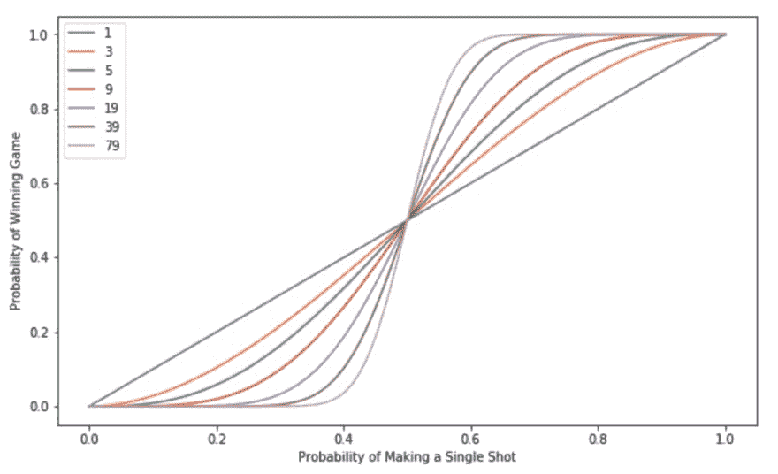
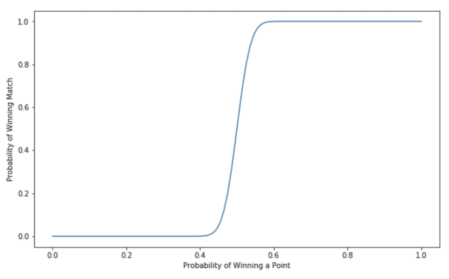

# 网球和放大小差异

> 原文：<https://dev.to/vorahsa/tennis-and-amplifying-small-differences-3icl>

不久前， [@teckert](https://dev.to/teckert) 发表了一篇关于篮球比赛中概率的好文章

[](/teckert) [## 书呆子的篮球

### 托马斯埃克特 1919 年 4 月 10 日 14 分钟阅读

#math #probability #interviewquestions #python](/teckert/basketball-for-nerds-5bf0)

## 概括

考虑到帖子中的两种情况，我得出了以下结论:你有奇数个机会，你必须投进一半以上的球。这符合帖子中的“1 选 1”和“3 选 2”案例。它让我们看到了 [@walker](https://dev.to/walker) 在评论中指出的效果，你的机会越多，游戏的最终结果就越取决于你个人的投篮概率。

在原帖中， [@teckert](https://dev.to/teckert) 手工计算了“3 选 2”游戏中的概率。但是如果我们想推广到真正的长时间博弈，这个公式将很难推导和处理。我们还可以编写一个循环来生成 [@teckert](https://dev.to/teckert) 的表格，让计算机来处理繁重的工作。有没有更好的办法？

事实证明，是有的。我们有这样一种情况，我们有`n`的机会和概率`p`去做每一件事，而与其他事情的进展无关。这意味着成功的数量遵循*二项式分布*。SciPy 有一个现成的[函数](https://docs.scipy.org/doc/scipy/reference/generated/scipy.stats.binom.html)来计算这个。

我们想确定所有投篮命中率超过一半的情况的总概率。在概率上，这样的计算可以使用*累积分布函数*(通常缩写为 CDF)来完成。CDF 给出了得到一个小于其参数的值的总概率，因此要得到得到一个大于一半的值的总概率，我们可以从 1 中减去 CDF 值(注意，我们假设的机会数是奇数，所以不可能正好一半命中)。

```
from scipy.stats import binom

def winning_probability(number_of_chances, shot_probability):
    return 1 - binom.cdf((number_of_chances - 1) / 2, number_of_chances, shot_probability) 
```

有了这个功能，我们可以绘制出各种机会的游戏获胜概率曲线。

```
import matplotlib.pyplot as plt
import numpy as np

plt.figure(figsize=(10, 6))
p_range = np.linspace(0, 1, 100)
for n in [1, 3, 5, 9, 19, 39, 79]:
    probs = [winning_probability(n, p) for p in p_range]
    plt.plot(p_range, probs, label=str(n))
plt.ylabel("Probability of Winning Game")
plt.xlabel("Probability of Making a Single Shot")
plt.legend()
plt.show()
display() 
```

由此产生的图表显示，我们拥有的机会越多，概率就越接近 0 或 1，这取决于我们是比平均水平更差还是更好。
[T3】](https://res.cloudinary.com/practicaldev/image/fetch/s--jkeU66IA--/c_limit%2Cf_auto%2Cfl_progressive%2Cq_auto%2Cw_880/https://thepracticaldev.s3.amazonaws.com/i/sxmn1nn75o3q01plm1r1.png)

## 网球的情况

那么这和网球有什么关系呢？嗯，网球显示了相似的小差异的放大。但在网球运动中，这种效应发生在多个层面。首先，你需要赢得四分来赢得一场比赛，你需要赢得六局来赢得一盘，最后你需要赢得三局来赢得这场比赛。如果你输了一局或一盘，你输了多少并不重要。

网球也带来了复杂性。要赢得一场比赛，仅仅赢得四分是不够的，你还需要领先对手两分。所以我们不能再用二项分布了。但是我们可以建立一个概率方程并求解它。关键是要注意，当比分与获胜所需的连续两分持平时，有三种可能的情况

1.  你连续赢了两分
2.  你的对手连续赢了两分
3.  你们都赢得了接下来两分中的一分

在第一种情况下，你赢得了比赛。在案例 2 中，你的对手赢了。在第三种情况下，情况又回到了起点。所以我们可以建立一个总概率的公式，它将是两项之和:情况 1 的概率和情况 3 中你赢的概率。这些算出来

```
case_1_probability = point_probability * point_probability
case_3_probability = 2 * point_probability * (1 - point_probability) * total_probability
total_probability = case_1_probability + case_3_probability 
```

由于递归定义(`total_probability`依赖于`case_3_probability`，而`case_3_probability`又依赖于`total_probability`)，这并不完全是计算机代码，但是我们可以扩展`total_probability`的定义，得到一个完全可解的数学公式

```
t_p = p_p * p_p + 2 * p_p * (1 - p_p) * t_p 
```

标准的代数运算产生解

```
t_p = p_p * p_p / (1 - 2 * p_p * (1 - p_p)) = p_p * p_p / (1 - 2 * p_p + 2 * p_p * p_p) 
```

我们可以用代码
实现它

```
def two_wins_in_a_row(point_prob):
    return (point_prob * point_prob) / (1 - 2 * point_prob + 2 * point_prob * point_prob) 
```

所以这是当你和你的对手都有，比如说，3 分，你需要连续赢两分的时候，赢得比赛的概率。

当我们知道赢得一分的概率时，让我们开始把事情放在一起计算赢得一场比赛的概率。从概念上讲，我们将根据你和你的对手的得分，用你的获胜概率来填写一个表格。那么，你赢得游戏的概率就是表格单元格中的值(0，0)。

| O\Y | Zero | one | Two | three | four | five | ... |
| --- | --- | --- | --- | --- | --- | --- | --- |
| Zero |  |  |  |   | one | one | ... |
| one |  |  |  |   | one | one | ... |
| Two |  |  |  |   | one | one | ... |
| three |  |  |  | T |  | one | ... |
| four | Zero | Zero | Zero |   | T |   | ... |
| five | Zero | Zero | Zero | Zero |  | T | ... |

我们可以从在每个你有 4 分或更多而你的对手比你少至少 2 分的单元格中填入数值 1 开始，因为你已经赢了。同样，在你的对手已经赢了的对称情况下，我们填 0。最后，对于 3-3 甚至之后的分数，我们填入 T 来表示这个值是通过调用`two_wins_in_a_row`直接计算出来的。

我们希望以类似
的函数签名结束

```
def game_win_prob_with_scores(point_prob, score_you, score_opponent): 
```

这将返回由`score_you`和`score_opponent`索引的表格单元格中的值。那么你赢一局的概率将是`game_win_prob_with_scores(point_prob, 0, 0)`。从我们填写的表格中，我们已经可以实现一些简单的案例

```
 if score_you >= 4 and score_you >= score_opponent + 2:
        return 1
    elif score_opponent >= 4 and score_opponent >= score_you + 2:
        return 0
    elif score_you >= 2 and score_you == score_opponent:
        return two_wins_in_a_row(point_prob) 
```

(我们注意到，事实上当博弈是 2-2 时，T 已经是概率了)

剩下的案子怎么处理？我们注意到，如果游戏现在的比分是`x` - `y`，那么接下来的概率是`point_prob``x+1`-`y`，`1 - point_prob`是`x` - `y+1`。因此，如果我们知道表格中某个单元格右下方的值，我们就可以根据其他两个值来计算该单元格中的值。在表格中，我们看到“边界”从 4-0 到 4-2 到 3-3 到 2-4 到 0-4，这将让我们最终计算其顶部和左侧的任何值。

所以现在我们可以为`else`
编写代码了

```
 else:
        return point_prob * game_win_prob_with_scores(point_prob, score_you + 1, score_opponent) + (1 - point_prob) * game_win_prob_with_scores(point_prob, score_you, score_opponent + 1) 
```

因为表中的边界是由`if` - `elif`链中的前三个条件实现的，并且两个递归调用都指向边界，所以递归最终会终止(总是确保递归终止，尤其是在这种乍一看并不那么明显的情况下)。

代码还有一个问题。假设我们从`score_you == 0`和`score_opponent == 0`开始。左边的递归调用有参数`score_you == 1`和`score_opponent == 0`，右边的递归调用有参数`score_you == 0`和`score_opponent == 1`。问题是，从这两个调用中，都将使用参数`score_you == 1`和`score_opponent == 1`来调用函数，因此会有重复的工作。

这可以通过将函数重写为非递归的并按顺序处理表格单元来解决，以便每个单元仅在其向右和向下的依赖性已知时才被计算。一个更简单的方法是将*记忆*应用于递归版本。这在 Python 中尤其容易，因为在`functools`中有一个装饰器，可以将任何函数转换成记忆版本。所以我们加上

```
from functools import lru_cache 
```

在顶部，还有

```
 @lru_cache(maxsize=None) 
```

在函数`game_win_prob_with_scores`之前，我们就完成了。

从游戏获胜概率，我们可以使用相同的技术将其转换为一组获胜概率。一盘比赛的获胜者是第一个赢得 6 场比赛的玩家，另一个最多赢得 4 场比赛，或达到 7-5，或以 6-6 赢得平局。抢七局和比赛一样，只是要打到 7 分。

通过对 3-0、3-1 和 3-2 这三种不同的可能性进行特殊处理，比赛是最容易处理的。

```
def match_win_prob(point_prob):
    set_prob = set_win_prob(point_prob)
    three_nil_prob = set_prob ** 3
    three_one_prob = 3 * set_prob ** 3 * (1 - set_prob)
    three_two_prob = 6 * set_prob ** 3 * (1 - set_prob) ** 2
    return three_nil_prob + three_one_prob + three_two_prob 
```

乘数 3 和 6 计算每种类型的胜利可能发生的方式。例如，在 3-1 获胜的比赛中，对手赢得的第一盘可以是第一盘、第二盘或第三盘。

这让我们看到了最后一张图，显示了网球规则是如何放大得分概率中的微小差异，从而使哪怕是稍微强壮一点的球员也更有把握赢得比赛。
[T3】](https://res.cloudinary.com/practicaldev/image/fetch/s--RZZVtdIh--/c_limit%2Cf_auto%2Cfl_progressive%2Cq_auto%2Cw_880/https://thepracticaldev.s3.amazonaws.com/i/960oogpx6oy35fcabn0x.png)

这当然有些简化，因为在真正的网球比赛中，赢得一分的概率并不是恒定的。尤其是发球是一大优势。考虑到两种不同的概率，进行类似的分析是可能的，但这不太可能证明任何额外的有趣的点。

## 附录

以下是网球示例的完整代码，经过重构，利用了比赛和决胜局完全相同的优势，除了不同的目标获胜次数。

```
import matplotlib.pyplot as plt
import numpy as np
from functools import lru_cache

def two_wins_in_a_row(point_prob):
    return (point_prob * point_prob) / (1 - 2 * point_prob + 2 * point_prob * point_prob)

@lru_cache(maxsize=None)
def simple_win_prob_with_scores(point_prob, target, score_you, score_opponent):
    if score_you >= target and score_you >= score_opponent + 2:
        return 1
    elif score_opponent >= target and score_opponent >= score_you + 2:
        return 0
    elif score_you >= target - 2 and score_you == score_opponent:
        return two_wins_in_a_row(point_prob)
    else:
        return (
            point_prob * simple_win_prob_with_scores(point_prob, target, score_you + 1, score_opponent)
            + (1 - point_prob) * simple_win_prob_with_scores(point_prob, target, score_you, score_opponent + 1)
        )

def tie_break_win_prob(point_prob):
    return simple_win_prob_with_scores(point_prob, 7, 0, 0)

def game_win_prob(point_prob):
    return simple_win_prob_with_scores(point_prob, 4, 0, 0)

@lru_cache(maxsize=None)
def set_win_prob_with_scores(point_prob, score_you, score_opponent):
    if (score_you == 6 or score_you == 7) and score_you >= score_opponent + 2:
        return 1
    elif (score_opponent == 6 or score_opponent == 7) and score_opponent >= score_you + 2:
        return 0
    elif score_you == 6 and score_opponent == 6:
        return tie_break_win_prob(point_prob)
    else:
        game_prob = game_win_prob(point_prob)
        return (
            game_prob * set_win_prob_with_scores(point_prob, score_you + 1, score_opponent)
            + (1 - game_prob) * set_win_prob_with_scores(point_prob, score_you, score_opponent + 1)
        )

def set_win_prob(point_prob):
    return set_win_prob_with_scores(point_prob, 0, 0)

def match_win_prob(point_prob):
    set_prob = set_win_prob(point_prob)
    three_nil_prob = set_prob ** 3
    three_one_prob = 3 * set_prob ** 3 * (1 - set_prob)
    three_two_prob = 6 * set_prob ** 3 * (1 - set_prob) ** 2
    return three_nil_prob + three_one_prob + three_two_prob

p_range = np.linspace(0, 1, 100)
probs = [match_win_prob(p) for p in p_range]
plt.figure(figsize=(10, 6))
plt.plot(p_range, probs)
plt.ylabel("Probability of Winning Match")
plt.xlabel("Probability of Winning a Point")
plt.show()
display() 
```