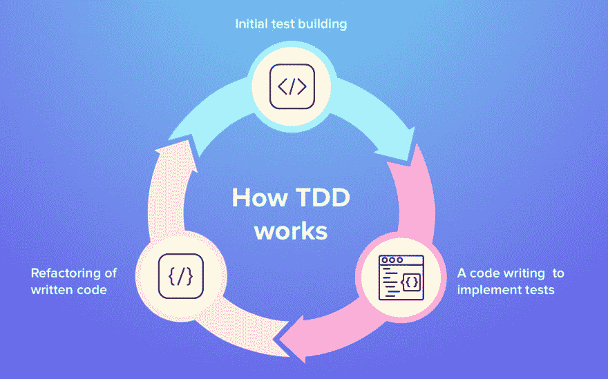
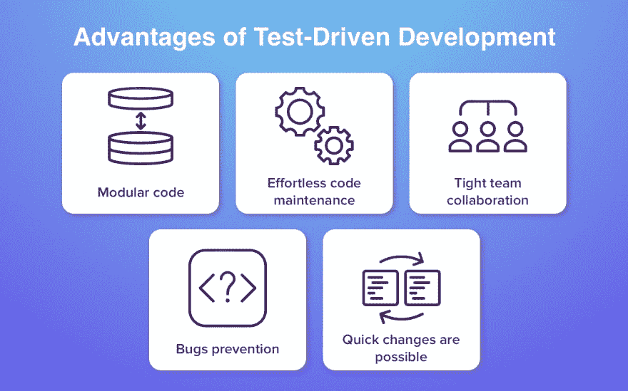

# 测试驱动开发方法以及如何使用它

> 原文：<https://dev.to/lypchenko/test-driven-development-method-and-how-to-use-it-4l2f>

这篇文章让我受到了很多批评。但这是我们公司的工作方式，所以这是我们的经验。

根据信息技术支出预测，IT 领域所有领域的投资将很快超过 2 万亿美元。专门从事软件开发的公司当然希望为他们的客户创建一流的程序，然而，由于所使用的工具和方法，构建一个程序可能会给客户带来巨大的经济损失，如果不是因为他们无法根据自己的需求购买一个软件的话。

难怪越来越多的公司试图暗示一种既有资格创建一流软件又有成本效益的开发模式。在本文中，我们将讨论测试驱动的开发方法，这种方法有很多好处和特点，可以极大地帮助创建一个廉价而高质量的产品。所以，如果你有兴趣申请一个，请继续关注！

## 什么是测试驱动开发，它是如何工作的？

测试驱动开发是一种基于短开发周期复制的方法。当使用 TDD 方法时，测试和代码可以由一个人编写，然而，最好有两个程序员或 QA 工程师和一个程序员组成的团队。

下面是 TDD 方法的工作原理:

1.  QA 工程师创建一个测试来覆盖所有的变更。
2.  开发人员根据特定的系统行为编写代码。
3.  启动测试以查看是否有任何失败。
4.  通过对测试效率的不断验证，对编写的代码进行重构。
5.  重复上述步骤。

## 使用测试驱动开发方法的好处

当使用测试驱动的开发方法时，开发人员专注于所需的功能实现，而不会添加不必要的功能，并且能够创建可维护的代码，减少开发阶段的错误数量。

目前，软件开发人员使用测试驱动方法有很多原因，其中一些原因是:

*   专注于模块化编程。测试驱动开发是理解模块化结构的基本原则的好方法，因为一次编写一个小测试意味着对模块化代码做更多的工作。

*   简化代码维护。测试驱动方法支持透明的集成过程，降低了程序代码重组过程中的安全风险。由于这种编写代码的方法允许在创建最终版本之前运行测试，重构也变得更快更容易执行。

*   及时修复 bug。由于开发人员从编写测试而不是编码开始，这有助于从一开始就消除错误。这样，任何问题都可以比平常更快地被发现和解决。

*   满足客户期望。借助于软件开发的测试驱动方法，我们可以再次确认所有的客户需求，从而更准确地完成工作。因此，开发人员根据客户的需求创建产品，而没有任何意外的更新。

*   团队合作。如果编写的代码有任何问题，开发人员可以很容易地修改它的部分。如果代码开始不正常运行，测试将立即崩溃，程序员将立即知道该做什么。

即使使用现代工具和方法，例如 DevOps 方法，软件开发也不是一件容易的事情。然而，借助于正确的方法，例如测试驱动的方法，我们可以显著减少花费在软件构建上的时间，这影响了创建程序的总成本。