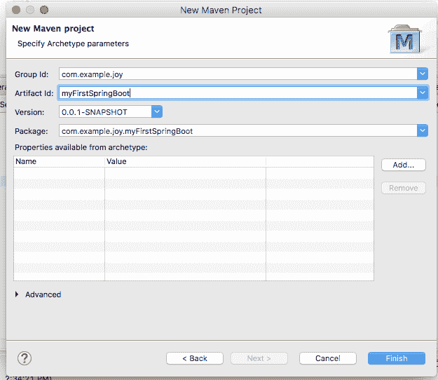
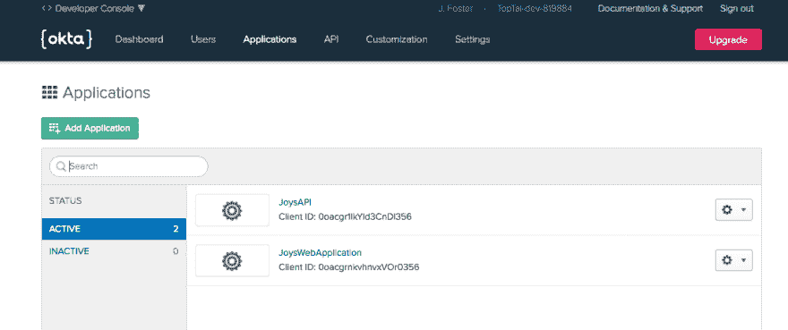
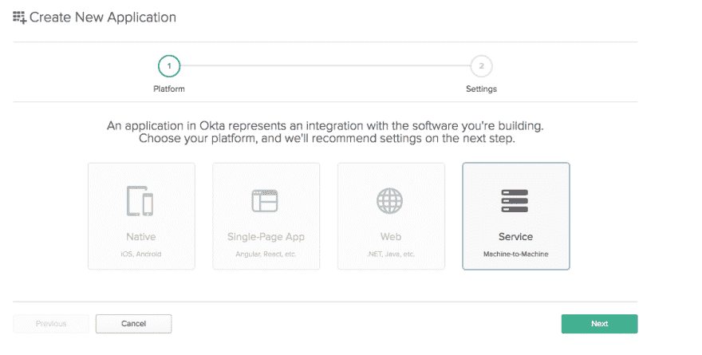
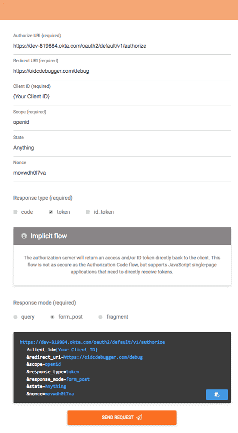
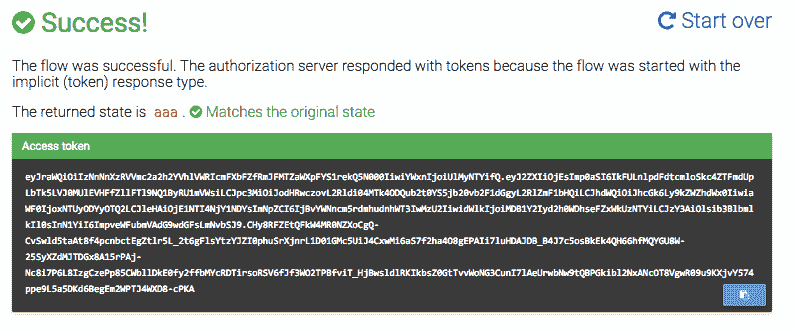
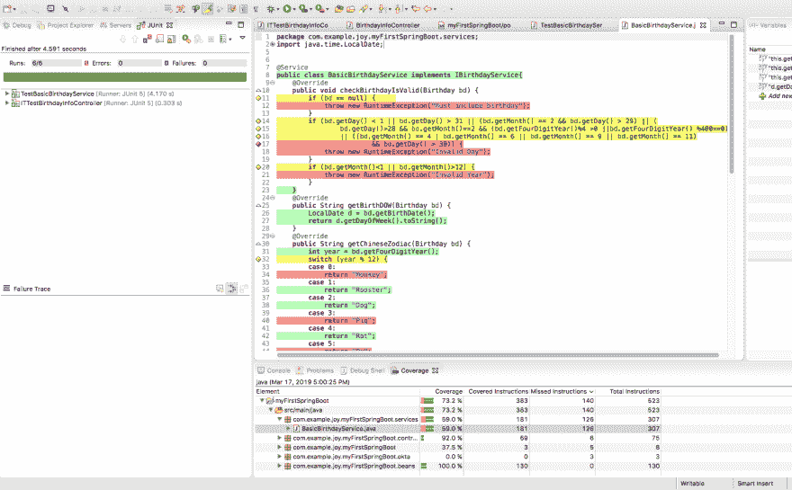

# 使用 JUnit 5 测试您的 Spring Boot 应用程序

> 原文：<https://dev.to/oktadev/test-your-spring-boot-applications-with-junit-5-3g3l>

在本文中，您将了解如何构建一个简单的 Spring Boot 应用程序，并使用 Junit 5 对其进行测试。没有测试的应用程序是众所周知的潘多拉盒子。如果你不知道你的应用程序在任何条件下都能工作，那么它有什么用呢？添加一套测试可以增强您的应用程序处理任何问题的信心。当构建您的测试时，使用一套现代且全面的工具是很重要的。使用现代框架可以确保您能够跟上语言和库中的变化。一套全面的工具确保您可以充分测试应用程序的所有方面，而无需编写自己的测试实用程序。JUnit 5 很好地处理了这两个需求。

这篇文章使用的应用程序将是一个基本的 REST API，带有端点来计算一个人生日的一些事情！有三个 POST 端点可以用来确定生日是星期几、星座还是十二生肖。这个 REST API 将用 OAuth 2.0 和 [Okta](https://developer.okta.com) 来保护。一旦我们构建了 API，我们将使用 JUnit 5 对代码进行单元测试，并回顾 JUnit 测试的覆盖范围。

使用 Spring 框架的主要优势是能够注入您的依赖项，这使得出于各种目的交换实现变得容易得多，但不仅仅是为了单元测试。Spring Boot 让这变得更加容易，它允许你用注释来做大量的依赖注入，而不是用一个复杂的`applicationContext.xml`文件！

> 注意:在这篇文章中，我将使用 Eclipse，因为它是我的首选 IDE。如果你也在使用 Eclipse，你将需要一个 Oxygen 或更高版本，以便包含 JUnit 5 (Jupiter)测试支持:[https://www.eclipse.org/downloads/packages/installer](https://www.eclipse.org/downloads/packages/installer)。

## 用 JUnit 5 创建一个 Spring Boot 应用程序进行测试

对于本教程，项目的结构如下所示。我将只讨论文件名，但是你可以使用下面的结构找到它们的路径，浏览完整的源代码，或者关注这个包。

首先，您将从头开始创建一个 Spring Boot 项目。

**注意:**以下步骤是针对 Eclipse 的。如果您使用不同的 IDE，可能会有相同的步骤。或者，您可以创建自己的项目目录结构，并在您喜欢的任何文本编辑器中编写最终的`pom.xml`文件。

从**文件** > **新建**菜单创建一个新的 Maven 项目。选择新项目的位置，并单击 next 两次，然后填写应用程序的组 id、工件 id 和版本。对于这个例子，我使用了以下选项:

*   群组 Id: `com.example.joy`
*   神器 Id: `myFirstSpringBoot`
*   版本:`0.0.1-SNAPSHOT`

[](https://res.cloudinary.com/practicaldev/image/fetch/s--IfIQmcRb--/c_limit%2Cf_auto%2Cfl_progressive%2Cq_auto%2Cw_880/https://developer.okta.com/assets-jekyll/blog/junit5-spring-boot/new-maven-project-88bf11cfbab0914a055900f99ff786da623fa8b2c0328f51d5e21240c6056f5a.png)

> 提示:如果 Maven 对您来说是新的，并且不清楚如何选择您的组 id、工件 id 或版本，请回顾这些约定:[https://Maven . Apache . org/guides/mini/guide-naming-conventions . html](https://maven.apache.org/guides/mini/guide-naming-conventions.html)

完成后，这将生成一个类似如下的`pom.xml`文件:

```
<project xmlns="http://maven.apache.org/POM/4.0.0"
    xmlns:xsi="http://www.w3.org/2001/XMLSchema-instance"
    xsi:schemaLocation="http://maven.apache.org/POM/4.0.0 http://maven.apache.org/xsd/maven-4.0.0.xsd">
    <modelVersion>4.0.0</modelVersion>
    <parent>
        <groupId>org.springframework.boot</groupId>
        <artifactId>spring-boot-starter-parent</artifactId>
        <version>2.1.3.RELEASE</version>
    </parent>
    <groupId>com.example.joy</groupId>
    <artifactId>myFirstSpringBoot</artifactId>
    <version>0.0.1-SNAPSHOT</version>
</project> 
```

接下来，您将希望使用一些基本设置和依赖项来更新`pom.xml`，如下所示(在版本之后添加所有内容):

```
<project xmlns="http://maven.apache.org/POM/4.0.0"
    xmlns:xsi="http://www.w3.org/2001/XMLSchema-instance"
    xsi:schemaLocation="http://maven.apache.org/POM/4.0.0 http://maven.apache.org/xsd/maven-4.0.0.xsd">
    <modelVersion>4.0.0</modelVersion>
    <parent>
        <groupId>org.springframework.boot</groupId>
        <artifactId>spring-boot-starter-parent</artifactId>
        <version>2.1.3.RELEASE</version>
    </parent>
    <groupId>com.example.joy</groupId>
    <artifactId>myFirstSpringBoot</artifactId>
    <version>0.0.1-SNAPSHOT</version>

    <properties>
        <java.version>1.8</java.version>
        <spring.boot.version>2.1.3.RELEASE</spring.boot.version>
    </properties>

    <dependencies>
        <dependency>
            <groupId>org.springframework.boot</groupId>
            <artifactId>spring-boot-starter-web</artifactId>
        </dependency>

        <dependency>
            <groupId>org.springframework.boot</groupId>
            <artifactId>spring-boot-starter-test</artifactId>
            <scope>test</scope>
           <exclusions>
                <exclusion>
                    <groupId>junit</groupId>
                    <artifactId>junit</artifactId>
                </exclusion>
            </exclusions>
        </dependency>
        <dependency>
             <groupId>org.junit.jupiter</groupId>
             <artifactId>junit-jupiter-engine</artifactId>
             <scope>test</scope>
         </dependency>
    </dependencies>

    <build>
        <plugins>
            <plugin>
                <groupId>org.springframework.boot</groupId>
                <artifactId>spring-boot-maven-plugin</artifactId>
            </plugin>
        </plugins>
    </build>
</project> 
```

请注意，您需要从 spring-boot-starter-test 依赖项中排除默认的 JUnit。`junit-jupiter-engine`依赖项是针对 JUnit 5 的。

## 用 Spring Boot 为你的 JUnit 5 测试创建一个 Java REST API

让我们从主应用程序文件开始，它是启动 Java API 的入口点。这是一个名为`SpringBootRestApiApplication.java`的文件，看起来像这样:

```
package com.example.joy.myFirstSpringBoot;

import org.springframework.boot.SpringApplication;
import org.springframework.boot.autoconfigure.SpringBootApplication;

@SpringBootApplication(scanBasePackages = {"com.example.joy"})
public class SpringBootRestApiApplication {

    public static void main(String[] args) {
        SpringApplication.run(SpringBootRestApiApplication.class, args);
    }
} 
```

`SpringBootApplication`注释告诉应用程序它应该支持自动配置、组件扫描(对`com.example.joy`包及其下的所有内容)和 bean 注册。

```
@SpringBootApplication(scanBasePackages = {"com.example.joy"}) 
```

这一行启动 REST API 应用程序:

```
SpringApplication.run(SpringBootRestApiApplication.class, args); 
```

是生日服务的接口。它非常简单，定义了四个可用的助手函数。

```
package com.example.joy.myFirstSpringBoot.services;

import java.time.LocalDate;

public interface BirthdayService {
    LocalDate getValidBirthday(String birthdayString) ;

    String getBirthDOW(LocalDate birthday);

    String getChineseZodiac(LocalDate birthday);

    String getStarSign(LocalDate birthday) ;
} 
```

`BirthdayInfoController.java`处理三个 post 请求以获取生日信息。看起来是这样的:

```
package com.example.joy.myFirstSpringBoot.controllers;

import java.time.LocalDate;

import org.springframework.http.HttpStatus;
import org.springframework.http.ResponseEntity;
import org.springframework.web.bind.annotation.ExceptionHandler;
import org.springframework.web.bind.annotation.PostMapping;
import org.springframework.web.bind.annotation.RequestBody;
import org.springframework.web.bind.annotation.RequestMapping;
import org.springframework.web.bind.annotation.RestController;

import com.example.joy.myFirstSpringBoot.services.BirthdayService;

@RestController
@RequestMapping("/birthday")
public class BirthdayInfoController {
    private final BirthdayService birthdayService;

    public BirthdayInfoController(BirthdayService birthdayService){
        this.birthdayService = birthdayService;
    }

    @PostMapping("/dayOfWeek")
    public String getDayOfWeek(@RequestBody String birthdayString) {
        LocalDate birthday = birthdayService.getValidBirthday(birthdayString);

        String dow = birthdayService.getBirthDOW(birthday);

        return dow;
    }

    @PostMapping("/chineseZodiac")
    public String getChineseZodiac(@RequestBody String birthdayString) {
        LocalDate birthday = birthdayService.getValidBirthday(birthdayString);
        String sign = birthdayService.getChineseZodiac(birthday);

        return sign;
    }

    @PostMapping("/starSign")
    public String getStarSign(@RequestBody String birthdayString) {
        LocalDate birthday = birthdayService.getValidBirthday(birthdayString);
        String sign = birthdayService.getStarSign(birthday);

        return sign;
    }

    @ExceptionHandler(RuntimeException.class)
    public final ResponseEntity<Exception> handleAllExceptions(RuntimeException ex) {

        return new ResponseEntity<Exception>(ex, HttpStatus.INTERNAL_SERVER_ERROR);
    }
} 
```

### Spring MVC 注解

首先，您会注意到靠近顶部的以下注释。`@RestController`注释告诉系统这个文件是一个“Rest API 控制器”,这意味着它包含一组 API 端点。您也可以使用`@Controller`注释，但是这意味着您必须添加更多的样板代码来将响应转换成 HTTP OK 响应，而不是简单地返回值。第二行告诉它所有的端点在路径中都有“/birthday”前缀。稍后我将展示端点的完整路径。

```
@RestController
@RequestMapping("/birthday") 
```

### 构造器注入带弹簧

接下来，您将看到`birthdayService`(类型为`BirthdayService`)的一个类变量。此变量在类的构造函数中初始化。从 Spring Framework 4.3 开始，使用构造函数注入时不再需要指定`@Autowired`。这将会加载一个`BasicBirthdayService`类的实例，我们很快就会看到。

```
private final BirthdayService birthdayService;

BirthdayInfoController(BirthdayService birthdayService){
    this.birthdayService = birthdayService;
} 
```

### 处理发布到您的 API 的帖子

接下来的几个方法(`getDayOfWeek`、`getChineseZodiac`和`getStarSign`)是有趣的地方。它们是三个不同端点的处理程序。每一个都以一个`@PostMapping`注释开始，它告诉系统端点的路径。在这种情况下，路径应该是`/birthday/dayOfWeek`(前缀`/birthday`来自上面的`@RequestMapping`注释)。

```
@PostMapping("/dayOfWeek") 
```

每个端点方法执行以下操作:

*   接受一个`birthdayString`字符串。
*   使用`birthdayService`来检查`birthdayString`字符串是否可以转换成`LocalDate`对象。如果是，则返回在后面的代码中使用的`LocalDate`对象。否则，将抛出一个错误(请参见下面的错误处理)。
*   从`birthdayService`获取要返回的值(星期几、中国十二生肖或占星符号)。
*   返回字符串(这将使它以 HTTP OK 作为响应)。

### rest controller 中的错误处理

最后，有一个错误处理方法:

```
@ExceptionHandler(RuntimeException.class)
public final ResponseEntity<Exception> handleAllExceptions(RuntimeException ex) {

    return new ResponseEntity<Exception>(ex, HttpStatus.INTERNAL_SERVER_ERROR);
} 
```

这里，`@ExceptionHandler`注释告诉它捕捉端点函数中的任何 RuntimeException 实例，并返回 500 响应。

`BasicBirthdayService.java`处理应用程序中大量的实际业务逻辑。这个类具有检查生日字符串是否有效的功能，以及根据生日计算星期几、中国十二生肖和星座的功能。

```
package com.example.joy.myFirstSpringBoot.services;

import org.springframework.stereotype.Service;

import java.time.LocalDate;
import java.time.format.DateTimeFormatter;

@Service
public class BasicBirthdayService implements BirthdayService {
    private static DateTimeFormatter formatter = DateTimeFormatter.ofPattern("yyyy-MM-dd");

    @Override
    public LocalDate getValidBirthday(String birthdayString) {
        if (birthdayString == null) {
            throw new RuntimeException("Must include birthday");
        }
        try {
            LocalDate birthdate = LocalDate.parse(birthdayString, formatter);
            return birthdate;
        } catch (Exception e) {
            throw new RuntimeException("Must include valid birthday in yyyy-MM-dd format");
        }

    }

    @Override
    public String getBirthDOW(LocalDate birthday) {
        return birthday.getDayOfWeek().toString();
    }

    @Override
    public String getChineseZodiac(LocalDate birthday) {
        int year = birthday.getYear();
        switch (year % 12) {
            case 0:
                return "Monkey";
            case 1:
                return "Rooster";
            case 2:
                return "Dog";
            case 3:
                return "Pig";
            case 4:
                return "Rat";
            case 5:
                return "Ox";
            case 6:
                return "Tiger";
            case 7:
                return "Rabbit";
            case 8:
                return "Dragon";
            case 9:
                return "Snake";
            case 10:
                return "Horse";
            case 11:
                return "Sheep";
        }

        return "";
    }

    @Override
    public String getStarSign(LocalDate birthday) {
        int day = birthday.getDayOfMonth();
        int month = birthday.getMonthValue();

        if (month == 12 && day >= 22 || month == 1 && day < 20) {
            return "Capricorn";
        } else if (month == 1 && day >= 20 || month == 2 && day < 19) {
            return "Aquarius";
        } else if (month == 2 && day >= 19 || month == 3 && day < 21) {
            return "Pisces";
        } else if (month == 3 && day >= 21 || month == 4 && day < 20) {
            return "Aries";
        } else if (month == 4 && day >= 20 || month == 5 && day < 21) {
            return "taurus";
        } else if (month == 5 && day >= 21 || month == 6 && day < 21) {
            return "Gemini";
        } else if (month == 6 && day >= 21 || month == 7 && day < 23) {
            return "Cancer";
        } else if (month == 7 && day >= 23 || month == 8 && day < 23) {
            return "Leo";
        } else if (month == 8 && day >= 23 || month == 9 && day < 23) {
            return "Virgo";
        } else if (month == 9 && day >= 23 || month == 10 && day < 23) {
            return "Libra";
        } else if (month == 10 && day >= 23 || month == 11 && day < 22) {
            return "Scorpio";
        } else if (month == 11 && day >= 22 || month == 12 && day < 22) {
            return "Sagittarius";
        }
        return "";
    }
} 
```

`@Service`注释是它用来将其注入到`BirthdayInfoController`构造函数中的。由于这个类实现了`BirthdayService`接口，并且它在应用程序的扫描路径中，Spring 将找到它，初始化它，并将其注入到`BirthdayInfoController`中的构造函数中。

该类的其余部分只是一组指定从`BirthdayInfoController`调用的业务逻辑的函数。

## 运行你的基本 Spring HTTP REST API

此时，您应该有一个工作的 API。在 Eclipse 中，只需右键点击`SpringBootRestApiApplication`文件，点击**运行为** > **Java 应用**，就可以启动了。要到达端点，您可以使用 curl 来执行以下命令:

**星期几:**

请求:

```
curl -X POST \
  http://localhost:8080/birthday/dayOfWeek \
  -H 'Content-Type: text/plain' \
  -H 'accept: text/plain' \
  -d 2005-03-09 
```

回复:

```
WEDNESDAY 
```

**十二生肖:**

请求:

```
curl -X POST \
  http://localhost:8080/birthday/chineseZodiac \
  -H 'Content-Type: text/plain' \
  -H 'accept: text/plain' \
  -d 2005-03-09 
```

回复:

```
Rooster 
```

**星座:**

请求:

```
curl -X POST \
  http://localhost:8080/birthday/starSign \
  -H 'Content-Type: text/plain' \
  -H 'accept: text/plain' \
  -d 2005-03-09 
```

回复:

```
Pisces 
```

## 使用 OAuth 2.0 保护您的 JUnit 5 Java 应用

现在我们已经创建了基本的 API，让我们使它安全！使用 Okta 的 OAuth 2.0 令牌验证可以快速做到这一点。为什么是 Okta？Okta 是一个身份提供商，可以轻松地将身份验证和授权添加到您的应用程序中。一直开着，朋友也不让朋友写认证。

集成 Okta 后，API 将要求用户传入一个 OAuth 2.0 访问令牌。Okta 将检查此令牌的有效性和真实性。

为此，您需要用 Okta 设置一个“服务应用程序”，将 Okta Spring Boot 启动器添加到 Java 代码中，并有一种方法为这个应用程序生成令牌。我们开始吧！

### 创建 OpenID 连接应用程序

您将需要在 Okta 中创建一个 OpenID Connect 应用程序，以获取您的唯一值来执行身份验证。

要做到这一点，你必须首先登录你的 Okta 开发者账号(或者[注册](https://developer.okta.com/signup/)如果你没有账号的话)。

进入 Okta 开发者仪表板后，点击屏幕顶部的**应用**标签，然后点击**添加应用**按钮。

[](https://res.cloudinary.com/practicaldev/image/fetch/s--ivE5U6it--/c_limit%2Cf_auto%2Cfl_progressive%2Cq_auto%2Cw_880/https://developer.okta.com/assets-jekyll/blog/junit5-spring-boot/applications-3fba557b23c82b0aef17c159ae16d1a77a60651181f023cbbd0c3a6caf550f1c.png)

您将看到以下屏幕。点击**服务**图标，然后点击**下一步**。

[](https://res.cloudinary.com/practicaldev/image/fetch/s--TJwr6FEE--/c_limit%2Cf_auto%2Cfl_progressive%2Cq_auto%2Cw_880/https://developer.okta.com/assets-jekyll/blog/junit5-spring-boot/new-application-705ef777e98be5921d7d28ea05a13ab824caf63e20dc7ea8ef10c842ab912e5b.png)

下一个屏幕将提示您输入应用程序的名称。选择有意义的事情，点击 **Done** 。

应用程序将被创建，您将看到一个屏幕，显示您的客户端凭证，包括客户端 ID 和客户端密码。您可以随时返回该屏幕，方法是转到**应用程序**选项卡，然后点击您刚刚创建的应用程序的名称。

### 将安全认证集成到您的代码中

向应用程序添加身份验证只需几个步骤。

创建一个名为`src/main/resources/application.properties`的文件，内容如下:

```
okta.oauth2.issuer=https://{yourOktaDomain}/oauth2/default
okta.oauth2.clientId={clientId}
okta.oauth2.clientSecret={clientSecret}
okta.oauth2.scope=openid 
```

用您的值替换`{...}`中的项目。`{clientId}`和`{clientSecret}`值将来自您刚刚创建的应用程序。一旦您配置了应用程序上下文，您需要做的就是向您的`pom.xml`文件添加一个依赖项，并再创建一个 Java 文件。

对于依赖项，将 Okta Spring Boot 启动器添加到依赖项部分的`pom.xml`文件中:

```
<!-- security - begin -->
<dependency>
    <groupId>com.okta.spring</groupId>
    <artifactId>okta-spring-boot-starter</artifactId>
    <version>1.1.0</version>
</dependency>
<!-- security - end --> 
```

最后一步是更新`SpringBootRestApiApplication`以包含一个名为`OktaOAuth2WebSecurityConfigurerAdapter`的静态配置子类。你的`SpringBootRestApiApplication.java`文件应该更新成这样:

```
package com.example.joy.myFirstSpringBoot;

import org.springframework.boot.SpringApplication;
import org.springframework.boot.autoconfigure.SpringBootApplication;
import org.springframework.context.annotation.Configuration;
import org.springframework.security.config.annotation.web.builders.HttpSecurity;
import org.springframework.security.config.annotation.web.configuration.WebSecurityConfigurerAdapter;

@SpringBootApplication(scanBasePackages = { "com.example.joy" })
public class SpringBootRestApiApplication {

    public static void main(String[] args) {
        SpringApplication.run(SpringBootRestApiApplication.class, args);
    }

    @Configuration
    static class OktaOAuth2WebSecurityConfigurerAdapter extends WebSecurityConfigurerAdapter {

        @Override
        protected void configure(HttpSecurity http) throws Exception {
            http.authorizeRequests()
                .anyRequest().authenticated().and()
            .oauth2ResourceServer().jwt();
        }
    }
} 
```

### 生成一个令牌，用 JUnit 5 测试您的 Spring Boot 应用程序

为了进行测试，您需要能够生成一个有效的令牌。通常，客户端应用程序将负责生成令牌，用于 API 中的身份验证。但是，由于您没有客户端应用程序，因此您需要一种生成令牌的方法来测试应用程序。

实现令牌的一个简单方法是使用 [OpenID 连接调试器](https://oidcdebugger.com/)生成一个令牌。然而，首先，您必须在 Okta 中设置一个客户端 **Web** 应用程序，以便与 OpenID Connect 的隐式流一起使用。

为此，请返回 Okta 开发者控制台，选择**应用** > **添加应用**，但这一次，请选择**网页**磁贴。

在下一个屏幕上，您需要填写一些信息。将名称设置为您记得的 web 应用程序名称。将**登录重定向 URIs** 字段设置为`https://oidcdebugger.com/debug`，将**授权类型允许**设置为**混合**。点击**完成**并复制客户端 ID，以进行下一步。

[](https://res.cloudinary.com/practicaldev/image/fetch/s--KCcnNUBv--/c_limit%2Cf_auto%2Cfl_progressive%2Cq_auto%2Cw_880/https://developer.okta.com/assets-jekyll/blog/junit5-spring-boot/oidc-app-settings-ca0f2ba9ed45006bbb1726b4612a10f8692c3ed9cec8bb5b491da3e3d0b23dec.png)

现在，导航到 [OpenID Connect debugger](https://oidcdebugger.com/) 网站，如下图所示填写表格(不要忘记填写您最近创建的 Okta **web** 应用程序的客户端 ID)。`state`字段必须填写，但可以包含任何字符。授权 URI 应该从您域名 URL 开始(在您的 Okta 仪表板上可以找到):

[](https://res.cloudinary.com/practicaldev/image/fetch/s--ConsBi_P--/c_limit%2Cf_auto%2Cfl_progressive%2Cq_auto%2Cw_880/https://developer.okta.com/assets-jekyll/blog/junit5-spring-boot/oidc-debugger-86f19723c39f1324fc1dcc5a5ceabf3cd92b652ed121f827a67d96666e5737ce.png)

提交表单以开始身份验证过程。如果您没有登录，您会收到一个 Okta 登录表单，或者您会看到下面的屏幕，其中有您的自定义令牌。

[](https://res.cloudinary.com/practicaldev/image/fetch/s--Nhp4eQW4--/c_limit%2Cf_auto%2Cfl_progressive%2Cq_auto%2Cw_880/https://developer.okta.com/assets-jekyll/blog/junit5-spring-boot/access-token-be9e5c4d7db4b74425d9387771f404248aba1de03b5a206ca30bd14173e9c40a.png)

**注意:**令牌将在一个小时内有效，因此如果您要长时间测试，您可能需要重复该过程。

## 使用 JUnit 5 测试您的安全 Spring Boot 应用程序

你现在应该有一个工作的**安全的** API。让我们看看它的实际效果吧！在 Eclipse 中，只需右击`SpringBootRestApiApplication`文件，点击 **run as** > **Java 应用**，就会启动。要到达端点，您可以使用 curl 来执行这些命令，但是一定要包括包含您的令牌的新头。用来自 OpenID Connect 的实际令牌替换`{token goes here}`:

**星期几:**

请求:

```
curl -X POST \
  http://localhost:8080/birthday/dayOfWeek \
  -H 'Authorization: Bearer {token goes here}' \
  -H 'Content-Type: text/plain' \
  -H 'accept: text/plain' \
  -d 2005-03-09 
```

回复:

```
WEDNESDAY 
```

**十二生肖:**

请求:

```
curl -X POST \
  http://localhost:8080/birthday/chineseZodiac \
  -H 'Authorization: Bearer {token goes here}' \
  -H 'Content-Type: text/plain' \
  -H 'accept: text/plain' \
  -d 2005-03-09 
```

回复:

```
Rooster 
```

**星座:**

请求:

```
curl -X POST \
  http://localhost:8080/birthday/starSign \
  -H 'Authorization: Bearer {token goes here}' \
  -H 'Content-Type: text/plain' \
  -H 'accept: text/plain' \
  -d 2005-03-09 
```

回复:

```
Pisces 
```

## 使用 JUnit 5 向您的 Java 应用程序添加单元和集成测试

恭喜你！您现在有了一个安全的 API，可以为您提供任何您能想到的生日信息！还剩下什么？嗯，你应该添加一些单元测试来确保它工作良好。

许多人犯了混淆单元测试和集成测试(也称为端到端或 E2E 测试)的错误。我将在下面描述这两种类型的区别。

在开始单元测试之前，向`pom.xml`文件添加一个依赖项(在`<dependencies>`部分)。

```
<dependency>
    <groupId>org.springframework.security</groupId>
    <artifactId>spring-security-test</artifactId>
    <scope>test</scope>
</dependency> 
```

### 单元测试

在很大程度上，单元测试旨在测试一小块(或一个单元)代码。这通常仅限于函数中的代码，或者有时扩展到从该函数调用的一些帮助函数。如果一个单元测试正在测试依赖于另一个服务或资源的代码，比如一个数据库或网络资源，那么单元测试应该“模仿”并注入这种依赖，就像对外部资源没有实际影响一样。它还将焦点限制在被测试的单元上。要模仿一个依赖项，您可以使用一个类似“Mockito”的模仿库，或者简单地传入一个您想要替换的依赖项的不同实现。嘲讽超出了本文的范围，我将简单地展示针对`BasicBirthdayService`的单元测试的例子。

`BasicBirthdayServiceTest.java`文件包含了`BasicBirthdayService`类的单元测试。

```
package com.example.joy.myFirstSpringBoot.services;

import static org.junit.jupiter.api.Assertions.assertEquals;
import java.time.LocalDate;
import org.junit.jupiter.api.Test;

class BasicBirthdayServiceTest {
    BasicBirthdayService birthdayService = new BasicBirthdayService();

    @Test
    void testGetBirthdayDOW() {
        String dow = birthdayService.getBirthDOW(LocalDate.of(1979,7,14));
        assertEquals("SATURDAY",dow);
        dow = birthdayService.getBirthDOW(LocalDate.of(2018,1,23));
        assertEquals("TUESDAY",dow);
        dow = birthdayService.getBirthDOW(LocalDate.of(1972,3,17));
        assertEquals("FRIDAY",dow);
        dow = birthdayService.getBirthDOW(LocalDate.of(1945,12,2));
        assertEquals("SUNDAY",dow);
        dow = birthdayService.getBirthDOW(LocalDate.of(2003,8,4));
        assertEquals("MONDAY",dow);
    }

    @Test
    void testGetBirthdayChineseSign() {
        String dow = birthdayService.getChineseZodiac(LocalDate.of(1979,7,14));
        assertEquals("Sheep",dow);
        dow = birthdayService.getChineseZodiac(LocalDate.of(2018,1,23));
        assertEquals("Dog",dow);
        dow = birthdayService.getChineseZodiac(LocalDate.of(1972,3,17));
        assertEquals("Rat",dow);
        dow = birthdayService.getChineseZodiac(LocalDate.of(1945,12,2));
        assertEquals("Rooster",dow);
        dow = birthdayService.getChineseZodiac(LocalDate.of(2003,8,4));
        assertEquals("Sheep",dow);
    }

    @Test
    void testGetBirthdayStarSign() {
        String dow = birthdayService.getStarSign(LocalDate.of(1979,7,14));
        assertEquals("Cancer",dow);
        dow = birthdayService.getStarSign(LocalDate.of(2018,1,23));
        assertEquals("Aquarius",dow);
        dow = birthdayService.getStarSign(LocalDate.of(1972,3,17));
        assertEquals("Pisces",dow);
        dow = birthdayService.getStarSign(LocalDate.of(1945,12,2));
        assertEquals("Sagittarius",dow);
        dow = birthdayService.getStarSign(LocalDate.of(2003,8,4));
        assertEquals("Leo",dow);
    }
} 
```

这个测试类是您可以进行的最基本的单元测试集之一。它创建了一个`BasicBirthdayService`类的实例，然后用传入的不同生日测试三个端点的响应。这是一个小单元被测试的很好的例子，因为它只测试一个服务，甚至不需要为这个测试加载任何配置或应用程序上下文。因为它只是测试服务，所以不涉及安全性或 HTTP rest 接口。

您可以从您的 IDE 或者使用 Maven 来运行这个测试:

```
mvn test -Dtest=BasicBirthdayServiceTest 
```

### 与 JUnit 5 的集成测试

集成测试旨在测试特定用例的整个集成代码路径(从端到端)。例如，生日应用程序的集成测试将是对端点`dayOfWeek`进行 HTTP POST 调用，然后测试结果是否如预期的那样。这个调用最终会同时命中`BirthdayControllerInfo`代码和`BasicBirthdayService`代码。为了进行这些调用，还需要与安全层进行交互。在更复杂的系统中，集成测试可能会访问数据库，从网络资源中读取或写入，或者发送电子邮件。

因为使用了实际的依赖关系/资源，集成测试通常应该被认为可能是破坏性的和脆弱的(因为支持数据可能被改变)。由于这些原因，集成测试应该被“小心处理”,并与正常的单元测试隔离，独立运行。我个人喜欢使用一个独立的系统，特别是对于 REST API 测试，而不是 JUnit 5，因为它使它们与单元测试完全分离。

如果您确实计划用 JUnit 5 编写单元测试，它们应该用一个像“it”这样的惟一后缀来命名。下面是你对`BasicBirthdayService`运行的相同测试的例子，除了作为集成测试编写的。这个例子模拟了这个特定测试的 web 安全性，因为测试的范围不是 OAuth 2.0，尽管集成测试可以用于测试一切，包括安全性。

`BirthdayInfoControllerIT.java`文件包含三个 API 端点的集成测试，以获取生日信息。

```
package com.example.joy.myFirstSpringBoot.controllers;

import static org.junit.jupiter.api.Assertions.assertNotNull;
import static org.junit.jupiter.api.Assertions.assertEquals;
import static org.springframework.security.test.web.servlet.request.SecurityMockMvcRequestPostProcessors.csrf;
import static org.springframework.security.test.web.servlet.request.SecurityMockMvcRequestPostProcessors.user;
import static org.springframework.test.web.servlet.result.MockMvcResultMatchers.status;

import java.time.LocalDate;
import java.time.format.DateTimeFormatter;

import org.junit.jupiter.api.Test;
import org.springframework.beans.factory.annotation.Autowired;
import org.springframework.boot.test.autoconfigure.web.servlet.AutoConfigureMockMvc;
import org.springframework.boot.test.autoconfigure.web.servlet.WebMvcTest;
import org.springframework.http.MediaType;
import org.springframework.test.context.ContextConfiguration;
import org.springframework.test.web.servlet.MockMvc;
import org.springframework.test.web.servlet.MvcResult;
import org.springframework.test.web.servlet.request.MockMvcRequestBuilders;

import com.example.joy.myFirstSpringBoot.services.BasicBirthdayService;

@AutoConfigureMockMvc
@ContextConfiguration(classes = {BirthdayInfoController.class, BasicBirthdayService.class})
@WebMvcTest
class BirthdayInfoControllerIT {
    private final static String TEST_USER_ID = "user-id-123";
    String bd1 = LocalDate.of(1979,7,14).format(DateTimeFormatter.ISO_DATE);
    String bd2 = LocalDate.of(2018,1,23).format(DateTimeFormatter.ISO_DATE);
    String bd3 = LocalDate.of(1972, 3, 17).format(DateTimeFormatter.ISO_DATE);
    String bd4 = LocalDate.of(1945, 12, 2).format(DateTimeFormatter.ISO_DATE);
    String bd5 = LocalDate.of(2003, 8, 4).format(DateTimeFormatter.ISO_DATE);

    @Autowired
    private MockMvc mockMvc;

    @Test
    public void testGetBirthdayDOW() throws Exception {
        testDOW(bd1,"SATURDAY");
        testDOW(bd2,"TUESDAY");
        testDOW(bd3,"FRIDAY");
        testDOW(bd4,"SUNDAY");
        testDOW(bd5,"MONDAY");
    }

    @Test
    public void testGetBirthdayChineseSign() throws Exception {
        testZodiak(bd1,"Sheep");
        testZodiak(bd2,"Dog");
        testZodiak(bd3,"Rat");
        testZodiak(bd4,"Rooster");
        testZodiak(bd5,"Sheep");
    }

    @Test
    public void testGetBirthdaytestStarSign() throws Exception {
        testStarSign(bd1,"Cancer");
        testStarSign(bd2,"Aquarius");
        testStarSign(bd3,"Pisces");
        testStarSign(bd4,"Sagittarius");
        testStarSign(bd5,"Leo");
    }

    private void testDOW(String birthday, String dow) throws Exception {
        MvcResult result = mockMvc.perform(MockMvcRequestBuilders.post("/birthday/dayOfWeek")
                    .with(user(TEST_USER_ID))
                    .with(csrf())
                    .content(birthday)
                    .contentType(MediaType.APPLICATION_JSON)
                    .accept(MediaType.APPLICATION_JSON))
                    .andExpect(status().isOk())
                     .andReturn();

        String resultDOW = result.getResponse().getContentAsString();
        assertNotNull(resultDOW);
        assertEquals(dow, resultDOW);
    }

    private void testZodiak(String birthday, String czs) throws Exception {
        MvcResult result = mockMvc.perform(MockMvcRequestBuilders.post("/birthday/chineseZodiac")
                    .with(user(TEST_USER_ID))
                    .with(csrf())
                    .content(birthday)
                    .contentType(MediaType.APPLICATION_JSON)
                    .accept(MediaType.APPLICATION_JSON))
                    .andExpect(status().isOk())
                     .andReturn();

        String resultCZ =result.getResponse().getContentAsString();
        assertNotNull(resultCZ);
        assertEquals(czs, resultCZ);
    }

    private void testStarSign(String birthday, String ss) throws Exception {
        MvcResult result = mockMvc.perform(MockMvcRequestBuilders.post("/birthday/starSign")
                    .with(user(TEST_USER_ID))
                    .with(csrf())
                    .content(birthday)
                    .contentType(MediaType.APPLICATION_JSON).accept(MediaType.APPLICATION_JSON))
                    .andExpect(status().isOk())
                     .andReturn();

        String resultSS = result.getResponse().getContentAsString();
        assertNotNull(resultSS);
        assertEquals(ss, resultSS);
    }
} 
```

这个测试类有相当多的内容；让我们检查几个关键项目。

有几行代码告诉系统模拟安全性，所以您不需要在运行这个集成测试之前生成一个令牌。下面几行告诉系统假设我们已经有了一个有效的用户和令牌:

```
.with(user(TEST_USER_ID))
.with(csrf()) 
```

*MockMvc* 只是一个内置在 Spring 框架中的方便系统，允许我们调用 REST API。MockMvc 成员变量的`@AutoConfigureMockMvc`类注释和`@Autowired`告诉系统自动配置和初始化这个应用程序的`MockMvc`对象(以及后台的应用程序上下文)。它将加载`SpringBootRestApiApplication`并允许测试对它进行 HTTP 调用。

如果你读到了*测试切片*，你可能会发现自己掉进了一个兔子洞，并且想把自己的头发拔掉。然而，如果你退出兔子洞，你会发现测试切片只是为一个特定的单元测试或集成测试类减少应用程序中加载的内容的行为。例如，如果您的 web 应用程序中有 15 个控制器，每个控制器都有自动连接服务，但是您的测试只测试其中一个，为什么还要加载另外 14 个控制器和它们的自动连接服务呢？相反，只需加载控制器、测试和该控制器所需的支持类！那么，让我们来看看测试片在这个集成测试中是如何使用的！

```
@ContextConfiguration(classes = {BirthdayInfoController.class, BasicBirthdayService.class})
@WebMvcTest 
```

`WebMvcTest`注释是对 WebMvc 应用程序进行切片的核心。它告诉系统你正在切片，`@ContextConfiguration`精确地告诉它要加载哪些控制器和依赖项。我已经包含了`BirthdayInfoController`服务，因为这是我正在测试的控制器。如果我忽略了这一点，这些测试就会失败。我还包括了`BasicBirthdayService`，因为这是一个集成测试，我希望它继续自动连接该服务作为控制器的依赖项。如果这不是一个集成测试，我可能会模仿这种依赖性，而不是用控制器加载它。

就是这样！切片不必过于复杂！

您可以从您的 IDE 或者使用 Maven 来运行这个测试:

```
mvn test -Dtest=BirthdayInfoControllerIT 
```

### 隔离单元和集成测试

在 Eclipse 中，如果右键单击一个文件夹并选择**run as**>**JUnit Test**，它将不带偏见地运行所有单元测试和集成测试。然而，通常希望只运行单元测试，或者两者都运行，特别是在作为自动化过程的一部分运行时。这样，可以对单元进行快速的完整性检查，而不需要运行有时是破坏性的集成测试。有许多方法可以做到这一点，但一个简单的方法是将 **Maven 故障保护插件**添加到您的项目中。这是通过更新`pom.xml`文件的`<build>`部分来完成的，如下所示:

```
<build>
    <plugins>
        <plugin>
            <groupId>org.springframework.boot</groupId>
            <artifactId>spring-boot-maven-plugin</artifactId>
        </plugin>
        <plugin>
            <groupId>org.apache.maven.plugins</groupId>
            <artifactId>maven-failsafe-plugin</artifactId>
        </plugin>
    </plugins>
</build> 
```

故障保护插件将通过名称区分测试的类型。默认情况下，它会将任何以`IT`开头或结尾的测试视为集成测试。它也认为以`ITCase`结尾的测试是集成测试。

一旦设置了`pom.xml`，您就可以运行`test`或者`verify`目标来分别测试单元测试或者单元和集成测试。在 Eclipse 中，这是通过转到项目并右键单击并选择**run as**>**Maven test**for`test`goal 来完成的。对于`verify`目标，您必须点击**运行为** > **Maven 构建…** ，然后在目标文本框中输入“验证”并点击运行。从命令行，这可以通过`mvn test`和`mvn verify`来完成。

## 使用 JUnit 5 为您的 Java 应用程序添加代码覆盖率

“代码覆盖率”的概念是指你的代码中有多少是用你的单元和/或集成测试来测试的。开发人员可以使用很多工具来完成这项工作，但是因为我喜欢 Eclipse，所以我通常使用一个叫做 [EclEmma](https://www.eclemma.org/) 的工具。在 Eclipse 的旧版本中，我们曾经不得不单独安装这个插件，但是在安装 Eclipse EE 版本时，它似乎是默认安装的。如果找不到，您总是可以去 Eclipse Marketplace(从 Eclipse Help 菜单)并自己安装它。

在 Eclipse 中，运行 EclEmma 非常简单。只需右击单个测试类或文件夹，选择**覆盖率为** > **JUnit 测试**。这将执行您的单元测试，同时也为您提供一个覆盖率报告(请看下图的底部)。此外，它将突出显示应用程序中任何用绿色覆盖的代码，以及任何没有用红色覆盖的代码。(它将覆盖部分内容，就像一个 if 语句被测试为真，但不会用黄色测试为假)。

**提示:**如果您注意到它正在评估您的测试用例的覆盖范围，并希望将其移除，请转到**首选项** > **Java** > **代码覆盖**，并将“仅匹配路径条目”选项设置为`src/main/java`。

[](https://res.cloudinary.com/practicaldev/image/fetch/s--yFtqIUvx--/c_limit%2Cf_auto%2Cfl_progressive%2Cq_auto%2Cw_880/https://developer.okta.com/assets-jekyll/blog/junit5-spring-boot/code-coverage-9135bd0412e42317750ee052782b97403839f7c8e3abbfdd45346dfe4fe5213a.png)

## 了解关于 Java 和 Spring Boot、安全 REST APIs 和 OIDC 的更多信息

我希望您已经学了这么多，并且喜欢这个关于如何用 Spring Boot 和 JUnit 5 构建和测试安全 REST API 的演练。

GitHub 上的[提供了完整的源代码。](https://github.com/oktadeveloper/okta-spring-boot-junit5-example)

如需进一步阅读 Spring Boot 或 OpenID Connect，请查看以下教程:

*   [开始使用 Spring Boot、OAuth 2.0 和 Okta](https://developer.okta.com/blog/2017/03/21/spring-boot-oauth)
*   [用 Angular 7.0 和 Spring Boot 2.1 构建一个基本的 CRUD 应用](https://developer.okta.com/blog/2018/08/22/basic-crud-angular-7-and-spring-boot-2)
*   [开始使用 Spring Security 5.0 和 OIDC](https://developer.okta.com/blog/2017/12/18/spring-security-5-oidc)
*   [身份、声明、&令牌 OpenID Connect Primer，第 1 部分，共 3 部分](https://developer.okta.com/blog/2017/07/25/oidc-primer-part-1)

有关 JUnit 5 和测试片的更多信息，请看以下资源:

*   Sergio Martin——用 JUnit 5 将单元测试提升到一个新的水平
*   [比茹·昆朱门- Spring Boot 网络测试切片](https://dzone.com/articles/spring-boot-web-slice-test)

如果你已经做到这一步，你可能会有兴趣看到未来的博客帖子。在推特上关注我的团队， [@oktadev](https://twitter.com/oktadev) ，或者查看[我们的 YouTube 频道](https://www.youtube.com/channel/UC5AMiWqFVFxF1q9Ya1FuZ_Q)。如有疑问，请在下方留言评论。