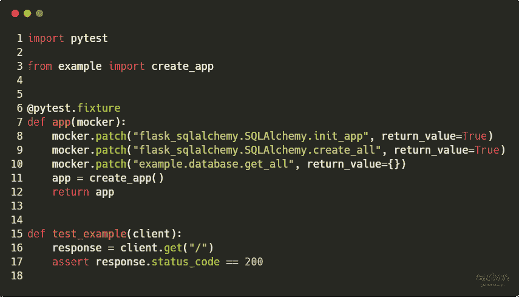

# 使用 pytest-mock 和 pytest-flask 进行测试

> 原文：<https://dev.to/ghost/testing-with-pytest-mock-and-pytest-flask-1i7g>

Pytest 是一个用于测试的流行 Python 库。它是我首选的测试库，因为它比诸如内置测试库 unittest 之类的替代库需要更少的样板代码。在本文中，我将向您展示如何使用 pytest-flask 和 pytest-mock 来测试您的 flask 应用程序。这两个库是 Pytest 的插件，构建在 Pytest 提供给我们的一些特性之上。

在这个例子中，我们将测试一个非常简单的 Flask 应用程序，我在这里创建了[源代码。如果你想了解更多关于 Flask 应用的信息，你可以在这里阅读我以前的文章](https://github.com/hmajid2301/medium/tree/master/9.%20Testing%20with%20pytest-mock%20and%20pytest-flask)[🔌 🔌。对于本文，您真正需要知道的是，它涉及到为一个假想的猫商店使用一个非常简单的 RESTful API。基本上，API 所做的就是与数据库交互，以获取当前的猫，添加新的猫，编辑现有的猫，并从商店中删除猫。](https://dev.to/hmajid2301/implementing-sqlalchemy-with-docker-18c9)

#### 先决条件

*   你自己的烧瓶应用
*   使用 pip install -r requirements.txt(或 pip3 而不是 pip)安装以下依赖项

其中 requirements.txt 为:

```
flask==1.0.2
pytest-flask==0.10.0
pytest-mock==1.10.0 
```

#### 库

*pytest-flask* 允许我们指定一个 app fixture，然后用这个 app 发送 API 请求。当向我们的 flask 应用程序发送 HTTP 请求时，用法类似于请求库。

pytest-mock 是一个围绕 unittest mock 库的简单包装器，所以使用 unittest.mock 可以做任何事情。用法上的主要区别是您可以使用 fixture mocker 来访问它，而且 mock 在测试结束时结束。而对于普通的模拟库，如果你模拟 open()函数，它将在测试模块的剩余时间内被模拟，也就是说，它将影响其他测试。

#### pytest-flask 示例

```
import pytest

from example_app import create_app

@pytest.fixture
def app():
 app = create_app()
 return app

def test_example(client):
 response = client.get("/")
 assert response.status_code == 200 
```

要使用 pytest-flask，我们需要创建一个名为 app()的设备，它创建了我们的 flask 服务器。然后，我们可以通过将 client 作为参数传递给任何测试来使用这个 fixture。然后，我们可以使用客户端发送各种 http 请求。

上面是一个使用 pytest-flask 的非常简单的例子，我们向我们的应用程序发送 GET 请求，它应该返回数据库中的所有猫。然后我们检查从服务器返回的状态代码是 200 (OK)。这很好，除了我们如何在代码中模拟出某些特性？

#### pytest-mock

我们可以使用 pytest-mock 库模拟出我们代码的某些部分，但是我们必须在 app() fixture 内部进行模拟。因为我们剩下的测试只是向我们的 Flask 服务器发出 HTTP 请求。在这个例子中，假设我们不想模拟到数据库的连接，我们可以使用下面几行代码。

```
mocker.patch("flask_sqlalchemy.SQLAlchemy.init_app", return_value=True)
mocker.patch("flask_sqlalchemy.SQLAlchemy.create_all", return_value=True)
mocker.patch("example.database.get_all", return_value={}) 
```

这段代码所做的是，每当任何被模拟的函数被调用时，比如说 init_app，我们模拟它，所以它总是返回 true。我们必须给它函数的“完整路径”,就好像你必须导入函数本身一样。

#### [T1】test _ example . py](#testexamplepy)

<figure>[](https://res.cloudinary.com/practicaldev/image/fetch/s--GjLZ1N1---/c_limit%2Cf_auto%2Cfl_progressive%2Cq_auto%2Cw_880/https://cdn-images-1.medium.com/max/855/1%2ActgQ4bI4VKqqom6wq6NiAg.png)

<figcaption>test _ example . py</figcaption>

T6】</figure>

在这个例子中，它非常无聊，因为当我们向应用程序发送 HTTP GET 请求时，它不会与数据库进行交互，因为我们已经模拟出来了，而只是返回一个空的 dict ({})。事实上，这不是一个很好的测试，你可以让它变得更有趣一点。

#### 附录

*   [示例源代码](https://github.com/hmajid2301/medium/tree/master/9.%20Testing%20with%20pytest-mock%20and%20pytest-flask)
*   [用碳制作的代码图像](https://carbon.now.sh)