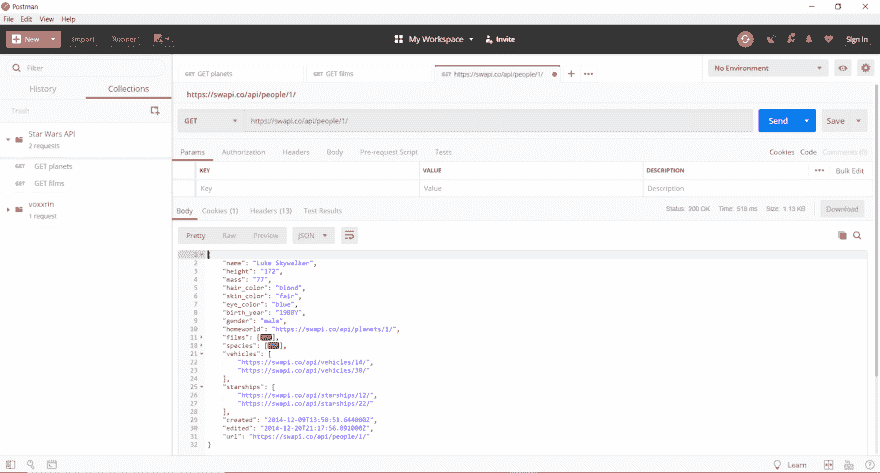
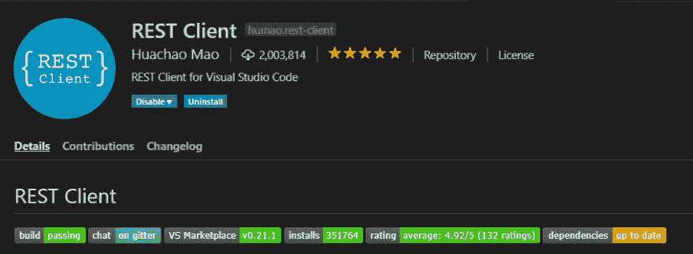
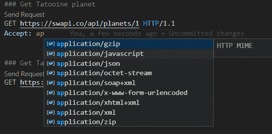
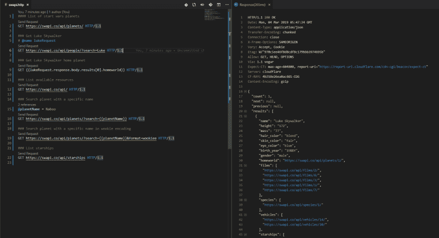
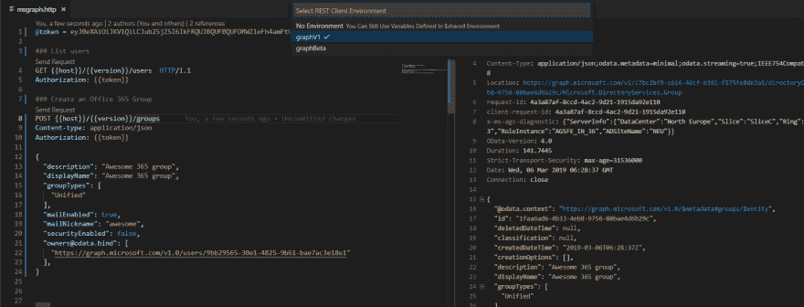

# 使用 REST 客户端测试您的 API

> 原文：<https://dev.to/techwatching/testing-your-api-with-rest-client-h23>

让我们来谈谈工具和测试一个 API！

## GUI 工具及其限制

我想和大多数开发人员一样，我经常使用 Fiddler 或 Postman 这样的 GUI 工具来查询 API。一旦你习惯了 Postman 的 HMI 及其所有标签，创建 GET / POST / PUT /就很容易了...请求，将它们保存在一个集合中，并将答案可视化。Postman 提供了许多其他特性，但是其中一个非常方便的特性是可以在请求中使用环境变量。

[](https://res.cloudinary.com/practicaldev/image/fetch/s--1RhbrCOc--/c_limit%2Cf_auto%2Cfl_progressive%2Cq_auto%2Cw_880/https://techwatching.dev/posimg/restclient_postman_1.png)

似乎是你会说的完美工具。如果你想自己快速测试一个 API，那是真的，说实话，我经常用它来测试。但是当你和其他开发人员在一个真实的项目上合作时，你可能会错过一些东西。对我来说，这是一种编辑、版本化和与其他开发者共享请求的方式。

好吧，我知道邮差付费计划允许你与团队中的其他人分享请求。我知道免费计划中的集合导出特性，但这还不够。我真的不喜欢太依赖专有软件和它的图形用户界面来做事。作为一名开发人员，我想要的是能够在简单的文本文件中编辑我的请求，我可以将其放在版本控制中。接下来是休息客户。

## 什么是 REST 客户端？

[](https://res.cloudinary.com/practicaldev/image/fetch/s--CetzkAjV--/c_limit%2Cf_auto%2Cfl_progressive%2Cq_auto%2Cw_880/https://techwatching.dev/posimg/restclient_vscode_1.png)

REST 客户端扩展是由[华超毛](https://github.com/Huachao)开发的开源 vs 代码扩展。如果我引用其 [GitHub 库](https://github.com/Huachao/vscode-restclient)的自述:REST 客户端允许你发送 HTTP 请求，直接在 Visual Studio 代码中查看响应。让我们看看对[的简单 GET 请求，Start Wars API](https://swapi.co/) :

[](https://res.cloudinary.com/practicaldev/image/fetch/s--6jMrZvu8--/c_limit%2Cf_auto%2Cfl_progressive%2Cq_auto%2Cw_880/https://techwatching.dev/posimg/restclient_swapi_1.png)

这里没有什么新的或复杂的东西，只是你凭直觉编写的请求。像这样，你可以简单地按照标准 RFC 2616 编写任何类型的请求。即使你不知道这个标准，它也很简单，你经常可以在你查询的 API 文档中找到这种格式的例子，比如在微软的 Graph API 文档中。

[](https://res.cloudinary.com/practicaldev/image/fetch/s--ecoRfMbL--/c_limit%2Cf_auto%2Cfl_progressive%2Cq_auto%2Cw_880/https://techwatching.dev/posimg/restclient_swapi_3.png)

REST 客户端通过选择 *HTTP* 作为语言模式来处理 vscode 中的文本文件(默认情况下，该语言模式与具有*的文件相关联)。休息*或*。http* 扩展名)。它为您提供了一些自动完成功能和一些代码片段来帮助您编写查询。在 vscode 中，只需用###分隔，就可以在同一个文件上写多个请求。在每个请求上方，一个可操作的*发送请求*链接允许您运行请求，并在响应面板中查看响应。

## 在 REST 客户端中使用变量

正如您在下面看到的，REST 客户端可以使用变量。变量`planetName`在文件中定义，并在 2 个请求中重用。一个变量也被用来命名请求【https://swapi.co/api/people/?search=Luke*获取T5】并且使得使用来自响应的元素成为可能(你可以在右边看到)。这里，我们使用响应的`homeworld`属性在下面的 GET 请求中检索 Luke 来自的星球。在变量的帮助下，您可以轻松地组合和链接您需要实现的场景的请求。*

[](https://res.cloudinary.com/practicaldev/image/fetch/s--F1ngOkbZ--/c_limit%2Cf_auto%2Cfl_progressive%2Cq_auto%2Cw_880/https://techwatching.dev/posimg/restclient_swapi_2.png)

REST 客户端允许您在 vscode 的用户设置文件中定义环境及其相关变量。例如，假设我想查询 Microsoft Graph API(V1 版和测试版的 API)，我将把下面的 json 添加到我的设置文件中:

```
"rest-client.environmentVariables": {
        "$shared": {
            "host": "https://graph.microsoft.com/",
        },
        "graphV1": {
            "version": "v1.0",
        },
        "graphBeta": {
            "version": "beta"
        },
    } 
```

Enter fullscreen mode Exit fullscreen mode

我定义了两个环境 *graphV1* 和 *graphBeta* ，并为*版本*变量指定了一个值。这些环境共享*主机*作为包含在共享环境 *$shared* 中的公共变量。从我的请求文件中，我现在可以在环境之间切换，并使用变量 *version* 和 *host* 来请求 Microsoft Graph API。

[](https://res.cloudinary.com/practicaldev/image/fetch/s--POhf7jzW--/c_limit%2Cf_auto%2Cfl_progressive%2Cq_auto%2Cw_880/https://techwatching.dev/posimg/restclient_msgraph_1.png)

## 我喜欢 REST 客户端的什么？

REST 客户端是 Postman 的一个很好的替代品，因为它允许从 Visual Studio 代码中轻松地编写请求和查询 API。我已经是一个 vscode 用户，所以我很喜欢呆在我熟悉和喜欢的环境中测试 API。REST 客户端可能没有 Postman 提供那么多功能，但是对于我的使用来说，已经足够了。

我真正喜欢这个工具的是，你把你的请求当作代码:你可以提交包含你的请求的文件，跟踪它们的修改，并与你的 Git 项目库中的同事共享这些请求。

我已经看到相当多的人最近在视频教程中使用它，如果你看看下载的数量，似乎我不是唯一一个发现它有用的人。

## 入门

REST 客户端中还有很多我没有提到的特性(生成代码片段、请求历史...)所以不要犹豫，试一试吧。您可以在任何您喜欢的 API 上使用它(甚至有对 SOAP 的基本支持)，就像您使用 Postman 或其他工具一样。

如果您想快速转换您的 Postman 查询，Postman 中有一个 *Code* 按钮，它允许您查看 HTTP 请求代码，您只需将它复制并粘贴到 vscode 中，以便与 REST 客户端一起使用。

或者，如果你愿意，你可以从测试星球大战 API 开始，你会在下面找到我使用的请求。享受😃