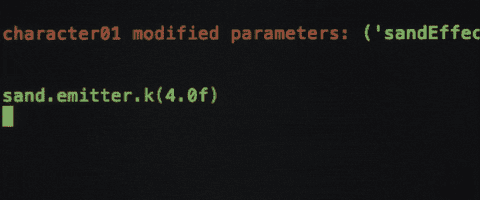

# 编程的 10 条戒律

> 原文：<https://dev.to/prjseal/the-10-commandments-of-programming-52fe>

## 1。你应该恰当地命名事物

[](https://res.cloudinary.com/practicaldev/image/fetch/s--y2O5CWXI--/c_limit%2Cf_auto%2Cfl_progressive%2Cq_66%2Cw_880/https://media3.giphy.com/media/jmB9YQa1f2MFi/giphy.gif)

正如你可能知道的，给事物命名是困难的，但是它不是不可能的，只要类、方法、对象或变量等的名字有意义，并且帮助读者理解正在发生的事情，那么你就做对了。

请不要成为这样做的人:

```
var button1 = new Button();

var textBox3 = new TextBox(); 
```

虽然代码本身可能不现实，但这里的要点是懒惰命名。将某个东西命名为 button1 或 textBox3 是没有帮助的，请给它一个有意义的名称。

## 2。你不应该在代码中写明显的注释

[](https://res.cloudinary.com/practicaldev/image/fetch/s--2jwjSEu9--/c_limit%2Cf_auto%2Cfl_progressive%2Cq_66%2Cw_880/https://media3.giphy.com/media/1gWkfw7pt1zJsxlzI7/giphy.gif)

我个人认为你不应该在代码中写注释。我认为你应该用一种不需要注释的方式来解释代码本身在做什么。考虑到这一点，这条戒律指的是这样的评论:

```
//get the user from the database
var user = GetUserFromDatabase();

//send an email to the user
var success = SendEmailToUser(user); 
```

那些评论毫无意义。代码在那里做什么是很明显的。如果你真的必须写评论，用它们来解释你为什么做某事，而不是说你在做什么。

## 3。你不应该将秘密提交给开源代码库

[](https://res.cloudinary.com/practicaldev/image/fetch/s--GE8ZCtRg--/c_limit%2Cf_auto%2Cfl_progressive%2Cq_66%2Cw_880/https://media3.giphy.com/media/yow6i0Zmp7G24/giphy.gif)

我们都爱开源软件，我们中的一些人甚至喜欢为它们做贡献或者创建我们自己的库。我们是好人，但不要被愚弄，不是每个人都有良好的意图，一些讨厌的人创造了机器人来进行他们的邪恶工作。

您不应该将任何密钥或秘密提交给开源存储库，因为有人会在公共存储库的提交历史中寻找这样的东西，并毫无益处地使用它们。

在本地使用诸如“AppSettingsSecrets.config”之类的不会签入源代码管理的内容。您也可以使用环境变量和密钥库。

## 4。你不应该重复代码超过一次

[](https://res.cloudinary.com/practicaldev/image/fetch/s--OsygZjXI--/c_limit%2Cf_auto%2Cfl_progressive%2Cq_66%2Cw_880/https://media0.giphy.com/media/jFywwp8TzdCFi/giphy.gif)

这听起来可能有点矛盾，但是想想它在说什么。它说你可以原谅在同一个项目中复制一些代码一次，但是如果你需要为项目的另一部分再次复制它，那么也许你需要重构代码，这样它可以存在一次，并且可以从所有需要它的不同地方被调用。

## 5。不得以明文或弱哈希算法存储密码

[](https://res.cloudinary.com/practicaldev/image/fetch/s--PC73YxNx--/c_limit%2Cf_auto%2Cfl_progressive%2Cq_66%2Cw_880/https://media3.giphy.com/media/It8qXjo51Rgek/giphy.gif)

这是不可原谅的。任何人都不应该在数据库中以纯文本形式存储密码，或者使用 MD5 之类的弱哈希算法。

如果您的数据遭到破坏，这种情况最近似乎越来越多，您希望让黑客尽可能难以得手。好吧，所以他们设法得到了你的数据，但如果你做得对，他们将无法访问密码和其他个人数据，因为你有一个非常强大的加密方法，如 AES 256，每个记录有不同的盐和向量。

## 6。你不应该窃取他人的代码

[](https://res.cloudinary.com/practicaldev/image/fetch/s--PVAMONKa--/c_limit%2Cf_auto%2Cfl_progressive%2Cq_66%2Cw_880/https://media0.giphy.com/media/l44QjgeQ5ium91n9K/giphy.gif)

当使用别人的代码时，你需要小心。如果你把它复制并粘贴到你的程序中，你需要确保你没有违反任何许可。你可能认为你可以仅仅重命名名称空间、类和方法名，但是如果代码看起来仍然和原来的一样，你仍然会被起诉。有一个著名的法庭案例，拥有 Java 的甲骨文起诉谷歌抄袭其 API。

有这么多不同的许可需要理解，仅仅因为某些东西是免费的，并不意味着你可以用它做你想做的事情。GPL 许可证试图强迫人们发布他们的源代码，如果你正在开发专有软件，这可能是个问题。

这篇文章将帮助你[了解更多关于软件许可](https://medium.com/shakuro/software-licenses-explained-77f4f18ebeb1)的信息。

## 7。你不应该承担不必要的依赖

[](https://res.cloudinary.com/practicaldev/image/fetch/s--THY4t4x5--/c_limit%2Cf_auto%2Cfl_progressive%2Cq_66%2Cw_880/https://media1.giphy.com/media/yHKOzZnHZyjkY/giphy.gif)

如果您是一名 web 开发人员，您可能在某个时候使用过 jQuery。你真的还需要使用 jQuery 吗？你实际使用了多少？如果只是通过类名或 id 获取元素，那么用普通的 javascript 就可以做到。看看这个网站，它会告诉你为什么[你可能不需要 jquery](http://youmightnotneedjquery.com/) 。

那么日期呢，如果你只想格式化日期和时间，你真的需要加载 momentjs 吗？

当然，最好的办法是找出你在项目中需要的几行代码来完成这些事情，并消除这些依赖性，除非你大量使用它们。

## 8。你不应该写紧耦合的代码

[](https://res.cloudinary.com/practicaldev/image/fetch/s--Wp7XQLr---/c_limit%2Cf_auto%2Cfl_progressive%2Cq_66%2Cw_880/https://media1.giphy.com/media/pcKoz7f46DSa0B569s/giphy.gif)

紧耦合代码是不容易测试的代码。它是依赖于其他代码才能运行的代码。它降低了代码的灵活性和可重用性。

测试驱动开发是一种先写测试，再写代码的方法。您只需编写足够通过测试的代码。您编写了足够多的测试来确保代码满足需求。如果你写的是紧密耦合的代码，测试会变得更加困难。遵循 TDD 方法让您思考如何以不与任何其他代码紧密耦合的方式编写代码。您应该为您的服务和依赖注入使用接口，将这些服务注入到您需要使用它们的地方。

## 9。你不应吞下错误

[](https://res.cloudinary.com/practicaldev/image/fetch/s--UsxmESdK--/c_limit%2Cf_auto%2Cfl_progressive%2Cq_66%2Cw_880/https://media2.giphy.com/media/xTiTnw85D3dc3SeYRG/giphy.gif)

让我们面对现实吧，我们都可能写过一个 try catch 语句，其中 catch 只是吞掉错误，这样应用程序就不会抛出错误。这很糟糕，真的很糟糕。

在吞下错误之前，您至少应该记录错误。

在理想的情况下，您将捕获错误，记录它，用您的代码对它做出反应，并将其提交到下一个级别，在那里您也可以适当地处理它。

## 10。不应该使用硬编码的值

[](https://res.cloudinary.com/practicaldev/image/fetch/s--h6vr7Lyw--/c_limit%2Cf_auto%2Cfl_progressive%2Cq_66%2Cw_880/https://media2.giphy.com/media/3o72F7RrTPW6jymXew/giphy.gif)

请不要在代码中使用硬编码值。拜托，那有多讨厌。如果值需要改变，你要做什么，找到并替换所有出现的“2”吗？

更好的方法是使用常量、变量或枚举，它们有一个有意义的名字来表示值，你只需要在一个地方更新它？

### 想有你的发言权？

如果你不同意或想要添加任何戒律，请评论你在哪里看到这篇文章，或在推特上发表你的评论，让辩论继续下去。