# ‍️的 7 个专业技巧，以获得有角度的 CLI 和示意图的生产力

> 原文：<https://dev.to/angular/the-7-pro-tips-to-get-productive-with-angular-cli-schematics-157m>

<figure>[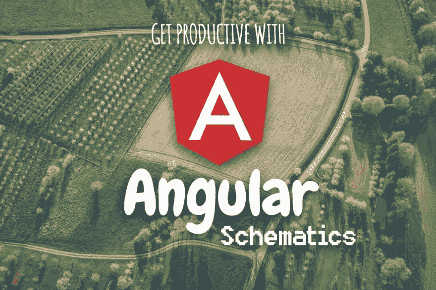](https://res.cloudinary.com/practicaldev/image/fetch/s--K8dl6ySM--/c_limit%2Cf_auto%2Cfl_progressive%2Cq_auto%2Cw_880/https://cdn-images-1.medium.com/max/1024/1%2ABmpWBv6AoWdbs3wffmIz_g.jpeg) 

<figcaption>像大地母亲一样多产！(原文📷由[马库斯·斯皮斯克](https://unsplash.com/photos/pZX9QPxeIQc?utm_source=unsplash&utm_medium=referral&utm_content=creditCopyText) )</figcaption>

</figure>

> Angular Schematics 是现代网络的工作流工具—官方介绍[文章](https://blog.angular.io/schematics-an-introduction-dc1dfbc2a2b2)

### 快速介绍

有很多关于如何构建自己的角度示意图的文章，但在这篇文章中，我们将重点关注如何最大限度地利用可用的示意图！💪

> 大多数情况下，我们将使用 Angular CLI 中现成的@schematics/angular。

### 我们要学什么

1.  使用快捷键，它们更快更容易打字，哈哈😂！
2.  跳过初始应用程序的创建
3.  生成多个应用程序和库以促进代码重用
4.  使用不同 npm 包中的示意图
5.  在 angular.json 文件中设置 schematics 默认值，这样我们就不需要一直指定所有的标志
6.  生成服务—提供:“根”与模块标志(作用域为延迟加载的模块)
7.  使用 ng add 添加像 Angular Material(或其他)这样的库

**奖励:**有用的命令

**奖金+:** 惊人的代码完成能力！

> 有趣的事实:一开始我脑子里只有 6 个不同的有用的提示，看看它是如何结束的。我们有 7 个要点和 2 个奖金🤦但是 schematics 有太多很酷的功能了，没有其他方法了😂

### 1。使用快捷方式，它们要快得多！🏎️

Angular CLI 中的大多数 schematics 命令都带有快捷方式版本。例如，我们可以简单地写 ng g s service-name，而不是 ng generate service service-name。

> 字母越少=打字错误的概率越低，耶🎉！

此外，原理图曾经记录在 Angular CLI 知识库的 GitHub Wiki 中，但现在已经得到了改进。官方原理图文档现已作为 [angular.io](https://angular.io/cli/generate) 的一部分与其余文档一起提供，非常方便！请查看所有可用的命令及其快捷方式版本！

### 2。跳过初始应用程序的创建

Angular CLI 在单个工作区中提供了对多个应用程序和库的强大支持。此功能很容易被忽略，因为默认情况下，Angular CLI 将使用默认应用程序直接在。/src/ folder。

<figure>[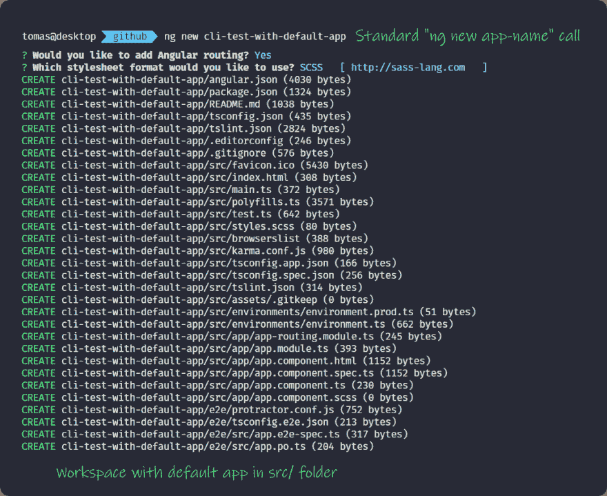](https://res.cloudinary.com/practicaldev/image/fetch/s--9hlW449i--/c_limit%2Cf_auto%2Cfl_progressive%2Cq_auto%2Cw_880/https://cdn-images-1.medium.com/max/1024/1%2A-e6CBz404bTglnA0jw60HA.png) 

<figcaption>标准工作空间生成使用 **ng 新** app-name</figcaption>

</figure>

当我们决定在开发过程中添加更多库时，CLI 将创建新的项目文件夹。这将导致不一致的代码结构，与后来添加的相比，原始应用程序不遵循路径和约定。

这可以通过创建带有 ng new - createApplication=false 标志的新工作区来防止。

我们得到的是一个空的工作空间。然后，我们可以继续使用 ng generate 应用程序 our-first-app(或库 our-first-library)。

这样，工作区中的所有代码都将位于项目文件夹中的可预测位置！太好了！🎉🎉🎉

<figure>[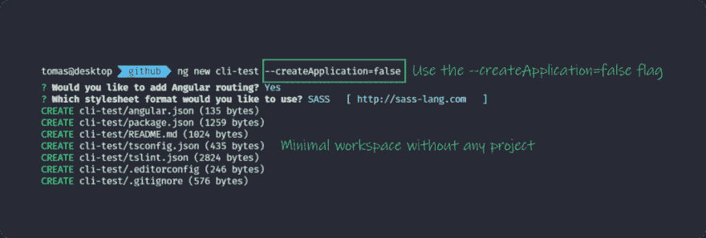](https://res.cloudinary.com/practicaldev/image/fetch/s--pHwk8cXZ--/c_limit%2Cf_auto%2Cfl_progressive%2Cq_auto%2Cw_880/https://cdn-images-1.medium.com/max/1024/1%2ABYmxYVe_5xZxzKODdz3X7Q.png)

<figcaption>Angular CLI 生成的最小工作空间与 ng new CLI-test--create application = false</figcaption>

</figure>

### 3。生成多个应用程序和库以促进代码重用

如上所述，Angular CLI 目前支持单个工作区中的多个应用程序和库(默认情况下在项目/文件夹中)。

可以通过分别运行 ng generate library library-name 和 ng generate application app-name 来添加库和应用。

> 您可以选择多个独立的 npm 包或 monorepo，这取决于您的主观偏好。两者都有其独特的优点和缺点。

Angular CLI 将生成库，这些库在由 ng-packager 构建后，将在 dist 文件夹中获得自己的 package.json 文件。这样的库可以独立于工作区中的其他项目，轻松地发布到 npm。这支持开箱即用的多 npm 软件包方案

另一方面，像@nrwl/nx 这样的工具帮助我们以 monorepo 的方式实现类似的结构。选择最适合您的用例的方式！

#### 如何在不同的 app 和库中生成实体？

在使用单个应用程序的工作空间中使用 schematics 非常简单。每次调用 ng generate 都会在唯一的应用程序中的指定路径中生成所需的实体。在单个工作空间中使用多个应用程序和库会怎么样？

angular.json 文件包含 defaultProject 属性，该属性指定在执行任何 Angular CLI 命令时将隐式假定哪个项目。这也适用于 ng 构建或 ng 测试。

<figure>[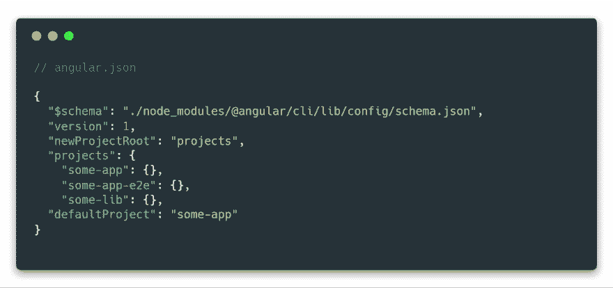](https://res.cloudinary.com/practicaldev/image/fetch/s--oe9fHoOp--/c_limit%2Cf_auto%2Cfl_progressive%2Cq_auto%2Cw_880/https://cdn-images-1.medium.com/max/1024/1%2AukDwmZbV6NQJe1kQVNypCw.png)

<figcaption>angular . JSON 文件顶层结构示例，包含一个 app 和一个 lib 项目</figcaption>

</figure>

我们还可以指定- project flag 作为这些命令的一部分，使其在所需的应用程序或库中运行…该命令将如下所示:ng g c path/some-component-project some-app

> 当主要在单个应用程序(或 lib)上工作时，更改 angular.json 文件中的 defaultProject 属性可能是值得的，以防止不必要的键入，或者在 package.json 中创建额外的 npm 脚本来为我们做这些。例如，“ng-my-lib”:“ng run-project my-lib”，我们可以像这样使用它。注意传递子命令的- npm 管道。

### 4。使用第三方 npm 包中的原理图

Angular CLI 附带了在@schematics/angular npm [包](https://www.npmjs.com/package/@schematics/angular)中实现的一组默认原理图，这使我们能够生成应用程序或组件。

> 原理图本身实际上是独立于框架的

许多人、组织和开源库已经在 npm 注册表中实现并提供了他们自己的原理图供我们使用。

一个很好的例子是 [NgRx 状态管理库](https://ngrx.io/)，它在@ngrx/schematics npm 包中提供了自己的 schematics。那么，我们如何使用这个额外的第三方原理图呢？

#### 在生成调用中指定 schematics 包名

这是最直接的解决方案。一旦我们在工作空间中安装了额外的 schematics 包，我们就可以简单地使用 ng g : [...选项]。或者从更实际的角度来想象一下——ng g @ ngrx/schematics:action feature-name/entity-name-spec = true……

<figure> 

<figcaption>对比使用**ng g**vs**原理图**</figcaption>

</figure>

#### 不借助 Angular CLI 运行原理图

即使没有 Angular CLI 的帮助，也可以执行原理图。在这种情况下，我们只需运行 schematics @ngrx/schematics:操作要素名称/实体名称。

如何使 schematics 命令在我们的环境中可用将在**奖金**部分讨论😉

> [在 Twitter 上关注我](https://twitter.com/tomastrajan)获得关于最新 Angular 博客帖子和有趣的前端内容的通知！🐤

### 5。在 angular.json 文件中设置 schematics 默认值，这样我们就不需要一直指定所有的标志

我们用来生成实体(如组件或服务)的许多图表支持大量的附加配置标志。

例如，对于组件，我们可以为- inlineStyle 和- inlineTemplate 设置标志，这样我们就可以在组件 typescript 文件中获得完整的实现。

> 一个单独的项目通常包含许多组件，所以如果我们想保持统一的代码风格，我们需要手动并经常重复这些标志…

幸运的是，Angular CLI 支持定义 schematics 选项的默认值！

<figure>[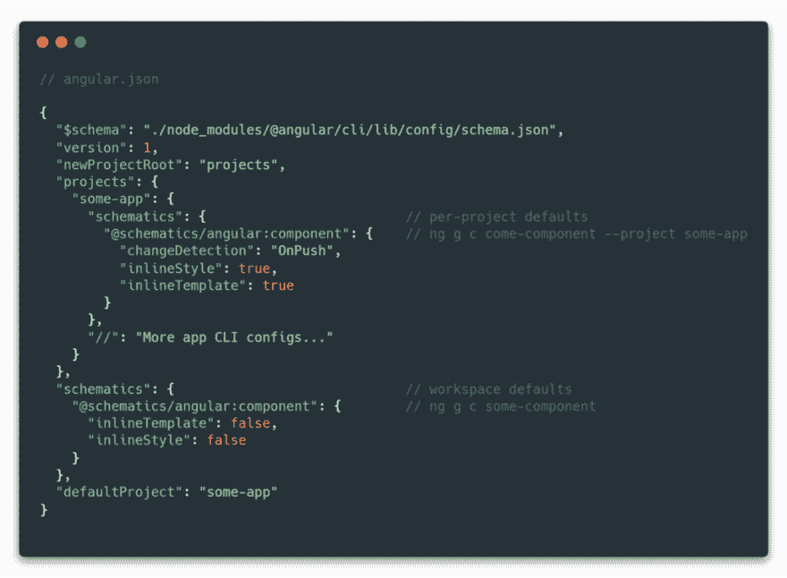](https://res.cloudinary.com/practicaldev/image/fetch/s--kua-B-LI--/c_limit%2Cf_auto%2Cfl_progressive%2Cq_auto%2Cw_880/https://cdn-images-1.medium.com/max/1024/1%2AwpRttbmXcePCFJ21F-a8tg.png) 

<figcaption>如何定义工作区和项目具体原理图默认值的例子</figcaption>

</figure>

默认值是在 schematics 对象内部定义的，并且是针对每个逻辑示意图定义的。每个原理图都由封装名称和各自的原理图定义。

在上面的例子中，我们从包@schematics/angular 中提供了元件原理图的默认值。

> 这种方法很棒，因为它足够灵活，允许我们为多个 schematics 包指定默认值，如流行的第三方@nrwl/schematics、@ngrx/schematics 包，甚至我们自己定制的@some-org/schematics。

schematics 对象可被定义为顶级属性，在这种情况下，默认值将应用于不带 -项目标志的 ng g 调用**。也可以配置项目特定的 schematics 默认值，并且只有在将 ng g 与- project some-project 标志一起使用时才会被激活。**

#### 覆盖默认 schematics 集合

一些 schematics 集合(如 ngrx)使我们能够调用原始 Angular CLI schematics(如 component 或 service ),紧挨着它们带来的所有新 schematics。

在这种情况下，我们可以使用 ng config cli.defaultCollection 将此类集合设置为默认的 Angular CLI schematics 集合。defaultCollection 属性将被添加到 angular.json 文件中。

<figure>[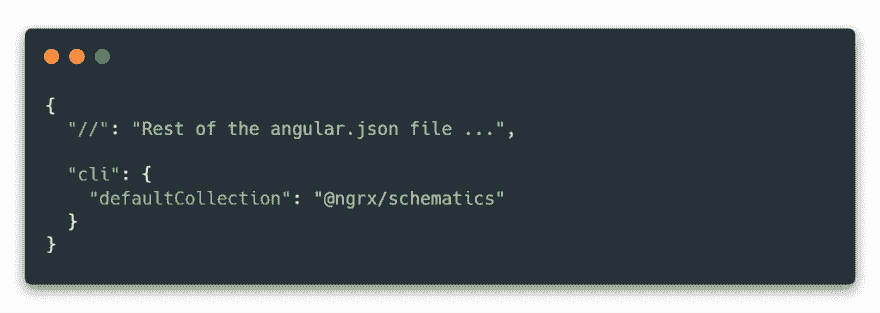](https://res.cloudinary.com/practicaldev/image/fetch/s--jVFSbRum--/c_limit%2Cf_auto%2Cfl_progressive%2Cq_auto%2Cw_880/https://cdn-images-1.medium.com/max/1024/1%2A2IibJvp53-pjk1HryMiMUQ.png) 

<figcaption>在 **angular.json** 文件中设置默认的 schematics 集合将使我们能够调用提供的 schematics，而不需要在每个 **ng g** 调用</figcaption>

</figure>

中指定它们的包名

设置默认集合使我们能够从该集合中执行 schematics，而无需在调用中指定 schematics 包名称。这样我们可以调用 ng g action feature/action-name，而不是 ng g @ ngrx/schematics:action feature/action-name，这样很好！

### 6。生成服务—提供:“根”与模块标志(作用域为延迟加载的模块)

服务生成已更改，默认情况下，Angular CLI 6+生成的服务使用新的 provided in:“root”语法。

<figure>[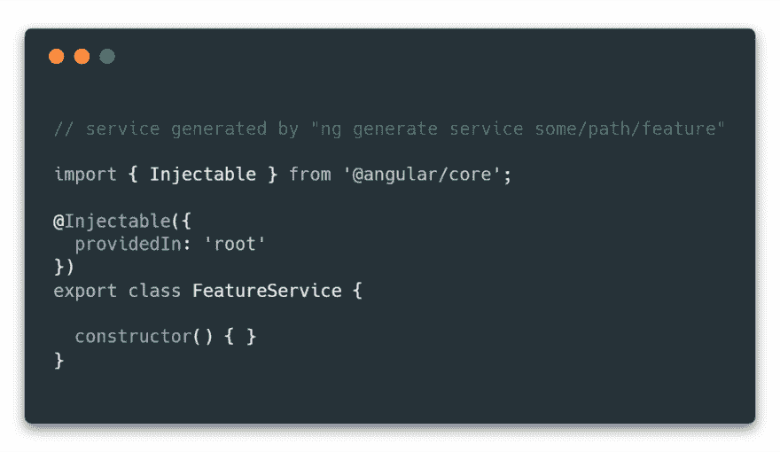](https://res.cloudinary.com/practicaldev/image/fetch/s--78CTSL-X--/c_limit%2Cf_auto%2Cfl_progressive%2Cq_auto%2Cw_880/https://cdn-images-1.medium.com/max/1024/1%2AXcMX6I8tbWnxewntwiX4-g.png) 

<figcaption>服务生成使用 **ng 生成服务点/路径/功能**</figcaption>

</figure>

这样的服务不需要在 providers 中指定:[] array of any @NgModule，这很方便。更好的是，如果消费者应用程序没有显式导入，根中提供的库服务将自动进行树抖动！

与以前使用 providers: [] array 的依赖注入风格相比，这是一个很大的改进，因为所有提供的服务最终都会包含在 bundle 中，而不管它们是否被使用！

> 当我们想要为每个创建的组件获得服务的唯一实例，或者当我们想要将服务范围扩大到延迟加载的模块时，使用旧式的*提供者:[]* 提供服务仍然有它的位置。

在可能生成服务某些特征和指定模块之前../some.module 标志，但这在 Angular CLI 7+中不再受支持。

如果我们想将我们的服务扩展到某个组件或模块，我们必须删除@ injective()decorator 的内容。然后，我们可以将服务导入到所需的模块中，并手动将其添加到 providers: [] array 中。

<figure>[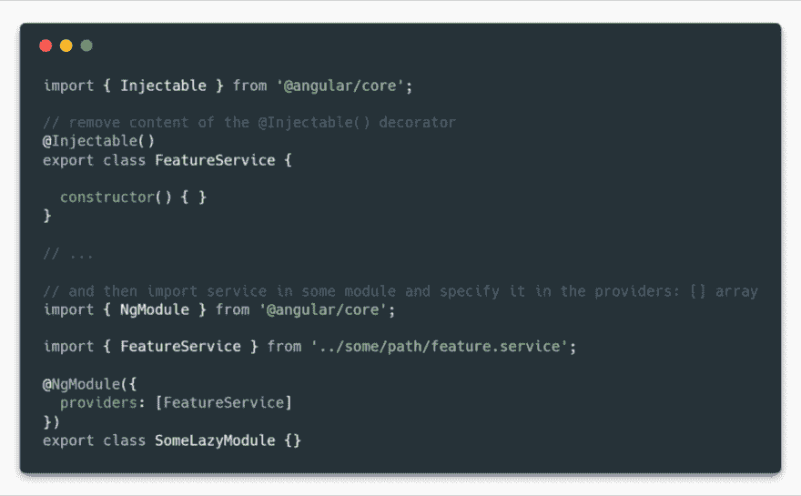](https://res.cloudinary.com/practicaldev/image/fetch/s--rFQs2JER--/c_limit%2Cf_auto%2Cfl_progressive%2Cq_auto%2Cw_880/https://cdn-images-1.medium.com/max/1024/1%2AWaA3qo0dIPKtmJVqWDWnIQ.png) 

<figcaption>调整服务依赖注入注册，将其作用域调整到懒加载模块</figcaption>

</figure>

### 7。使用“ng add”添加像 Angular Material(或其他)这样的库

到目前为止，我们主要讨论的是我们工作区中已经存在的各种原理图的执行。原理图本身通常会创建几个新文件，并可能在这里或那里添加一些导入语句来连接东西…

> 但是需要更多设置工作的库呢？

图表再次掩护了我们！帮助以 ng add 命令和在特定 schematics 包中实现的相应(特殊)ng-add schematics 的形式出现！

> 最常见的例子可能是 Angular Material，这是一个在许多 Angular 项目中使用的优秀组件库。角度材质设置过程有点复杂…

1.  显然，我们必须安装@angular/material npm 包
2.  我们必须决定，如果我们想去与预建的主题或添加我们自己的自定义主题
3.  我们必须决定是否要支持触摸事件和浏览器动画

这样一个重要的设置过程最好使用 ng add 来处理。

<figure>[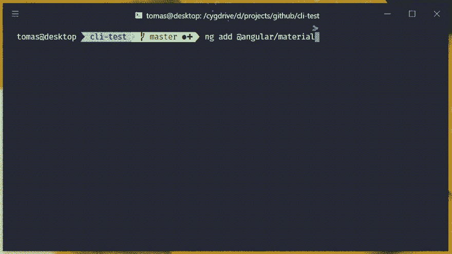](https://res.cloudinary.com/practicaldev/image/fetch/s--hit1g9gg--/c_limit%2Cf_auto%2Cfl_progressive%2Cq_66%2Cw_880/https://cdn-images-1.medium.com/max/1024/1%2AkufIo62SC3s-OLSBMj-k-w.gif) 

<figcaption>这种选择能力被称为“提示”，是 Angular CLI 7+</figcaption>

</figure>

的新特性

如果没有 ng add，我们将不得不手动安装软件包，然后花几分钟时间阅读文档来弄清楚如何设置一切！

> **PRO 提示:**将 ng-add schematics 添加到您的开源库可能仍然是值得的，即使它不会比 npm 安装包做得更多。这样，人们可以使用通常的工作流程添加它！查看[示例](https://github.com/angular-extensions/model/blob/master/schematics/collection.json#L4)如何在[@ angular-extensions/model](https://github.com/angular-extensions/model/tree/master/schematics)库中[实现](https://github.com/angular-extensions/model/blob/master/schematics/ng-add/index.ts)这个最小的 ng-add 原理图。

### 🎁额外收获:有用的命令

#### 不带角度 CLI 运行原理图

原理图独立于 Angular CLI，可以在工作空间之外执行。我们所要做的就是安装 NPM I-g @ angular-dev kit/schematics，它将给出 schematics 命令，我们可以在我们选择的终端中运行该命令。

另一种可能是 npx。不幸的是，在我们的例子中包名和命令名不同，所以执行起来会很麻烦……npx-p[@ angular](http://twitter.com/angular)-dev kit/schematics，因此我建议使用全局 npm 安装。

#### 列出所有可用的原理图

示意图-列表-示意图示意图-包-名称:

该命令列出了指定包中所有可用的原理图。该软件包必须安装在执行命令的文件夹的 node_modules/文件夹中，并且可以在其中使用。(请注意，包名以:字符结尾)

示例:schematics-list-schematics @ngrx/schematics:在安装了@ ngrx/schematics 包的 Angular CLI 生成的项目的工作空间中。

### 💝奖金+:惊人的代码完成能力！

我们可能已经注意到 angular.json 的第一行看起来有点滑稽…

<figure>[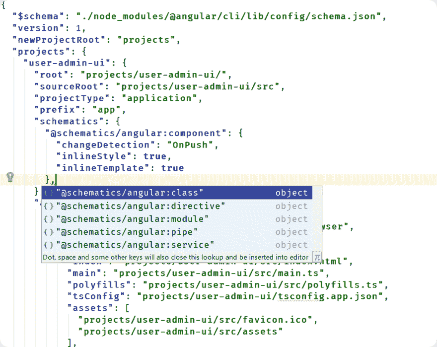](https://res.cloudinary.com/practicaldev/image/fetch/s--gbQEO1wp--/c_limit%2Cf_auto%2Cfl_progressive%2Cq_auto%2Cw_880/https://cdn-images-1.medium.com/max/1024/1%2A9GlG7m2HdN9eiqCqBvD5iQ.png)

<figcaption>angular . Json 文件中的代码完成示例由 [Json 模式](https://json-schema.org/)</figcaption>

</figure>

提供支持

> $schema 属性负责提供超级棒的代码完成功能！

比方说，我们希望将默认值添加到我们项目的另一个原理图中。我们所要做的就是点击我们选择的编辑器的代码完成快捷键，我们将得到可能值的列表！

经常伴随着有用的描述！

<figure>[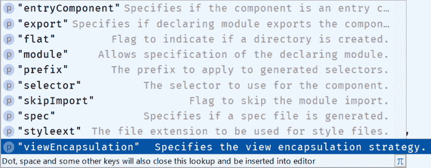](https://res.cloudinary.com/practicaldev/image/fetch/s--Hr4h0Qur--/c_limit%2Cf_auto%2Cfl_progressive%2Cq_auto%2Cw_880/https://cdn-images-1.medium.com/max/931/1%2Ao1_I_cjC-k8c9TFvH5atgw.png)

<figcaption>IDE</figcaption>

</figure>

代码完成功能提供的属性描述示例

### 今天到此为止！

> 我希望你喜欢这篇文章，并通过在你的项目中使用角度示意图获得更多的成果！

请支持本指南👏👏👏使用👏按钮，有助于将它传播给更广泛的受众🙏。此外，如果你有任何问题，请通过文章回复或 Twitter DMs [@tomastrajan](https://twitter.com/tomastrajan) 联系我

> 开始一个有角度的项目？检查[角 NgRx 材料启动器](https://github.com/tomastrajan/angular-ngrx-material-starter)！

<figure> 

<figcaption>Angular NgRx 素材首发内置最佳实践、主题化等等！</figcaption>

</figure>

> 永远不要忘记，未来是光明的

<figure> 

<figcaption>显然前途光明(📸由[【詹姆斯·唐纳森】](https://unsplash.com/photos/toPRrcyAIUY?utm_source=unsplash&utm_medium=referral&utm_content=creditCopyText)</figcaption>

</figure>

如果你已经做到了这一步，请随意查看我的其他一些关于角度和前端软件开发的文章…

*   [退订 RxJS 的最佳方式在 Angular 应用中可观察到！](https://blog.angularindepth.com/the-best-way-to-unsubscribe-rxjs-observable-in-the-angular-applications-d8f9aa42f6a0)
*   [常见角度问题的最终答案:subscribe() vs | async Pipe](https://blog.angularindepth.com/angular-question-rxjs-subscribe-vs-async-pipe-in-component-templates-c956c8c0c794)
*   [角度 6+依赖注入总指南—提供者与提供者:[]💉](https://medium.com/@tomastrajan/total-guide-to-angular-6-dependency-injection-providedin-vs-providers-85b7a347b59f)
*   [运行时可定制的动态角度动画总指南](https://blog.angularindepth.com/total-guide-to-dynamic-angular-animations-that-can-be-toggled-at-runtime-be5bb6778a0a)
*   【Angular CLI 预算如何拯救了我的一天，它们又如何拯救了你的一天

* * *