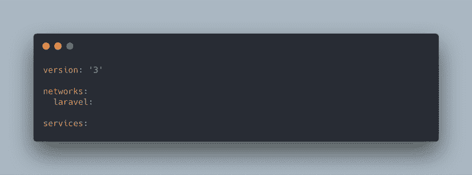
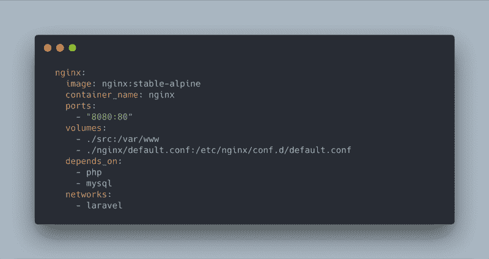
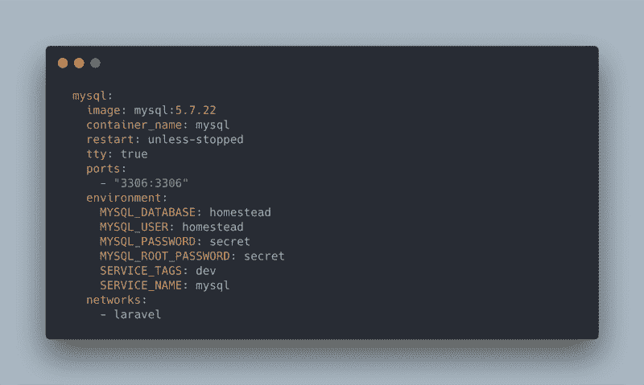
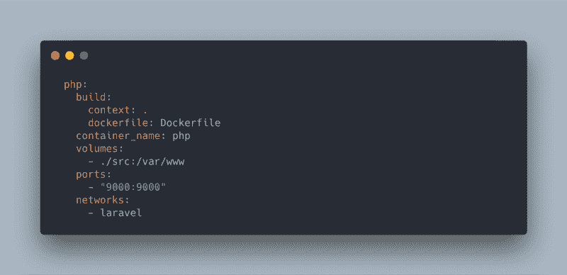
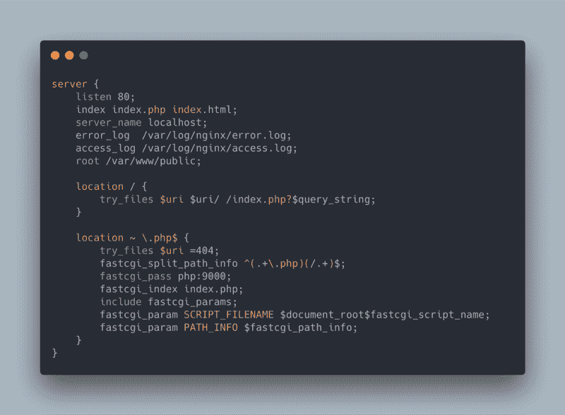
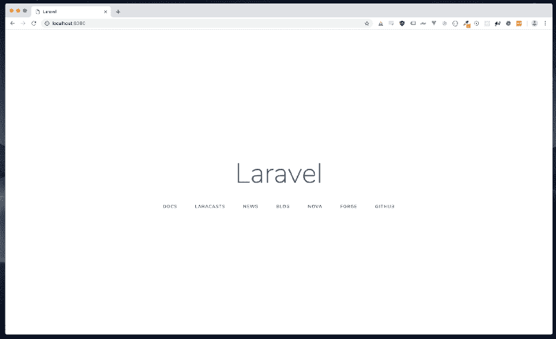
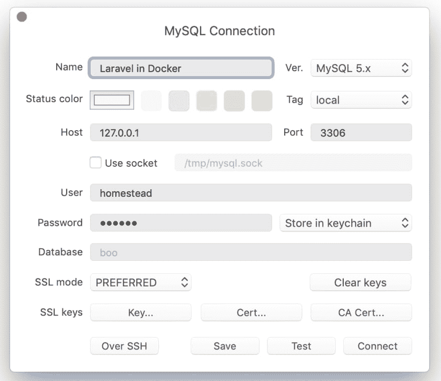

# 拉勒维尔码头——码头对当地拉勒维尔发展的好处

> 原文：<https://dev.to/aschmelyun/the-beauty-of-docker-for-local-laravel-development-13c0>

## TL；博士；医生

想走快车道，跳过下面的详细教程？为你的 OS 安装 [Docker](https://docs.docker.com/docker-for-mac/install/) ，克隆[这个 repo](https://github.com/aschmelyun/docker-compose-laravel) ，将你的 Laravel app 文件添加到 **src** 目录，从你刚刚克隆的根项目目录运行:
`docker-compose build && docker-compose up -d`。

## 简要介绍

在我们开始之前，应该知道本文并不是 Docker 的完整教程，也不是对复杂工具集的解释。这更像是使用 Docker 和 docker-compose 快速设置本地开发环境的简化演练，而不是直接在机器上安装 LAMP 堆栈。虽然有一些注意事项，但下面的方法是我发现在开发 Laravel 应用程序时最适合我的。

对于不知道 Docker 是什么的人，让我们来欣赏一下简单的概述。根据 opensource.com:

> Docker 是一个工具，旨在通过使用容器来简化应用程序的创建、部署和运行。容器允许开发人员将应用程序与它需要的所有部分打包在一起，比如库和其他依赖项，然后作为一个包发送出去。

你可以把 Docker 看作一个淡化的 VM。

为什么这是有帮助的或有用的？如果您有多个运行不同版本的 Linux、PHP 或任何其他 web 软件的生产服务器，这些变量可以在您的容器中复制，并且您可以保证应用程序将在生产机器上准确地运行。

更符合这篇文章的基调，如果您在本地机器上有多个跨越不同版本的 Laravel 项目，您可以为每个应用程序配置一个特定的 Docker 配置，而不必实现 PHP 版本切换器之类的东西并修改您实际机器的配置。您甚至可以同时访问两个项目，每个容器都独立运行。

听起来很刺激？让我们开始吧！

## 安装对接器

在本文的持续时间内，截图和参考资料将与 MacOS 用户相关。但是，Windows 上的安装和使用说明应该非常相似(如果不是几乎完全相同的话)。

首先，抓取安装程序:[https://docs.docker.com/docker-for-mac/install/](https://docs.docker.com/docker-for-mac/install/)。

运行典型的应用程序安装过程，完成后打开应用程序。第一次打开 Docker 时，系统会要求您通过系统密码对其进行授权，之后您会看到小鲸鱼图标出现在您的顶部状态栏中。

## 项目结构

以下是我在 Laravel + Docker 项目中使用的结构。您不必明确遵循这一点，尽管本文的其余部分将假设您的项目是用相同的布局设置的。

```
my-project.com/
├── nginx/
│   └── default.conf
├── src/
│   └── (Laravel app files)
├── docker-compose.yml
└── Dockerfile 
```

在接下来的几个部分中，我将详细介绍这些文件的作用，但现在只需使用上面的布局将它们创建为空白占位符。此外，在 **src/** 目录下添加(或创建)整个 Laravel 应用程序的文件。

## 创建我们的堆栈

使用 Docker 的一个重要经验是每个容器应该提供一个服务。因为我们正在创建一个典型的 LEMP 堆栈，这意味着我们的 web 服务器( **Nginx** )、 **PHP** 和 **MySQL** 都需要一个。虽然理论上我们可以为这些服务中的每一个创建单独的容器，然后尝试将它们链接在一起，但 Docker 有一个漂亮的内置工具，名为 **[docker-compose](https://docs.docker.com/compose/)** 。

我们所做的是定义将要使用的服务，并在运行时 Docker 将每个服务都配置为一个容器，并将它们全部包装在一个虚拟网络中。这意味着可以从每个容器访问每个服务。

首先，打开 **docker-compose.yml** 文件，在它的顶部添加以下内容:

[](https://res.cloudinary.com/practicaldev/image/fetch/s--_Ssd0LHl--/c_limit%2Cf_auto%2Cfl_progressive%2Cq_auto%2Cw_880/https://cdn-images-1.medium.com/max/800/1%2AxNYoBOhF9G-TQFz3wVsYfg.png)

对我们刚刚添加的内容进行一些快速解释:

*   **版本:3** ，docker-compose 引擎最新最值得推荐的版本
*   **网络:**我们只使用一个网络， **laravel** ，除了名称之外，我们不添加任何选项
*   **服务:**我们将在这里指定组成堆栈的图像

## 添加 Nginx

在我们在上面的 **docker-compose.yml** 文件底部指定的服务标题下，您将添加以下内容:

[](https://res.cloudinary.com/practicaldev/image/fetch/s--YyhaZ-i4--/c_limit%2Cf_auto%2Cfl_progressive%2Cq_auto%2Cw_880/https://cdn-images-1.medium.com/max/800/1%2AioySVPvb1iSlIv7ev501VQ.png)

我们在上面所做的是告诉 Docker 我们想要一个名为 **nginx** 的容器，它由 nginx:stable-alpine image 构建(它的完整源代码你可以在这里看到)。我们使用 alpine linux 作为基础操作系统，因为它的轻量级和响应性。

接下来，我们将容器命名为 **nginx** ，并在本地机器上将它的`:80`端口公开为`:8080`。这个端口号是我们最终用来访问我们的站点的，您可以将它调整为任何您喜欢的非保留端口号。

对于 web 服务器的卷，我们添加了以下两项:

*   我们的本地 **/src** 文件夹被绑定到容器的 **/var/www** 路径。与符号链接不同，我们在/src 中修改的任何内容都可以立即在/var/www 下的服务器上看到。
*   我们创建的 **/nginx/default.conf** 文件链接到了**/etc/nginx/conf . d/default . conf**容器文件，这将使我们能够在本地机器上修改 nginx web 服务器。

您可以在这个标题下指定任意数量的目录或文件，将它们从本地机器符号链接到 nginx 容器。

通过在 **depends_on** 项下添加 php 和 mysql(我们接下来将创建的服务),我们告诉 Docker 在初始化时 php 和 mysql 容器需要在 nginx 之前运行。此外，如果我们试图只启动 nginx 容器，它也会启动这两个依赖容器。

最后，我们指定这个容器明确位于我们在 docker-compose.yml 文件开头创建的 **laravel** 网络下。

## 添加 MySQL

我们添加到 docker-compose.yml 文件的下一个服务是 MySQL。这个相对来说比较直接。

[](https://res.cloudinary.com/practicaldev/image/fetch/s--me8e_Pm7--/c_limit%2Cf_auto%2Cfl_progressive%2Cq_auto%2Cw_880/https://cdn-images-1.medium.com/max/800/1%2A0rXBlDAOOWxUQnDPy7lvMQ.png)

最初，我们指定图像和容器名称，并设置一些杂项设置，我觉得这些设置有助于保持 MySQL 在容器中的稳定性。

默认的 MySQL 端口`:3306`是我们暴露给本地机器的端口，然后使用**环境**对象我们可以设置一些初始化时使用的变量来修改创建的数据库。因为我们正在为一个 Laravel 应用程序配置 Docker，所以我使用典型的 Laravel 中的默认数据库名称/用户名/密码。环境文件。

就像 nginx 一样，我们将这项服务附加到了 laravel 网络上。
✨简单！

## 添加 PHP

与 Nginx 和 MySQL 不同，添加我们的 **PHP** 容器将走一条不同的、*稍微*更复杂的道路。使用前面的两个服务，我们能够直接引用一个映像来构建我们的容器，但是由于 Laravel 需要一个依赖项，我们将实际上从本地 docker 文件构建我们自己的映像。

在我们开始这一部分之前，将以下内容作为下一个(也是最后一个)服务添加到我们的 **docker-compose.yml** 文件中。

[](https://res.cloudinary.com/practicaldev/image/fetch/s--_Uc8cfFF--/c_limit%2Cf_auto%2Cfl_progressive%2Cq_auto%2Cw_880/https://cdn-images-1.medium.com/max/800/1%2AN8S_9gJheDvwcXIpuphk2Q.png)

你已经可以看出区别，我们用一个**版本**标题替换了之前使用的**图像**标题。在它下面，我们将上下文指定为当前项目目录，将 dockerfile 指定为 Dockerfile(我们之前已经创建了它)。

像我们的 nginx 容器一样，我们为根目录指定相同的卷，然后为容器暴露端口`:9000`，并将网络设置为 **laravel** 。

现在我们已经添加了该服务，是时候将以下内容添加到我们的**docker 文件**中了:

[](https://res.cloudinary.com/practicaldev/image/fetch/s--BJ8UhyjT--/c_limit%2Cf_auto%2Cfl_progressive%2Cq_auto%2Cw_880/https://cdn-images-1.medium.com/max/800/1%2AeCT3BxPVZ2w7redLrfHpKA.png)

对，就是这样。

我们在这里做的是:

*   指定我们希望我们的 php 容器从`7.2-fpm-alpine` PHP 图像构建。
*   安装 Laravel 的 ORM 在其数据库方法中使用的`pdo`和`pdo_mysql` PHP 扩展。

`docker-php-ext-install`命令是 Docker 内置的(而[没有很好的记录](https://docs.docker.com/samples/library/php/#how-to-install-more-php-extensions))。您可以传递任何 PHP 扩展，它将在我们新创建的容器中处理安装和配置。

## 配置 nginx

还记得我们创建的 **/nginx/default.conf** 文件吗？打开它并添加以下内容:

[](https://res.cloudinary.com/practicaldev/image/fetch/s--t1WuYhpb--/c_limit%2Cf_auto%2Cfl_progressive%2Cq_auto%2Cw_880/https://cdn-images-1.medium.com/max/800/1%2AGhwmexAjEEbdags1CQOowg.png)

老实说，这里没有太多要讨论的，因为它主要是大多数基本 Laravel 应用程序使用的样板 nginx 配置。注意，根路径被设置为我们链接 Laravel 应用程序的 **/var/www** nginx 目录的公共文件夹。

## 开始停靠

我们已经准备好了所有的单个部分，现在终于到了组装 Docker 网络的时候了！打开一个终端窗口，导航到这个项目的根目录。由于我们的一个容器( **php** )正在使用 Dockerfile 作为它的映像，这是我们第一次启动这些容器，我们需要做的第一件事是运行 **build** 命令来生成映像数据:

`docker-compose build`

这将需要一点时间来完成，并且可能看起来暂时什么也没发生。给它大约 1-2 分钟，你应该已经看到**成功地构建了**并且**成功地在你的终端中标记了**条消息。然后，您可以使用以下命令实际启动容器:

`docker-compose up -d`

Docker 将创建我们的 laravel 网络，然后创建我们在 docker-compose.yml 文件的服务部分指定的三个容器。如果你对 **-d** 标志感兴趣，它代表**分离**并在所有的命令处理完毕后保持容器运行。否则，Docker 会在它们完成初始化后立即停止它们。对一个网络服务器来说毫无意义！

## 配置 Laravel

在我们第一次访问我们的应用程序之前，我们需要对我们的 Laravel 做一些小的调整。环境文件。特别是关于数据库连接和应用程序域。在 **src** 目录中打开您的项目的`.env`文件，并修改下面几行:

*   `DB_HOST=mysql`——这个名字来自于我们在 docker-compose.yml 文件中创建的 MySQL 服务，在 docker 网络中用来引用其他容器中的服务。
*   添加您在我们的 nginx 容器中公开的端口号，使其指向一个可解析的地址。

## 访问您的应用程序

假设上述步骤中的一切都成功启动，我们现在可以访问我们的容器和暴露的端口，并看到我们的应用程序的登录页面！

在浏览器中，导航到 [http://localhost:8080](http://localhost:8080) ，其中 **8080** 是您在 docker-compose.yml 文件中的 nginx 服务下指定的**第一个**端口。

[](https://res.cloudinary.com/practicaldev/image/fetch/s--XfZ_wI0K--/c_limit%2Cf_auto%2Cfl_progressive%2Cq_auto%2Cw_880/https://cdn-images-1.medium.com/max/800/1%2Ap3yulsFx0g_Szh_2hqfkPg.png)

💥嘣！我们的 Laravel 应用程序正在 Docker 网络中运行！

当然，如果你可能还想使用像 [TablePlus](https://tableplus.io/) 这样的工具访问你的 MySQL 数据库，连接起来也很简单。您要做的就是使用`127.0.0.1`作为主机，以及您在我们的 docker-compose.yml 文件中的 MySQL 服务下公开的端口(在本例中，我们将它保留为默认的 **3306** )。

我们的用户名和密码已经在环境变量中分别指定为`MYSQL_USER`和`MYSQL_PASSWORD`、**家园**和**秘密**。

[](https://res.cloudinary.com/practicaldev/image/fetch/s--XOr5oxsF--/c_limit%2Cf_auto%2Cfl_progressive%2Cq_auto%2Cw_880/https://cdn-images-1.medium.com/max/2000/1%2AoupY3mehpHd2bItaf_tNzw.png)

**注意:**如果计划为不同的项目同时运行多个网络，则必须指定不同的端口以在本地计算机上公开(例如，一个为 8080，另一个为 8081)。否则，您将在容器初始化过程中遇到`port is already allocated`错误。

## 运行命令

Laravel 经常使用命令行进行迁移、排队和测试。使用 docker-compose 的`exec`命令，在我们的 Docker 网络上执行这些非常容易。

在虚拟机中，你可以通过 ssh 进入系统并直接在操作系统上执行命令， **Docker 更喜欢将命令传递给容器**，然后将这些命令的输出回显到你的终端。例如，让我们通过在项目根目录下的终端中运行以下命令来运行 Laravel 附带的默认迁移:

`docker-compose exec php php /var/www/artisan migrate`

让我们稍微分解一下:

*   docker-compose exec 告诉 docker 我们想要在我们的容器网络上执行一个命令。
*   我们要对其执行命令的容器名。因为我们将要执行一个 PHP 命令，所以它需要在 PHP 运行的容器上。
*   **PHP/var/www/artisan migrate**我们正在运行的命令的实际名称。我们使用 artisan 的绝对路径，该路径通过本地卷进行符号链接。/src 并运行标准的 Laravel 迁移。

[](https://res.cloudinary.com/practicaldev/image/fetch/s--jksoACZS--/c_limit%2Cf_auto%2Cfl_progressive%2Cq_auto%2Cw_880/https://cdn-images-1.medium.com/max/800/1%2AHUKD-2efKCz8jM1G0Eg_eQ.png)

在运行我们的命令后，您应该会看到迁移输出，并且您的数据库现在会填充两个表！

任何数量的命令都可以从本地终端运行到我们选择的 Docker 容器中。只需注意您要在其上执行命令的容器中安装的和可用的服务。

**提示:**如果你坚持要直接通过 ssh 进入容器来执行命令，有一个非常简单的解决方法。运行
`docker-compose exec {container_name} /bin/sh`将打开到{container_name}参数中指定的容器的持久连接。

## 行尾

好了，我们做到了！我们已经安装了 Docker，设置并配置了 docker-compose 文件，以创建一个由三个容器组成的 LEMP 堆栈，包装在一个网络中，在该网络上公开了端口，让我们可以访问我们的应用程序和数据库，甚至通过 docker-compose 的 exec 方法运行 cli 命令。

接下来，如果您想关闭容器和网络，只需导航到项目的根文件夹并运行
`docker-compose down`即可。这将使容器和**中存储的任何相关的非卷数据**停机并被销毁。

当我处理跨越不同 Laravel 版本的多个项目时，Docker 为我打开了一个开发可能性的世界。我可以很容易地在 docker 网络上运行一个带有 PHP 容器的项目，使用`7.1`，如果我想知道我当前的项目在 PHP 中的表现如何`7.3`，只需简单地改变 Docker 文件中的**单个字符**，重新构建容器，并重新启动 docker-compose 网络。

我不否认，你不会得到比直接在你的机器硬件上运行你的栈更好的本地开发性能。但是对我来说,**性能**与**多功能性、易用性、并行环境和定制化**的权衡远远超过了这些。

如果你有任何问题，评论，或者想聊更多关于
PHP 和 Laravel 的事情，请不要犹豫，通过 [Twitter](https://twitter.com/aschmelyun) 联系我！如果你正在寻找一个**特别针对 Laravel 应用**的超级简单的错误和日志监控服务，我已经建立了 [Larahawk](https://larahawk.com) 。它目前处于私人测试阶段，很快就会推出，每个应用每月只需 5 美元。