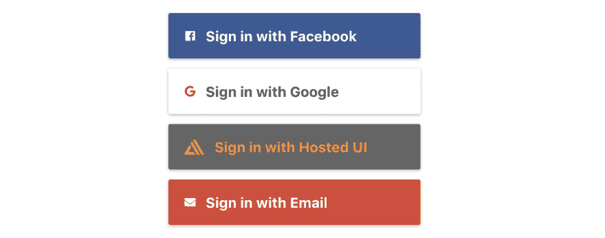
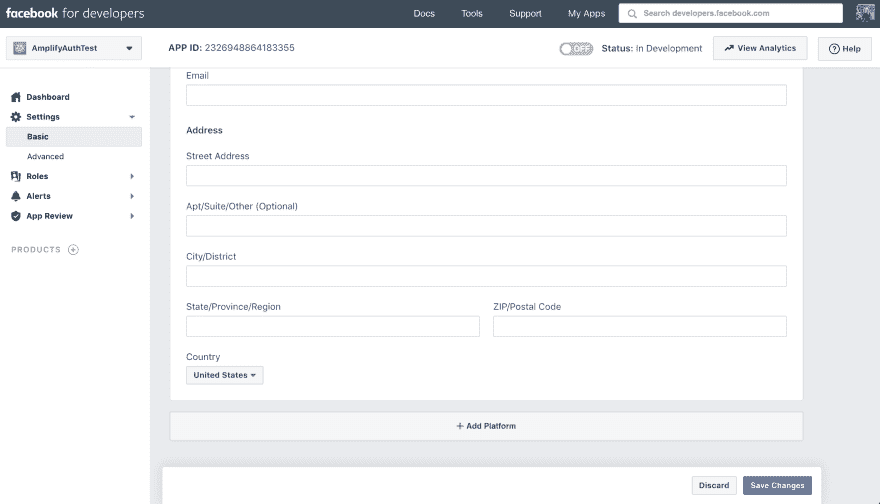
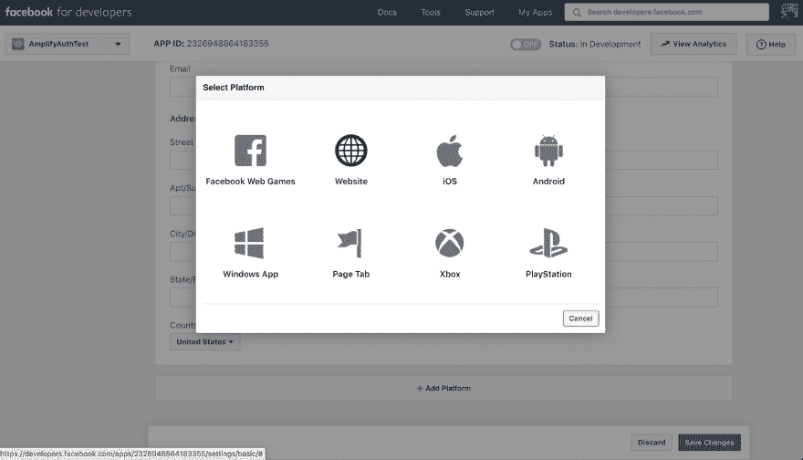
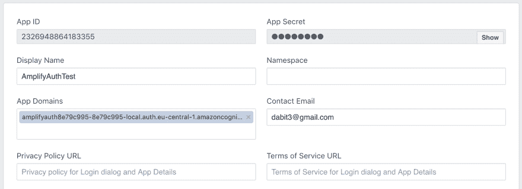
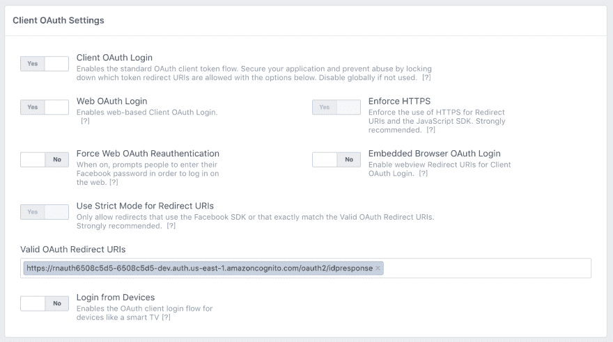
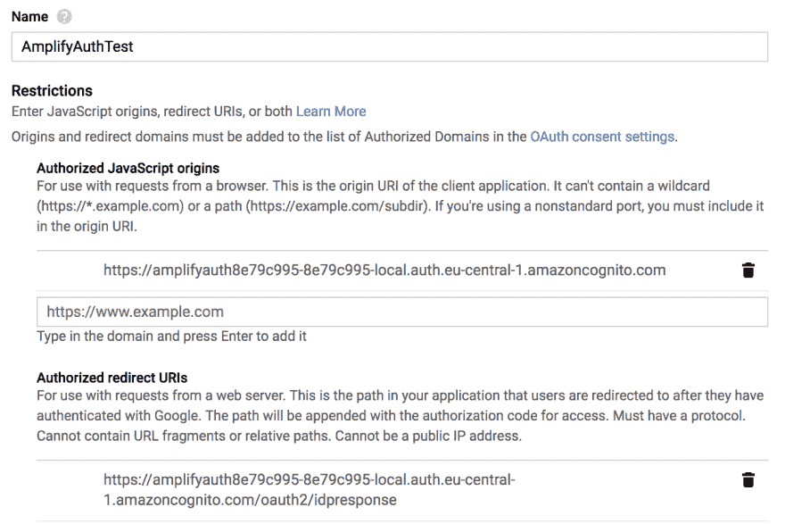

# 使用 Amplify 框架进行用户认证的完整指南

> 原文：<https://dev.to/dabit3/the-complete-guide-to-user-authentication-with-the-amplify-framework-2inh>

[](https://res.cloudinary.com/practicaldev/image/fetch/s--Q9azhUNg--/c_limit%2Cf_auto%2Cfl_progressive%2Cq_auto%2Cw_880/https://thepracticaldev.s3.amazonaws.com/i/cyt0msckucqfvbpw2d05.jpg)

AWS Amplify 身份验证模块为开发人员提供了身份验证 API 和构建模块，这些开发人员希望创建具有现实生产就绪用户身份验证的应用程序。

使用 Amplify，您可以整合基于用户名/密码的身份验证以及与脸书、谷歌或亚马逊的 OAuth。

[](https://res.cloudinary.com/practicaldev/image/fetch/s--QQ59cG6K--/c_limit%2Cf_auto%2Cfl_progressive%2Cq_auto%2Cw_880/https://thepracticaldev.s3.amazonaws.com/i/xujnbctap44h12ovju02.png)

我们还提供了一个预构建的“托管 UI ”,它提供了完整的 OAuth +用户名/密码流。

[](https://res.cloudinary.com/practicaldev/image/fetch/s--ybY0eKsh--/c_limit%2Cf_auto%2Cfl_progressive%2Cq_auto%2Cw_880/https://thepracticaldev.s3.amazonaws.com/i/ury12fn9kn33obfbahaw.png)

> 这篇文章涵盖了 web 应用程序的认证。关于 React Native 上的帖子，点击[这里](https://dev.to/dabit3/the-complete-react-native-guide-to-user-authentication-with-the-amplify-framework-ib2)。

## 亚马逊 Cognito 简介

Amplify 框架使用 [Amazon Cognito](https://aws.amazon.com/cognito/) 作为主要的认证提供者。Amazon Cognito User 是一个强大的用户目录服务，处理用户注册、认证、账户恢复&等操作。

扩大与 Cognito 的接口以存储用户数据，包括与其他 OpenID 提供商如脸书和谷歌的联盟。

Amplify CLI 自动执行这些 AWS 资源的访问控制策略，并通过 GraphQL 提供细粒度的访问控制，以保护 API 中的数据。

大多数现代应用程序需要多个身份验证选项，即脸书登录+用户名/密码登录。Amazon Cognito 允许使用一个用户注册中心跨多种身份验证类型对用户进行身份验证，从而简化了这个过程。

在本文中，您将了解如何使用 OAuth 以及用户名和密码登录向 React 应用程序添加身份验证。

# 入门

### 安装 Amplify CLI

要使用 Amplify 在您的应用程序中构建身份验证，您首先需要安装 AWS Amplify CLI。Amplify CLI 是一个命令行工具，允许您创建和部署各种 AWS 服务。

要安装 CLI，我们将运行以下命令:

```
npm install -g @aws-amplify/cli 
```

接下来，我们将使用 AWS 帐户中的用户配置 CLI:

```
amplify configure 
```

> 要观看配置 CLI 过程的视频演示，请单击此处的。

### 创建 React 项目

接下来，我们将创建我们将要使用的 React 应用程序:

```
npx create-react-app rn-amplify

cd rn-amplify 
```

现在，我们将安装 Amplify 库:

```
npm install aws-amplify 
```

### 创建放大项目

现在我们可以从 React 应用程序的根目录初始化一个新的 Amplify 项目:

```
amplify init 
```

在这里，我们将被引导完成一系列步骤:

*   输入项目名称: **amplifyauth** (或您喜欢的项目名称)
*   输入环境的名称: **local** (或您偏好的环境名称)
*   选择你的默认编辑器: **Visual Studio 代码**(或者你的文本编辑器)
*   选择你正在构建的应用类型: **javascript**
*   你用的是什么 javascript 框架: **react**
*   源目录路径: **src**
*   分发目录路径:**构建**
*   构建命令: **npm 运行-脚本构建**
*   开始命令: **npm 运行-脚本开始**
*   是否要使用 AWS 配置文件？ **Y**
*   请选择您想要使用的档案:**您的用户档案**

现在，我们的 Amplify 项目已经创建&我们可以继续下一步了。

# 创建我们的应用 id

在我们的应用中，我们将有三种类型的身份验证:

*   脸书(乌斯)
*   谷歌(OAuth)
*   认知(用户名+密码)

接下来，我们需要创建脸书和谷歌应用程序，以便为每个应用程序获取应用程序 ID 和应用程序机密。

关于设置的说明，点击[此处](https://aws-amplify.github.io/docs/js/cognito-hosted-ui-federated-identity#facebook-instructions)。

关于 **[谷歌](https://console.developers.google.com/apis/credentials)** 设置的说明，点击[此处](https://aws-amplify.github.io/docs/js/cognito-hosted-ui-federated-identity#google-sign-in-instructions)。

在你创建了脸书和谷歌 OAuth 证书后，继续下一步。

# 创建&配置认证服务

现在我们的 Amplify 项目已经初始化&我们有了来自脸书和谷歌的应用程序 id 和秘密，我们可以添加认证服务。为此，我们可以运行下面的命令:

```
amplify add auth

# run amplify update auth if you already have a project configured & want to now add Social login 
```

这将引导我们完成一系列步骤:

*   您想使用默认的身份验证和安全配置吗？**社交提供商(联盟)的默认配置**
*   您希望用户在使用您的 Cognito 用户池时如何登录？**用户名**
*   报名需要具备哪些属性？**电子邮件**
*   您希望我们为您创建什么域名前缀？**amplifyauthhxxxxxxxxx**(使用默认或创建自定义前缀)
*   输入您的重定向登录 URI:**[http://localhost:3000/](http://localhost:3000/)**(这可以在以后为生产环境更新)
*   是否要在 URI 添加另一个重定向登录: **N**
*   输入您的重定向注销 URI:**[http://localhost:3000/](http://localhost:3000/)**(这可以在以后针对生产环境进行更新)
*   是否要添加另一个重定向注销 URI: **N**
*   选择您想要为您的用户池配置的社交提供商:选择**脸书** & **谷歌**

> 在上面的步骤中，我们选择了社交提供者(联盟)的*默认配置。这将允许结合使用用户名/密码登录和 OAuth。如果你只想要用户名/密码，你可以选择*默认配置*或*手动配置*。*

最后，系统会提示您输入脸书和谷歌的应用 id 和密码，输入后按回车键继续。

现在已经成功配置了身份验证服务，我们可以通过运行以下命令来创建服务:

```
amplify push 
```

运行`amplify push`之后，您应该会看到一条成功消息&。**OAuth 端点**也应该被注销到控制台:

[](https://res.cloudinary.com/practicaldev/image/fetch/s--O-bOcZTt--/c_limit%2Cf_auto%2Cfl_progressive%2Cq_auto%2Cw_880/https://thepracticaldev.s3.amazonaws.com/i/mwtmnrmzt0534n01m02a.png)

OAuth 端点应该是这样的:

```
https://amplifyauth8e79c995-8e79c995-local.auth.eu-central-1.amazoncognito.com/ 
```

这个 OAuth 端点也可以在 **src/aws-exports.js** 中引用，如果你在`oauth` - > `domain`键下的任何点需要的话。

我们将需要使用这个端点来完成我们的脸书和谷歌 Oauth 提供商的配置。

## 配置脸书

接下来，打开我们之前创建的脸书应用&点击左侧菜单中的**基本**。

[](https://res.cloudinary.com/practicaldev/image/fetch/s--Wx5vi03E--/c_limit%2Cf_auto%2Cfl_progressive%2Cq_auto%2Cw_880/https://thepracticaldev.s3.amazonaws.com/i/lhnv5cmhie9wpkbpg1jv.png)

滚动到图书，点按“添加平台”,然后选取“网站”:

[](https://res.cloudinary.com/practicaldev/image/fetch/s--hTxujtXX--/c_limit%2Cf_auto%2Cfl_progressive%2Cq_auto%2Cw_880/https://thepracticaldev.s3.amazonaws.com/i/ql7oyizcxizminti0mle.png)

对于 _ 站点 URL)，输入 OAuth 端点 URL，并在站点 URL 中追加`/oauth2/idpresponse`:

[](https://res.cloudinary.com/practicaldev/image/fetch/s---vRU4jGj--/c_limit%2Cf_auto%2Cfl_progressive%2Cq_auto%2Cw_880/https://thepracticaldev.s3.amazonaws.com/i/thj18ote374ct839m7lw.png)

保存更改。

接下来，在应用程序域中键入 OAuth 端点:

[](https://res.cloudinary.com/practicaldev/image/fetch/s--qh3FH3-Q--/c_limit%2Cf_auto%2Cfl_progressive%2Cq_auto%2Cw_880/https://thepracticaldev.s3.amazonaws.com/i/oonjcdz1534yxos5rt5i.png)

保存更改。

接下来，从导航栏选择**产品**然后从脸书**设置**登录&选择**网页**。

对于**有效的 OAuth 重定向 URIs** ，使用 OAuth 端点+ `/oauth2/idpresponse`。如果提示您输入站点 URL，也使用此端点(即[https://amplifyauth8e 79 c 995-8e 79 c 995-local . auth . eu-central-1 . Amazon cognito . com/oauth 2/idpresponse):](https://amplifyauth8e79c995-8e79c995-local.auth.eu-central-1.amazoncognito.com/oauth2/idpresponse):)

[](https://res.cloudinary.com/practicaldev/image/fetch/s--1GnEmdaa--/c_limit%2Cf_auto%2Cfl_progressive%2Cq_auto%2Cw_880/https://thepracticaldev.s3.amazonaws.com/i/0utvmq3ddac35kp456kh.png)

保存更改。

点击页面顶部的开关上的**，确保你的应用程序*处于活动状态*。**

[](https://res.cloudinary.com/practicaldev/image/fetch/s--8l2bPiud--/c_limit%2Cf_auto%2Cfl_progressive%2Cq_auto%2Cw_880/https://thepracticaldev.s3.amazonaws.com/i/a3glwfwhbo1gijtf83k2.png)

## 配置谷歌

既然脸书已经配置好了，我们现在可以配置谷歌了。为此，让我们到[谷歌开发者控制台](https://console.developers.google.com/apis/credentials) &更新我们的 OAuth 客户端。

单击客户端 ID 以更新设置。

在**Authorized JavaScript origins**下，添加 OAuth 端点。

对于**授权重定向 URIs** ，在 URL 后添加 OAuth 端点`/oauth2/idpresponse`:

[](https://res.cloudinary.com/practicaldev/image/fetch/s--ld5ZQPru--/c_limit%2Cf_auto%2Cfl_progressive%2Cq_auto%2Cw_880/https://thepracticaldev.s3.amazonaws.com/i/u0wdz5dxteg27upjaqsx.png)

保存更改。

# 试探一下

现在，我们应该已经设置好了身份验证服务，并准备好了。让我们来测试一下。

最简单的方法是使用 AWS Amplify 的`Auth`类中的`Auth.federatedSignIn()`方法。该功能将呈现**托管的用户界面**，用户可以选择注册&使用脸书、谷歌或用户名/密码登录，而无需我们编写任何代码。

[](https://res.cloudinary.com/practicaldev/image/fetch/s--ybY0eKsh--/c_limit%2Cf_auto%2Cfl_progressive%2Cq_auto%2Cw_880/https://thepracticaldev.s3.amazonaws.com/i/ury12fn9kn33obfbahaw.png)

为了验证这一点，让我们首先配置 React 应用程序来识别我们的 Amplify 项目。我们通过在最后一次导入 **src/index.js** :
中添加以下代码来实现这一点

```
// src/index.js

import Amplify from 'aws-amplify'
import config from './aws-exports'
Amplify.configure(config) 
```

接下来，打开 App.js 并更新代码如下:

```
// src/App.js

import React from 'react'
import logo from './logo.svg'
import './App.css'

import { Auth } from 'aws-amplify'

function App(props) {
  return (
    <div className="App">
      <header className="App-header">
        
        <p>
          Edit <code>src/App.js</code> and save to reload.
        </p>
        <button onClick={() => Auth.federatedSignIn()}>Sign In</button>
      </header>
    </div>
  )
}

export default App 
```

现在，运行应用程序:

```
npm start 
```

现在，当应用程序启动时，我们应该能够使用登录按钮登录！

## 添加更多功能

现在我们已经添加了一种简单的登录方式，接下来的步骤是什么？我们将完成以下内容:

1.  了解如何注销用户并检查当前登录的用户
2.  为 OAuth 提供者添加自定义按钮
3.  如何添加自定义表单的用户名/密码登录与一个例子
4.  监听身份验证更改(身份验证事件发生时触发)

### 如何签出用户&查看当前已签入用户

现在我们已经有用户登录了，我们如何知道他们确实登录了呢？我们可以使用 Amplify 的`Auth`类随时检查当前登录用户的状态。

让我们将代码更新如下，这样我们就可以添加一个**登出**按钮以及一个检查当前登录用户状态的按钮:

```
// src/App.js

import React from 'react'
import logo from './logo.svg'
import './App.css'

import { Auth } from 'aws-amplify'

function checkUser() {
  Auth.currentAuthenticatedUser()
    .then(user => console.log({ user }))
    .catch(err => console.log(err))
}

function signOut() {
  Auth.signOut()
    .then(data => console.log(data))
    .catch(err => console.log(err))
}

function App(props) {
  return (
    <div className="App">
      <header className="App-header">
        
        <p>
          Edit <code>src/App.js</code> and save to reload.
        </p>
        <button onClick={() => Auth.federatedSignIn()}>Sign In</button>
        <button onClick={checkUser}>Check User</button>
        <button onClick={signOut}>Sign Out</button>
      </header>
    </div>
  )
}

export default App 
```

现在，当我们运行我们的应用程序时，我们可以注销当前登录用户的信息，也可以注销用户。

### 为 OAuth 提供者添加自定义按钮

如果我们不想使用托管 UI &想从头开始创建我们自己的 UI，该怎么办？我们可以很容易地做到这一点。`Auth`类也有一些我们可以用来直接调用 OAuth 提供者的方法:

```
Auth.federatedSignIn({provider: 'Google'})
Auth.federatedSignIn({provider: 'Facebook'}) 
```

让我们更新我们的应用程序，让它有几个定制的 OAuth 按钮:

```
<button
  onClick={() => Auth.federatedSignIn({provider: 'Facebook'})}
>Sign In with Facebook</button> 
<button
  onClick={() => Auth.federatedSignIn({provider: 'Google'})}
>Sign In with Google</button> 
```

现在，我们已经创建了一个自定义按钮，用于登录我们的 OAuth 提供者。

如果你对这个和代码的现场演示感兴趣，请查看 [amplifyauth.dev](https://www.amplifyauth.dev/) &在 GitHub [查看代码这里](https://github.com/dabit3/amplify-auth-demo)。

### 添加用户名/密码登录的自定义表单

如果我们还想创建一个自定义表单供用户登录呢？我们可以通过 Auth 类使用现有配置来实现这一点。

Auth 类有 30 多种方法可用于管理所有身份验证任务的用户，如注册用户、登录用户、处理 MFA，以及一般用户管理附带的所有功能。(查看 AuthClass API [此处](https://aws-amplify.github.io/amplify-js/api/classes/authclass.html))。

要使用我们现有的设置开始定制表单，您可以使用以下方法来注册用户、确认注册(MFA)和注册用户:

```
// sign user up
Auth.signUp({
  username: someUsername, password: somePassword, attributes: { email: someEmail }
})

// confirm sign up
Auth.confirmSignUp(someUsername, authenticationCode)

// sign user in
Auth.signIn(someUsername, somePassword) 
```

这些方法是异步的&返回承诺，因此您可以检查它们是否成功。

要使用此流程查看定制表单，请签出[这个](https://github.com/dabit3/amplify-auth-demo/blob/master/src/Form.js)文件。

如果你对这个和代码的现场演示感兴趣，请查看 [amplifyauth.dev](https://www.amplifyauth.dev/) &在 GitHub [查看代码这里](https://github.com/dabit3/amplify-auth-demo)。

您还可以查看[这个 repo](https://github.com/aws-samples/aws-amplify-auth-starters) 在不同框架中的端到端示例，以及使用自定义身份验证流的受保护路由。

### 监听认证事件

现在我们已经有了用户登录和注销，如果我们想基于这个登录状态执行某种类型的操作呢？使用 Amplify 库，我们可以很容易地监听所有认证更改。

我们将为此使用的类是 [Hub](https://aws-amplify.github.io/docs/js/hub) 。

让我们创建一个监听所有授权事件并将其注销的监听器:

```
// src/App.js

// import useEffect hook
import React, { useEffect } from 'react';
import logo from './logo.svg';
import './App.css';

// import Hub
import { Auth, Hub } from 'aws-amplify'

function checkUser() {
  Auth.currentAuthenticatedUser()
    .then(user => console.log({ user }))
    .catch(err => console.log(err));
}

function signOut() {
  Auth.signOut()
    .then(data => console.log(data))
    .catch(err => console.log(err));
}

function App(props) {
  // in useEffect, we create the listener
  useEffect(() => {
    Hub.listen('auth', (data) => {
      const { payload } = data
      console.log('A new auth event has happened: ', data)
       if (payload.event === 'signIn') {
         console.log('a user has signed in!')
       }
       if (payload.event === 'signOut') {
         console.log('a user has signed out!')
       }
    })
  }, [])
  return (
    <div className="App">
      <header className="App-header">
        
        <p>
          Edit <code>src/App.js</code> and save to reload.
        </p>
        <button onClick={() => Auth.federatedSignIn()}>Sign In</button>
        <button onClick={checkUser}>Check User</button>
        <button onClick={signOut}>Sign Out</button>
        <button onClick={() => Auth.federatedSignIn({provider: 'Facebook'})}>Sign In with Facebook</button>
        <button onClick={() => Auth.federatedSignIn({provider: 'Google'})}>Sign In with Google</button> 
      </header>
    </div>
  );
}

export default App 
```

现在，每当用户执行任何身份验证事件时，身份验证数据都会被记录到控制台。

# 下一步

既然你已经为你的应用添加了身份验证，你可以开始用 GraphQL 或 AWS Lamba 为你的应用添加安全的后端和 API。要了解更多信息，请点击此处的。

如果你想使用 Amplify 控制台托管你的应用程序，请点击[此处](https://console.aws.amazon.com/amplify/home?#/create)或查看[此](https://www.youtube.com/watch?v=DHLZAzdT44Y)视频了解如何操作。

> 我的名字是纳德·达比特。我是亚马逊网络服务的一名开发者倡导者，负责像 [AWS AppSync](https://aws.amazon.com/appsync/) 和 [AWS Amplify](https://aws-amplify.github.io/) 这样的项目。我专门从事跨平台&云应用开发。