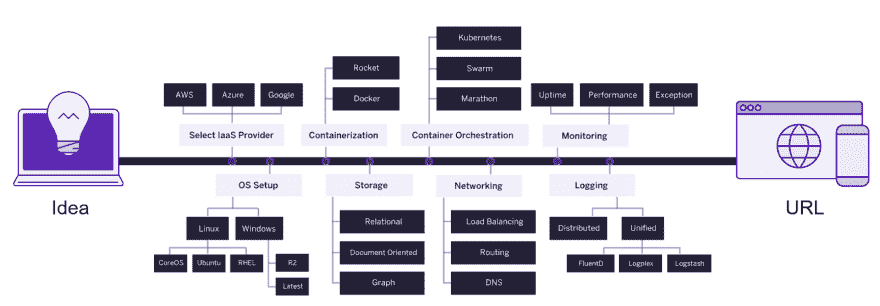
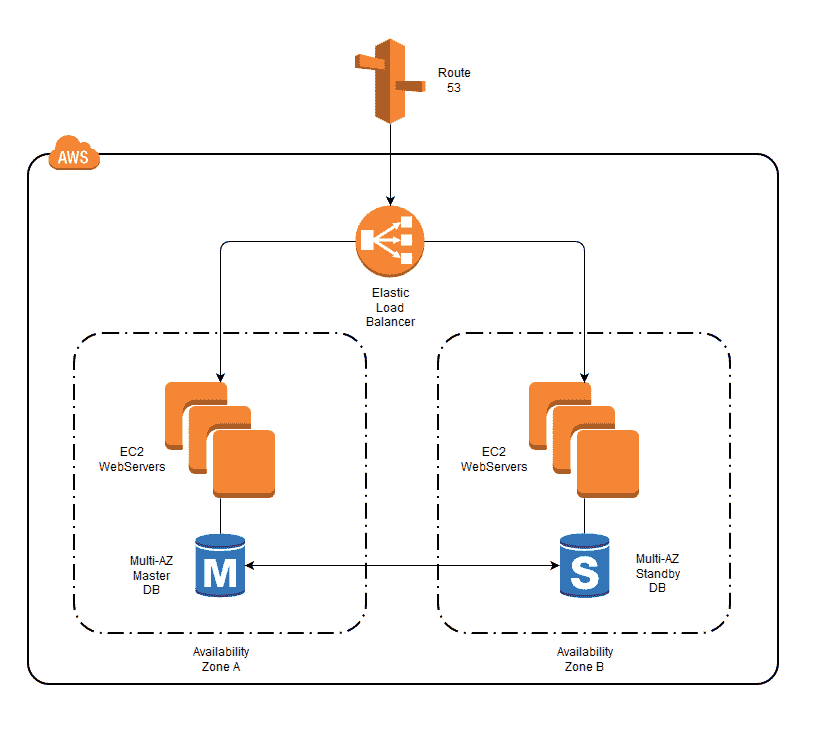
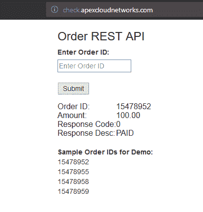
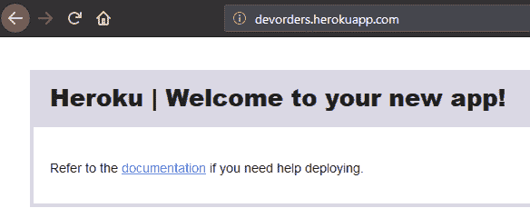
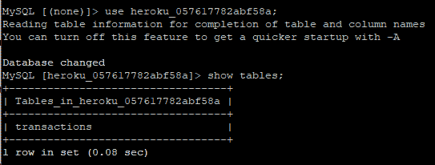
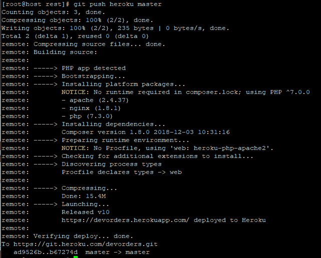
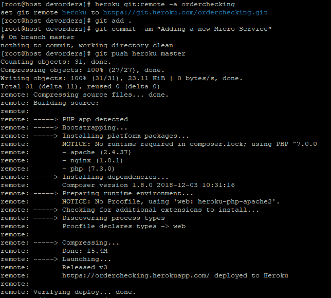
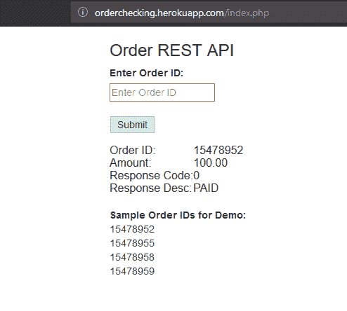
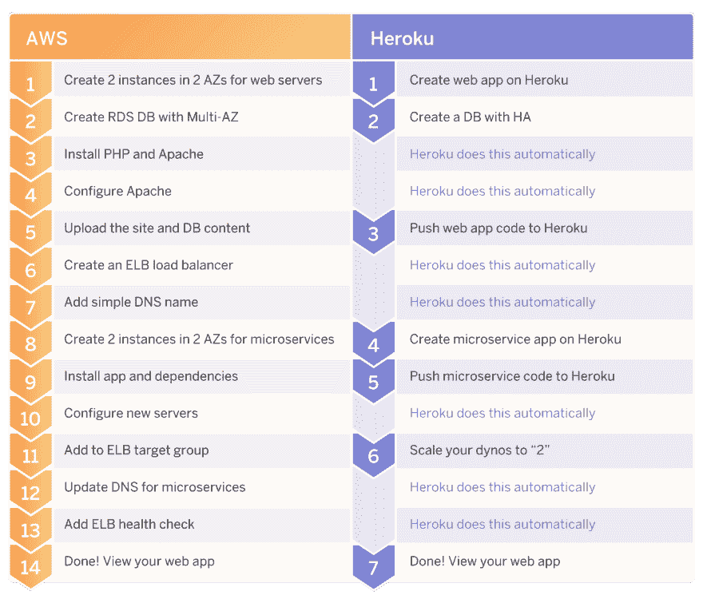

# 运行微服务最简单的方法:比较 AWS 和 Heroku

> 原文：<https://dev.to/heroku/the-easiest-way-to-run-microservices-comparing-aws-and-heroku-295n>

这可能是老生常谈，但表现最好的公司是那些执行最快并提供最佳客户体验的公司。对于开发人员来说，这意味着简化他们的日常工作流程，以便他们可以更快地发布功能。在现代微服务的世界中，开发人员可以提高速度，因为他们将复杂的整体分解成更小、更易管理的服务。然而，运行微服务架构也不是一件容易的事情。当您运行越来越多的服务时，您需要一种方法来快速让它们运行并持续推送更新。

运行任何一种在线服务的最流行的平台之一是 AWS。虽然这是许多公司的标准选择，但它与其他选择相比如何呢？虽然其他人已经写了 AWS 和 Heroku 的高级比较，但让我们看看一个真实世界的例子，看看要让微服务在两者上运行需要付出多少努力。让我们看看在两个平台上安装相同的应用程序所需的确切步骤，这样我们就可以知道哪个是最容易的。

## 部署高可用性微服务的复杂性

从一个想法到一个 URL 需要很多步骤，特别是如果你想让你的服务自动伸缩和容错的话。设置服务器和数据库只是您需要配置的第一层。在具有容错功能的部署中，确保您的服务器配置相同并且数据库跨区域同步是一项挑战。由于可能的合规性要求，您需要为 VPC 配置特定的子网或设置路由组。用户认证和密钥管理也是另一个需要经常维护的组件。然后是 DNS 管理、自动扩展、故障转移配置、操作系统配置、日志记录和监控，所有这些都需要在典型的 EC2 环境中设置。下面管道中列出的所有组件都需要配置和不断维护。您可以看到在大型环境中这是如何迅速失控的。

[](https://res.cloudinary.com/practicaldev/image/fetch/s--HuNl-x1r--/c_limit%2Cf_auto%2Cfl_progressive%2Cq_auto%2Cw_880/https://thepracticaldev.s3.amazonaws.com/i/ggca31s6g5apdc4g2mx2.png)

## 测试用例

我们将比较在 AWS EC2 和 Heroku 上设置服务所涉及的步骤，这样您就可以看到哪一个将为您节省最多的时间。如果你以前没有听说过 Heroku，它是一个运行 web 应用程序或 web 服务的平台。您可以将其视为构建在 AWS 之上的一个层，旨在简化 web 应用程序的部署、操作和迭代。它们也是相互兼容的，所以你可以有一个混合的环境，一些服务在 Heroku 上运行，另一些在 EC2 上运行。

为了进行公平的比较，我们创建了一个简单的应用程序，并将它部署在两个平台上。它允许您提交订单进行处理，它使用一个简单的文本表单并显示已提交订单的列表。

[](https://res.cloudinary.com/practicaldev/image/fetch/s--T-cC5LIe--/c_limit%2Cf_auto%2Cfl_progressive%2Cq_auto%2Cw_880/https://thepracticaldev.s3.amazonaws.com/i/lnwxxgbvh2f02t4jg0zy.png)

我们将使用 LAMP 架构，因为它对于许多具有 web 前端和数据库的应用程序来说是常见的。我们还将添加一个后端服务来展示微服务的部署过程。服务器将使用来自同一个 [GitHub 库](https://github.com/verumnetworks/order_api/archive/master.zip)的代码。我们将使用两个平台的特性来实现一个具有容错性和可伸缩性的解决方案。服务和数据库应该能够抵御故障和停机。这在每个平台上都有不同的实现，所以您将看到它们是如何进行比较的。

## 在 AWS 上设置服务的步骤

如果您以前在 AWS 上部署过具有高可用性的应用程序，那么这个设置可能对您来说很熟悉。我们将提供比较步骤的概述。AWS 中的环境将需要几个组件，并将从在默认的 VPC 中创建两个 AWS EC2 实例开始，这两个实例位于不同的可用性区域内。流量将使用带有弹性负载平衡器的路由 53 分配给每个可用性区域中的第一个可用实例。多 AZ MySQL 主数据库将支持应用程序的后端，在单独的可用性区域中有一个活动的故障转移备用实例。我们在下面包含了一个简单微服务应用程序的拓扑结构。

[](https://res.cloudinary.com/practicaldev/image/fetch/s--3V6-DZsM--/c_limit%2Cf_auto%2Cfl_progressive%2Cq_auto%2Cw_880/https://thepracticaldev.s3.amazonaws.com/i/ik6m7l94f7fqn70uo9q1.png)

首先，我们将部署允许我们接受一些订单的 PHP 应用程序，然后我们将提供一个独立的订单状态检查微服务。我们将从默认的 VPC 和子网开始。开箱即用，Amazon Linux EC2 实例将以最少的配置支持 PHP 应用程序。

为了简洁起见，我们将提供必要步骤的概述。每个步骤都包含许多子步骤，如果您需要更多关于如何执行这些步骤的详细信息，我们还提供了 AWS 文档的链接。如果您是 AWS 的专家，您可能已经多次执行过类似的步骤。

**步骤 1** :创建前两个微型 [AWS Linux 实例](https://docs.aws.amazon.com/efs/latest/ug/gs-step-one-create-ec2-resources.html)，每个可用性区域一个。这些服务器将托管订单处理服务的主要 UI。

**第二步**:新建一个 [RDS MySQL 数据库](https://docs.aws.amazon.com/AmazonRDS/latest/UserGuide/CHAP_Tutorials.WebServerDB.CreateDBInstance.html)。指定这将是公共的多 AZ 部署。

**步骤 3** :现在我们已经运行了 Linux 和 MySQL 实例，让我们连接 EC2 实例并开始安装相关软件，如 [PHP](https://www.tecmint.com/install-php-7-in-centos-7/) 和 [Apache](https://www.liquidweb.com/kb/how-to-install-apache-on-centos-7/) 。

**第四步**:启用 Apache 内的 [mod_rewrite 模块](https://linuxadmin.io/mod_rewrite-apache-centos/)。这将允许应用程序在以后创建调用 REST URL 时拥有干净的 URL。

### 设置 API

第五步:现在我们可以将网站内容上传到每台服务器的 web 目录中，开始开发。从我们的[演示应用 GitHub 库](https://github.com/verumnetworks/order_api/archive/master.zip)上传站点文件。

api.php 文件将提供允许我们从 UI 查询后端数据库的接口。db.php 文件将直接连接到 RDS 数据库。确保使用在您之前创建的 RDS 数据库之后保存的端点 URL。为了验证，首先我们可以用下面的 MySQL 命令向数据库中插入一些虚拟数据:

```
INSERT INTO `transactions` (`id`, `order_id`, `amount`, `response_code`, `response_desc`) VALUES
(1, 15478952, 100.00, 0, 'PAID'),
(2, 15478955, 10.00, 0, 'PAID'),
(3, 15478958, 50.00, 1, 'FAILED'),
(4, 15478959, 60.00, 0, 'PAID'); 
```

该命令将在数据库中创建四个订单条目，订单状态为已支付或失败。现在数据库中有数据了，我们需要测试前端 UI 来确认对数据库的查询是成功的。

**步骤 6** :在我们可以检查之前，我们需要创建一个负载平衡器，并将每台服务器添加到特定可用性区域下的目标组中。

**步骤 7** :导航至 53 号公路，为您的领域创建 A 记录。在这种情况下，将使用 order.apexcloudnetworks.com。然后，选择弹性负载平衡器作为值，选择故障转移作为路由策略。

当 A 记录完成时，您现在可以导航到主前端 URL 来查询订单的 API。要查询 API，请按以下格式输入 URL 请求:

```
http://order.domain.com/api.php?order_id=15478958 
```

然后，您可以看到 API 返回的响应，包括订单 ID、金额和状态:

[](https://res.cloudinary.com/practicaldev/image/fetch/s--wnh9FMl4--/c_limit%2Cf_auto%2Cfl_progressive%2Cq_auto%2Cw_880/https://thepracticaldev.s3.amazonaws.com/i/6weyralbmrvuctzg68kh.png)

至此，您已经有了一个完整的应用程序。负载平衡器在两个独立的可用性区域内的多台服务器之间路由请求。如果服务器或可用性区域出现故障，它将由备用区域中的相同服务器和数据库进行备份。

### 构建微服务

现在，我们将添加一个独立的微服务来检查订单状态。微服务将使我们的开发团队能够简化应用开发并消除依赖性。

**步骤 8** :要开始构建微服务，首先在相同的默认 VPC 中提供相同的 EC2 Linux 实例，每个可用性区域一个。

**步骤 9** :在新的 EC2 实例上，一定要安装相同的依赖包。

**第十步**:上传相同。htaccess，index.php，api.php 和 db.php 文件到新的服务器。

**步骤 11** :将两台新服务器添加到负载均衡器目标组。添加服务器后，我们可以为微服务 API 设置一个新的 URL。

**步骤 12** :从 Route 53 开始，将新的检查域指向在步骤 6 中创建的负载平衡器。确保将路由策略设置为故障转移。

**步骤 13** :导航到检查域，验证 API 成功查询读取副本数据库，并返回记录。

[](https://res.cloudinary.com/practicaldev/image/fetch/s--4qacEy9J--/c_limit%2Cf_auto%2Cfl_progressive%2Cq_auto%2Cw_880/https://thepracticaldev.s3.amazonaws.com/i/rotw2nkymlla3cpvhqnj.png)

随着 API 检查的成功，我们可以完成构建一个微服务用户界面，使检查订单变得更加容易。在步骤 4 中从 repo 下载的 index.php 文件将创建一个 HTML 表单，该表单将在只读数据库中查询订单状态。的。htaccess 文件将允许 Apache mod_rewrite(您之前启用的)在从微服务 UI 进行搜索时显示干净的 URL。

**步骤 14** :导航到检查 URL，您将看到更新后的 HTML 表单。输入一个样本搜索 id 以查询订单状态:

[](https://res.cloudinary.com/practicaldev/image/fetch/s--DpqVUhNv--/c_limit%2Cf_auto%2Cfl_progressive%2Cq_auto%2Cw_880/https://thepracticaldev.s3.amazonaws.com/i/fsgln4u03n7r8v7kc7sx.png)

现在，您有了一个独立的微服务，也可以从添加到环境中的任何其他服务中调用它。此外，您还提高了可用性和冗余性。即使您关闭了主服务器或主数据库，第二台服务器仍将保持在线，并将继续为客户的订单状态请求提供服务。

我们知道这个过程包括多个步骤。除了使用像 CloudFormation 这样的自动化配置管理解决方案(也需要额外的工作来配置)之外，在 AWS 上没有简单的方法可以绕过这些步骤。久而久之，就变成了例行的杂务工作。

## 在 Heroku 上设置服务的步骤

现在让我们比较一下使用 Heroku 创建同一个系统需要多少步骤。

**步骤 1** :我们将使用上面相同的 PHP 应用程序在 Heroku 上进行部署。创建一个新的 Heroku 账户，按照 [PHP 入门指南](https://devcenter.heroku.com/articles/getting-started-with-php#set-up)设置 CLI。仍然在现有的应用程序代码目录中，使用以下命令创建 Heroku 应用程序:

```
heroku create devorders 
```

查看 Heroku 创建的 URL。您将看到为您创建的默认应用程序。哇！这只是一个命令，我们有一个基本的服务器在运行！很酷，对吧？

[](https://res.cloudinary.com/practicaldev/image/fetch/s--3y8Lr2DY--/c_limit%2Cf_auto%2Cfl_progressive%2Cq_auto%2Cw_880/https://thepracticaldev.s3.amazonaws.com/i/wlez1hkd5gxwe9dv34xu.png)

### 设置数据库

**步骤 2** :要提供数据库，您需要使用 Heroku 的 ClearDB MySQL 插件。使用下面的命令提供一个共享的 MySQL 实例:

```
heroku addons:create cleardb:ignite 
```

Heroku 的附加合作伙伴之一 ClearDB 将在单独的可用性区域中自动创建一个多实例数据库集群，以保证数据可用性。现在用下面的命令获得数据库连接的细节:

```
heroku config | grep CLEARDB_DATABASE_URL 
```

使用从上面的命令中获得的连接细节，导入应用程序中包含的事务 SQL 文件。登录数据库，确认表已经创建。

[](https://res.cloudinary.com/practicaldev/image/fetch/s--RLl57Xnb--/c_limit%2Cf_auto%2Cfl_progressive%2Cq_auto%2Cw_880/https://thepracticaldev.s3.amazonaws.com/i/p550nkmcdwsjhg9n5y6b.png)

### 提交代码

**步骤 3** :用应用程序 URL 更新 api.php 文件，并用下面的代码替换 db.php 的内容:

```
 <?php
$url = parse_url(getenv("CLEARDB_DATABASE_URL"));

$server = $url["host"];
$username = $url["user"];
$password = $url["pass"];
$db = substr($url["path"], 1);

$conn = new mysqli($server, $username, $password, $db);
?> 
```

您不需要在这个配置文件中硬编码任何用户名或密码。Heroku 将这些数据存储在`CLEARDB_DATABASE_URL`环境变量中。

**步骤 4** :此时，您已经准备好使用下面的命令提交代码:

```
git push heroku master 
```

[](https://res.cloudinary.com/practicaldev/image/fetch/s--9_78E_Qr--/c_limit%2Cf_auto%2Cfl_progressive%2Cq_auto%2Cw_880/https://thepracticaldev.s3.amazonaws.com/i/to8oks7b80uownl68kvl.png)

导航到已创建的 devorders.herokuapp.com URL，以验证应用程序已成功发布。您可以看到，我们成功地连接到数据库，从 API 调用中检索数据。

好了，现在我们的前端正在运行。您会注意到我们没有配置任何 DNS 或 VPC 设置，也没有手动上传任何代码到服务器。Heroku 为我们自动化了这些步骤。

[](https://res.cloudinary.com/practicaldev/image/fetch/s--rjCAoDca--/c_limit%2Cf_auto%2Cfl_progressive%2Cq_auto%2Cw_880/https://thepracticaldev.s3.amazonaws.com/i/rzznegelkzxqw8z4icpe.png)

### 创建微服务

**步骤 5** :要创建微服务，只需用下面的命令创建一个新的应用程序:

```
heroku create orderchecking 
```

**第六步**:接下来，`clone`现有的应用程序存储库，`cd`到新的目录。

[](https://res.cloudinary.com/practicaldev/image/fetch/s--486HYXOB--/c_limit%2Cf_auto%2Cfl_progressive%2Cq_auto%2Cw_880/https://thepracticaldev.s3.amazonaws.com/i/colajof0x72tajttk0s8.png)

**步骤 7** :在克隆的应用程序目录中，将存储库设置为`orderchecking` repo，并使用以下命令部署代码:

```
heroku git:remote -a orderchecking
git add .
git commit -am "Adding a new Micro Service"
git push heroku master 
```

[](https://res.cloudinary.com/practicaldev/image/fetch/s--Pjw5Y6Pq--/c_limit%2Cf_auto%2Cfl_progressive%2Cq_auto%2Cw_880/https://thepracticaldev.s3.amazonaws.com/i/bm1wb4qj7csexvfdgv98.png)

导航至微服务 URL orderchecking.herokuapp.com/index.php，从用户界面检查订单状态。

[](https://res.cloudinary.com/practicaldev/image/fetch/s--boRdcMVc--/c_limit%2Cf_auto%2Cfl_progressive%2Cq_auto%2Cw_880/https://thepracticaldev.s3.amazonaws.com/i/8xrzrdle97w9zoabz14l.png)

您可以看到，我们可以成功地连接到订单数据库，并调用 API 来检查客户订单状态。Heroku 提供了一个独立的服务，可以独立调用 MySQL 数据库集群。开发人员还可以在这个应用程序上工作，并在不影响生产主分支的情况下进行更改。

现在是真正的魔术！您可以简单地用一个命令来扩展应用程序:

```
heroku ps:scale web=2 
```

“2”表示您希望在其上运行应用程序的 dynos(服务器实例)的数量；无需配置新服务器、配置自动扩展组或负载平衡器。所有应用程序流量自动平均分布在所有正在运行的实例中。

## 结论

[](https://res.cloudinary.com/practicaldev/image/fetch/s--OShgw9tR--/c_limit%2Cf_auto%2Cfl_progressive%2Cq_auto%2Cw_880/https://thepracticaldev.s3.amazonaws.com/i/cxc3a3kzj3a6ii9gahup.png)

您可以看到，与手动 AWS 部署相比，使用 Heroku，我们减少了大约一半的步骤。此外，提供 Heroku 环境所需的步骤通常是一行命令，而 AWS 需要多个命令或配置。在 Heroku 上，VPC 配置和网络管理，以及将代码部署到服务器的过程都已经为您完成了。我们没有展示它，但是通过一个命令，您也可以部署到世界上的多个地区，或者安装[数百个插件](https://elements.heroku.com/addons)，用于监控、缓存等服务。

另一方面，AWS 确实提供了 Heroku 没有的一系列服务，如数据仓库、S3 存储和人工智能。此外，您可能已经有团队在使用 AWS，您需要一种方法来安全地与这些服务对话。由于 Heroku 运行在 AWS 上，你可以通过 [VPC 对等](https://devcenter.heroku.com/articles/private-space-peering)安全地连接到 AWS 中的服务。这使您的团队能够灵活地利用这两个平台的优势。

当比较在 AWS 和 Heroku 上运行微服务时，我们可以考虑更多的利弊。实际上，这取决于你和你的团队优先考虑什么。什么利弊对你来说最重要？为什么？

要了解更多信息，请查看 Heroku 的 Dreamforce 演示文稿,观看一个精彩的分步视频，该视频概述了部署高度可用和安全的多区域微服务。正如您所看到的，考虑一下自己在 AWS 上实现同样的功能需要多少时间。