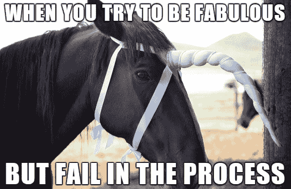

# 伪敏捷

> 原文：<https://dev.to/jmir17/the-fake-agile-388c>

假敏捷:当你说你是敏捷的，因为你“使用”scrum，但实际上你根本不是敏捷的。

[](https://res.cloudinary.com/practicaldev/image/fetch/s--tubLu3Rb--/c_limit%2Cf_auto%2Cfl_progressive%2Cq_auto%2Cw_880/https://cdn-images-1.medium.com/max/1600/1%2Aq0q20KOEInagYwpL46fTTw.png)

**问题的起源**
自从所有这些敏捷框架出现以来:scrum、看板、精益……许多公司喜欢它们，并试图将它们应用到自己的业务中，因为它们理解它们的原则和目标，并且实施起来有意义。

不久之后，他们想要获得认证，所以他们派他们的经理去参加一个为期两天的课程，开始在公司“实践”敏捷。问题是所有这些经理都来自企业，他们在这个过程中跳过了所有的软件技术实践。他们只关注 scrum 原则。

敏捷是为训练有素的软件专业人员创造的，用来弥合业务和技术之间的鸿沟，但结果是(在大多数情况下)它没有发生。

**了解问题的后果**
当你与这些人交谈时，许多人说他们“做”得敏捷，但那句话在英语中没有任何意义。敏捷不是你做的事情，而是你是或者不是的事情。在这个具体的例子中，它指的是敏捷地适应变化。

敏捷就是拥有短而快的反馈循环。这个反馈让你在整个项目生命周期中不断地反应和适应。敏捷不解决问题，敏捷暴露问题。指出问题所在，然后由您决定是否采取措施。

管理者通常不太欣赏开发者，但是他们没有意识到他们是他们的人质。在一个软件项目中，业务的节奏是由开发人员决定的，而不是由业务决定的。业务只能跟开发人员走得一样快，业务被软件困住了。

另一方面，开发人员应该开发软件，让企业能够自由地改变和发展。软件必须是敏捷的、可快速交付的，因此当业务发生变化时，软件可以快速适应。如果这没有发生，是开发人员的错，因为他们没有让业务变得敏捷。这些情况总是意味着金钱的损失，但在某些情况下，甚至可能是一个公司的结束。软件应该能够随着业务需求的变化而变化。

症状
当你的软件很脆弱，不稳定，甚至有一些已知的错误时，你可以告诉你你的公司有问题。当一个软件因为高度耦合或难以理解而难以更改和维护时。它需要几个月的时间来测试，并且永远无法部署。当一次又一次的迭代时，由于技术债务，软件变得越来越难操作…如果你有这些症状，也许你没有那么敏捷。软件中的任何变化都应该能够在几个小时(如果不是几分钟的话)内部署到生产中，确保一切正常工作。

软件开发是一个迭代和增量的过程，敏捷为您提供了一种在整个生命周期中收集反馈的方法，以便在为时已晚之前持续改进您的软件。如果你在每次迭代后都没有收集到任何反馈，那么你在敏捷的最基本概念上就失败了。

当你改变了方法，但是你仍然有和以前一样的问题，那是因为你用错误的方式生产软件。它发生了，你认为你做得很好，但在正确的时刻，你意识到一切都是一团糟。在一个软件项目中，最重要的可交付成果是软件本身，最终使用哪种方法或过程并不重要。

真实敏捷
纪律和技术实践是让整个敏捷过程正常运行的粘合剂。目前，该行业缺乏纪律性和专业性。许多开发人员只是提交他们的代码，他们不会走得更远。他们应该每天问自己:“我怎样才能改进这个系统？”然后简单地去做。给软件带来质量和卓越。质疑一切，适当地收集需求，并确保最终所有需求都得到满足，就像任何其他领域的任何其他专业人员一样。

敏捷软件需要纪律和良好的实践，有成千上万的资源可以获得关于它们的信息，但是要开始，这里有一个非常短的列表:

```
 Disciplines                       Technical practices
    ==============================       ==============================
     - Work in fixed time boxes            - Test Driven Development (TDD)
     - Estimate in relative units          - Refactoring
     - Customer communication              - Automated Tests
     - Continuous integration              - Simple design
     - Team Collaboration                  - Pair programming
     - And more                            - And many more 
```

Enter fullscreen mode Exit fullscreen mode

作为软件工程师，我们必须承担将好的实践引入软件开发的风险，我们不能将决策委托给企业，因为他们不了解问题，所以他们不能正确地评估风险。作为优秀的专业人士，我们必须做出技术决策，并决定何时在承担风险的事情上投入时间或资金，因为这是优秀专业人士的工作。

掌握好的实践并不容易，它需要一些时间，但就像掌握生活中的其他事情一样。耐心点，继续工作。使用好的实践不足以保证成功，但是缺乏好的实践通常是失败的主要原因。