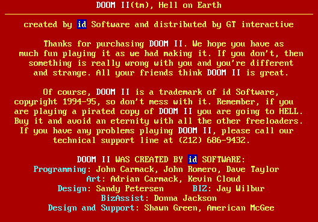

# TDD、Composer、Laravel 和软件包开发的挫折

> 原文：<https://dev.to/joshbruce/the-frustrations-of-tdd-composer-laravel-and-package-development-21n8>

(我很确定推特爆炸了。)

在过去的几个星期里，我想——有点忘了时间——我一直在发布一些日常帖子，描述重新开发 8fold 平台的冒险经历，这个平台被亲切地称为 Amos，从现在开始我将简称为 AMOS。

如果你好奇的话，不要太在意 recaps，看看这个线程。

今天对我来说是最后一根稻草，我试图以我认为最有益的方式做事，并尽可能严格地遵守各种原则:

1.  总的来说，TDD 公平地重构了贾维尔·特雷维尼奥·萨尔达娜，因为我注意不到任何细微差别的丢失。
2.  利用你所拥有的，直到你不能。
3.  包应该是独立可测试的，即使是在 monorepo 中。

最后一个是我今天打破的地方，它有点波及到其他人。

Composer 对于 PHP 就像 NPM 对于 JavaScript 一样。`vendor`目录相当于`node_modules`文件夹。Composer 提供了一种叫做自动加载的功能。这有助于 PHP 通过伏都教的方式找到你的应用程序正在寻找的东西，除了它与供应商文件夹中存储的*文件`autoload.php`有关之外，我没有深入探讨。这很重要，因为引用是相对于运行`$ composer dumpautoload`时 composer 文件所在的*。**

我的单回购结构看起来像这样:

```
/8fold
    /AMOS
    /CoreCharon
    /AppIdeasmith
    /Laravel
    /vendor
    composer.json
    phpunit.xml 
```

前三个文件夹在技术上是包，Laravel 服务，稍后将被注入服务容器。这个`Laravel`文件夹中存放着[的拉里韦尔](https://laravel.com)。供应商文件夹是所有已安装的软件包所在的位置。`composer.json`文件类似于节点的`package.json`文件。`phpunit.xml`文件是 PHPUnit 的配置，PHPUnit 是 PHP 的实际测试包(看，PHP 确实有一些好东西)。

这就是有趣的地方。

```
/8fold
    /AMOS
        composer.json
        phpunit.xml
    /CoreCharon
        composer.json
        phpunit.xml
    /AppIdeasmith
        composer.json
        phpunit.xml
    /Laravel
        composer.json
        phpunit.xml
    /vendor
    composer.json
    phpunit.xml 
```

将一个供应商文件夹连同 composer 和 phpunit 文件放在根目录下，我认为这是一个好的举措。因为每个包也可以有自己的供应商文件夹，但是我不想让他们这样做；所以，我用符号链接的文件夹指向根文件夹。

事情进展得很顺利。测试正在进行。不必在“终端”中从一个文件夹跳到另一个文件夹。唯一恼人的部分是我不得不偶尔进入我正在测试的应用程序并运行`composer dumpautoload`。我还没有遇到需要创建数据库表的单元测试；所以，是的，自我感觉很好。

当然，我应该知道不能把它放进宇宙里。

经过三个小时的努力，我终于找到了一个优雅的解决方案，并决定创建一个数据库表。在我的辩护中，我坚持我的约束:

1.  关系数据库应该用于存储关系(显而易见的),而不是用户生成或关注的内容。

基本上，该表目前只有一个字段:username。我创造了迁移。我做了测试。

它们在整个屏幕上爆炸，就像我小时候扮演毁灭战士 II 而死去一样。

[](https://res.cloudinary.com/practicaldev/image/fetch/s--WvimpIkD--/c_limit%2Cf_auto%2Cfl_progressive%2Cq_auto%2Cw_880/https://thepracticaldev.s3.amazonaws.com/i/2uq3dmlsnv8etsg8qup2.PNG)

沮丧之余，我花了尽可能多的时间尝试使用一个名为 Testbench 的包来单独测试这些包，这是我唯一能找到的专门用于测试拉勒维尔*外*拉勒维尔的包*的包，我决定放下键盘，开始权衡我认为需要发生的事情的利弊。*

1.  把测试拉回正轨。这将把测试从他们正在测试的包的上下文中分离出来。这也将为我提供一个运行与项目相关的所有终端命令的单一位置。(嗯嗯...符号链接？)
2.  不，差不多就是这样...

所以，我开始这样做。我没有一次完成，因为我仍然需要在这个项目上取得进展，而不只是在内部瞎折腾。我移动了一个测试，确保它需要数据库和带有一个字段的新表。测试通过。我一直在搬东西。我一直在做东西。

一个小时后，我感觉自己在进步。

TDD 展示了为什么关于它的好处的争论。是设计还是验证？我倾向于设计，因为我很快就能开始重构，甚至构建一个比以前的迭代更能控制其命运的新类。

我通过这种方式对作曲家有了更多的了解。

也对拉勒维尔有了更多的了解。主要是，对我来说，在这一点上，我更感兴趣的是孤立地使用设计良好和开发良好的类，而不是将框架作为一个整体来使用。

当我从 Marcel 那里得到关于创建本地包的免费课程预览时，包开发变得有趣多了，当然这也是你上课时可以看到的视频之一。基本上，我终于明白了如何让 Composer 像对待 Packagist 一样对待我的电脑，这就像 JavaScript 的 NPM。

就是这样。希望不要充满仇恨和愤怒。:)