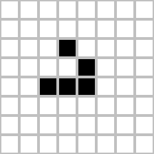
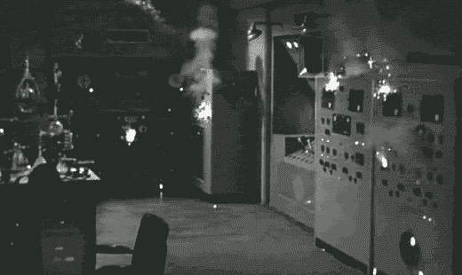

# 生活的游戏(红宝石)

> 原文：<https://dev.to/256hz/the-game-of-life-in-ruby-2p90>

康威的《生活的游戏》是一个流行的编码练习，经常被用来探索一种新的语言，或者一种语言的一个新的方面。我将给出一个简短的历史(虽然这是一个有趣的话题，如果你想了解更多，我在底部提供了链接)。

|  |
| --- |
| *图一。约翰·康威。作者塔那·普兰贝克* |

这个游戏源于物理学家(同时也是学者)约翰·冯·诺依曼在 20 世纪 40 年代的作品。我们所知道的它是由数学家约翰·康威在 20 世纪 60 年代后期提炼出来的。它旨在作为单细胞种群增长和下降的模型，在二维网格上显示出来。

## 康威法则

1.  每个单元有八个邻居。
2.  每个细胞的邻居数量决定了它进入下一轮的生死。
3.  如果细胞有:少于两个邻居，它会孤独而死。
4.  -两三个邻居，它会活下去。
5.  -四个或更多，它会死于过度拥挤。
6.  如果一个空间正好有三个邻居，它将成为一个活细胞。

在这些规则下，有可能创造出无限移动、生长、自我复制和维持的结构。这个小家伙是首批“发现”的自我复制结构之一，被称为滑翔机。

|  |
| --- |
| *图二。一架小巧可爱的滑翔机。维基百科* |

你可以用这些规则创建非常复杂和互动的群体，包括(但不限于)一种[图灵完全编程语言](https://www.ics.uci.edu/~welling/teaching/271fall09/Turing-Machine-Life.pdf)。在 Ruby 中创建您的版本后，您将能够自己模拟这些！

### 生活，遇见露比

这是一个非常有趣的练习，因为它可以通过多种方式进行创作。Ruby 是 OOPL 的一个很好的例子，所以我将介绍两个选项:**单元格作为对象**，以及**面板作为对象**。

#### 作为对象的单元格

在面向对象的语言中，很自然地会把每个组件看作是它自己的类。在伪代码中，您可以这样描述细胞类:

```
class Cell

@position = [x, y]

def self.count_neighbors
  Cell.all.each |cell.position|
  if cell.position is next to any other cell.position
      create_cell / destroy_cell 
```

每个单元格都知道自己在网格中的位置，以及如何检查周围有多少其他单元格。这是一个有效的解决方案，但是你可以想象它会很快变得低效。每次想要计算相邻单元格的数目时，每个单元格都必须遍历所有其他单元格！这被称为大 O(N)计算时间，意味着一次“回合”所需的计算次数是数组中单元数量的平方。此外，创造细胞变得棘手；因为我们不是为空细胞制造对象，所以为新细胞测量合适的条件并不简单。在有数百万个细胞的板子里，我们可怜的非量子计算机会变得可悲。

|  |
| --- |
| *图 3。很难过* |

#### 作为对象的纸板

这里有一个选项，允许你只对每个单元格迭代一次，然后对棋盘的每个方格迭代一次。board 是一个对象，存储一个位置(单元格)数组，有两个主要方法:get_board_size 和 check_board。

```
class Board
@cells = [(x1, y1), (x2, y2), (x3, y3), ...]
def get_board_size
  @cells.each
     find min(x, y) and max(x, y)
end
def check_board
  from board min(x, y) to board max(x, y)
  check_neighbors
     if neighbors
         create_cell / destroy_cell 
```

这允许你只检查一次每个单元格，就可以得到棋盘的大小。然后迭代整个棋盘来创建和破坏细胞。这使你处于 O(N)计算时间的领域，这意味着你的程序进行的计算的数量将随着你的板上的单元的数量而线性增加。

## 结论

《生活的游戏》在编码“形”和练习的列表中出现很多是有原因的；规则很简单，但是实现方式却千差万别。我在这里提到的两个例子只是面向对象的可能性中的两个——例如，你能想出在函数式编程环境中制作游戏的方法吗？有限板有解；用六边形代替正方形；甚至是三维物体上的网格。看看下面粗糙的三叶结生活。

您可以在下面找到我的函数式 Python 解决方案，它添加了简单的 ASCII 可视化和一个小的预设模式列表。

祝游戏愉快！

[](https://res.cloudinary.com/practicaldev/image/fetch/s--1_CbReUY--/c_limit%2Cf_auto%2Cfl_progressive%2Cq_66%2Cw_880/https://upload.wikimedia.org/wikipedia/commons/6/64/Trefoil_knot_conways_game_of_life.gif)

### 更多阅读

[Python GoL 示例](https://github.com/256hz/Game-of-Life/tree/master)
[维基百科](http://www.conwaylife.com/wiki/Conway%27s_Game_of_Life)
[生活的游戏维基:模式](http://www.conwaylife.com/wiki/Category:Patterns)
[生活的游戏音乐音序](http://www.synthtopia.com/content/2009/04/29/game-of-life-music-sequencer/)
[生活的游戏《我的世界》制造(whoadude.gif)](https://youtu.be/jaoSzCfa9OM)