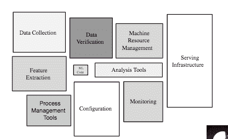

# 谷歌“机器学习速成班”以及为什么你应该这么做

> 原文：<https://dev.to/vorsprung/the-google-crash-course-on-machine-learning-and-why-you-should-do-it-30gg>

“虽然今年人工智能取得了一些进步，但它将在 2019 年飞速发展。”于是一周十几篇文章开始了。但这对我意味着什么？

我基本上理解“通用人工智能”或能像人一样理解广泛话题和兴趣的计算机离还有很长的路要走

然而，机器学习现在就在这里。用真实世界的数据来训练一个模型，然后用统计学来预测事件是可行的。

我不会假装理解支撑机器学习的复杂数学的来龙去脉。然而，对于一个在管理系统和软件开发方面有一点经验的普通人来说，这有什么意义吗？

我决定做一个课程来看看！

我选的课程是谷歌[“机器学习速成班”](https://developers.google.com/machine-learning/crash-course/)

我已经用 Tensorflow 做了一些尝试，这个课程使用 Tensorflow 作为基本框架

本课程涵盖了用于建立模型、收集数据和改进预测的高级理论。有大约 20 个小时的视频和实践练习，使用类似木星笔记本的机器学习游戏围栏

对我来说，最好的实现是在后面的一个部分，总结在这个图表中

小小的蓝色部分是超级聪明的东西，有很多复杂的数学运算

其余部分基本上是传统的数据处理实践。如果你有移动数据、清理数据和其他常规验证过程的经验，那么*机器学习的神秘世界的大部分*都是你已经知道的！

因此，非常值得学习这门课程，看看你现有的技能和经验如何适应即将到来的机器学习场景