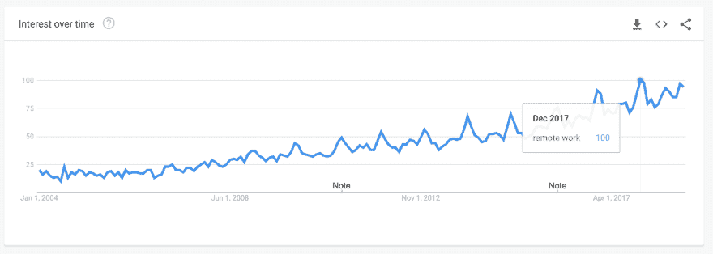
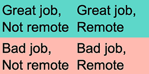
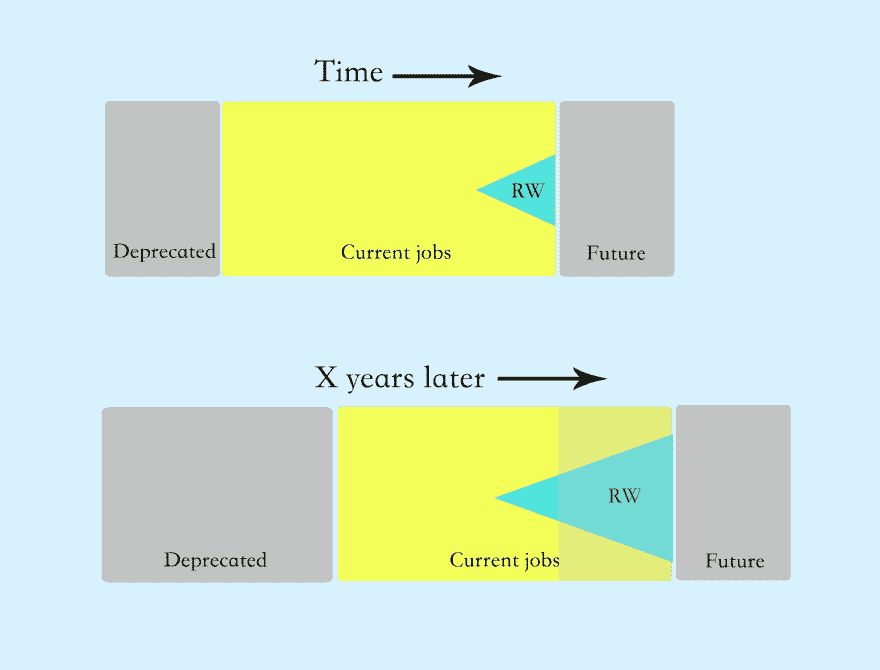
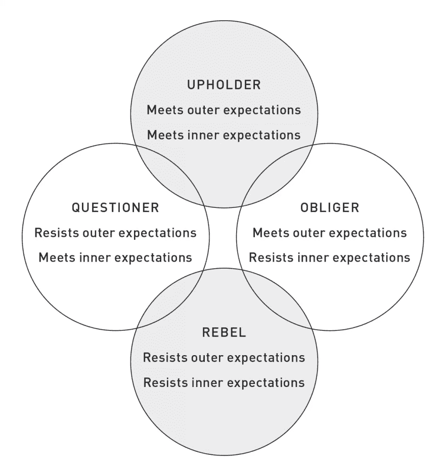

# 远程工作的现实指南

> 原文：<https://dev.to/stephsmithio/the-guide-to-remote-work-that-isnt-trying-to-sell-you-anything-498m>

这篇文章最初发表在我的博客上，我经常在这里写远程工作、学习编码和技术领域的女性。

## **远程工作↗**

众所周知，在过去的十年里，远程工作的规模和范围都有了显著的增长。像 [Buffer](https://buffer.com/) 、 [Basecamp](https://basecamp.com/) 、[automatic](https://automattic.com/)、 [Toptal](http://toptal.com) 和 [Mozilla](http://v) 这样的公司证明，成功不是由你上班的小时数来定义的，我们看到许多人至少会考虑转型。

虽然这种趋势还没有，也可能永远不会达到“曲棍球棒”式的增长，但它拥有[一个令人惊讶的季节性因素](https://trends.google.com/trends/explore?date=all&geo=US&q=remote%20work)，人们正在考虑这种新的生活，因为他们希望重新定义自己的每一个新年。

当你展望新的生活时，无论是在一月还是任何一个平常的日子，我写了这篇指南来帮助你摆脱一些关于远程工作经历的诚实和更实际的观点。它经常被那些通过向他人出售来维持这种生活方式的人所诟病。那不是我在这里要做的。实际上，只需点击一个按钮，就可以预订航班去某个地方开始远程工作(如果你不喜欢，还可以返回)。

相反，本指南着重于我过去 3 年远程工作的经验，可能对那些寻求转型或刚开始转型的人更有帮助。随意跳到对你最有用的部分，包括最后的一些实用技巧。

*   远程工作！=最终目标
*   我能遥控吗？
*   位置独立性的利与弊
*   我的个人经历
*   实用技巧

## **我是谁？**

首先，我是谁，为什么我要谈论远程工作？我是[斯蒂芬](http://stephsmith.io)，过去三年我一直在[远程工作](https://twitter.com/stephsmithio/status/1074370717376888832)。大部分时间是在 [Toptal](https://toptal.com/about) 度过的，开始是一名增长主管，最近加入他们的管理团队，领导一个大约 20 人的出版团队。我也做过横跨 SEO、社交和网络开发的远程工作。这些年来，我见证了 Toptal 作为远程领域领导者的成长，也走访了大约 50 个国家，会见了其他远程工作者，从更传统的到默默无闻的。我要澄清一下，这些观点是我自己的，不一定代表 Toptal 的观点。

## **远程工作！=最终目标**

我认为这是我遇到的几乎所有远程工作指南都缺少的部分。尽管我是远程工作的大力支持者，但我还是要说:

> 远程工作不是最终目标。

我这么说是什么意思？嗯，你 2019 年的目标之一可能是过渡到远程工作，这很好。然而，你应该有多个其他目标，这个目标不应该凌驾于基本目标之上，更重要的是，你的幸福或正直。

让我解释一下:

远程工作对你生活的影响就像形容词对名词的影响一样。这是一个描述符，但在你的生活中可以有很多描述符。远程工作让你可以用不同的方式设计你的生活，但最终它本身不会给你带来幸福。所以，当你寻找远程工作时，记住你真正的“为什么”。**例如**，“远程工作让您能够”:

*   花更多时间在家，做一个更好的爸爸
*   搬到一个新的城市和你的伴侣在一起
*   学会兼职写代码，这样你最终就可以自己创业了

我想说明的是，获得一份远程工作并不能解决你所有的问题，但它给了你空间去运作，让你的其他目标得以实现。即使你远程工作，你仍然需要在你的技能、人际关系和目标上努力，因为不努力它们是不会发展的。

最重要的是，不要为了远程工作而牺牲自己的正直。这似乎是显而易见的，但你的快乐将源于你每天实际做的事情**，而不是你实际工作的地方。取消通勤或降级办公室肯定是积极的，但请记住，在下图中，左上角仍然比右下角更好。**

随着远程工作变得越来越普遍，新的机会每天都在涌现。有了这些动力，你就没有理由牺牲你的个人或职业目标去“远离”；你可以鱼与熊掌兼得(你可以找到远程工作和你喜欢的工作)。

## **我甚至可以遥控吗？**

通常有两个*当前*限制远程工作任务的因素，如下式所示:

> 远程员工= A 的员工* % B 的员工* %

A =可以远程完成的工作 B =允许远程工作的公司或个人

由于最近的心理和技术转变，A 乘数和 B 乘数都在增长，导致了更大规模的远程劳动力。

### **答:可以远程完成的工作**

如果你所做的已经有 50%+在线，你可以跳过 A，直接进入 b。这是任何开发人员，设计师，电子商务窥视者，SEO 专家，社交媒体经理，但也包括产品经理，营销人员，商业顾问，作家，等等。

如果你**不**认为你目前的角色可以过渡到远程工作，我的建议是至少做一下研究。如果没有把自己的工作视为最容易获得和最明显的选择之一，许多人会立即停下来，限制自己的选择。与此同时，虽然不常见，但我见过远程医生/护士、建筑师、教师、心理学家等等。这里的关键是消除障碍；重新思考你的角色的**元素**，而不是作为一个整体的角色。

例如，如果你是一名护士，你可能**不能**继续远程工作，同时像你今天一样在不同的医院执行任务，但你可能有许多工作元素或* *新* *元素可以在网上完成。尽管这看起来很简单，但还是要制作一个图表，列出你目前正在做的事情和你在你的角色范围内能够做的事情，并标出它们是否可以在电脑上完成。

如果你仍然不相信你目前的技能适合远程工作，还想做出改变，请参考实用技巧部分，让你步入正轨。

### **想得更大**

同样值得注意的是，员工队伍在不断变化，技术每天都在创造新的远程友好型角色。例如，我在 TechCrunch Disrupt (2017)上亲眼目睹了多家公司开发 AR/VR 技术，该技术将允许人们在从建筑到实验室的各个行业进行培训和异地工作。一如既往，请记住，劳动力是短暂的，现在存在或不存在的东西可能在 1 年、5 年或 30 年后都不存在。随着我们的发展，这些新工作将有更大比例与远程工作重叠。

### **B:就问**

如果你很幸运已经掌握了远程工作的技能，并且想继续你目前的工作，那么我的建议很简单:**直接问**。你可能是实现你生活中这一元素的唯一限制步骤。

根据我自己的经验以及许多最终辞职去担任偏远职位的人的经验，如果这是你离职的原因，公司通常会在你离职时给你同样的待遇。

最好是想出一个你和你的公司如何一起过渡的计划。如果你正计划着手一个远程工作项目，比如远程年，一些提供了基本的模板或指南来处理这种情况，但最终不要想太多。如果公司或你的老板没有做好让你跳槽的心理准备，这会给你带来其他机会(见实用技巧部分)，你应该继续前进。

## **区位独立性的好与坏**

我并不是第一个说远程工作有其自身的机遇和挑战的人，其中许多取决于每个人如何操作。

### **自主权和生产力**

如果有一个词可以概括远程工作，那就是自主。远程工作让你在工作内外都能自由设计自己的生活。部分原因是远程工作自然会模糊这些界限。

> 吃饭时在手机上回复一条松弛的信息“有用”吗？

即使你在远程工作时有一个老板，你的头号责任伙伴也是你自己。我相信这是让一些人自然茁壮成长的原因，但同样重要的是，另一些人在偏远的环境中挣扎。如果你正在考虑远程工作，考虑一下你的倾向是否符合这种生活方式。虽然肯定不科学，但我会鼓励人们参加[四种倾向测验](https://quiz.gretchenrubin.com/)并听有声读物。如果你属于抵制内心期望的任何一类，那并不意味着你不能有效地远程工作，而是可能表明你需要从一开始就努力养成一些习惯。

远程工作中缺乏强加的结构意味着在工作之外发展自己的结构和期望对你来说更加重要。如果你不这样做，你会经常发现你的个人抱负会被搁置一旁。确保你选择了个人目标(例如:学习),为它们分配了时间，并为每个目标分配了具体的 KPI。

在你的工作范围内，学会识别不同类型的活动以及你如何应对它们。这是一个个人练习，所以要诚实并客观地描述你所纠结的事情。例如，我知道我可以连续花 8 个小时在电子表格上，但发现连续写超过 1 个小时会让人筋疲力尽。我认识到这一点，并在需要时积极休息或换班。

也就是说，任务转换是一个主要的能量消耗者，所以确保你将大部分时间集中在特定的任务上(尤其是类似的任务)。

对于很多人来说:1x4h 的工作> > 2x2h 的工作> > 4x1h 的工作> > 8x 30 分钟的工作> > 16x 15 分钟的工作

为什么？有一个过渡期，你必须适应手头的任务，这是不可避免的。针对更多流量和更少校准进行优化，可以完成更多工作。我鼓励任何人从技术角度更好地理解上下文切换的概念，通过听[算法来过](https://www.amazon.com/Algorithms-Live-Computer-Science-Decisions/dp/1627790365)生活。

让我明确一点，自主并不意味着做得更少；它意味着以更好、更优化的方式做事的自由。我从一次又一次的观察中学到的一件事是，尽管工作地点相距甚远，但要区分谁在努力工作，谁没有努力工作，还是非常容易的。如果你打算转换到远程工作，这样你就可以放松，什么也不做，你不会愚弄任何人。

### **自我选择**

说到自治，远程工作的最大好处之一就是你与之互动的人。对于为什么会这样，我提出了一个假设:大多数人不会陷入远程工作——他们会主动寻找。

为了过渡到远程工作，你通常会认识到有一种更好、但更非传统的生活方式，并改变你的生活以适应这种生活方式。对于一个花了大约 10 个月才找到合适的远程工作的人来说，这并不总是一条直截了当或常规的道路。也就是说，我认为这导致了远程工作社区中某种形式的自我选择，以及特定特质和价值观的发展。人们往往更有野心，更有创造力，更能自我调节，这是一个提升你自身素质的好地方。

虽然这里肯定有个人偏见，因为我是一个“提问者”，但如果在偏远社区有更多的“提问者”和“反叛者”(再次提到 4 种倾向)，我不会感到惊讶。

说到价值观，远程工作人员倾向于重视效率、花费的时间和信任，而不是微观管理，因此，无论他们在组织中处于什么位置，这种现实都会出现在你的大多数同事身上。即使在许多地方有向“扁平”组织的转变，我发现在远程组织的文化中尤其如此。我不清楚这是因为这些公司的前瞻性思维，还是因为它们通常较新且规模较小。看看这些规模不断扩大的远程公司如何进入企业时代将会很有趣。

### **基本特质养成**

我相信特质只是随着时间的推移而形成的习惯，因此如果你有足够的动机去塑造它，它是可以被塑造的。以下是我认为你需要远程工作的几个关键特征。人们说你需要的其他东西通常是这些东西的某种组合，或者并不像人们想象的那样是“成功”所必需的:

*   对行动的偏好
*   清晰的沟通(这需要努力)
*   凡事重质量轻数量。我特别推荐这种投资好技术的方式。

尤其是如果你在为一家初创公司工作，充足性在更广泛的基础上是很重要的。我会鼓励每个人学习基础知识:

*   搜索引擎优化
*   分析/Excel 建模(我曾经听到有人说，“如果你不知道数据透视表是什么，你的生活是什么？”)
*   抄写
*   设计与 UX 理论
*   开发(基本的 HTML、CSS、脚本)

那些在技术领域工作的人开始认识到，为了最有效地工作，你应该了解对整个“技术派”有贡献的其他学科。因为远程工作与技术有很大的交集，所以这一点依然正确。

### **社会生活**

远程工作争议最少的陷阱之一是社会结构。没有了团队午休或饮水机聊天，远程工作可能会非常孤独。向这种生活方式的转变需要校准，但我会鼓励你建立你的数字和非数字生活来解释这一点:

*   创建自己的饮水机-在线。如果你在一家完全偏远的公司工作，有意识地打电话促进团队合作。你想怎么称呼他们都行:一起工作，每周一次的聊天，等等。但重要的是要考虑到培养关系的时间。如果你不在一个完全偏远的公司工作，在像 T2 的游牧者或根据你的兴趣定制的特定群体中寻找像你一样的人。
*   如果可能的话，在其中一个中心开始你的远程生活。这些地方是更多的数字游牧民选择停留的原因，如天气好，生活成本低，互联网好，但更重要的是，在这里你可以更容易地遇到其他游牧民。你可以在游牧者主页上了解他们的位置，但我个人建议是仓谷、清迈、里斯本和麦德林。

我认为还有一个值得注意的因素，远程工作人员应该积极改善:鼓励同理心。当你不在某人身旁工作时，不管是不是有意的，对这个人的感受或时间的意识会减少。要扭转这一局面，需要积极的参与。

此外，远程工作建立在影响为王的理念之上，在大多数情况下，衡量的是个人(而不是群体)的影响。这可能会产生一种消极的动态，我已经见过很多次了。在办公室里，你会看到有人熬夜帮助他们的队友，但在远程工作中，大多数“付出”都被忽视了，除非是那些从付出中受益的人。如果不主动承认付出和互惠，远程工作很快就会变成一场零和游戏。

我鼓励每个人，尤其是远程工作者，阅读[给予和接受](https://amzn.to/2Tvcdhd)并牢记这一点。请记住，不是每个人都出于同样的原因选择远程工作，所以如果你的同事仍然需要在 5 点前下班或者需要去接他们的孩子，你要适应。这听起来不言自明，但并不总是第二天性。

最后，不要通过筒仓将你的远程生活方式与亲身生活方式进行比较。虽然在进步，但我认为远程工作的社交性质永远无法与面对面的互动直接相比。然而，远程工作提供了如此多的其他好处，所以承认它的缺陷，但不要单个地纠结于它们。

我喜欢把远程工作想象成你正在开始的一段新恋情。这种关系不能保证会变得更好，但有可能变得更好。把远程工作看作是一种新的生活方式，既有积极的一面，也有消极的一面；只要是积极的，就要学会接受并积极改善某些方面。

### **身体健康**

至于身体健康，再一次，确保你考虑到这一点。这里的主题是，额外的自主性要求你把思想放在某些在不太流畅的生活方式中可能自然发生的事情上。

安排时间在白天散步，注意你会在电脑前坐好几个小时！对于那些呆在一个地方的人，我的一些同事买了 100 美元的跑步机，他们经常在打电话时使用。对于那些正在移动的人，我推荐像 [Teeny Breaks](https://www.producthunt.com/posts/teeny-breaks) 这样的应用程序，它们专注于如何更加专注。

### **远程工作和出差**

许多人选择远程工作，因为这让他们可以环游世界。这本来是我的意图，但再次不是最终目标。永远环游世界不会满足你，除非它伴随着其他的野心。

我在这个[最近的帖子](https://twitter.com/stephsmithio/status/1074370717376888832)中为那些远程旅行和工作的人写了一些提示，但总结起来:

*   “慢下来”，这样你就可以专注于其他目标。
*   旅行时写下你的想法和主意。四处走动会让你接触到新的事物，因此，新的想法会更经常地产生。
*   利用旅行时间通过读书/听书/有声读物(买个 Kindle)来学习。
*   用你的旅行来挑战你的信仰。不仅仅是文化上的，而是关于你思考、工作、设定目标等的方式。
*   再次，感同身受，善待他人。

## **我的亲身经历**

多年来，我很幸运地把这条路称为我的工作场所。从很多方面来说，这是我所能记得的，但我承认，我花了一些时间来适应我目前的状态，这比去年更有成效，我假设比明年更没有成效。

这确实抓住了我对远程工作的个人观点。在办公室里，我能够在一个小盒子里进行优化，现在我发现自己正在最大化一个大得多的盒子。每个季度或每年，我都会发现新的机会——不仅是外部的，还有内部的。

实际上，这是我的习惯和主要学习的大致时间表:

**0-6 个月**:住在爱丁堡。这段时间主要用来适应远程工作。我会鼓励其他人在此期间保持相对稳定，并“先优化再扩展”。

*   前~3 个月感觉很诡异。我害怕在“关键工作时间”离开电脑超过 15 分钟，并且不真正理解如何内化时间并不重要，工作只是受影响驱动的，尽管这一点已经向我传达了多次。
*   3-6 个月:我在优化我的习惯方面变得更好了，但是仍然花了太多时间在工作上。我不知道如何区分生活和远程工作。

**6-18 个月**:去过很多地方。这很有趣，但最终这一年并没有关注任何具体的个人成长。今年是我可以自信地说“远程工作和旅行”本身不是最终目标的原因。

**18 个多月**:我放慢了旅行的速度，重新把生活的重心放在了**的影响**上，无论是工作之内还是工作之外。我清楚地确定了我的目标(比如学习编码)，并把它们作为我的“北极星”。这帮助我在工作中更加高效，甚至在过渡到领导 20 个人时也是如此，因为我积极地接受了这样一种心态，即我的生活是敏捷的，可以被设计成最大化影响和消除浪费。

我估计我现在的工作效率和影响力是我刚开始远程工作时的 2-5 倍，这是因为扩展了的盒子和选择了正确的目标。自然，我认为许多人在开始远程工作时都会经历类似的生命周期。

## **实用小贴士**

如果你还在读书，并且对找一份远程工作感兴趣，以下是我的建议:

首先，决定你是想去一个偏远的公司工作还是自由职业。两者都是有效的，但性质完全不同。如果你是一名自由职业者，你会更加独立地工作(通常不是团队的一部分)，需要花时间在营销自己或吸引客户等事情上，但最终你会有更多的自主权。

如果你决定走公司路线，我会鼓励你去一家完全远离公司的公司工作。以下是来自 [Buffer](https://open.buffer.com/remote-jobs/) 和 [RemoteOK](https://remoteok.io/remote-companies) 的两家此类公司的名单。

他们很自然地建立了社会结构和系统来对抗远程工作的一些陷阱。如果你是一个组织中不到 10%的远程员工中的一员，而这个组织大部分是面对面的，那么他们就没有足够的动力来设置这些。不是因为他们不在乎，而是因为大多数远程工作的陷阱对旁观者来说很微妙，但对远程工作人员来说却很重要。

如果你选择在公司找工作，这是我的建议:

### **学习基本的数字技能**

不管你申请的是什么样的职位，了解基本的营销、搜索引擎优化、设计和开发技能都会让你受益匪浅。随着学习的民主化无处不在，你可以在 Udemy 上选择这些主题中的任何一门课程。如果你对编码特别感兴趣，[我最近做了一个关于这个的演讲](https://twitter.com/stephsmithio/status/1077692151020965889)。

例如，当我在 2015 年寻找远程工作时，我知道我没有足够的技能来获得合适的远程职业。幸运的是，我不愿意用我的职业来换取远程工作的能力；我再一次意识到我可以鱼与熊掌兼得。因此，我全年做了 4 份兼职，涉及搜索引擎优化、社交媒体、电子邮件营销和在线研究，帮助我建立新技能，加快我的学习，以便我可以找到我喜欢的角色(Toptal 的增长领导者)。

### **在合适的地方搜索**

随着 2018 年成为就业委员会年，有几十个地方可以搜索，但这也意味着很多噪音。当我在 2-3 年前搜索的时候，我最幸运的是拥有 [Flexjobs](https://flexjobs.com) 和 [RemoteOK](http://remoteok.io) ，据我所知，他们在寻找最好的远程工作(包括全职远程工作)和确保质量(这是最重要的)方面仍然领先。2016 年，我在这两个网站上都找到了付费远程职位；3 个在 FlexJobs 上，1 个在 RemoteOK 上。

值得注意的是，FlexJobs 是一个[付费平台](https://www.flexjobs.com/Pricing.aspx)，每月 15 美元或每年 50 美元，但当你想到寻找合适工作的成本节约时，这是我能想到的更好的投资之一。

### **向左向右滑动公司**

2019 年，任何经营完全远程公司的人仍然是[创新者](http://sphweb.bumc.bu.edu/otlt/MPH-Modules/SB/BehavioralChangeTheories/BehavioralChangeTheories4.html)。不到 1%的公司完全远程办公，所以当你申请时，记住你在和谁说话，说出他们的价值观，希望这与你的价值观一致。

请记住，公司选择雇佣远程员工的原因有很多。其中一些包括:

*   进入全球人才库
*   节省的成本
*   员工保留率
*   对更高生产率的信念
*   等等。

根据每个公司的公众形象和他们的/文化页面，你通常可以感觉到哪些原因引起了他们的共鸣。同样，用这个来衡量你的价值观是否与他们的一致，因为不是所有的远程就业机会都是合适的。

记住，任何工作都是双向的，所以即使你在寻找远程工作，也要审查雇主和职位。请记住，一份有回报的工作通常是具有挑战性的，只要它以正确的方式挑战你。出于这个原因，我通常建议人们不要去那些承诺给你童话和彩虹的偏远工作，除非那是你真正想要的。远程工作将会渗透到你的生活中，而不仅仅是办公室工作，所以确保你找到了合适的提供远程工作的公司。

### **放下自我**

当你申请的时候，请记住，那些招聘远程职位的人与典型的招聘经理相比，往往有着不同的议程。他们不太关心:

*   声望很高的学位，有时甚至是任何学位
*   你目前挣多少钱
*   流行词

他们更关心:

*   延展性证明
*   砂砾证明
*   雄心的证明

注意上面片段中的 proof 这个词。例如，*告诉*一位远程招聘经理你“有抱负、有勇气或者有可塑性”几乎毫无意义。然而，如果你学会了自己编写代码，这样你就可以找到一份远程工作，这本身就证明了你有学习新技能的可塑性，有足够的雄心去开始，并有勇气在学习过程中取得成功。

我还发现，当我在 2016 年申请时，随着我将远程工作经验添加到我的腰带上，每个申请都变得更容易了。这部分是因为我有了更多的信心，但也是因为远程工作向招聘经理证明了我是负责任的。正如我在上面分享的个人经验，远程工作的前 3-6 个月是一个学习曲线，所以如果你已经经历了这个阶段，公司可以信任你有效远程工作的能力。

如果你没有远程工作经验，那就利用这个机会提升你的技能。即使你是某个行业的“拥有 10 年经验的专业人士”，你也可以不断学习。如前所述，开发、SEO 和营销技能都是任何技能组合的坚实补充。远程工作尤其如此，尤其是在运营/营销领域，因为它们是动态的，需要你在一段时间内做不止一件事。你不断学习的能力对你和公司都是一大优势。

当你面试的时候，不要害怕谈论你已经建立的副业项目或者你们一起黑东西的时间。证明你有能力做远程工作的证据隐藏在你已经解决的问题中。

## **未来的工作**

毫无疑问，随着我们的发展，远程工作将会变得越来越普遍，我希望你们每个人都是未来的一部分。

我也希望这个指南给出一个更加真实的位置独立性的画面，以及一些你可能需要学习的技巧，以最大化你的影响。最后，远程工作是你自己创造的，我相信它可以让你设计一个更好的生活，在头脑中有正确的相邻目标。快乐生活！

PS:来推特上打个招呼