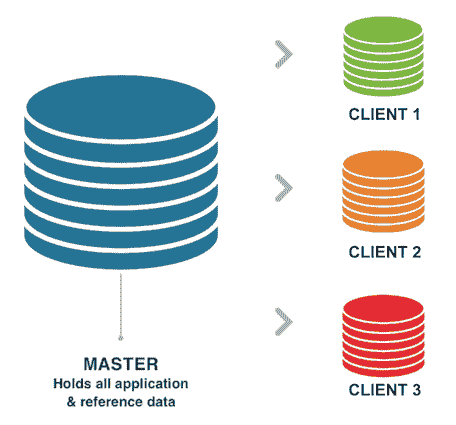

# 了解你的宝石的重要性

> 原文：<https://dev.to/molly/the-importance-of-knowing-your-gems-2f07>

Ruby 有如此多令人敬畏的、容易获得的[宝石](https://rubygems.org/)，但是它们的易用性会让你产生一种自满的感觉。这就是过去一年在肯纳发生在我们身上的事情，我们艰难地认识到了解自己的宝贝是多么重要。

## 问题

在过去的一年里，我们在 Kenna 对我们的主要 MySQL 数据库进行了分片，我们选择按客户进行分片。

[](https://res.cloudinary.com/practicaldev/image/fetch/s--5bbhA5GZ--/c_limit%2Cf_auto%2Cfl_progressive%2Cq_auto%2Cw_880/https://thepracticaldev.s3.amazonaws.com/i/sprxkp6tv0ip6pg7ibsz.png)

因此，客户机的所有数据都保存在自己的数据库碎片中。这意味着每次我们在 MySQL 中查找客户端数据时，我们都需要知道要查看哪个数据库碎片。我们的分片配置，

```
{
    'client_123' => 'shard_123',
    'client_456' => 'shard_456',
    'client_789' => 'shard_789'
} 
```

Enter fullscreen mode Exit fullscreen mode

它告诉我们什么客户端属于什么数据库碎片，需要易于访问，因为我们每次发出 MySQL 请求时都需要访问它。

我们首先求助于 Redis 来解决这个问题，因为它速度很快，而且我们想要存储的配置哈希也不是很大。但最终，随着我们添加越来越多的客户端，配置散列会越来越大。

[](https://res.cloudinary.com/practicaldev/image/fetch/s--y8RPmuGF--/c_limit%2Cf_auto%2Cfl_progressive%2Cq_auto%2Cw_880/https://thepracticaldev.s3.amazonaws.com/i/meovt3c3jq0xpdty3dvy.png)

13 千字节可能看起来不是很多数据，但如果你要求 13 千字节数百万次，它可以增加。很快，我们从 Redis 读取了 7.8 MB/秒的数据，随着我们继续增长，这是不可持续的。如果我们有任何扩展的希望，我们必须找到一种不涉及 Redis 的方法来访问我们的分片配置。

## 寻找解决办法

当我们开始试图找出如何解决这个问题时，我们做的第一件事就是仔细研究 ActiveRecord 的连接对象。这是 ActiveRecord 存储它需要知道如何与数据库对话的所有信息的地方。因为这个事实，我们认为这可能是一个很好的地方，可以找到一些东西来帮助我们存储我们的分片配置。所以我们跳进控制台查看。我们发现的根本不是 ActiveRecord 连接对象...

```
(pry)>  ActiveRecord::Base.connection
=>  <Octopus::Proxy:0x000055b38c697d10
 @proxy_config= #<Octopus::ProxyConfig:0x000055b38c694ae8 
```

Enter fullscreen mode Exit fullscreen mode

相反，我们发现了一个章鱼代理对象，它是我们的章鱼碎片宝石 T1 创建的。

[](https://res.cloudinary.com/practicaldev/image/fetch/s--KJSLJB5Z--/c_limit%2Cf_auto%2Cfl_progressive%2Cq_66%2Cw_880/https://media.tenor.cimg/5a79eeda0aefbb6ad6496b4ee6fd2081/tenor.gif)

这完全出乎我们的意料！找到这个之后，我们立即开始钻研[章鱼宝石](https://github.com/thiagopradi/octopus)源代码，试图弄清楚这个类在做什么。当我们最终发现 [Octopus 代理类](https://github.com/thiagopradi/octopus/blob/master/lib/octopus/proxy.rb)时，让我们非常高兴的是，它有所有这些我们可以用来访问我们的分片配置
的好帮手方法

```
module Octopus
    class Proxy
        attr_accessor :proxy_config
        delegate :current_shard, :current_shard=,
                     :current_slave_group, :current_slave_group=,
                     :shard_names, :shards_for_group, :shards, :sharded, 
                     :config, :initialize_shards, :shard_name, to: :proxy_config, prefix: false
    end
end 
```

Enter fullscreen mode Exit fullscreen mode

嘣！Redis 加载问题解决！我们只需引用本地 ActiveRecord 连接对象，而不是在每个 MySQL 请求之前点击 Redis。

## 吸取教训

我们从整个经历中学到的最重要的事情之一就是了解你的宝石有多重要！在你的 gem 文件中包含一颗宝石是非常容易的，但是当你这样做的时候，确保你对它的工作原理有一个大致的了解。

我不是说你需要去阅读你的每一个宝贝的源代码。那要花你一辈子的时间去做。但是也许，下一次你添加一个新的宝石，考虑在一个控制台中第一次手动设置它。这将允许您查看它是如何配置和设置的。如果我们做到了这一点，我们就会更好地理解我们的 Octopus sharding gem 是如何配置的，我们就可以省去整个 Redis 的麻烦了！

[](https://res.cloudinary.com/practicaldev/image/fetch/s--WC5psqDf--/c_limit%2Cf_auto%2Cfl_progressive%2Cq_66%2Cw_880/https://thepracticaldev.s3.amazonaws.com/i/2xjwqqryldr6v8n24v8y.gif)

另一个了解您的宝石如何工作的好方法是通过日志记录！为您的 gem 设置调试日志级别，并在与您的应用程序交互后，检查日志。他们会给你一些关于 gem 如何工作以及如何与你的代码和外部服务交互的深刻见解。关于使用日志的更多信息，请查看我的 [Live、Log 和 Prosper](https://dev.to/molly_struve/live-log-and-prosper--3j65) 帖子。

新年快乐，编码快乐！

*如果你对使用 Ruby checkout 防止数据库命中的其他方法感兴趣，我的[缓存为王](http://confreaks.tv/videos/rubyconf2018-cache-is-king-get-the-most-bang-for-your-buck-from-ruby)来自 RubyConf 的演讲启发了这篇文章。*