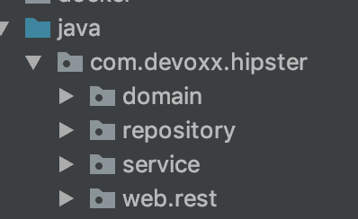
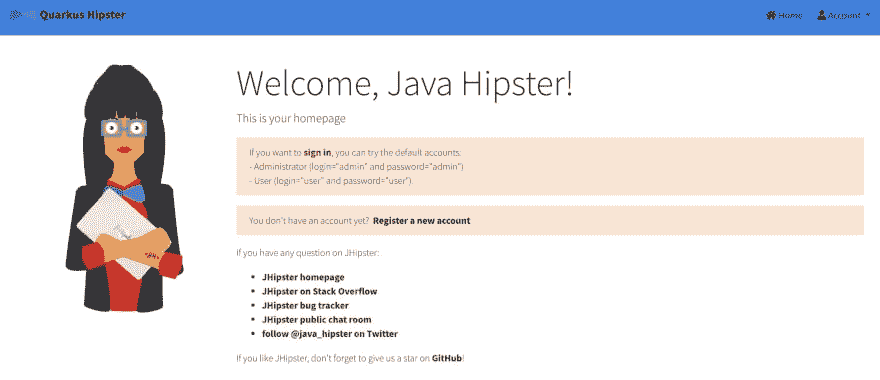
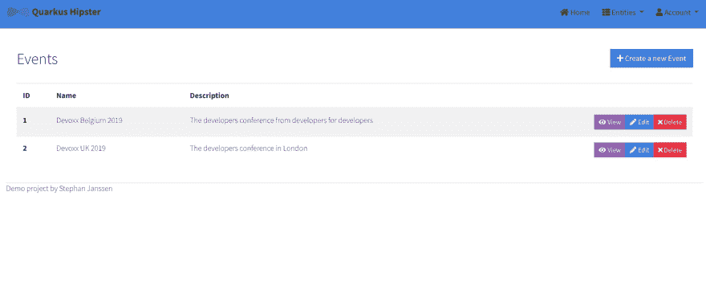

# jhipster quartus 演示应用

> 原文：<https://dev.to/stephan007/the-jhipster-quarkus-demo-app-1a1n>

上周末，我写了一篇关于为我的 JHipster 应用程序创建尽可能小的 Docker 图像的文章。结果是一个 180Mb 的 Docker 映像，它从 avg。在谷歌云上的 56 秒内。

在比利时这个多雨的星期天，我决定创建一个启动速度最快的 JHipster 应用程序。

# 执行摘要

> 59Mb 尺寸和 0.056 秒启动时间😱💪🏻

# 夸尔库斯来救援了！

自从红帽宣布 Quarkus，我想玩这个新项目，今天是那一天。

我的目标基本上是替换现有的 Spring Boot 应用程序(由 JHipster 生成),并替换为 Quarkus 原生版本。让我们看看能走多远。

我想模仿 JHipster 使用的包结构，这非常符合逻辑。在服务包下，你还可以找到 DTO 和地图绘制者。

[](https://res.cloudinary.com/practicaldev/image/fetch/s--P4-wFFgz--/c_limit%2Cf_auto%2Cfl_progressive%2Cq_auto%2Cw_880/https://media.licdn.com/dms/image/C4D12AQEtVjmCP2TvKg/article-inline_image-shrink_1500_2232/0%3Fe%3D1564012800%26v%3Dbeta%26t%3DeSBQHT7fg5OMNRTK2Iq4fr2u1Ac_3f7xqrWDIIrRVkM)

# 域:神气活现地冬眠

让我们首先创建一个(会议)事件域对象，它有一个名称和描述字段。

```
package com.devoxx.hipster.domain;

import io.quarkus.hibernate.orm.panache.PanacheEntity;

import javax.persistence.*;
import javax.validation.constraints.NotNull;
import javax.validation.constraints.Size;

@Cacheable
@Entity(name = "hipster_event")
public class Event extends PanacheEntity {

    @NotNull@Size(min = 3, max = 100)
    @Column(nullable = false)
    public String name;

    public String description;
} 
```

Hibernate Panache 让我想起了 Lombok(不需要 getters 和 setters ),此外，您还可以使用 bean 验证。通过一个简单的@Cacheable 注释，您可以激活 Infinispan 缓存。

# 事件存储库

```
package com.devoxx.hipster.repository;

import com.devoxx.hipster.domain.Event;
import io.quarkus.hibernate.orm.panache.PanacheRepositoryBase;

import javax.enterprise.context.ApplicationScoped;

@ApplicationScoped
public class EventRepository implements PanacheRepositoryBase<Event,Integer> {

    public Event findByName(String name){
        return find("name", name).firstResult();
    }
} 
```

finder 方法在 EventRepository 中创建。对于我的简单 CRUD web 应用程序，这目前只是一个示例方法。我希望在以后的版本中增加分页和排序功能。

基本的域对象可以直接给 Angular，但是当引入更复杂和机密的字段(如电子邮件或 OAuth 秘密)时，您希望在域和 web REST 包之间有一个 DTO 映射器。

# 映射结构

> MapStruct 是一个代码生成器，它基于配置方法的约定，极大地简化了 Java bean 类型之间映射的实现。

JHipster 非常依赖 MapStruct，所以我需要研究一下 Quarkus 是否可行。实际的 Quarkus 网站没有提到它，但谷歌确实回报了一些最近的努力，使 MapStruct 成为 Quarkus 生态系统的一部分，太棒了！

```
package com.devoxx.hipster.service.mapper;

import com.devoxx.hipster.domain.Event;
import com.devoxx.hipster.service.dto.EventDTO;
import org.mapstruct.Mapper;

@Mapper(config = QuarkusMappingConfig.class)
public interface EventMapper {

    EventDTO toDto(Event event);

    Event toEntity(EventDTO eventDTO);
} 
```

EventMapper 需要一个对 QuarkusMappingConfig 接口的引用，该接口告诉 Quarkus 它正在使用 CDI 进行依赖注入。Quarkus 有 Spring DI 支持但是不确定 MapStruct 是否已经支持？

```
package com.devoxx.hipster.service.mapper;
import org.mapstruct.MapperConfig;

@MapperConfig(componentModel = "cdi")
interface QuarkusMappingConfig {
} 
```

领域模型，DTO 和地图完成👍🏼

# 服务层

EventService 是非常轻量级的，我很想把这个逻辑移到 EventResource 类中，但是在这些垂直层之间有一个清晰的分离最终将是一件好事。所以我们开始吧...

```
@ApplicationScoped
public class EventService {

    @Inject
    EventMapper eventMapper;

    /**
     * Get all events.
     *
     * @return list of event DTOs.
     */public List<EventDTO> getAll() {
        Stream<Event> events = Event.streamAll();
        return events.map(event -> eventMapper.toDto(event) )
                     .collect(Collectors.toList());
    }
} 
```

最终的服务还包括获取特定事件(通过 id)和保存 DTO 的代码。

# 事件资源

```
@Path("api/events")
@ApplicationScoped
@Produces("application/json")
@Consumes("application/json")
public class EventResource {

    @Inject
    EventService eventService;

//...

    @GETpublic List<EventDTO> getEvents() {
        List<EventDTO> allEvents = eventService.getAll();

        if (allEvents == null) {
            throw new WebApplicationException("No events available", HttpURLConnection.HTTP_NOT_FOUND);
        }

        return allEvents;
    }

//...
} 
```

EventResource 同样没有真正的惊喜。Quarkus 使用 RestEasy，这是一个 dip 开关，我需要在春季休息后更换我的脖子，但我会生存和学习。

# 功能测试

编写一些使用 REST 端点的功能测试也是一种有趣的体验，如下所示。

说到好玩，夸尔库斯也支持科特林。接下来应该试一试。

```
@QuarkusTest
class EventEndpointTest {

    @Test
    void testGetOneEvent() {
        given()
                .when().get("/api/events/1")
                .then()
                .statusCode(HttpURLConnection.HTTP_OK)
                .assertThat()
                .body(containsString("Devoxx"),
                      containsString("for developers"));

    }

    @Test
    void testGetAllEvents() {
        //List all, the database has initially 2 events
        given()
                .when().get("/api/events")
                .then()
                .statusCode(HttpURLConnection.HTTP_OK)
                .assertThat()
                .body("size()", is(2));

    }
} 
```

# 让我们飞向远方

JHipster 使用 Liquibase，但 Quarkus(目前)只支持 FlyWay (Axel 感谢邀请，但我光是看啤酒就已经头疼了🤪).

在添加 FlyWay maven 依赖项之后，您需要通过在 application.properties 文件中添加以下行来激活它。

```
# Flyway minimal config properties
quarkus.flyway.migrate-at-start=true 
```

然后，在 resources/db/migration 目录中添加 SQL 语句。不要忘记添加 PostgreSQL 序列生成器，否则新域对象将不会获得任何 id。

```
CREATE SEQUENCE hibernate_sequence START 10;

CREATE TABLE hipster_event
(
    id   INT,
    name VARCHAR(100),
    description VARCHAR(255)
);
INSERT INTO hipster_event(id, name, description)
VALUES (1, 'Devoxx Belgium 2019', 'The developers conference from developers for developers'),
       (2, 'Devoxx UK 2019', 'The developers conference in London'); 
```

现在我们已经有了所有的逻辑，让我们看看如何运行这个宝贝。

# GraalVM

需要下载 GraalVM 1.0 rc16 和 Apache Maven 3.5.3+。

注意:Quarkus 还不支持 GraalVM v19.0，但看起来红帽团队正在支持@[https://github.com/quarkusio/quarkus/issues/2412](https://github.com/quarkusio/quarkus/issues/2412)

在项目被 maven 编译和打包之后，您现在可以启动 Quarkus 应用程序:

```
$ mvn quarkus:dev 
```

真正酷的是 Quarkus 支持项目的热重装。每当 HTTP 请求到达应用程序时，它会重新加载应用程序，因为只需要几毫秒的时间。最后，不用设置 ZeroTurnaround 的 JRebel 就可以热重装是一个非常好的奖励。

下面列出了最重要的输出...

```
INFO  [io.qua.dep.QuarkusAugmentor] (main) Beginning quarkus augmentation
INFO  [io.qua.fly.FlywayProcessor] (build-6) Adding application migrations in path: file:/Users/stephan/java/projects/quarkushipster/backend/target/classes/db/migration/
INFO  [io.qua.fly.FlywayProcessor] (build-6) Adding application migrations in path: file:/Users/stephan/java/projects/quarkushipster/backend/target/classes/db/migration
INFO  [io.qua.dep.QuarkusAugmentor] (main) Quarkus augmentation completed in 703ms
INFO  [org.fly.cor.int.lic.VersionPrinter] (main) Flyway Community Edition 5.2.4 by Boxfuse
INFO  [org.fly.cor.int.dat.DatabaseFactory] (main) Database: jdbc:postgresql:quarkus_hipster (PostgreSQL 10.5)
INFO  [org.fly.cor.int.com.DbValidate] (main) Successfully validated 1 migration (execution time 00:00.013s)
INFO  [org.fly.cor.int.sch.JdbcTableSchemaHistory] (main) Creating Schema History table: "public"."flyway_schema_history"
INFO  [org.fly.cor.int.com.DbMigrate] (main) Current version of schema "public": << Empty Schema >>
INFO  [org.fly.cor.int.com.DbMigrate] (main) Migrating schema "public" to version 1.0.0 - HIPSTER
INFO  [org.fly.cor.int.com.DbMigrate] (main) Successfully applied 1 migration to schema "public" (execution time 00:00.050s)
INFO  [io.quarkus] (main) Quarkus 0.15.0 started in 1.781s. Listening on: http://[::]:8080
INFO  [io.quarkus] (main) Installed features: [agroal, cdi, flyway, hibernate-orm, jdbc-postgresql, narayana-jta, resteasy, resteasy-jsonb] 
```

Quarkus 在 1.781 秒内启动了我的简单 CRUD Java 应用程序。

> 夸尔库斯 0.15.0 始于 1.781s。

而且它甚至还没有运行在本机模式下😱

# 走向本土

在构建本地包之前，您需要安装 GraalVM 本地映像工具。将 shell 目录更改为 GraalVM bin 目录，并键入以下内容:

```
$ gu install native-image 
```

现在，您可以创建 Java 应用程序的本机映像，这需要几条 tweets 和一杯咖啡(大约 3 分钟，取决于您的计算机)。

```
$ mvn package -Dnative 
```

maven 命令将在目标目录中创建一个{project}{version}-runner 应用程序。您可以通过在 shell 中执行应用程序来启动它。

本机应用程序在大约 5056 秒时首次“仅”启动，但似乎我必须更新我的/etc/hosts 并将我的主机名添加到本地主机。

```
127.0.0.1       localhost   Stephans-MacBook-Pro.local
::1             localhost   Stephans-MacBook-Pro.local 
```

添加后，本机应用程序在 0.056 秒内启动，如下所示，应用程序只有 56Mb 大小😱

# 和现在的前端

在速度冲击之后，我不得不先放松一下，但现在让我们使用 JHipster 生成 Angular 7 应用程序。

## JHipster 客户端

我们只需要创建项目的角边，你可以这样做:

```
$ jhipster --skip-server 
```

创建完成后，我们现在可以导入 JDL (JHipster 领域语言)文件，该文件将创建所有相关的 Angular CRUD 页面和逻辑。当前的 JDL 中只有事件域模型和两个字段:名称和描述。

```
$ jhipster import-jdl jhipster.jdl 
```

这太容易了，前面的命令在不到 5 分钟的时间内就产生了最先进的 Angular TypeScript 代码。一个普通的开发人员需要一天(或更长时间)来完成这项工作，并可能在一周内给客户开出账单！

您使用 npm start 运行 Angular JHipster web 应用程序，然后打开浏览器并指向 [http://localhost:9000](http://localhost:9000)

这就是你得到的:

[](https://res.cloudinary.com/practicaldev/image/fetch/s--XDyNc27U--/c_limit%2Cf_auto%2Cfl_progressive%2Cq_auto%2Cw_880/https://media.licdn.com/dms/image/C4D12AQGxNJRkic1Hsg/article-inline_image-shrink_1500_2232/0%3Fe%3D1564012800%26v%3Dbeta%26t%3DkAwaLlmGB_XHnRxFutmoijl-VgJ4ct9uTduP14sWxWk)

为了显示会议事件数据，我必须在 Quarkus 中实现几个模拟 REST 端点，用于用户验证和帐户细节。

我还禁用了 event.route.ts 文件中的 ROLE_USER 权限，因为这还没有配置。

一旦做出了这些改变，我就可以享受我的原始逻辑了....呃，等等...什么？非常...浏览器不喜欢访问端口 9000，访问端口 8080 上的 REST 后端端点。跨产地资源共享(CORS)。

嗯，夸库斯会怎么对付 CORS？

Google 给我指了一个我必须添加到 Quarkus 项目中的示例 CorsFilter，它成功了，太棒了！

[](https://res.cloudinary.com/practicaldev/image/fetch/s--3uvIxkQJ--/c_limit%2Cf_auto%2Cfl_progressive%2Cq_auto%2Cw_880/https://media.licdn.com/dms/image/C4D12AQHhDT3w7MIE9g/article-inline_image-shrink_1500_2232/0%3Fe%3D1564012800%26v%3Dbeta%26t%3D6BNW1RNOKN-rEhV5g7PoCSVOiydIIkyd11zLj4q8NO8)

我们现在有一个由 JHipster 创建的(不安全的)Angular web 应用程序，它与一个 Quarkus 后端对话，启动时间不到 2 秒& web 和 java 模块的热重载。

# 接下来是什么？

另一个多雨的周末应该允许我添加 RBAC 和 JWT(quar kus 支持)，但同时你可以从

##  [德沃克斯](https://github.com/devoxx) / [夸库希斯特](https://github.com/devoxx/quarkusHipster)

<article class="markdown-body entry-content container-lg" itemprop="text">

# quartus jhipster 演示项目

这是一个基本的 JHipster Angular CRUD 应用程序，使用 Quarkus 作为后端服务。

结账也是我相关的 [LinkedIn 文章](https://www.linkedin.com/pulse/jhipster-quarkus-demo-app-stephan-janssen)。

后端代码非常简单，使用了以下 Quarkus(扩展) :

*   REST 易于公开 REST 端点
*   使用 Hibernate ORM 在数据库上执行 CRUD 操作
*   DTO 映射的 MapStruct
*   数据库表的快速版本控制
*   ArC，CDI 启发的零开销依赖注入工具
*   高性能农业连接池
*   基于 Infinispan 的缓存
*   所有这些都由 Narayana 事务管理器安全地协调
*   PostgreSQL 数据库；见下文通过 Docker 运行一个

这个演示应用程序基于 https://github.com/quarkusio/quarkus-quickstarts red hat 团队提供的 Quarkus 示例项目“hibernate-orm-panache-resteasy”

感谢 Quarkus(红帽)、JHipster、GraalVM 团队的出色工作！

## 要求

要编译和运行此演示，您需要:

*   我在弹" T0 "
*   阿帕奇族…

</article>

[View on GitHub](https://github.com/devoxx/quarkusHipster)

或者在 GitLab @上[https://gitlab.com/voxxed/quarkushipster](https://gitlab.com/voxxed/quarkushipster)

我接受合并请求😎👍🏼

再次感谢 GraalVM、Quarkus 和 JHipster 团队让这一奇迹成为可能！

# 补遗

发表文章后，我在 Twitter 上得到一些有趣的反馈，看起来启动时间还是太慢了😎

> 桑尼@ sannegrinovero[@ Stephan 007](https://twitter.com/Stephan007)[@ QuarkusIO](https://twitter.com/QuarkusIO)[@ juliendubois](https://twitter.com/juliendubois)[@ angular](https://twitter.com/angular)[@ getmap struct](https://twitter.com/GetMapStruct)[@ FlywayDb](https://twitter.com/FlywayDb)[@ Infinispan](https://twitter.com/Infinispan)[@ spring 非常感谢这篇好文章，但是你的启动速度太慢了😅有点不对劲，我去看看...cc/](https://twitter.com/springboot)[@ Emmanuel Bernard](https://twitter.com/emmanuelbernard)[@ QuarkusIO](https://twitter.com/QuarkusIO)2019 年 5 月 20 日上午 10:07[](https://twitter.com/intent/tweet?in_reply_to=1130414651135746050)[](https://twitter.com/intent/retweet?tweet_id=1130414651135746050)0[](https://twitter.com/intent/like?tweet_id=1130414651135746050)4

我应该在本机模式下得到大约 0.015 秒，但由于某种未知的原因(DNS 解析？)我的原生 app 秒后才启动。根据 Emmanuel 的说法，这可能与某些缓慢/不可用的 DNS 解析有关。

> 艾曼纽伯纳德@艾曼纽伯纳德[@ Stephan 007](https://twitter.com/Stephan007)[@ SanneGrinovero](https://twitter.com/SanneGrinovero)[@ shelajev](https://twitter.com/shelajev)[@ QuarkusIO](https://twitter.com/QuarkusIO)[@ juliendubois](https://twitter.com/juliendubois)[@ angular](https://twitter.com/angular)[@ getmap struct](https://twitter.com/GetMapStruct)[@ FlywayDb](https://twitter.com/FlywayDb)我们确实怀疑某种缓慢/不可用的 DNS 解析。这似乎是一个普遍的 Java 问题，而不仅仅是 Quarkus 的问题。2019 年 5 月 20 日下午 13:31[](https://twitter.com/intent/tweet?in_reply_to=1130466137152675840)[](https://twitter.com/intent/retweet?tweet_id=1130466137152675840)0[](https://twitter.com/intent/like?tweet_id=1130466137152675840)1

通过将我的主机名添加到/etc/hosts 中的 localhost，解决了上述问题！！

你可以在我的推特时间线上关注相关讨论。

> Stephan[@ Stephan 007](https://dev.to/stephan007)JHipster 遇上 Quarkus，一个启动出血快、占地面积小的 demo 项目征途篇！[linkedin.com/pulse/jhipster…](https://t.co/1uCuMBNU0P)2019 年 5 月 20 日上午 06:44[](https://twitter.com/intent/tweet?in_reply_to=1130363667428630528)[](https://twitter.com/intent/retweet?tweet_id=1130363667428630528)53[](https://twitter.com/intent/like?tweet_id=1130363667428630528)123