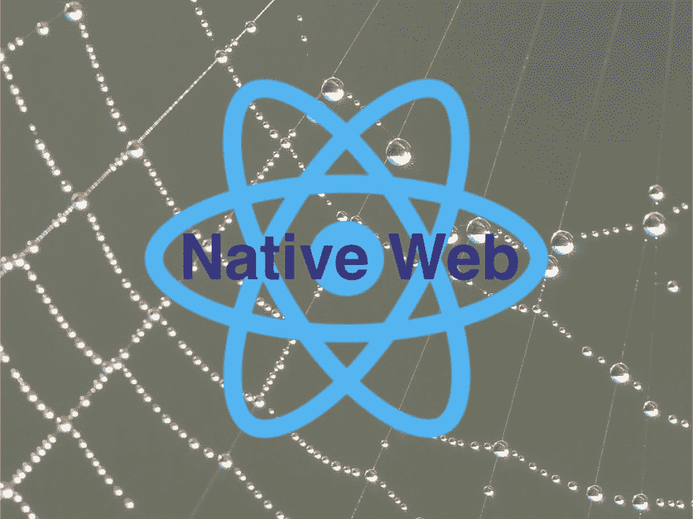

# 2019 年 react-native-web 的状态

> 原文：<https://dev.to/bnevilleoneill/the-state-of-react-native-web-in-2019-5co2>

React-native-web 是我最近偶然发现的最惊人的想法之一。对于 UI 开发人员来说，它让一个长期的梦想成为现实:能够用一个代码库创建一个既能在手机上运行又能在浏览器上运行的应用程序。

我们达到这一点的途径也非常有趣:

*   首先，React 的出现改变了我们创建 web 应用的方式
*   接下来，React Native 发布，吸取了 React 的所有优点，并提供给 iOS 和 Android 应用程序。React Native 最初是为了在移动平台上工作而创建的，它在很大程度上受本地应用程序开发方式的影响。尽管如此，它保留了一些让它感觉更接近 web 开发的关键元素:JavaScript、JSX 标记和 Flexbox
*   最后，react-native-web 的创建是为了让这些 react 原生应用程序再次在浏览器中运行

### 反应原生作为通用 UI 语言

上面最后一步的必要性一开始有点不清楚。我们已经有了 React，它最初是为了构建 web 应用程序而创建的。为什么我们要使用其他不符合明确目的的东西呢？

第一个原因是 React Native 使用 React 的一种子集来生成 UI。如果我们想要一个既能在手机上运行又能在网络上运行的代码，我们应该坚持使用限制性更强的代码；在这种情况下，它是 React Native。只要我们不使用需要一些本机功能的模块，React 本机应用程序应该可以通过 react-native-web 开箱即用地在浏览器中工作。

第二个原因——也是真正让 React Native 在创建通用应用方面优于 React 的原因——是 **React Native 是一种纯 UI 语言**。它定义了一些定义 UI 原语的基本组件，这些组件被认为独立于运行它们的平台。我们可以在 React Native 中创建的所有组件都基于、或等原语，这些原语是对任何可视化界面都有意义的基本元素，无论它在哪里运行。

另一方面，React 的原语只是 DOM 节点——HTML 标签，如

,

，或者

尽管如此，通过使用 HTML 标签将 React Native 原语翻译成 DOM 语言是可能的——这(以及更多)就是 react-native-web 为我们做的。

至此，我们已经理解了为什么使用 React Native 作为 web 和 Native 的通用语言是一个好主意。我确信这是一条正确的道路，但是 react-native-web 已经和我们在一起快两年了，它仍然在努力传播，特别是在 web 开发人员中。

### 一个平台两个生态系统

使用 React Native 创建 web 应用并不简单，这不仅仅是因为我们需要适应它的限制——这就像 Native 和 web 仍然是两个独立的世界。即使已经有可能使用一个代码库并在任何地方运行它，该代码也充满了可以在一个环境中运行而不能在另一个环境中运行的条件。

我们可以用这些库来开发一个 react-native-web 应用程序。

#### 反应本机库

一方面，我们有 React 本地库。我们应该能够将这些库毫无问题地插入到我们的 react-native-web 项目中(除非它们运行本机代码或具有本机依赖性)。

不幸的是，对于我们的通用应用程序来说，性能曾经是 React 原生开发者的主要关注点——当渲染在原生端进行时，我们在移动端实现了最佳的 UI 性能。这样，我们可以在 JavaScript 线程中进行计算，而不会影响接口的响应。那些带有本机代码的库不能在 react-native-web 项目中使用。

如果 React 原生库开发人员尽可能在他们的项目中附带一个替代原生功能的 JavaScript，那就太好了。如果本机代码在浏览器中没有多大意义，React 本机库应该提供一个在 web 环境中运行时不会中断的本机部分的模拟。

即使我们找到了一个与 web 兼容的 React 原生库，让它在我们的 web 应用程序中工作的过程也并不简单。为了构建我们的 web 应用程序，我们使用 webpack 作为捆绑器(稍后将详细介绍这个主题)，它通常不传输 node_modules 文件夹中的文件。React 原生库不需要捆绑来为移动设备工作，所以[我们需要将异常](https://github.com/callstack/react-native-paper/issues/689)添加到我们的 webpack 的模块配置中，以便将它们捆绑在一起。

如果您是 React 本地库开发人员，请🙏，表现出对 react-native-web 的热爱，并在您的库中发布一个 transpiled 版本。如今有一些工具可以让它变得非常简单，比如微捆绑或者 T2 毕丽。

#### 反应库

另一方面，我们有 React 库，它通常被认为可以在浏览器中工作。他们利用 HTML 标签来构造 UI；因此，如果我们在我们的通用应用程序中使用它们，它们将破坏移动版本。

如果你是一个 React 库开发者，并且你认为你的库对移动环境有意义，你应该知道通过使用与 React Native 相同的原语通过 [react-primitives](https://github.com/lelandrichardson/react-primitives) 也可以使它在 React Native 中工作。

开始时，进入流程有点乏味，但是当你习惯了原语和 Flexbox，它甚至可以帮助你改进代码的组织。此外，您将学习 React Native，这在您的工具箱中非常方便。

### **用 React Native 构建通用 app**

创建通用应用程序时，我们必须忍受的另一个痛苦是管理多个捆绑器。在 React Native 中开发和构建应用的标准方法是使用 [Metro bundler](https://facebook.github.io/metro/) 。由脸书制造的 Metro 允许我们在本地构建和测试应用，几乎不需要配置。当您使用 [Expo](https://expo.io/) 创建一个 React 本地应用程序时，它就会发布。

当我们想要创建应用程序的 web 版本时，react-native-web 建议使用 webpack 作为捆绑器。不要误解我——web pack 很棒，但是需要两个不同的构建系统和两种不同类型的配置让我很头疼。

我希望将来我们可以只用一台捆扎机。使用 Metro 来构建我们的 web 应用程序是可能的；我一直在尝试使用 Metro 捆绑我的 web 应用程序，这看起来完全可能。我可以创建一个 JavaScript 包，但是我的 web 应用程序并没有真正工作，因为一些我不想调查的 transpilation 问题。有人想试试吗？

### 融合移动和网络世界

我一直在谈论 React Native 和 [ReactDOM](https://www.npmjs.com/package/react-dom) 开发人员如何调整他们的库，使它们彼此友好，这应该只是第一步。

理想情况下，我们会将两个世界统一成一个通用的开发者社区。这不仅仅是使库在任何环境下都不会崩溃；更确切地说，它是在创造满足两个世界需求的工具，并为它们增加价值。

如前所述，react-native-web 应用确实受到了移动应用最佳实践的影响。目前，当我们创建一个 react-native-web 应用程序时，我们或多或少会让移动应用程序适应浏览器。但是，我们真的想要一个拥有全幅布局元素和可折叠抽屉、运行在大屏幕桌面浏览器中的手机应用吗？大概不会。

这就是为什么响应式布局革命在 2000 年代中期开始:让我们的设计适应不同的屏幕尺寸。这现在是任何 web 项目的一个基本特性。在移动应用中，响应式用户界面并不常见。但是，构建适应手机、平板电脑和桌面的应用程序而不需要编写两次代码不是很棒吗？

响应式布局只是 web 概念的一个例子，它可以为移动开发增加价值。另一个好方法是 URL。我们不需要在我们的移动应用程序中使用 URL，但是为我们的屏幕分配一个唯一的标识符并直接访问某个点的概念非常强大。这在移动应用程序中也不常见，这就是为什么在 react-native-web 应用程序中处理 URL 相当困难，尽管它应该是非常基本的。

React-native-web 尽了很大努力将移动产品引入 web 开发，但是在其他方面还没有太多进展。总的来说，**我们应该开始纯粹从 UI** 的角度来考虑，不管我们在处理什么平台——我们还没有到那一步。

很难在 React Native 中定义悬停交互，因为当它被创建时，我们认为它们是不必要的。出于同样的原因，浏览器中的手势交互也不是小菜一碟。所有这些情况都应该被一种旨在成为定义 UIs 的通用方法的语言轻松涵盖。

### **欢迎来到新世界**

创建通用应用程序是一个梦想成真，但就像大多数刚刚起步的事情一样，要让每个人都感到轻松，还有很多工作要做。

这是一个尚未探索的世界。作为一名库开发人员，我认为这是我们构建未来社区将使用的下一组工具和库的大好机会。你不想成为“下一个 Redux”的创造者吗？

我想特别呼吁世博团队为世博环境增加对 react-native-web 的支持，因为我认为他们可以在过渡中发挥重要作用。最著名的移动开发平台推出现成的 web 包，这将是对通用应用程序的巨大推动。

让 Metro 为 web 服务将为 Expo(那里有一个巨大的社区)打开 web 开发的大门，但是教育 React 本地开发人员嘲笑他们在 web 上工作的本地依赖性将保证您的项目在您希望的时候退出。对每个人来说都是双赢的局面！

### **2019 年用 React Native 打造通用 app 值得吗？**

肯定是的！尝试在所有平台上运行同一个项目当然仍然具有挑战性，并且还有许多空白需要填补。但是我们已经可以使用 React Native 作为一种语言来为我们的应用程序的不同版本创建 UI，即使它们针对不同的环境，也可以重用大部分相同的代码。

如果你想帮助解决上面的一些问题，你将推动通用应用程序开发的梦想，整个社区都会感谢你。

如果你只是想最大化你的代码可重用性，建立一个 [Lerna 项目](https://lernajs.io/)，将你的应用程序的移动和网络版本作为单独的包，并开始使用 React Native 创建你的组件。您将重用整个 UI，但是您将能够单独处理特定于平台的问题——无需担心兼容性。

如果您对这种方法感兴趣，我强烈推荐您阅读来自 [Lucas McGartland](https://medium.com/u/2b3150c688d0) 的文章 [*用通用组件库*](https://hackernoon.com/building-cross-platform-applications-with-a-universal-component-library-e6292ca9a15) 构建跨平台应用程序。

### Plug: [LogRocket](https://logrocket.com/signup/) ，一款适用于网络应用的 DVR

<figcaption>[https://logrocket.com/signup/](https://logrocket.com/signup/)</figcaption>

LogRocket 是一个前端日志工具，可以让你回放问题，就像它们发生在你自己的浏览器中一样。LogRocket 不需要猜测错误发生的原因，也不需要向用户询问截图和日志转储，而是让您重放会话以快速了解哪里出错了。它可以与任何应用程序完美配合，不管是什么框架，并且有插件可以记录来自 Redux、Vuex 和@ngrx/store 的额外上下文。

除了记录 Redux 操作和状态，LogRocket 还记录控制台日志、JavaScript 错误、堆栈跟踪、带有头+正文的网络请求/响应、浏览器元数据和自定义日志。它还使用 DOM 来记录页面上的 HTML 和 CSS，甚至为最复杂的单页面应用程序重新创建像素级完美视频。

[免费试用](https://logrocket.com/signup/)。

* * *