# 1000 多小时兼职项目的故事

> 原文：<https://dev.to/bcnzer/the-tale-of-the-1-000-hour-side-project-56ic>

# 起源

现在是 2014 年，我决定将我的举重提升到一个新的水平，并加入当地的举重协会。我参加过几次比赛，大多是新手比赛。

我主动提出帮忙，因为他们总是需要志愿者。这也为我提供了一个了解这项运动的机会。

一天，组织者让我在当地的新手比赛中“操作电脑”。这意味着使用他们的程序来运行竞争。原来这是一个 Excel 电子表格，充满了宏，叫做 [NextLifter](http://www.nextlifter.com/) 。至今仍在使用。

[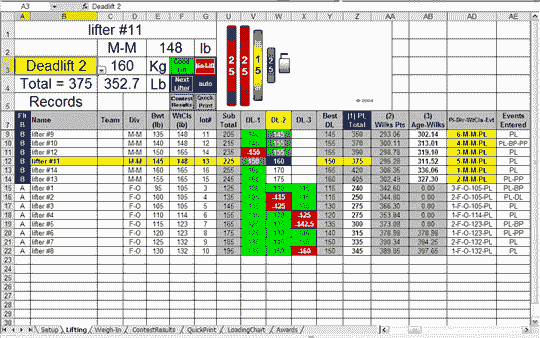](https://res.cloudinary.com/practicaldev/image/fetch/s--wBIKl4jO--/c_limit%2Cf_auto%2Cfl_progressive%2Cq_auto%2Cw_880/https://thepracticaldev.s3.amazonaws.com/i/be41epe70etx4c3agiu4.png)

<figcaption>Sample of NextLifter, which is an Excel spreadsheet that makes heavy use of macros</figcaption>

[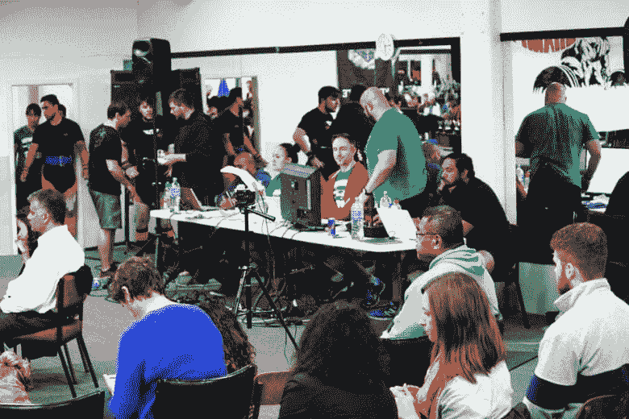](https://res.cloudinary.com/practicaldev/image/fetch/s--nh_LvUkq--/c_limit%2Cf_auto%2Cfl_progressive%2Cq_auto%2Cw_880/https://thepracticaldev.s3.amazonaws.com/i/g1te9h1km1c9a0nwfsmg.jpg)

<figcaption>Me running the computer. I’m wearing the red shirt at the desk</figcaption>

[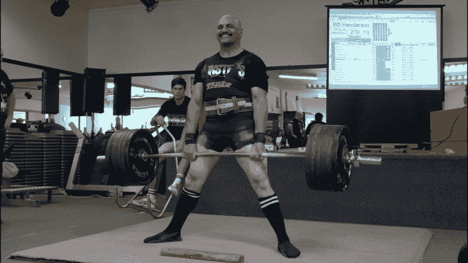](https://res.cloudinary.com/practicaldev/image/fetch/s--PKNhyN13--/c_limit%2Cf_auto%2Cfl_progressive%2Cq_auto%2Cw_880/https://thepracticaldev.s3.amazonaws.com/i/xve7qcvznosv7d1o2htu.png)

<figcaption>The spreadsheet in action at the same comp</figcaption>

# 灾难来袭

在我们开始后不久，一位年轻的女士问我是否能记住她的名字。名字和姓氏是颠倒的。

我做了更改，然后 Excel 表开始抛出错误并显示调试对话框。

比赛渐渐停止了。我吓坏了。

谢天谢地，我们把所有东西都写在了纸上(总是有纸质备份)，所以我们设法在上面运行，但这很痛苦。

在回家的路上，我决定尝试替换这个@#$@#$@#$电子表格。

从那时起，我的动机就是建造一些东西来帮助我的朋友，让志愿者的生活更轻松。

# 怎么称呼它？！？

我讨厌给事物命名，但是当你开始一个新项目时，这是工具问的第一件事。我最初给它起了一个代号:*洛基项目*。

然后我选定了一个名为**的观察员**。我觉得这个名字很贴切，因为观察员是一名志愿者，如果你正在努力完成你的人生，他的工作就是帮助你扶好栏杆。你可以说他们支持你。

<figcaption>All the guys in white are spotters, ready to grab the barbell incase the lifter can’t get it up</figcaption>

# 时间

我通常在晚上 8 点到 10 点半之间有空——只要孩子们上床睡觉。有时早一点，有时晚一点。

在我开始这个项目之前，我大部分时间都在玩游戏。这个项目的开始大致与我意识到我在游戏上浪费了多少时间相吻合。

无可否认，一开始很难。游戏简单、有趣且令人放松。所有这些编码感觉像是一种不同形式的工作，可能会非常令人沮丧，尤其是在我学习的时候。

[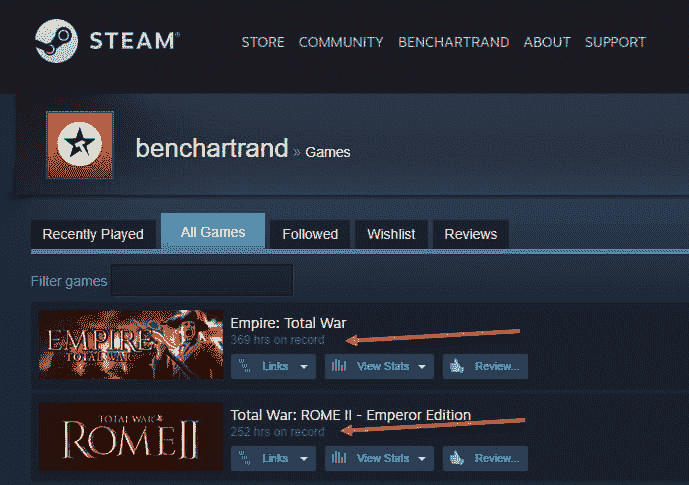](https://res.cloudinary.com/practicaldev/image/fetch/s--BjEATven--/c_limit%2Cf_auto%2Cfl_progressive%2Cq_auto%2Cw_880/https://thepracticaldev.s3.amazonaws.com/i/3j6l14626u34a09x1ieo.png)

<figcaption>Screenshot from Steam. These numbers shocked me</figcaption>

值得注意的是，我仍然偶尔玩游戏，但不像以前那么频繁了，而且它们通常是休闲游戏。例如:我可能会玩 30 分钟，然后在晚上 8 点停下来写代码。

# 跟踪我的时间

我的雇主曾经告诉我不要在业余时间做任何事情。我清楚地记得那次谈话，以及那次谈话有多可笑。

我决定使用一个叫做 [WakaTime](https://wakatime.com/) 的工具。它被安装到了 [Visual Studio](https://visualstudio.microsoft.com/) 中，这样它就可以跟踪我所花的时间。我想，更糟糕的情况是，这将证明我只是在业余时间做我的项目。

[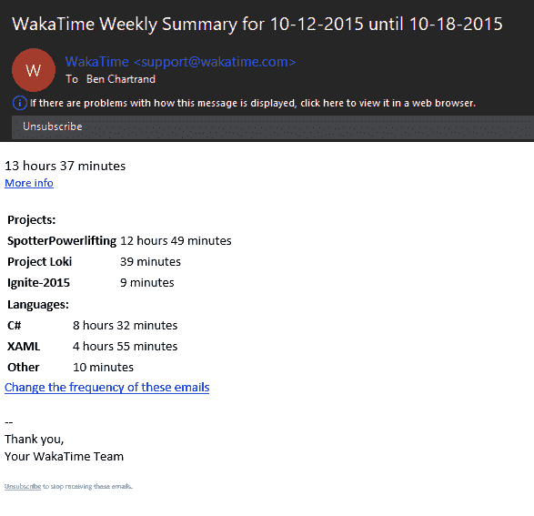](https://res.cloudinary.com/practicaldev/image/fetch/s--XFJfgoCw--/c_limit%2Cf_auto%2Cfl_progressive%2Cq_auto%2Cw_880/https://thepracticaldev.s3.amazonaws.com/i/p738bw1l4ss13pqfrqp2.png)

<figcaption>Sample weekly email from WakaTime</figcaption>

我忘了我在 WakaTime 登录了多少次。记得 100 多小时的时候给朋友看了一张截图。我很确定它已经持续了数百个小时(300？400?)等我处理掉的时候。

2016 年 11 月，我意识到 Wakatime 已经很久没有跟踪我的时间了。沮丧之下，我取消了订阅，使用了一个名为 Codealike 的工具。我会给你看一些我存档的来自 Codealike 的截图。

顺便说一句，值得强调的是我没有每天都花时间。也有很长一段时间我没有写任何代码，主要是在圣诞节前后。

# 它开始了。版本 1–WPF

> 这很容易。我会马上把它做完。
> 我。吹牛

我想提供一个独立的程序——可以在他们的电脑上运行的程序。我选择了使用 [WPF](https://en.wikipedia.org/wiki/Windows_Presentation_Foundation) (Windows 呈现框架)和一个叫做 [Mahapps](https://mahapps.com/) 的框架。GitHub 在最初的 Windows 桌面客户端中使用了这个组合。

我对 XAML 并不熟悉，但我是和其他一些工具和框架一起学习的，比如 SQLite 和 Entity Framework。

[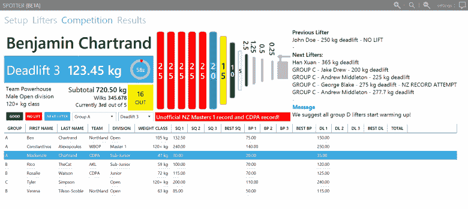](https://res.cloudinary.com/practicaldev/image/fetch/s--B8mX2qs_--/c_limit%2Cf_auto%2Cfl_progressive%2Cq_auto%2Cw_880/https://thepracticaldev.s3.amazonaws.com/i/dpucwpv9hbtmcfbnxd05.png)

<figcaption>Screenshot from July 2015</figcaption>

进展缓慢。除了学习所有这些新技术，我还沉浸在这项运动的细节中，这项运动的技术性和复杂性令人惊讶。

# 第二版——UWP

> 这太棒了！我会在下一个大公司
> 我之前完成这件事。仍然非常乐观

Windows 10 即将推出，Windows 商店也是如此。大约在 2015 年 10 月，我决定换成 [UWP](https://docs.microsoft.com/en-us/windows/uwp/get-started/universal-application-platform-guide) ，这是 XAML 的一种形式。这意味着我可以调整我的应用程序，并通过 Windows 商店交付。

一个主要的挑战是我失去了 MahApps。没有 UI 框架好。我不得不自己做所有的事情，并且我与用户界面做斗争。

也就是说，我确实推进了我的项目，并且做了一些很酷的东西。一个是这个 [blade UI](https://liftcodeplay.com/2015/11/12/design-pattern-blades-for-sequential-data-entry-wizards-in-uwp/) 控件，类似于 Azure 门户中使用的控件。后来它被其他人选中，并被制作成一个通用控件，在 [UWP 社区工具包](https://docs.microsoft.com/en-us/windows/communitytoolkit/)中被称为 [BladeView](https://docs.microsoft.com/en-us/windows/communitytoolkit/controls/bladeview) 。

[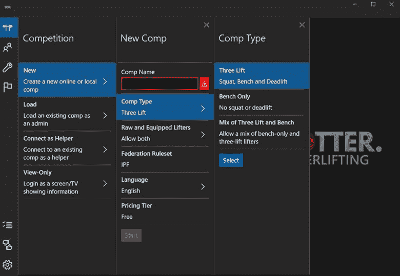](https://res.cloudinary.com/practicaldev/image/fetch/s--CaYswlSG--/c_limit%2Cf_auto%2Cfl_progressive%2Cq_auto%2Cw_880/https://thepracticaldev.s3.amazonaws.com/i/zwb9xphzi40396gzyfsn.png)

<figcaption>My implementation of the Blade control. Pretty snazzy</figcaption>

# 什么叫我不能调配到店里？！？

事情进展得很顺利。我想通过 Windows 商店给我的朋友一个测试版。

作为第一步，我在发布模式下构建了我的应用程序。它花了很长时间…最终崩溃了。一次又一次地发生。

我直接向微软的团队提出了一个问题，他们给了我一个基本上没有印象的回答，大意是“对不起，你正在处理一个我们知道可能存在但尚未遇到的问题”。

我无法部署我的应用程序，我很生气。我发誓远离 UWP。

到目前为止，我的朋友们什么都没说，但我能看出他们对 Windows 桌面应用不感兴趣。他们有苹果电脑、iPads 等等。此外，还需要互联互通。是时候进入基于网络的版本了。

# 版本 3–ASP.NET 核心

> 这将是迄今为止最好的版本！我会在提举季节
> 开始前完成

我决定使用 ASP.NET 核心，写一个 MVC 应用程序。ASP.NET 核心是开源的，跨平台的，在当时，非常新-早期测试版。

一开始进展缓慢，我经历了早期采用者的痛苦，但我取得了稳步的进步。这感觉既新鲜又令人兴奋。

当实际运行比赛的屏幕出现时，我意识到我需要使用一些 Javascript。就在那时，我爱上了 Vue。一起工作是如此的快乐。我想用 Javascript 做更多的事情。

在这一点上，我已经在 Codealike 中打卡了几个小时，如下所示。

<figcaption>Codealike showing 413 hours tracked as of 27 Sept 2017</figcaption>

[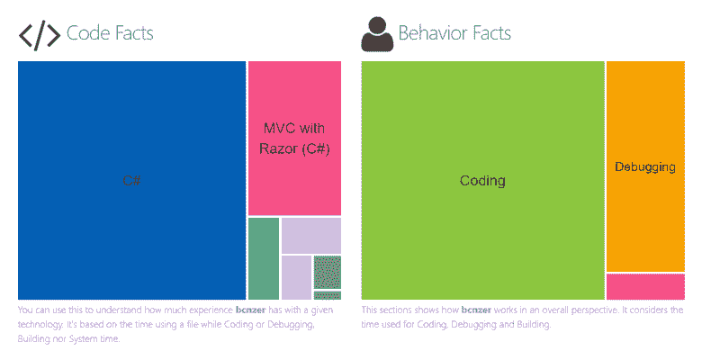](https://res.cloudinary.com/practicaldev/image/fetch/s--jBYPYcpD--/c_limit%2Cf_auto%2Cfl_progressive%2Cq_auto%2Cw_880/https://thepracticaldev.s3.amazonaws.com/i/shvya3ajcmt9ufg3bgl9.png)

<figcaption>Some code and behaviour facts from Codealike</figcaption>

我还向一个开源项目——ASP.NET 核心文档提交了我的第一份公关文件。

# 你想当 CTO？

还记得我提到过我的雇主吗——那个不想让我花时间兼职写代码的人？同一位雇主给了我 CTO(首席技术官)的职位。

所有这些我在业余时间学到的东西，我都带到了工作中，但是我从来没有提到过我的项目。

好像他们悄悄地意识到我知道很多。很明显我是唯一一个投资的人(烦恼？)学习新技术。

起初，这个头衔只不过是一种尊称(在与供应商打交道时有所帮助)，但随着时间的推移，它带来了引入变革的力量。

git 就是一个例子。多年来，我们一直使用一种类似 SourceSafe 的传统工具。我把所有人都转移到了 git 和 Visual Studio Team Services(现在叫做 Azure DevOps)。所有现实生活中的知识和经验都是非常宝贵的。

# 版本 4–vue . js SPA+ASP.NET 核心 API

> 我最终会完成这个的。但是，当我做到的时候，会很棒的！
> 我

我喜欢和 [Vue.js](https://vuejs.org/) 一起工作。我也发现了 [Visual Studio 代码](https://code.visualstudio.com/)的乐趣。我决定用纯 ASP.NET 核心 API 将我的应用程序重写为单页应用程序(SPA)。

这是一个巨大的飞跃。我对现代 Javascript、Node 和 NPM 一无所知。这是采用新技术的另一个例子，需要时间来提高效率，并最终回到以前的状态。但这是值得的。

[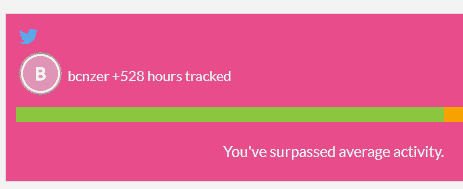](https://res.cloudinary.com/practicaldev/image/fetch/s--0tzsX23F--/c_limit%2Cf_auto%2Cfl_progressive%2Cq_auto%2Cw_880/https://thepracticaldev.s3.amazonaws.com/i/n3zkhq1v7gj00lpx6h7u.png)

<figcaption>528 hours tracked in Codealike… and growing!</figcaption>

与 ASP.NET 核心为 API 工作是伟大的，但托管 API 的想法困扰着我。我想尽可能避免支付任何费用。我正在编写一个事件应用程序，所以可能会有流量为零的时候，也可能会有堆的时候。

然后我听说了这个神奇的东西叫做无服务器，具体来说就是 [Azure Functions](https://azure.microsoft.com/en-us/services/functions/) 。

# 版本 5–vue . js SPA+Azure Functions API

> 这项技术太神奇了。额外的延迟是完全值得的。
> 我，现在开始对时间框架变得现实了

在 Azure Functions 第一次出现的时候，我开始玩它。我意识到我可以用它来编写我的整个 API！

这很棒，但我想做的一些事情在 Azure Functions 中并不简单。例如，我想通过 Auth0 进行 JWT 验证。这很痛苦，但我想通了，甚至创建了一个演示应用程序来展示它是如何工作的。

我取得了很大的进展，设计了一个惊人的架构，包括 CQRS，这应该可以保持我的成本很低(每月不到 20 美元)。在这段时间里，最令人惊讶的是我对建筑有了更多的了解。我最喜欢的一本书是《云应用架构指南》。

我还用 [Cloudflare Workers 和 Workers KV storage](https://liftcodeplay.com/category/cloudflare/) 进行了大量实验，这是一种无服务器的边缘存储服务。

大约在这个时候，我意识到 Codealike 已经很久没有跟踪时间了，尤其是从 VS 代码开始。我恼怒地扔掉了它。以下是我能找到的最后一张截图。值得强调的是，实际工作时间要高得多。

[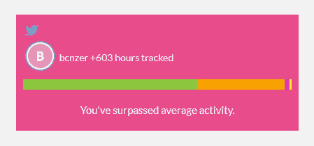](https://res.cloudinary.com/practicaldev/image/fetch/s--lU9wL5DK--/c_limit%2Cf_auto%2Cfl_progressive%2Cq_auto%2Cw_880/https://thepracticaldev.s3.amazonaws.com/i/z4i4xutruhl2a3bcfls9.png)

<figcaption>This is the last screenshot from Codealike</figcaption>

# 第 6 版–view . js+nuxt 和 Firebase

> 也许我的朋友们已经忘了我还在努力？哦，好吧，当他们得到它的时候，他们会得到它的。
> 我

对于我的 Vue.js SPA，我决定使用 [Nuxt.js](https://nuxtjs.org/) 重写它，并将我的用户界面组件化。以前的版本没有组件，所以有些屏幕一片混乱。

大约在同一时间，我得出结论，我的 Azure 功能有点麻烦。我的痛苦是我自己造成的，因为我过度设计了我的后端。

一个朋友建议我的应用程序适合 NoSQL 的商店。他的话一直在我脑海中回响。

我决定进入谷歌云商店。当时 Firestore 还在测试阶段，但使用起来很愉快，甚至比我以前的还要便宜，它附带了 auth，最棒的是，我的开发全是 Javascript。

我用 Firebase 和 IndexedDb(通过 [Dexie.js](https://dexie.org/) )做了一些非常漂亮的东西——本质上是使用 IndexedDb 作为本地缓存，并从 Firestore 获得实时更新，以向其推送更新。对于我的用例来说，这是一个很棒的例子。我曾计划使用 IndexedDb 作为我与服务人员的离线解决方案的一部分。

我对自己的进步非常满意。一切都在一起，看起来棒极了。

我采取了我称之为“戴森”的方法。我想建造一些奇妙的东西——尽我所能的好。这是故意的，因为我是为对这项运动一无所知的志愿者建造的。这与更“敏捷”的方法形成对比，更“敏捷”的方法是构建最小化的东西并交付。

例如:假设有 35 名举重运动员。你不能让他们一个接一个地举起来。你把它们分成叫做航班的组。问题是创建航班有特定的规则/逻辑，例如:

*   女人先走
*   最小开启升程到最大
*   每次飞行不超过 14 名举重运动员

NextLifter 假设您可以手动完成这项工作。我可以证明，作为一名志愿者，这是一场噩梦。

使用我的应用程序，你只需按一个按钮，它就会为你做到。之后，您可以拖放升降机来手动调整顺序。

下面是一些截图。[点击此链接了解更多信息](https://photos.app.goo.gl/xLAWS5Kbb2dUKTkd7)。这些截图没有显示的是所有的加载效果、过渡等等。此外，要创建一个帐户，你可以使用你的电子邮件或谷歌帐户。所有对 Firestore 的请求都有身份验证/授权。

 

<figcaption>所有举重运动员页面</figcaption>

[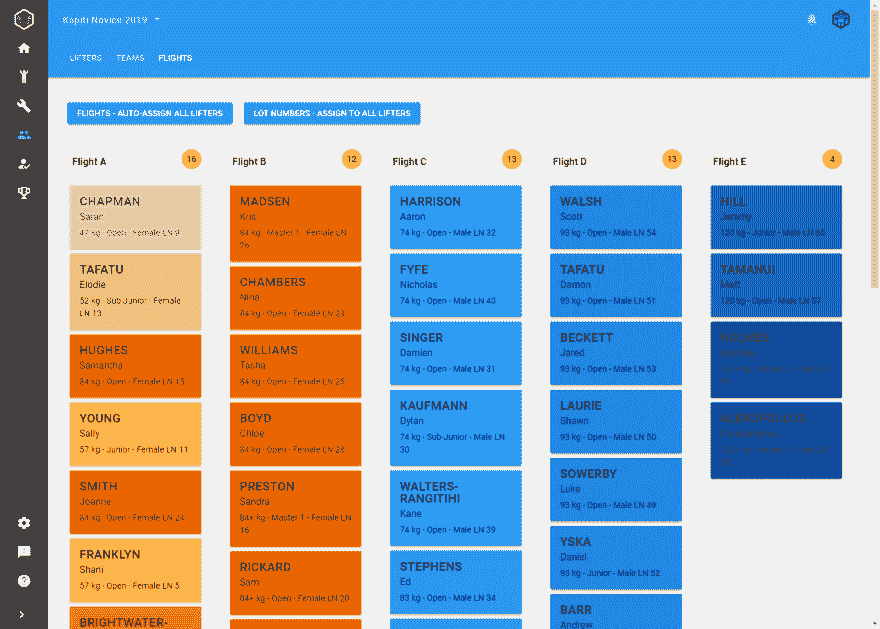](https://res.cloudinary.com/practicaldev/image/fetch/s--Y1FnmcNO--/c_limit%2Cf_auto%2Cfl_progressive%2Cq_auto%2Cw_880/https://thepracticaldev.s3.amazonaws.com/i/xnuvhmb3db47f5l8u9ks.png)

<figcaption>The Flights screen. Click a button and it creates all the flights for you (lots of fun Javascript sorting algorithms). You can also drag and drop lifter and create more flights</figcaption>

[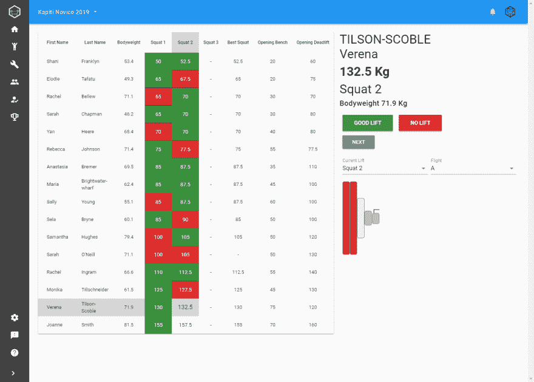](https://res.cloudinary.com/practicaldev/image/fetch/s--5qxcrtyI--/c_limit%2Cf_auto%2Cfl_progressive%2Cq_auto%2Cw_880/https://thepracticaldev.s3.amazonaws.com/i/22evuzy9q4hx9ty3tf8m.png)

<figcaption>The main screen in Spotter - where you run a competition once it's live</figcaption>

[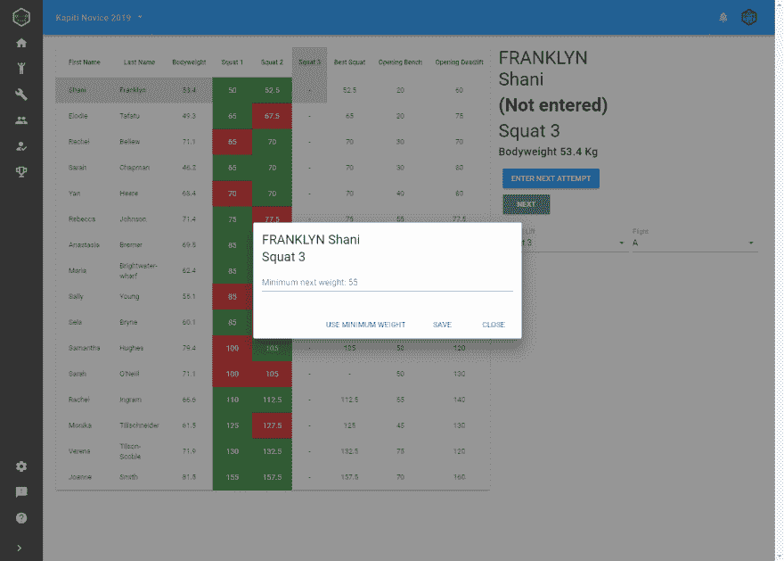](https://res.cloudinary.com/practicaldev/image/fetch/s--S87VN2U2--/c_limit%2Cf_auto%2Cfl_progressive%2Cq_auto%2Cw_880/https://thepracticaldev.s3.amazonaws.com/i/y96m9nyka1u2cddpm7bq.png)

<figcaption>Entering the next weight. Notice how it suggests a legal next weight. If you passed your previous lift and it's a comp run under IPF rules, you must go up by a minimum of 2.5 kgs. This is the type of functionality I focused on as I knew it made lift easier for volunteers like myself</figcaption>

# 有一天，我停止了工作

我从一个朋友那里得到了一个关于[开瓶器](https://gitlab.com/openpowerlifting/openlifter)的消息。它是由制作《疯狂的快速》【https://openpowerlifting.org】网站的同一个团队制作的。

他们的应用程序旨在取代电子表格。它是本地独有的，使用[电子](https://electronjs.org/)建造。

我的方法更多的是关于在线，首先，在任何设备上工作，并且尽可能的用户友好。

当我看着他们的代码时，我很惊讶。几个月内，他们建了这么多。让我担心的是，我意识到有一大堆我还没有开始考虑的复杂性。

举个例子:在真正的大型比赛中，吊装可能会分好几天进行，而且吊装可能会在不同的平台上同时进行。斯波特处理不了这个。还有很多例子。

最近，我在我的应用程序上投入了大量的空闲时间，以为自己已经接近完成了。我意识到我面前有如此多的工作和复杂性。

我甚至不能开始匹配他们的速度。我是一个人。他们似乎有 4 个以上的人在工作。另外，我总是转移注意力去探索新技术，写博客等等。

这导致一些痛苦的灵魂探索。我决定最终把这个项目放在一边。我做了最后一个名为 **final commit** 的提交，并推了它。

还记得我说过 1000 小时是我保守的估计吗？我认为实际数字接近 1500 小时，但我无法确认。

# 不要为我哭泣，因为我学到了太多

我怎么强调这个项目对我的职业生涯的巨大影响和益处都不为过。我通过这个项目重塑了自己，并将继续这样做。

我提到了我是如何成为 CTO 的。这是另外两个最近的例子:

示例 1:所有关于无服务器的知识(Azure 函数和 Cloudflare Workers)引导我

*   做[2018 年六场](https://liftcodeplay.com/talks/)2017 年一场。这包括在微软新西兰的两次演讲和一次大型会议
*   接受播客访谈，讨论无服务器、架构等内容。

例子 2:当我在我现在的雇主那里面试时，他们要求提供代码样本。我向他们展示了我的副业——ASP.NET 核心代码、我的 Azure 账户、VSTS CI / CD 管道等等。

我现在被认为是工作中的 DevOps 和无服务器的家伙。

据我所知，随着时间的推移，我还写了一堆博文。

# 机遇

我们中的许多人选择提供成长和学习机会的角色/雇主。不幸的是，这些机会在数量和持续时间上都是有限的。

有了这个项目，我感觉自己在创造机会。如果我想学点什么，我会去做。这有助于我没有顾客，所以我只对自己负责。

# 成长心态

我意识到拥有一个成长的心态是至关重要的。下图很好的解释了这一点。

我第一次开始的时候非常困难。最难的部分是最初接受我必须做出改变，我在技术方面落后了(前雇主有很多遗留的技术)。

[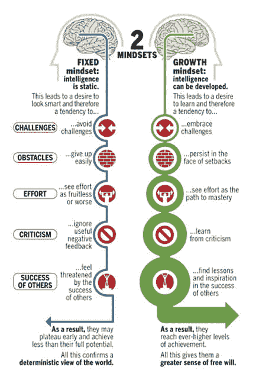](https://res.cloudinary.com/practicaldev/image/fetch/s--yqWpJguM--/c_limit%2Cf_auto%2Cfl_progressive%2Cq_auto%2Cw_880/https://thepracticaldev.s3.amazonaws.com/i/jsisbifn6dzexr6e9750.jpg)

# 志同道合的人

当我在做我的项目时，我使用了 Twitter。我能够与专家和其他志同道合的开发人员交谈并向他们学习。随着时间的推移，我真的很珍惜我与人们建立的联系。

我喜欢与同事分享我所学到的东西。我举办了“午餐和学习”会议，讨论诸如 Azure 功能和我使用 Cloud Firestore 之类的话题。

与对偶尔出现的问题持开放态度并愿意倾听的人一起工作也很棒，即使只是我分享一个他们会理解/欣赏的成就(例如，嘿，我离线工作了！).

我开玩笑地称自己为*初级荣誉美联储*(前端开发人员)。

# 从这里到哪里？

与斯波特，我不打算再次工作。不久的将来，我可能会对它进行开源。

我喜欢学习。我有一个巨大的“学习”清单。我在考虑建立一些更小的项目来探索技术/概念，如 [PWAs](https://developers.google.com/web/progressive-web-apps/) 。斯波特觉得这是一个永无止境的项目，所以我热衷于完成项目。

我想把自己推得更远，远离我熟悉的领域。比如:我想学 Rust，专门在 Linux 环境下工作。

作为一名贡献者，我也想参与到开源中来，并且开源更多我的项目。

我还想做更多的事情。我期待着下一个 1000 小时！