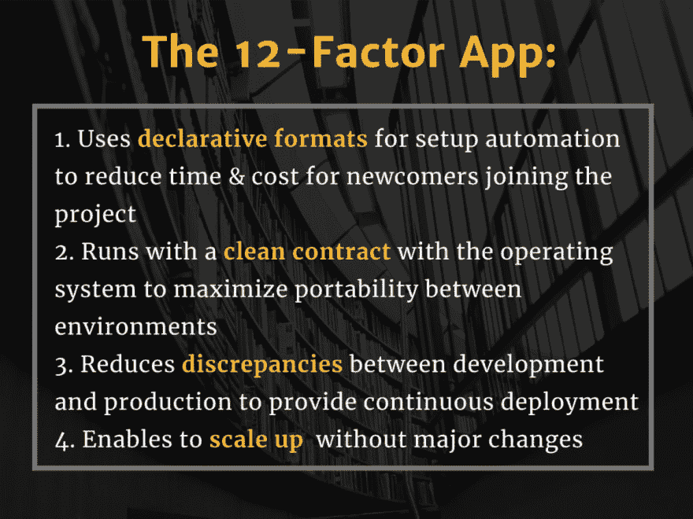
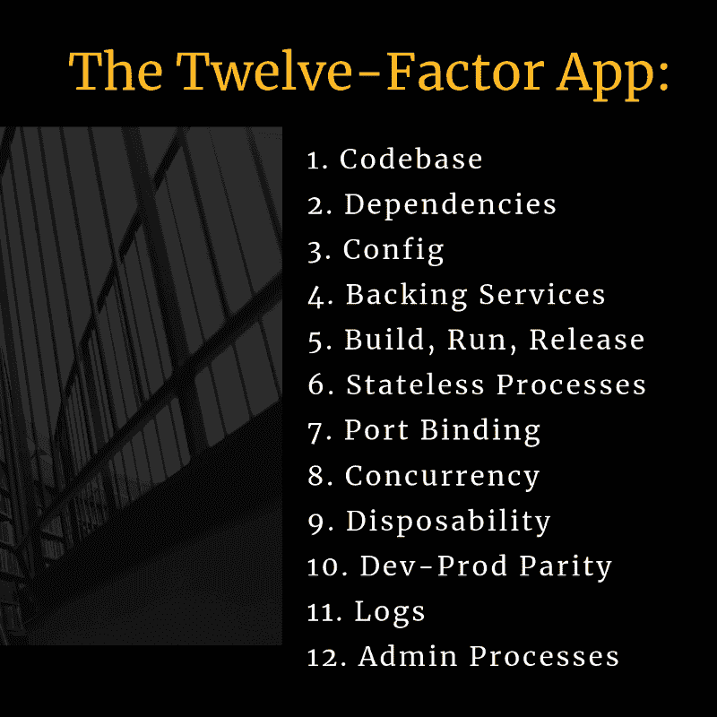

# 十二因素应用——成功的微服务指南

> 原文：<https://dev.to/simon_sugob/the-twelve-factor-appa-successful-microservices-guideline-3a1h>

# 为什么是十二因子 App？

现在大家都在做微服务。无论你在哪里工作，无论是在初创公司还是大公司，你都会遇到微服务架构。Heroku 在定义什么是支撑架构的坚实基线方面做得很好。

2011 年，Adam Wiggins [Heroku 的联合创始人]基于他们自己的经验，发表了关于构建软件即服务的十二要素应用程序方法学[。它是技术和语言不可知的，但成功地与微服务、容器和 CI/CD 管道兼容，重点是 DevOps，因此，这个主题在我的雷达上。](https://12factor.net/)

## 12 因素应用程序基于一些[参数](https://12factor.net/)来部署云原生应用程序:

Tibco 的 Matt Ellis 表示,“12 因素应用检查表实际上只是一套指导原则，规定了如何构建微服务来正确支持独立管理和迭代服务的概念。在构建解耦的无状态微服务时，这些因素非常重要”。那么 12 因子 app 应该是什么呢？看 28 秒。视频:[https://www.youtube.com/watch?v=7PH3AOePAXc](https://www.youtube.com/watch?v=7PH3AOePAXc)

## 这份文件是写给谁的？

*“任何开发人员构建作为服务运行的应用程序。作者说，部署或管理此类应用程序的运营工程师“T1”。*

# 现在让我们来探究 12 个因素:

完整内容在[那里](https://12factor.net/)出来了，没必要再重复了。我将只概述以下各点的核心信息:

## 因素 1:代码库

构建在一个代码库之上，由版本控制系统(VCS)完全跟踪。部署应该是自动的，这样一切都可以在不同的环境中运行，而不需要任何工作。您应该始终为单个应用程序准备一个存储库，以简化 CI/CD 管道。

## 因素二:依赖性

不要将任何依赖项复制到项目代码库，而是使用包管理器。请始终记住使用正确版本的依赖项，以便所有环境保持同步并重现相同的行为。

## 因素 3:配置

将配置存储在环境变量中。配置和代码应该严格分开。无论应用程序部署在哪里，代码都应该保持不变，但是配置可能会有所不同。

## 因素 4:后台服务

将后台服务视为附加资源，因为您的服务应该易于互换。您必须能够轻松地将支持服务从一个提供者切换到另一个提供者，而无需更改代码。这将确保良好的可移植性并有助于维护您的系统。

## 因素 5:构建、运行、发布

十二因素应用程序要求在构建、发布和运行阶段之间严格分离。每个版本都应该有一个唯一的版本 ID，并且版本应该允许回滚。系统的自动化和维护应该尽可能简单。然后，您将所有东西放在一个可以发布并安装到环境中的东西中，然后就可以运行它了。

## 因素 6:无状态进程

您不应该将状态引入到您的服务中，应用程序应该作为一个单一的、无状态的进程来执行。十二要素过程是无状态的，不共享任何东西。这个因素是微服务架构的核心。

## 因素 7:端口绑定

您的服务应该通过端口绑定对其他人可见。如果您构建了一个服务，确保其他服务如果愿意的话可以将它视为一个资源。十二因素应用程序是完全独立的。

## 因素 8:并发

将你的应用分成更小的部分，而不是试图让你的应用变得更大(通过在最强大的机器上运行一个实例)。定义的小型应用程序允许根据需要向外扩展，以处理不断变化的负载。每个流程都应该单独扩展，使用因子 6(无状态)，很容易扩展服务。

## 因素 9:一次性

流程应该不那么耗时。一定要跑得快，停得快。你能处理失败。如果没有这一点，自动扩展和部署、开发的便利性将会降低。你可以用容器来实现。

## 因子 10:开发-生产平价

让开发、试运行和生产尽可能相似，这样任何人都可以理解和发布它。持续部署需要基于匹配环境的持续集成，以限制偏差和错误。这也隐含地鼓励了一种 DevOps 文化，在这种文化中，软件开发和操作是统一的。集装箱化在这里是一个巨大的帮助。

## 因子 11:日志

将日志视为事件流。日志对于调试和检查应用程序的总体健康状况非常重要。同时，您的应用程序不应该关心这些信息的存储。相反，这些日志应该被视为由单独的服务捕获和存储的连续流。

## 因素 12:管理流程

将管理任务作为一次性流程运行，例如数据库迁移或在环境中执行一次性脚本。为了避免搞乱数据库，请使用您在应用程序旁边构建的工具来检查数据库。

# 实践中的十二要素 App

[Greg Pryzby](https://github.com/gpryzby) 在他的演讲“你必须有 12 个因素才能骑行”中讨论了这种方法，并解释了 12 个因素应用程序和 OpenStack 如何互补:【https://youtu.be/GZ4sAEUMOnM】T2

还有两篇文章值得一读:[《为什么是 12 因子应用模式、微服务和 cloud foundry Matter》](https://spring.io/blog/2015/01/30/why-12-factor-application-patterns-microservices-and-cloudfoundry-matter)作者蒂姆·斯潘[《我如何使用 12 因子 App 方法论用 Java 构建 SaaS 应用&Scala》](https://medium.com/hashmapinc/how-i-use-the-twelve-factor-app-methodology-for-building-saas-applications-with-java-scala-4cdb668cc908)作者杰伊·卡帕德尼斯。

# 结论

微服务仍然是相对较新的架构模式，因此我真的建议您学习[细节](https://12factor.net/)中的十二因素应用方法。以我的经验来看，大多数微服务项目一开始都会失败。这不是因为深层的设计问题，或者编码困难，事实上，是因为把基本的东西搞错了。

12 个因素中的一些点可能看起来微不足道，但是当通过少数环境运行 20 多个服务时，它们可能非常重要。

让我以 Tim Spann 对他为什么决定结合 12 因素应用模式、微服务和云计算的独特解释来结束我的发言:

*“当你没有好的过程和平台来帮助你时，好的代码就会失败。当你没有一个拥抱开发运维、微服务而不是巨型独石的良好文化时，优秀的团队就会失败。”*

也贴[这里](https://www.hiredevops.org/the-twelve-factor-app-successful-microservices-guideline/)