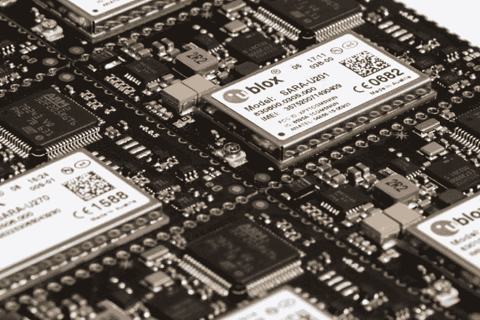
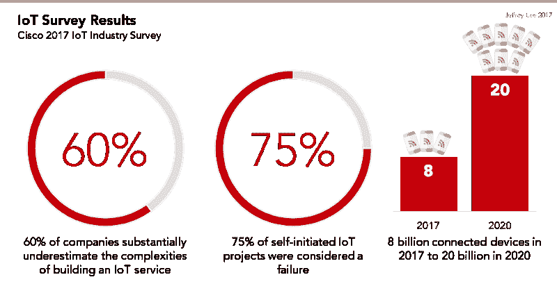
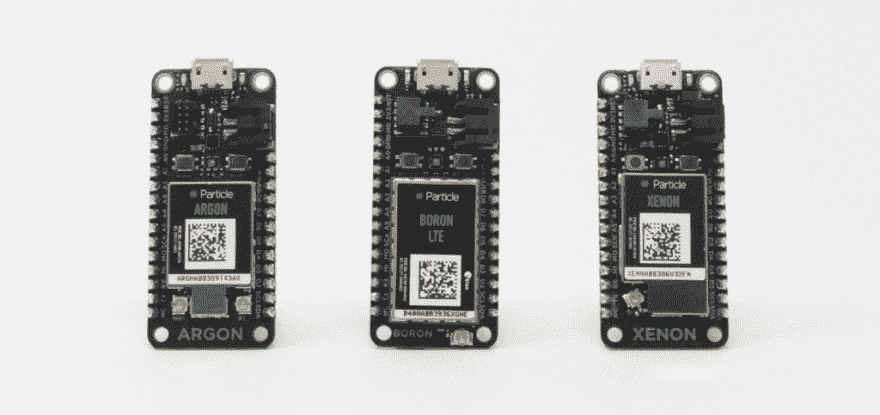
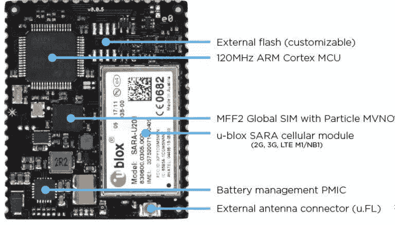
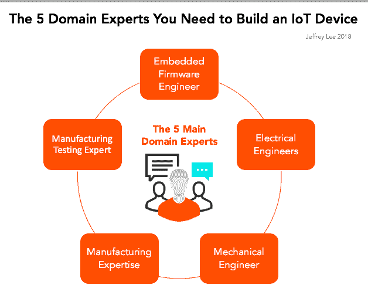

# 启动首个物联网项目的终极指南

> 原文：<https://dev.to/heffay626/the-ultimate-guide-to-starting-your-first-iot-project-2cpj>

#### 启动物联网项目的基本要素，提供持续、循环的价值

所以你在考虑启动一个物联网项目。问题是，你建造什么？你如何建造它？或者说，什么是物联网项目？让我们从最后一个问题开始，好吗？

### 什么是物联网项目？

物联网项目是将任何物理对象连接到互联网以收集和共享数据的行为。我们如何使用和共享这些数据取决于物联网项目的目的。无论您是连接风车来监控性能数据，还是连接机器来监控自身的损坏，这些项目生成的数据都可以以多种方式使用。有了合适的硬件、软件、连接和技术，您可以将家庭、工厂或农场中的任何对象连接到互联网，并将数据流传输到互联网。

### 物联网项目的挑战

物联网行业为各行各业的企业提供了优化运营、开发新的收入来源和加强客户关系的机会。

根据 Gartner 的一项研究，60%的采用者预测物联网技术将在未来五年内改变他们的组织，削减开支，并产生大量新收入。40%的采纳者期望在短短三年内看到有意义的回报。然而，那些试图跳过研发过程直接投入部署的公司将无法看到最佳结果。

这是因为许多公司逆向工作，首先想象相关产品，然后才是价值主张。这些物联网项目几乎从未成功过，因为该公司从未花时间来完全理解他们试图解决的问题。

### 如何成功部署物联网项目

相比之下，成功的物联网项目首先了解客户和企业的日常问题，然后想象一种可以帮助解决这些问题的互联产品。

弄清楚这一点后，您就可以开始制定可行的实施策略，设置现实的目标和期望，并简化部署过程。像其他主要的商业活动一样，这需要全面的计划和测试。

本文提出了一个可行的逐步过程，以彻底了解物联网如何帮助您的业务，以及您可以开始构建您的第一个物联网项目的方法。

### **1。学习基础知识**

在你开始物联网项目之前，你需要对物联网技术的工作原理有一个基本的了解。花时间了解其他产品创造者和企业如何使用物联网来解决问题，并自学如何提问，例如:

**重要问题:**

1.  物联网的常见用例有哪些？(*例如，预防性维护、资产跟踪、环境监控、远程监控、合规性报告等*)。您的物联网项目是否属于这些用例之一？
2.  我能否围绕连接创建一个商业模式，以证明连接设备产生的重复成本是合理的？
3.  我需要考虑哪些重要的技术选择和注意事项？

### 2。确定您的使用案例

谈到上一步中的第一个问题，物联网的用途非常广泛，可以以多种方式使用。你不可能列出所有可能的用例，但是有一些经过验证的方法可以为使用它们的公司提供持续的、循环的价值。常见、广泛的物联网使用案例包括:

*   **预防性或预测性维护** —您可以连接您的机器或设备，并在出现问题时收到警报。例如，[按摩浴缸的热水浴缸](https://www.particle.io/offers/jacuzzi/)与互联网相连，一旦出现问题，就会提醒经销商和业主。
*   **资产跟踪** —物联网技术允许公司实时监控他们不断移动的资产(如设备或车辆)。随着可见性的提高，他们可以在问题发生之前解决问题。例如， [SafeTransport 利用粒子的资产跟踪器](https://www.particle.io/customers/case-studies/safetransport/)让管理员能够远程实时跟踪和监控校车。
*   **环境监测** —物联网传感器可用于商业农业、水监测等。通过保护宝贵的资源，公司可以为客户和他们的业务带来持续的价值。例如，[科学家正在通过连接传感器监测有害气体](https://blog.particle.io/2018/08/07/scientists-deploy-an-iot-network-to-battle-kilaueas-deadly-fumes/)的实时测量值，如夏威夷的二氧化硫和颗粒物。
*   **自动补充** —物联网技术允许公司在消耗品(如燃料、机油、过滤器)不足时自动接收警报，这使他们能够预测需求等。
*   **智能计量** —物联网设备跟踪建筑物和家庭的能源、水和天然气消耗，减少运营支出并提高预测能力。
*   **消费者追加销售** —公司可以创造一种高端互联产品，并以高价出售。然而，产品必须引入对客户有价值的新功能或改进服务，这样才能发挥作用。

事实证明，这些物联网商业模式可以帮助产品制造商和企业通过他们的物联网项目赚钱。当然，你必须将这些商业模式与第一步中的问题结合起来，以创建一个为你和你的客户提供持续、循环价值的物联网项目。

### 3。研究和选择物联网平台/工具

*物联网平台的一种展示方式*

在开始物联网项目之前，研究可以帮助您成功实施物联网产品的最佳物联网平台、工具和应用。选择最佳框架是物联网项目的关键部分，合适的平台将能够随着您的业务增长并适应未来的技术进步。

在检查物联网平台时，您应该根据您的解决方案检查或寻找以下类型的东西:

*   **硬件—** 供应商是否针对您的特定使用情形提供任何现成的应用、开发套件或入门包？您可能需要进行一些定制，但是不必从头开始可以节省大量的时间和精力。
*   **设备管理** —供应商如何允许您监控、分割和管理现场的物联网设备？
*   **连接性** —供应商的网络覆盖符合您企业当前和未来计划的程度如何？
*   **连接方法** —您需要什么类型的连接？您的物联网产品需要 Wi-Fi 或蜂窝解决方案吗？您需要评估这些需求，看看供应商如何解决它们。
*   **地理覆盖范围** —他们是否提供全球支持的嵌入式 SIM 卡？物联网平台是否覆盖了您业务所需的区域？
*   **服务类型** —物联网平台如何描述和销售自己？一些服务是纯粹的连接平台，而另一些是提供硬件、软件和连接的端到端解决方案。你需要评估你的业务需要什么。随着时间的推移，您的需求会如何变化？

### 4。为您的物联网项目选择合适的物联网硬件

物联网开发板和模块是每个物联网项目的核心。随着物联网的发展，这些主板的种类和技术能力只会变得更加复杂。当开始一个物联网项目时，你会希望从一个简单的原型套件开始，但随着硬件开发和设计流程的进展，你需要投资用于扩展的硬件板。

这可能会让你问，[原型制作和生产硬件](https://blog.particle.io/2018/03/13/how-to-select-the-right-iot-hardware-from-prototype-to-production/)有什么区别？以下是原型制作和生产硬件及其预期用途之间的一个示例:

**原型硬件—开发套件(dk)**

开发套件是试验板友好的，并针对可扩展性、模块化和易用性进行了优化。因此，它们可用于根据使用情形和应用进行扩展，但最好用作友好环境中的短期 POC。

1.  **预期用途** —用于快速迭代/原型化硬件和固件系统。它提供了一个快速启动的解决方案，并启动了一个物联网项目。
2.  **功能** — USB 连接、硬件附件生态系统、可在试验板上安装的接头、RGB 状态 LED、板载天线、实惠的价格
3.  **观众** —对硬件非常陌生的业余开发人员和工程师
4.  **举例**——[氩气](https://store.particle.io/products/argon)、[硼](https://store.particle.io/products/boron-lte)

**生产硬件—大规模生产模块(MPM)**

大规模生产模块针对大规模生产产品中的部署进行了优化，而不是针对开发。这些是真货，打算在恶劣环境和狭小空间部署 5-10 年。这些产品在被焊接到您的最终产品中之前几乎没有用处。

1.  **预期用途** —在量产产品中的部署
2.  **特性** —认证、硬件保修和支持、环境稳定性、尺寸和可制造性优化
3.  **受众** —规模化生产产品的公司
4.  **例题**——[E 系列](https://store.particle.io/products/e-series-evaluation-kit)

对于您的物联网项目，您可能希望从某种形式的开发套件开始，以启动并运行您的第一个原型。但是，在您验证了概念之后，您会希望过渡到生产硬件，如大规模生产模块，以确保长期部署。

### 5。构建您的首个物联网原型

开发原型可以让您在全面部署之前发现物联网项目所需的最小参数。一个完整的原型模拟最终物联网产品的基本和最重要的组件。要创建成功的原型，您应该问自己以下问题:

*   我能通过准确地测量我所追求的数据来验证用例吗？
*   哪些功能和数据对计划的成功最重要？
*   最昂贵和最具挑战性的设计要求是什么？
*   设计中有没有什么功能会被忽略和不被使用？
*   设计没有满足哪些需求，问题有多大？

事实上，当涉及到原型时，没有一个清晰的路线图可以遵循。如果你不熟悉产品开发，这个过程会很有挑战性。然而，有大量资源可以从真正的物联网专家那里获得灵感和帮助:

*   [**粒子社区**](https://community.particle.io/) —粒子社区提供了一个由物联网专家组成的支持团队，他们可以回答您的任何物联网项目问题和顾虑。
*   [**hackster . io**](https://www.hackster.io/)—hackster . io 提供了一个学习和构建物联网项目的开发社区。你可以从他们网站上列出的数千个物联网项目中获得灵感。
*   [**阿达果**](https://learn.adafruit.com/) —阿达果是学习构建物联网项目的必去之地。他们提供大量的资源、硬件和指南来帮助你开始。
*   [**Stackoverflow**](https://stackoverflow.com/company) —虽然 Stackoverflow 主要面向程序员，但它有一个庞大的支持社区，可以帮助您回答与物联网相关的问题。

### 6。寻找物联网合作伙伴(即确定您的技能组合和您缺少的东西

这一步是可以互换的，可能需要在开始构建第一个原型之前完成。无论如何，如果你计划开发一个大规模的物联网项目，你可能需要找到一个合作伙伴或领域专家来帮助你构建你的产品。

根据思科的一项调查 (2017 年)，超过 60%的受访者承认他们大大低估了管理自己的物联网计划的复杂性。更令人担忧的是，同一项调查还发现，75%的自发物联网项目被认为是失败的。

然而，同样的思科调查发现，在项目的整个生命周期中咨询物联网领域专家的大多数公司都按时完成了项目。单干的公司经常会超出他们最初的时间表，并且发现他们缺乏保持项目正常运行的内部专业知识。不幸的是，当公司意识到他们需要额外的专业知识时，他们已经深入到了开发过程中，这使得旋转成本成倍增加。

为了成功部署物联网产品，您需要评估构建物联网设备所需的技能。虽然你需要很多潜在的专家，但这里列出了完成企业物联网项目所需的最重要的技能:

1.  **嵌入式固件专业知识:**嵌入式固件工程师开发并实现在电子设备上运行的可重编程内容(固件)。您可以将固件视为允许嵌入式设备执行其基本功能的操作系统(OS)。知识渊博的嵌入式固件工程师可以帮助您构建一个稳定的固件架构，专为受限系统而设计。
2.  **电气工程专业:**电气工程师设计、开发、测试、监督电气设备的制造。他们是 DFM(为制造而设计)最佳实践的专家，可以帮助您设计具有最佳性能和最便宜元件的 PCB 原型。
3.  **机械工程专业知识:**您的机械工程师负责您的设备在世界上的物理功能，包括它如何与其他机械系统以及潜在的人类用户进行交互。
4.  **制造专业知识:**在向市场部署物联网设备时，您需要一位制造经理，他可以帮助您寻找并找到轻松降低硬件成本的方法。
5.  制造测试专业知识:制造测试不同于制造专业知识，因为实施质量测试标准本身就是一项工作。

### 底线

成功的物联网项目需要全面的分析和深入的规划。不做研究和实施合理部署策略的公司将面临许多挑战和复杂情况，导致不令人满意的结果。

要在您的企业中启动物联网项目，您需要了解该技术的工作原理以及它能为您做什么。每个行业都有一套独特的物联网应用和工具，一个好的物联网技术合作伙伴将帮助您确定您的特定需求，定义您的期望，并避免那些试图自行部署物联网的公司所面临的陷阱。

**感谢您阅读这篇文章！如果你对任何与物联网相关的事情感兴趣，请随时关注我。:)**

* * *