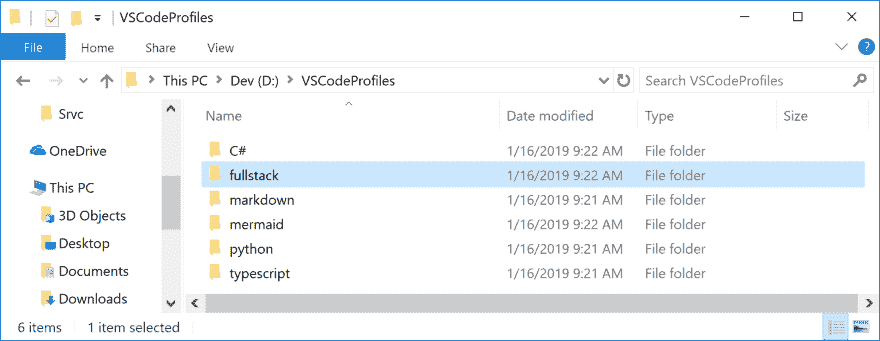
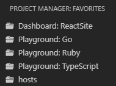

# 我忽略的 VS 代码扩展

> 原文：<https://dev.to/wolfhoundjesse/the-vs-code-extension-i-overlooked-2ki6>

# 编程语言太多

去年我已经在 [VS Code](https://code.visualstudio.com/) 中安装了 50 多个扩展，但是我还没有遇到过在用 Python 做数据科学的时候需要 TypeScript 林挺的情况。对解决方案的快速搜索揭示了[这个 GitHub 回购](https://github.com/avanslaars/code-profiles)，这个计划起初在我看来相当天才。结果就是这个文件夹的集合，每个文件夹都有我要使用的扩展的副本:

 
我高兴了……一阵子。我不喜欢相同扩展的多个副本占用千兆字节的空间，最终我回到将所有插件安装到默认目录中，禁用它们，并在每个项目的基础上启用我需要的特定插件。

# 输入项目经理分机

在这个过程中，我发现了一个扩展， [Project Manager](https://marketplace.visualstudio.com/items?itemName=alefragnani.project-manager) ，它可以让你有效地为你经常使用的文件夹添加书签。我没有发现它有任何用处，因为，真的，用老办法打开一个文件夹有多难？我希望这里有一个好的结局，但事实是，我没有马上找到适合我的方法，当我找到时，这并不是一个主要的啊哈！瞬间。

# 我现在的工作流程

我刚刚在一台新的笔记本电脑上开始了全新的安装，这给了我一个机会来重新思考我如何管理我用 VS 代码做的所有不同类型的工作。

## 两种方式开始

当我在基本设置上工作时，我喜欢在没有指定文件夹的情况下打开 VS 代码，以防我在以前的工作中有任何用户设置。

如果您是 VS 代码的新手，也许您只想安装一些您想在任何地方使用的扩展。对我来说，这是一个很短的列表:

1.  Git 扩展包 -我把所有的东西都放在版本控制之下，甚至是我的笔记(稍后会详细介绍)。

2.  [VS Live Share Extension Pack](https://marketplace.visualstudio.com/items?itemName=MS-vsliveshare.vsliveshare-pack)——第二次查看代码的最快方式。

3.  [项目经理](https://marketplace.visualstudio.com/items?itemName=alefragnani.project-manager) -快速访问您经常使用的项目，让您轻松地从一个游乐场跳到另一个游乐场。

4.  这是一个估算你在一个特定项目上花了多少时间的非常好的工具。也有团队选项。

对于更有经验的用户来说，第二个选择是一次安装你记得使用的所有东西，禁用它们，然后只启用基本扩展(就像我上面提到的那些)。

## 设置几个游乐场

有时候我想尝试用 JavaScript，或者最近用 Ruby。我采用了以前的 VSCodeProfiles 文件夹的想法，创建了一个 playgrounds 文件夹，其中包含以环境命名的各种文件夹。然后，我打开文件夹，启用适当的扩展，并将文件夹保存到项目管理器。编辑:你也可以为每个环境配置合适的外壳。这样，如果我想快速尝试一些东西，我可以打开代码，从我的侧边栏输入正确的工作环境:

# 做笔记

顺便说一句:我已经开始了一个新的记笔记过程。我很少打开记事本，我使用过 notepad++并且很喜欢它，我仍然使用微软的便利贴来固定我一直使用的信息——核发射代码、管理员密码之类的东西。不，我不是认真的，*妈妈*。

当我想要写下一些东西时，无论是为了以后添加到我们的文档中，还是为了记住一个与工作相关的过程，或者为了记住一个给我小儿子的礼物想法，我都会打开项目管理器，然后点击 *notes* 。在这个项目/目录中，有一个组织有序的 Markdown 文件系统，当然，还有两个在 VS 代码中编写 Markdown 时大放异彩的扩展:

1.  [一体降价](https://marketplace.visualstudio.com/items?itemName=yzhang.markdown-all-in-one)

2.  [markdownlint](https://marketplace.visualstudio.com/items?itemName=DavidAnson.vscode-markdownlint)

# 如此而已。