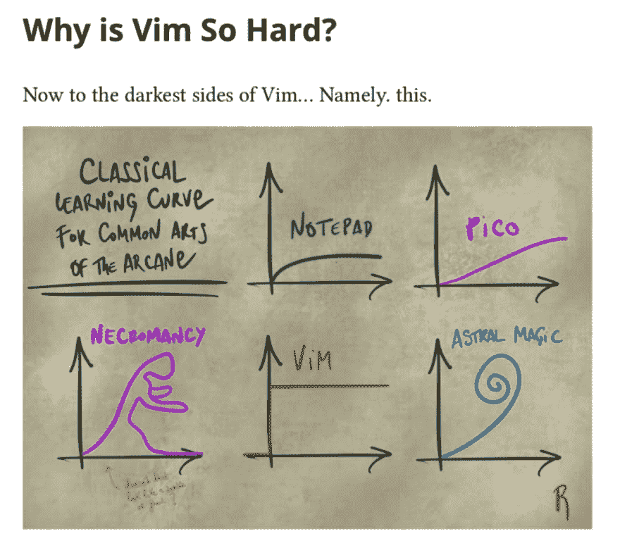

# 巫师日志-第一部分-写巫师的冒险，荣耀和不幸使用 Vim

> 原文：<https://dev.to/vintharas/the-wizard-logs---part-i---the-adventures-glory-and-misfortunes-of-writing-wizards-use-vim-2eho>

*本文最初发布于[barbarianmeetscoding.com](https://www.barbarianmeetscoding.com/blog/2019/01/14/the-wizard-logs-part-i-adventures-glory-and-misfortunes-of-writing-wizards-use-vim)。*

当我宣布[巫师在写作的早期阶段使用 Vim](http://leanpub.com/wizardsusevim) 时，我就开始思考让读者群体参与到这本书的写作和开发中来的最佳方式。我是否应该在每次发布新版本时发送电子邮件更新？我应该两周做一次吗？每月？我应该等到书准备好吗？

这是我想用这本书做的一部分，并遵循我最近写的一篇名为[不要放弃的文章的精神。继续迭代](http://localhost:8000/blog/2019/01/03/dont-give-up-keep-iterating)，是为了显示一本书需要多少工作量。还有**特别是**一个丑陋、恶心、混乱的泥球如何通过反复的工作慢慢变成一个美丽的雕塑。

这是我勉强接受的格式:**向导日志**！在这个双周系列中，我将与你分享我在 Vim 上写这本新书的冒险、荣耀和不幸。我会告诉你这本书的最新进展，我一直在考虑的想法，我一直在思考的事情，我必须避免的障碍和我遇到的死胡同。

首先，如此怪异的一本书获得如此好的反响，真是太感人了。这几乎完全归功于令人敬畏和鼓舞的[dev to](https://dev.to/vintharas/wizards-use-vim-my-new-book-on-vim-4bc0)社区。在这个早期阶段，有很多人对阅读这本书感兴趣并充满热情，并提供了反馈。事实上，已经有很多反馈帮助我改进了这本书，这让我增加了一章来表彰书中的贡献。如果你已经提供了一些反馈，那么去看看吧。

在过去的一周里，我花了我爸爸大部分的空闲时间来写这本书。本着 LeanPub 的精神，我出版了这本书的大约 20 个新版本，有很多改进和新内容:

*   塑造和重塑了整本书的结构。拆分、合并和移动章节到它们更有意义的地方。未来肯定会有更多这样的事情发生
*   我采纳了亚瑟·祖巴列夫的一些很好的建议，把这本书分成几部分，而不是按照一个整体的方法。我们同时有了相同的认识:d .这是很好的反馈！这本书现在有三条路径:学徒、大师和特级大师**给你在每一部分之后那种可怕的完成感和成就感**。
*   我花了很多时间阅读这本书的介绍性章节，回顾并彻底改进了它:
    *   序言和导言
    *   体验活力
    *   这是关于学习 Vim 时最大陷阱的一章
    *   Vim 入门，这是设置 Vim 开发环境的一章
    *   更有效地学习 Vim 的技巧
    *   请注意，这些都是工作名称，它们将随着本书的发展而被塑造成书呆子的形式
*   到今天为止，我正在学习第一章的 Vim Vim 学习，它将带你完成打开 Vim，打开和创建文件，保存和退出等等，这是在你开始有趣的部分之前最基本的东西
*   在这一点上，我主要关注的是增加内容，而不是质量和风格。而且我在写的时候也没怎么去想这本书的奇幻主题。当这本书的所有内容都完成时，这将是一个改进。但事实是有时它会出现。有时它会变得太大，失去控制:

> 有不同的途径可以让你开始学习维姆，每一条都对应着维姆秩序中的不同派别。每个人都有自己的特质和使用 Vim 的方法，有些是纯粹主义者，有些是实用主义者，但都被 Vim 的魅力所吸引。
> 
> 这些派别处于不断的动荡之中，一些会崛起，一些会灭亡，而另一些则历久不衰。这些是今天最重要的:
> 
> ## 各派系
> 
> [维姆](https://www.vim.org/)T3】的高级奥术师代表了最大最古老的派系，充满了它自己的子行动和团体。他们是 Vim 最初版本的追随者和用户，从 1991 年开始踢屁股。这是最稳定的选择，它可以在终端上运行，并通过 GVim 和 MacVim 为非常薄的 GUI 层提供支持。它是在仁慈的最高考古学家[布莱姆·米勒](https://moolenaar.net)的指导下积极开发的，并于 2018 年 5 月发布了最新的重要版本 Vim 8.1，并支持集成终端。你可以在 [vim 邮件列表](https://groups.google.com/forum/#!forum/vim_announce)中关注他们的成就。
> 
> **尼奥维姆巫师和术士**，这是一个从高级奥术师分裂出来的派系，心中有一个愿景。重构最初的 Vim，使它更易于维护，更易于新的贡献者使用。这样就有了尼奥维姆。Neovim 作为一种现代化的 vim 替代品，忠实于原版的理念和精髓。Neovim 本身只支持文本界面，但它被设计为一个可以被其他图形编辑器(如 Visual Studio 代码或 Oni)使用的平台。它是在 [GitHub](https://github.com/neovim/neovim) 上积极开发的。
> 
> 在现代编辑器中倾向于实用主义使用 Vim 插件的吟游诗人、菲利斯和斯卡尔德是一个小派别。Vim 非常棒，许多其他流行的编辑器都支持某种类似 Vim 的模式。对于重视使用 Vim 提高生产率，但又喜欢现代流行编辑器的开箱即用体验的软件开发人员来说，这是一个受欢迎的选择。支持这种混合设置的编辑器示例如下:
> 
> *   [Visual Studio 代码](https://code.visualstudio.com)与 [VSCodeVim](https://github.com/VSCodeVim/Vim)
> *   [原子](https://atom.io/)与 [vim 模式](https://atom.io/packages/vim-mode)
> *   [Visual Studio](https://visualstudio.microsoft.com/) 带 [VsVim](https://marketplace.visualstudio.com/items?itemName=JaredParMSFT.VsVim)
> *   [用](https://www.sublimetext.com/)[复古模式](https://www.sublimetext.com/docs/3/vintage.html)升华文字
> *   WebStorm 和其他基于 IntelliJ 平台的 ide，如 IntelliJ IDEA、PyCharm、Android Studio 等...用 [IdeaVim](https://github.com/JetBrains/ideavim)
> 
> Oni 炼金术士是一个非常不起眼的小派别，其成员尝试实现不可能的事情:将 Vim 和现代编辑的最佳部分结合成一个单一的编辑器 Oni 来统治他们。Oni 是一个用 React 和 TypeScript 构建的图形编辑器，它在幕后使用 Neovim 为您提供 vim 的所有功能，但仍然旨在提供出色的开箱即用体验。目前它处于非常早期的阶段，但我认为值得注意它的存在并关注它如何发展。
> 
> <cite>向导使用 Vim</cite>

我还为这本书创作了一些艺术草图。这些是版本 0，目标是在绘图中反映一个想法或想法的精神。以下是其中的一些:

[T6】](https://res.cloudinary.com/practicaldev/image/fetch/s--knyQP3Uz--/c_limit%2Cf_auto%2Cfl_progressive%2Cq_auto%2Cw_880/https://www.barbarianmeetscoding.cimg/wizards-use-vim-vim-joke.jpg)

到目前为止，我在书中收录了一些很酷的想法:

*   谈论 Vim 用户社区，而不仅仅是 Vim 的核心特性
*   让这本书在你如何接近 Vim 时非常实用。这本书推荐你使用 Neovim/vim 学习 Vim 和类似 Vim 的编辑器/IDE 插件来练习你在当前编辑器中所学的内容。
*   可以练习使用 Vim 的练习。
*   写日记。而不是在章节末尾提供摘要。作为读者，你有一些功课要做。用 Vim 记录并写下你所学的总结。

> 在一章的结尾总结你学到的东西是一本书质量的重要标志。但是在这本书里，我们会做得更好。**我们将记下**，而**你**将使用 Vim 写下你在阅读每章时所学内容的总结。你要写下你从 Vim 中学到的东西，这是华丽的 meta。除了超级棒之外，还有更多优点:
> 
> *   你可以看到你在每章中学到了多少
> *   你会巩固你所学的概念
> *   你可以思考如何将你学到的东西融入到你当前的工作流程中。这种方法比我现在做的更有效吗？
> *   你以后可以用它作为参考
> 
> <cite>向导使用 Vim</cite>

我现在关心的事情:

*   介绍时间太长了
*   LeanPub 的在线阅读体验不是很愉快(个人观点)。我在考虑建立一个单独的网站，你可以在网上阅读这本书。这一直是我计划的一部分，但我可能会在我想好之前就这么做。
*   我究竟该如何融入书中的一个奇幻故事(可能是在同伴游戏中？？)

如果你已经下载了这本书，并且想知道现在是否要读这本书(我有几个读者问我这个问题)，我已经为你找到了答案。这完全取决于你想从这本书里得到什么:

*   如果你想跟随并体验一本书是如何被制作出来并随着时间慢慢改进的，提供有更大影响的反馈，然后阅读从**提案**或**草稿**开始的章节。
*   如果你想读一个尽可能接近最终版本的版本，并且仍然想提供反馈并影响这本书，那么**候选人**和**完成**就是你想要的。

<aside class="callout info">

想知道提案、草稿、候选人和成品到底是什么吗？它们只是代表书中每一章的成熟状态的名称。他们的目标是让读者意识到这一点，这样他们就可以决定是否要忍受早期的草稿。

</aside>

这就是我现在所知道的。直到下一次！保重，善待你周围的人。抱抱！

附:如果你对我写作过程的更多细节感兴趣，那么[看看我写的关于写书的这个系列](https://dev.to/vintharas/how-to-write-a-book-and-not-die-trying-the-story-of-how-i-wrote-javascriptmancy--everything-i-learnt-writing-2-books--a-half-5f7p)。