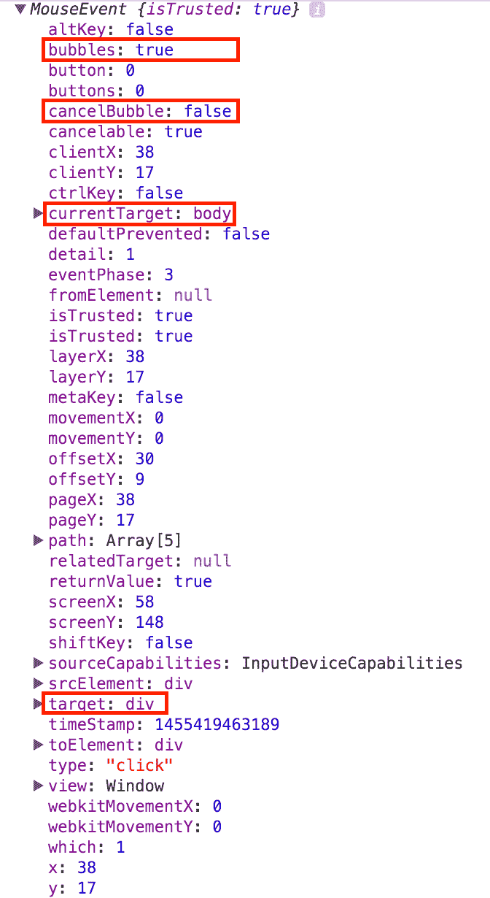
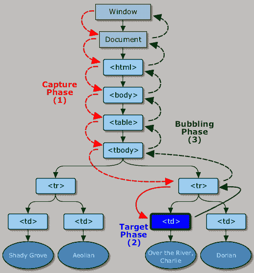
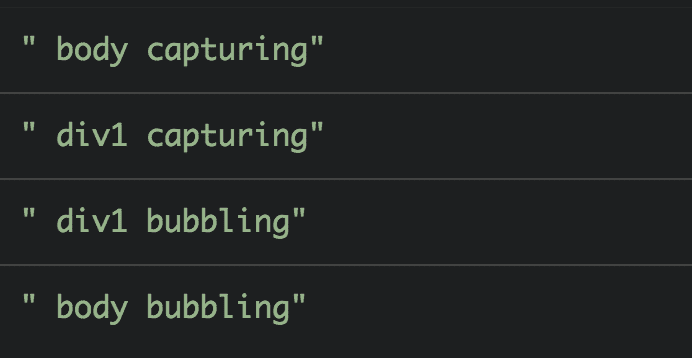

# 冒泡和捕获 JS 事件

> 原文：<https://dev.to/daolf/things-you-should-know-about-js-events-4k2l>

或者我应该说，关于 DOM 事件你应该知道的事情。

如果你有机会做一些客户端 JS，你当然必须处理事件。虽然像 Jquery 这样的库使得这样做变得非常容易和简单，但我认为仍然有一些可疑的部分值得研究。

### 事件对象

让我们从捕捉一个虚拟事件对象开始，并对其进行研究，就像这样简单:

```
document.body.addEventListener(“click”, function(event) {
    console.log(event);
}); 
```

Enter fullscreen mode Exit fullscreen mode

如果你看着这个物体，你会得到这样的结果:

[](https://res.cloudinary.com/practicaldev/image/fetch/s--4fpxph9L--/c_limit%2Cf_auto%2Cfl_progressive%2Cq_auto%2Cw_880/https://www.daolf.cimg/post-1/event.png%23center)

可以看到很多与事件实际位置相关的属性。`isTrusted`属性表示事件是由实际用户而不是脚本生成的。今天我们不打算把它们都包括在内，而是只包括红色矩形内的四个。

### 使用 Capture，或未知参数

这就是我如何将事件监听器添加到我的主体:

```
document.body.addEventListener(“click”, function(event) {
    console.log(event);
}); 
```

Enter fullscreen mode Exit fullscreen mode

这是我的 DOM 在捕捉这个事件时的样子:

```
<body>
    <div id="div1">
        Click me!
    </div>
</body> 
```

Enter fullscreen mode Exit fullscreen mode

所以通过点击一个 div 标签，一个附加到主体的处理程序被执行，这怎么可能呢？我是说，我点击了一个 div 标签，而不是主体。嗯，你想到的第一个答案可能是:

> “事件遍历 dom，故事结束，没有什么值得写一篇文章”

你是对的，事件确实遍历了 dom，但是按照什么顺序呢？我是说，想想吧。两种顺序都是可能的，而且都同样有意义。

*   多姆秩序(非官方名称)

所以 DOM 是一棵树，要遍历一棵树，你要从树根到树叶，对吗？所以在我的例子中，body 标签是根，div 标签是叶，这看起来可以接受吗？

> “哼为什么不呢？但是另一种方法呢

*   UI 订单(非正式名称)

你也可以争辩说，因为你，作为一个用户，看到了主体上面的 div，因此点击了 div 而不是主体，事件可以从 div 到主体。从叶子到根。这也是有道理的。

> “是的，这更有道理，这就是我观察到的，真相在哪里？''

真相在 W3C，我们一起回顾一下，再来看看 addEventListener 方法。

[](img/18840fca7ad7d4ea5aafb0755ff2c2f8.png)](https://res.cloudinary.com/practicaldev/image/fetch/s--Klk0xd1Z--/c_limit%2Cf_auto%2Cfl_progressive%2Cq_auto%2Cw_880/https://cdn-images-1.medium.com/max/3448/1%2Amcu2E6x8CKTjGjkCqg-_KA.png)*[http://www . w3schools . com/jsref/met _ element _ addevent listener . ASP](http://www.w3schools.com/jsref/met_element_addeventlistener.asp)*

你看到第三个布尔参数，这是所有神奇事情发生的地方。默认情况下，该参数为 false，这意味着，根据语义，默认情况下我们不使用捕获。注意，这第三个参数是我不能用 Jquery 写这篇文章的原因。click()方法(或任何其他与事件相关的方法)没有第三个参数。

> “但什么是捕捉呢？''

捕获是一种模式，是我们之前提到的 DOM 顺序。另一种模式，默认模式，是冒泡模式，如果你喜欢的话，是 UI 顺序。这两种模式将决定处理程序是在捕获阶段还是冒泡阶段执行。

### 冒泡和捕捉阶段

当你点击一个文档时，事件首先从你的 DOM 的根，窗口节点，到叶子，这是捕获阶段。一旦事件到达叶子，就像水中的气泡试图回到表面，事件回到 DOM 的根，这是冒泡阶段。

[](https://res.cloudinary.com/practicaldev/image/fetch/s--SR-uvIxL--/c_limit%2Cf_auto%2Cfl_progressive%2Cq_auto%2Cw_880/https://cdn-images-1.medium.com/max/2000/1%2AEhug03eY1tIyJ9LdSdDljA.png%23center)

通过设置第三个参数，您只需告诉 DOM 元素在冒泡阶段或捕获阶段执行处理程序。因为该参数有一个默认值，覆盖了大部分用例，所以它已经被遗忘了。通过正确使用它，我们可以更好地控制我们的活动，我将向你展示。

如果我们为每个阶段添加一个事件侦听器，会发生什么情况，它们会以什么顺序被触发？让我们稍微修改一下代码。

```
//Capturing phase
document.body.addEventListener("click", function(event) {
  console.log(" body capturing");
}, true);

document.getElementById("div1").addEventListener("click", function(event) {
  console.log(" div1 capturing");
}, true);

//Bubbling phase
document.getElementById("div1").addEventListener("click", function(event) {
  console.log(" div1 bubbling");
}, false);

document.body.addEventListener("click", function(event) {
  console.log(" body bubbling");
}, false); 
```

Enter fullscreen mode Exit fullscreen mode

正如所料，如果我们单击 div，这将是跟踪结果:

[](https://res.cloudinary.com/practicaldev/image/fetch/s--nW5KmaLY--/c_limit%2Cf_auto%2Cfl_progressive%2Cq_auto%2Cw_880/https://cdn-images-1.medium.com/max/2000/1%2AwjpMIeFeIKP108ab7vuUxg.png%23center)

你可以在这里自己去查[(别忘了打开控制台)。](https://codepen.io/daolf/pen/eJxbVL)

正如您所看到的，这非常简单，第三个参数允许您判断外部 div 应该在内部 div 之前还是之后执行处理程序。请注意，您可以随时使用:
来告诉事件停止以一种模式或另一种模式传播

```
event.stopPropagation() 
```

Enter fullscreen mode Exit fullscreen mode

### 当前目标和目标

现在您已经理解了事件在 DOM 中双向传递，但是还有一个问题仍然很难回答。

> 在我的处理程序中，我如何知道事件来自哪里？

例如，在我们附加到主体的处理程序中，如果我们单击主体，并且只在主体上，而不是在上面的 div 中，我想要执行处理程序怎么办。这正是可以使用 currentTarget 和 Target 的情况。

`currentTarget`很好，`currentTarget`将总是具有 DOM 元素的值，该元素附加了事件监听器。这意味着在我们的例子中，currentTarget 总是将 body 元素作为值。

`target`将具有首先接收事件的 DOM 元素的值(鼠标下的元素)。所以如果你想让处理程序只在主体被“真正”点击时执行，你可以这样做:

```
document.body.addEventListener("click", function(event) {
  // Target and currentTarget are the same
  // You clicked on the body
  if(event.target === event.currentTarget) {
    // the behavior you want
  } else {
    // default behavior
  }
}, false); 
```

Enter fullscreen mode Exit fullscreen mode

## 感谢阅读:

我希望你现在比 5 分钟前更了解 JS 事件。

如果你有任何关于 JS 事件的问题，请在评论中告诉我，不要忘记[订阅](https://www.daolf.com/stay_updated/)我的时事通讯，还有更多的内容:)(你还可以免费获得我下一本电子书的第一章😎).

## 你可能喜欢的事物:

你可以阅读我的新 GIT 系列的第 1 部分，这里的人似乎很喜欢，它谈到了臭名昭著的`.git`目录。

[](/daolf) [## 通过探索。git 目录

### 皮埃尔 2 月 25 日 196 分钟阅读

#git #junior #showdev #beginners](/daolf/git-series-13-understanding-git-for-real-by-exploring-the-git-director--5bd0)

或者关于 Python 的东西[这里](https://www.daolf.com/posts/beware-of-python-dict/)；)