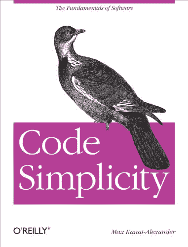
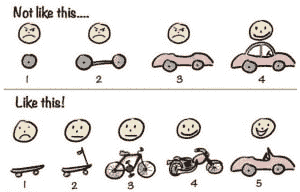
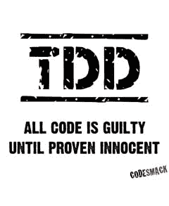
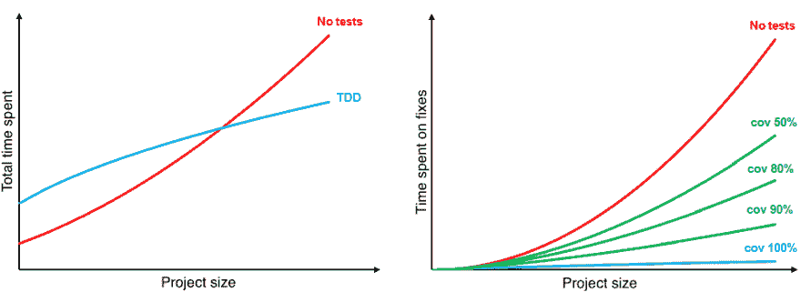

# 对马克斯·卡纳特-亚历山大“代码简单性”的思考

> 原文：<https://dev.to/akotek/thoughts-on-code-simplicity-by-max-kanat-alexander-22a1>

我最近读了这本书，在网上和 dev.to 上得到了很多推荐，我会试着用它最好的想法来总结它，并给出我自己对它的想法。

这本书讲述了 Max Kanat-Alexander 从 [Bugzilla](https://www.bugzilla.org/) 项目的建筑师那里学到的经验，关于他的重构问题，重写和项目管理。

它试图通过引入“法律”和“规则”来给出关于软件设计的**“正确方法”**的想法。它实际上试图给编程和软件开发赋予“哲学概念”，主要是“容易”(掌握)和已知的概念。

我认为 -如果我们每个人都能在头脑中有一套“想法”、“规则”或指导方针，(也许把它们写在我们的办公室里，进行“学习课程”或练习，直到它们固定下来)可以帮助我们成为更好的软件开发人员。在一本书上阅读这些东西，可以“启发”我们的概念，使我们更加了解它们，并在实践中写出更好的代码。例如:如果我们将简单性和“YAGNI”视为有价值的概念，那么每次我们编写新代码时，我们都会自动想到它们。另一个例子是采用 TDD(书中没有提到)，如果我们决定采用 TDD，这将极大地影响我们编码的方式，从时间到质量。在未来，这些想法将导致更好的代码编写。

* * *

## 让我们深入了解它的主要概念:

**理解** :
书籍从这个概念开始——作为开发者必须知道和实践的主要事情之一——如何更好地理解问题。Max 说这也是评估程序员的一个标准——一个好的程序员知道他每次都在做什么，而一个坏的程序员不知道。**写代码是一项脑力劳动，理解就是一切**，如果你明白自己在做什么，你会做得更好。

我认为这是一个显而易见的概念，但显然令人大开眼界，它看起来非常简单，在开始时是“已知的”，但是，我们真的每次在写代码之前都“完全”理解我们的任务吗？我们真的知道自己每次都在做什么吗？我们想达到什么目的？这可以给我们一种新的方式来思考我们的(和正在做的)软件开发过程。

我认为从编写一个 uni-test 开始也是一个很好的实践，通过一个测试来解释它，它可以帮助理解我们想要达到的目标。

此外——在实施或设计 sprint 时或在 sprint 中途进行“理解会议”可能是一个很好的实践，停下来**与其他队友或团队领导解释/讨论你的任务**,以验证——你理解你正在尝试做什么。将重构任务添加到我们的 sprint 中——通过检查旧组件并重新思考它们是否达到了目标——可能是我应该接受的另一个好的实践。

软件的目的是帮助人们:
这又是一个显而易见的虚假想法，但是——每次我们为当前的 sprint 选择任务或设计程序时都会想到它——我们真的认为它达到了帮助别人的目的吗？在一个更快的非关系数据库中改变和设置我们的日志能帮助人们吗？不是立即，但它将减少搜索时间，在未来将帮助 it 人员解决用户的问题或跟踪他们，并最终帮助用户。

在计划我们的特性请求和编码时考虑这一点，可以帮助减少编写无用的代码/组件，甚至拒绝来自我们老板/ pm 的未来请求。

**三大缺陷**:

 
这是一个很棒的概念，**注意到软件设计中的三个主要缺陷**:随着我们程序的增长，它的一些部分将需要改变，而不是因为客户需求、错误或新技术。如果你想让程序对人们有用，你也必须不断地改变你的系统。你应该预料到你将应付你的软件的变化。

Max 指出了程序员通常会犯的三个错误，**这使得应对变化更加困难:**
a .编写不需要的代码。
b .没有让代码变得容易。
c .过于普通。

我认为第一条是最重要的——**在你真正需要之前不要写代码(‘YAGNI’)**。这个想法给我自己带来了一些思考，因为有时候当我写新代码的时候，我也会添加一些未使用的方法以供‘将来’使用——这是一种浪费。这与编写新的方法、类等等有关。这个简单的概念是至关重要的——只编写当前问题所需的代码，如果需要扩展的话——以后再做。不要过度设计你的代码，这是浪费时间，增加复杂性，而且不可能处理“所有可能的事情”,因为需求总是在变化。

好的设计意味着你的代码是需要的，因此，编写未使用的代码也会导致坏的设计。

这可以节省我们编写新模块的时间，并减少压力。删除不使用的代码也很重要——它可以减少对方法和组件的误解，这可能会导致不同的设计。如果你将来需要密码的话，只要回到你的 VCS 就行了。这也应该是进行代码审查的一个重要的仪式——验证没有“未使用的代码”和“不需要的代码”。

简单:
事情越简单，你就越容易在未来做出改变。想法是使你的代码的单个组件尽可能简单，然后确保它们随着时间的推移保持简单。这可以通过其他人理解一个模块的难易程度来测试。这个概念假设是随着我们软件的增长——我们的代码库变得复杂，没有人能一次在脑子里构想出整个系统。

每当我们生产新的东西时，简单应该在我们的头脑中。

**增量开发和设计:**
上面提到的缺陷可以用这个想法来解决，主要是——我们**把我们的任务分成更小的，每次执行小的任务。**当我们增量开发时——我们也增量设计，我们在每一步回顾我们的设计。这种方法在敏捷开发中执行，但并不总是在设计部分执行。Max 注意到做增量开发——在小的迭代中开发特性，每次开发它的一部分，和**增量设计**——我们也增量地构建我们的设计。我们从一个简单容易的设计开始——实现它，然后将系统设计修改得更好。增量设计有点“新”，不太“常见”，可能也需要一些实践，但这是 Max 对增量过程的主要补充。

这可能与新来的人有关，我总是面临这些问题——从某个简单的设计开始思考，然后实现它——这可能是有用的，并让事情开始运转。

另一个概念是建造事物的顺序，从“内到外”建造。**首先构建最重要的组件**，然后通过使用或不使用迭代构建其他组件。我没有这方面的经验，但它是有意义的——如果你想建造一个计算器，首先建造“加法”和“减法”,然后作为基础建造它们——在此基础上使用其他的。这是一个有趣的想法，可以帮助产生更好的代码。

进行增量设计也是敏捷过程中需要考虑的事情——让我们添加一个回顾我们设计的任务——我们为这个组件选择了正确的架构吗？它需要重构吗？还有更多。
[T3】](https://res.cloudinary.com/practicaldev/image/fetch/s--k86iv9Im--/c_limit%2Cf_auto%2Cfl_progressive%2Cq_auto%2Cw_880/https://thepracticaldev.s3.amazonaws.com/i/gdnfgoh3ksrtxcchcnyk.png)

保持一致:
麦克斯在简单的语境中注意到了一致性，作为简单的一部分，你也应该试着**保持一致**。如果我们用一种特定的写作风格来写我们的单元测试，我们应该继续这样做。这有助于我们的团队成员学习如何以特定的方式使用我们的代码，保持一致减少了他们理解我们编写的另一部分的努力，因为他们已经熟悉了我们的“风格”。

我认为这是一个简单的(又一次)众所周知的想法——但是如果我们给出我们的想法，实践它——这是一个我们都应该接受的规则。

软件复杂性:
软件复杂性是关于我们的系统有多“复杂”的概念——就理解它和向它添加代码而言。我们的软件开始时很小，简单，易于维护，随着时间的推移，它变得越来越大，越来越复杂，越来越难以维护。缺陷开始出现，可维护性变得更加困难。

从 Max 的角度来看，应该尽最大努力保持代码的简单，应该采取积极措施通过重构和简化来降低复杂性。

**处理复杂性——重写代码:**
作为一名程序员，你会遇到复杂性——因为你的系统的某些部分太复杂，不容易维护。如果一个系统需要整个重写或重构——它应该与编写新特性并行进行，并且分成小块进行。

在重构与重写之间的紧张关系中(我们应该从头重新编写整个组件还是仅仅重构它)，最大化重构和重构现有的代码库是更好的选择，

如果你对这个概念感兴趣，[查看这个](https://techbeacon.com/app-dev-testing/rewrites-vs-refactoring-17-essential-reads-developers)。

**Testings:**

**本书的最后也可能是第二个最重要的部分** (imo)，指的是我们知道**我们的软件如何运行的唯一方式取决于我们测试它的程度**。或者换一种说法——只有经过测试，我们才能说我们的代码“有效”。“有效”是我们期望从代码中得到的行为，如果我们提供一个返回结果的 search()方法——我们期望它对每个查询以特定的方式运行，这必须经过测试。

我认为，除了确保我们的系统像 max 所说的那样“工作”,严格测试(用测试覆盖我们代码的越来越多的行为)可以给我们带来更多的功能，而不仅仅是测试行为:它可以是我们代码的“文档”——如何使用我们的代码，它可以提供关于我们的代码如何被使用的案例——如果我们使用搜索引擎——如何回答查询，它进行什么过程等等。可以帮助其他开发者使用该系统。

这个图表显示了一个长时间的项目被测试正确地覆盖，而另一个没有。
[T3】](https://res.cloudinary.com/practicaldev/image/fetch/s--mAlm2Lt3--/c_limit%2Cf_auto%2Cfl_progressive%2Cq_auto%2Cw_880/https://thepracticaldev.s3.amazonaws.com/i/muvjjsgybvf9gvbt72oc.png)

* * *

**总之** - Max 记录了关于软件开发的“已知”想法和事实，但是，在你付费购买的书中阅读它们——并且投入时间和精力阅读——你真的能够掌握如此重要的想法。除了掌握它们之外，这些想法是初级开发人员非常需要的，应该每天练习和使用。

就是这样！