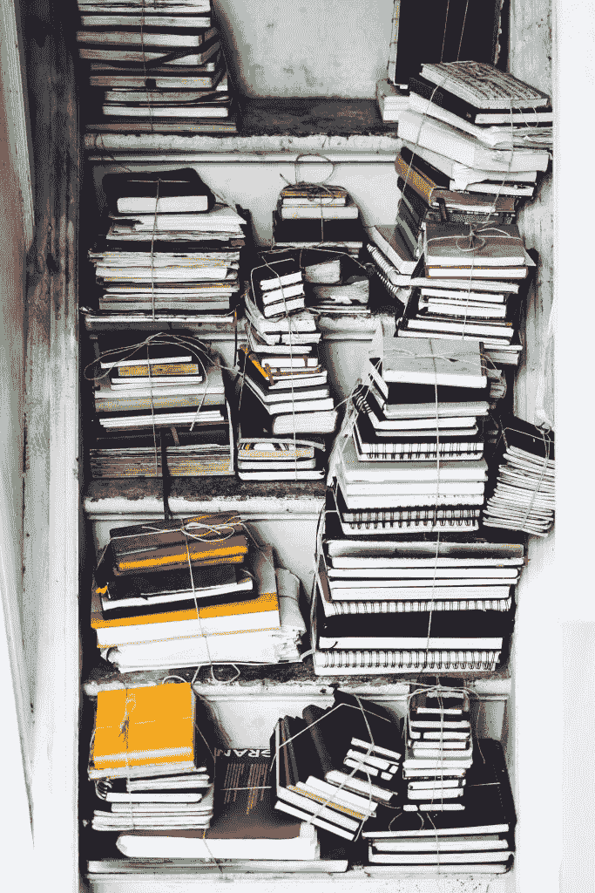

# 数字化整理

> 原文：<https://dev.to/jeffmcneill/tidying-up-digitally-2n4m>

*原发表为[整理数码](https://mcneill.io/tidying-up-digitally/)于 [www.mcneill.io](https://mcneill.io/tidying-up-digitally/) 。*

* * *

玛丽·近藤是整理房子的专家。她的网飞系列[和玛丽·近藤一起整理](https://www.netflix.com/title/80209379)和两本书(这两本书都值得一读，按时间顺序排列最好)都很畅销:

*   [改变生活的整理魔法:日本的整理艺术(改变生活的整理魔法)](https://amzn.to/2ttBMU1)
*   [Spark Joy:一堂关于组织和整理艺术的图解大师课(改变生活的整理魔法)](https://amzn.to/2TYnOoS)

她认为她的原则同样适用于组织和工作生活。然而，在这两个方面，数字方面根本没有得到解决。甚至连不起眼的收件箱都没有被讨论，尽管当然零收件箱显然符合她处理纸质信息的方式(本质上，没有纸质信息，或者只有最少的合同和保证)。

虽然其他行业已经在玛丽·近藤周围寻找一些点击诱饵，如*金融时报*可悲的不足[如何玛丽·近藤你的投资组合](https://www.ft.com/content/aafccab8-3370-11e9-9be1-7dc6e2dfa65e)，使用直觉判断的想法肯定可以应用到我们生活的其他方面。因为金融投资是只有金融投资专家才具有直觉专业知识的事情，所以这个应用程序不能很好地工作。

加里·克莱恩的 *[力量的来源](https://amzn.to/2EkcOwE)* 仍然是对专家在时间有限、高风险的情况下直觉如何工作的最好解释。对克莱恩来说，研究的对象是在高风险决策方面拥有 15 年或以上经验的专家。对于每一个经历过青少年时代的人来说，关于一个人家庭财产的直觉已经越过了那条线，那里有可以利用的功能直觉。

## 数字整理

应用 *Kon-Marie 方法*的整理原则在数字景观方面非常有意义:

*   应用和应用
*   电子邮件、文档和媒体(电子书、音频、视频)

## 两阶段整理

整理的两个阶段是:

*   丢弃
*   组织

## 数字丢弃

丢弃相当简单:这个应用程序、数据或媒体提供了任何快乐的火花吗？一个人不能把它握在手中，但他仍然可以得出一个结论。对于移动应用程序和桌面应用程序来说，这相当简单。在某些情况下，必要性可能意味着需要保留一些*不太快乐的东西*，但也可能激发人们寻找一个更快乐的替代品。

## 数字整理

组织的基础是把相关的东西(类别，大小)放在一个地方。由于数码物品一般不会*收好*，所以原始位置才是关键(以及以后寻找物品)。

因为文件有时最好按文件时间保存(也就是说，编辑这些文件的程序可以到某一类文件的单一位置)。示例:

以下哪一项是首选:

*   /brands/brand-x/图像/...
*   /品牌/图片/品牌-x/...

在某些情况下，一个给定的文件可能涉及一个以上的品牌，那么显然第二个更有效，但在一个特定品牌的文件更大的情况下，那么第一个肯定是一个更好的组织。

显然，两者都是可能的，但重要的是不要太不精确和灵活，因为这通常只会产生混乱和文件混乱。

## 数字空间

即使给定非常大的存储空间，数据和应用程序也会使设备变得杂乱。玛丽·近藤建议，最重要的不是使用的地方，而是归还的地方(也就是说，给东西一个易于归还的家，而不是试图优化易于捡起的地方)。

如上所述，将东西存放在容易记忆的位置将是关键，因为将东西放回那些位置(数字文件结构)将是非常重要的。在查看目录树时，视觉混乱仍然存在，这是 Linux 发行版及其文件结构在应用程序和相关数据在逻辑驱动器中的位置方面的一个重大缺陷。

