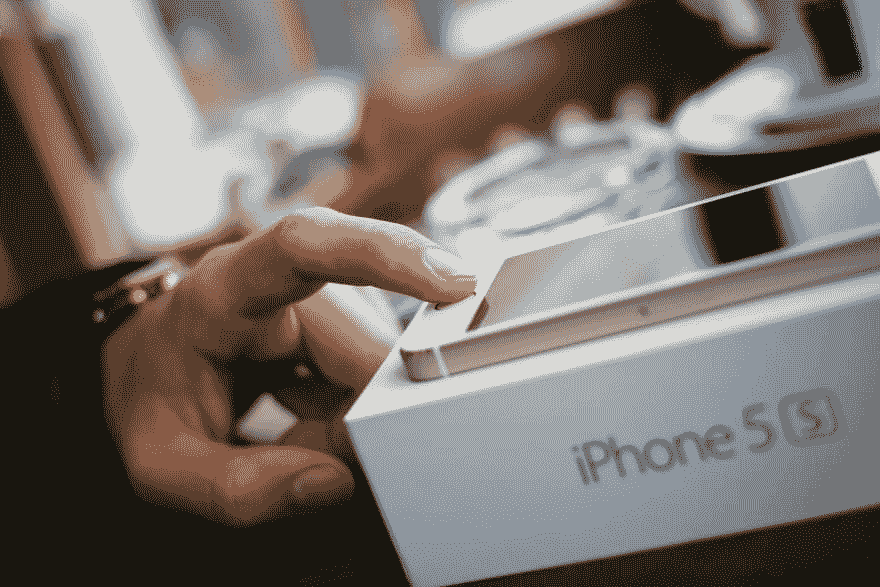
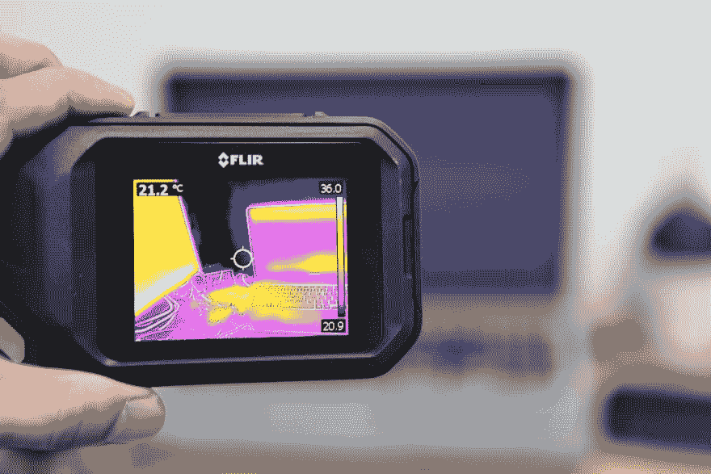
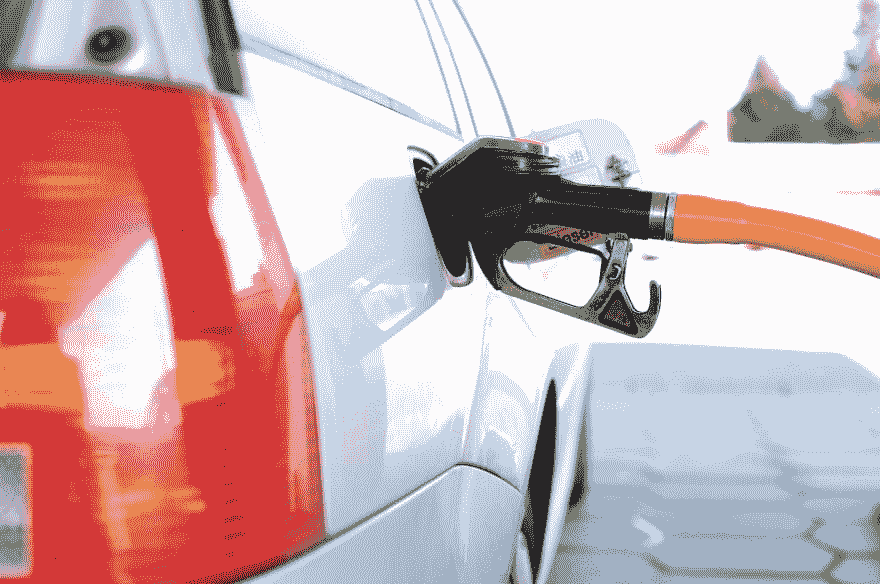

# 2019 年十大物联网传感器

> 原文：<https://dev.to/indeemasoftware/top-10-iot-sensors-in-2019-----5ap0>

可收集的数据包括有生命和无生命物体可以发送到物联网系统的各种信号。因此，这些对象应该有一些高度特定的信号生成设备，以便在物联网内共享信息。

原文-[2019 年十大物联网传感器](https://indeema.cimg/articles/Top-10-IoT-sensors-in-2019/refuel-2157211_1920.jpg)

为什么具体？因为它们可能会产生各种各样的信号。即使像进化完美匹配的人体这样的复杂系统，也有不同的器官来处理来自周围环境的各种信号。我们谈论的是传感器，当然是用于物联网的传感器。

## 哪里还有什么

所有可用的传感器都固有两种基本类型的相互作用:测量和控制。此外，这些类型区分数据流从端点或向端点移动的方向。这很好地对应了生物体的工作方式:每一个动作都会产生一个反应。当物联网操作方式发生时，机器模仿生物的行为看起来很相似。然而，收入和结果数据流之间的比例可能会有很大差异。在每种情况下，决定传感器主要类型的是一个或另一个物联网系统工作的领域。以下领域通常被认为最适合物联网应用:

```
Autonomous vehicles

Smart homes

Wearables

Robotization of industrial manufacturing

Smart medical equipment

Remote tracking and monitoring

Optimization of energy generation and distribution

Alarming and security systems

Industrial prediction maintenance

Human-free defense systems and weapons

Retail and payments 
```

## 
  
将信号转化为大数据

大自然赋予人类手指独特的图案。然而，我们没有能够检测我们指纹的器官。这可能是因为人类有一些不同的高级能力来识别彼此。直到最近，我们手机中的触控 ID 传感器还是最可靠的用户识别方法之一。这是传感器行业如何将自然可用的东西转化为可收集数据的典型案例。

[](https://res.cloudinary.com/practicaldev/image/fetch/s--NTW9bv28--/c_limit%2Cf_auto%2Cfl_progressive%2Cq_auto%2Cw_880/https://thepracticaldev.s3.amazonaws.com/i/r6497dgentryb5ikiuro.jpg)

由于传感器制造商不断发现越来越多的信号可以通过各种物联网解决方案检测和利用，物联网传感器的名单正在不断扩大。由于物联网处理器的计算能力不断增长，新型物联网传感器开始组合整个信号群。例如，高级安全和监控系统不仅限于光学传感器，运动、温度、红外辐射、声音和重量构成了复杂物联网解决方案通过适当的传感器可以检测、测量和识别的属性。举几个例子，以下传感器在许多物联网解决方案提供商中很受欢迎:

```
Proximity sensors

Infrared sensors

Humidity sensors

Gas sensors

Weight sensors

Vibration sensors

Temperature sensors

Level sensors

Pressure sensors

Motion sensors 
```

## 
  
接近传感器

物体之间的准确距离是近程传感器可以检测到的。这种传感器的应用范围非常广泛，因为我们生活的空间是三维的。确定接近度的方法取决于在每个给定情况下引入的许多因素。这就是为什么接近传感器制造商可以选择不同的基本技术，提供电容、电感、超声波和光电等类型的传感器。每个人可能都很熟悉近程传感器的工作原理，当你需要把你的车停在市中心的一个免费停车位时，那里的车通常是首尾相接的。一些非经济型汽车固有的自动泊车功能是近程传感器物联网应用的一个很好的例子。

## 红外线传感器

红外传感器可以双向工作:检测外部红外辐射和向外部发射红外辐射。这种传感器可以通过捕捉周围物体发出的热量来探测它们。人体散发出我们肉眼无法察觉的热量。例如，这就是为什么红外传感器为我们提供了一种独特的穿墙能力。许多好莱坞科幻大片(终结者，捕食者)使用红外视觉效果，为他们的角色添加令人印象深刻的超人能力。

[](https://res.cloudinary.com/practicaldev/image/fetch/s--Zj0Vrk80--/c_limit%2Cf_auto%2Cfl_progressive%2Cq_auto%2Cw_880/https://indeema.cimg/articles/Top-10-IoT-sensors-in-2019/the-thermal-imaging-camera-3756103_1920.jpg)

在现实生活中，物联网红外传感器广泛用于可穿戴设备(智能手表)中，以测量脉搏和血压。例如，当需要检测血液泄漏或远程测量体温时，医疗保健领域的许多物联网解决方案都基于红外传感器。红外传感器的工业物联网应用意味着远程操作的过热报警以及非接触式温度测量。Asahi Kasei Microdevices、Murata 和 Intersil 是红外传感器的品牌，仅举几例。

## 湿度和气体传感器

这两种类型的传感器可以分组是有原因的。两者都可以检测水或气体的泄漏。两者都被用于各种空气质量控制系统，这些系统在新兴城市化中变得越来越受欢迎。最近围绕气候变化的炒作产生了对能够监控室内和室外生活条件的智能物联网解决方案的日益增长的需求。此外，广泛使用诸如 CO2 探测器之类的气体传感器的一个隐含的推动力是在公司业务部门中固有的当代“员工效率热潮”,其中员工的工作能力与工作场所的空气质量直接相关。能够自动调节二氧化碳含量的物联网智能通风正在成为图书馆、健身房、商场、医院和公司办公室等公共场所的必备功能。不用说，湿度和气体传感器对于空气质量控制和监测系统是必不可少的。

## 重量传感器

我们生活在一个引力相当大的星球上，这个星球对物理物体的质量施加了一定的限制。这就是为什么现在没有陆地生物比大象更庞大。重量测量在建筑行业非常重要。回忆一下你不得不离开商业中心某处拥挤电梯的尴尬时刻，因为如果你在里面，超重探测器就会开始闪烁。即重量传感器允许电梯的安全利用。如果没有物联网重量传感器，每一个进行散装装载的行业中基于物联网的自动化都很难应对:超重对于露天矿的自卸卡车和制药企业的玻璃安瓿都是危险的。至于我们的健康，体重传感器是我们浴室体重秤不可或缺的一部分，它建议我们经常考虑少吃汉堡。

[](https://res.cloudinary.com/practicaldev/image/fetch/s--GzXRHKFp--/c_limit%2Cf_auto%2Cfl_progressive%2Cq_auto%2Cw_880/https://indeema.cimg/articles/Top-10-IoT-sensors-in-2019/i-yunmai-617618-unsplash.jpg)

## 振动传感器

无论发生何种类型的运动，振动传感器都有助于确定工业设备的安全共振水平。在大约公元前 2000 年发明轮子之后，旋转成为任何工业的主要运动形式。即使一个非常精确的转动机构也会产生或多或少的强烈振动。机器人生产线的预测性维护和自我分析能力构成了物联网技术提供商的广阔领域。持续的振动监测能告诉我们很多关于设备当前状态的信息。控制振动的人既控制了设备的经济高效的不间断运行，也控制了设备的整体寿命。因此，物联网振动传感器作为工业振动诊断系统不可或缺的一部分，通过降低事故和计划外停机的风险，带来了隐藏但重要的利润。

## 温度传感器

每个自动消防系统都包括温度传感器。公共场所的智能物联网解决方案(智能办公室、智能商店、智能健身房、智能等等)离不开温度监控。虽然原始但可靠的双金属温度传感器只能在发生火灾时发出温度显著升高的信号，但用于自动空气质量控制的精确温度测量需要更复杂的数字物联网温度传感器。温度传感器是房屋和交通工具中现代加热和调节系统的基础。花式智能温控器本质是什么？只有一套温度传感器和数据传输器。

## 液位传感器

另一个需要记住全球气候变化的原因是世界范围内更频繁的洪水发生。北极冰层正在融化，海平面正在上升。水位检测对沿海地区变得至关重要。洪水的早期检测和预测是物联网解决方案大有帮助的领域。水位传感器构成了水位数据开始传输到分析软件的主要端点。

一般来说，液位传感器广泛用于人们处理液体物质的众多领域。汽车上的油量计使用的液位传感器与加油站的大油箱相似。任何液体的自动分配通常基于两个传感器的信号:上部液位传感器和底部液位传感器。液位传感器通常采用电容和光学工作原理。我们一天要面对几次水位传感器的影响:当浮动的水位传感器阻塞供水时，马桶水箱停止供水。

[](https://res.cloudinary.com/practicaldev/image/fetch/s--5Qchnmx7--/c_limit%2Cf_auto%2Cfl_progressive%2Cq_auto%2Cw_880/https://indeema.cimg/articles/Top-10-IoT-sensors-in-2019/refuel-2157211_1920.jpg)

## 压力传感器

那些经常乘飞机旅行的人很清楚当你的耳朵里塞满棉花时那种不愉快的感觉。在机舱里稍微减压就产生了这样的感觉。这意味着飞机中的气压不同于我们在地面上的自然气压水平。在这种情况下，压力传感器可能有点工作不正常。

由于压力作为一种物理属性既属于气体也属于液体，因此压力传感器的应用领域可能会令人印象深刻。家庭和工业应用都存在。自动压力控制涉及诸如锅炉、热水器和散热器等加热设备的安全运行。血压传感器集成在许多用于医疗诊断的智能设备中。轮胎压力指示是现代智能汽车固有的一项奇特的物联网功能。没有气压，即使是每日天气预报也是不完整的。并且在每个给定的情况下，物联网压力传感器被接合。

## 运动传感器

正如我们在本文开头提到的，有些类型的传感器有相当长的历史。运动传感器已经从中国的管状铃铛发展成为基于超声波、微波、光伏和红外工作原理的复杂数字设备。具有运动检测的安全报警系统广泛用于博物馆、仓库、危险区域以及许多其他禁止未经授权进入的地方。物联网制造商为工业和家用照明系统配备了物联网运动传感器，以提供自动非接触开关灯。除了积极的用户体验，基于运动传感器的智能照明还可以显著降低能耗。

运动检测的另一个有前景的领域是现代设备的无触摸手势控制。健身追踪器能够识别我们是停留、行走还是跑步。在 iPhone 7 上去掉了一个 3.5 的插孔后，苹果和其他智能手机制造商开始一个接一个地从他们的设备上去掉物理控制按钮。很快，移动设备变成由我们的面部表情控制的屏幕的那一天就会到来。届时运动传感器将会主宰一切。

无论物联网传感器的类型如何，任何端点都是物联网的起点。传感器产生反映安装传感器的物体的一种或另一种属性的初级信号。没有传感器，没有数据。传感器种类越多，物联网开发就越灵活。我们非常感激我们的自然传感器——眼睛、耳朵、手指等，害怕失去任何感觉能力。上述工业物联网传感器只是所有可用数据生成设备的一小部分。尽管如此，任何物联网解决方案提供商都可以凭借深厚的专业知识，为广泛的应用领域打造强大的物联网系统。

标签:IoT、传感器、IIoT、物联网