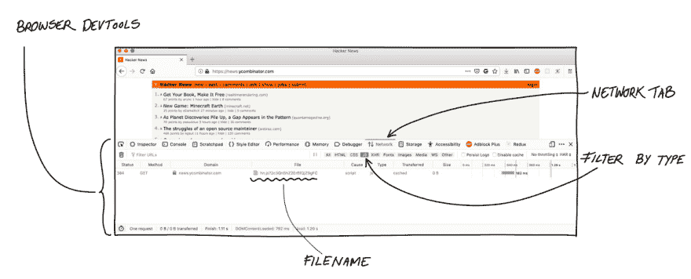
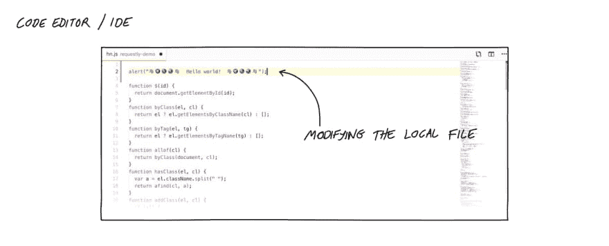
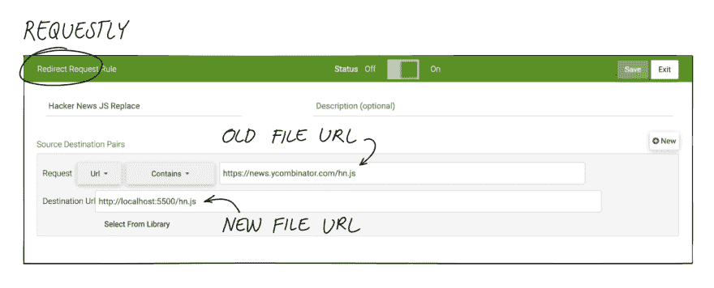
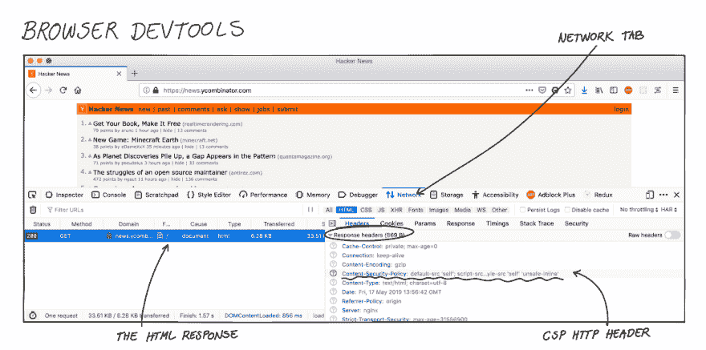
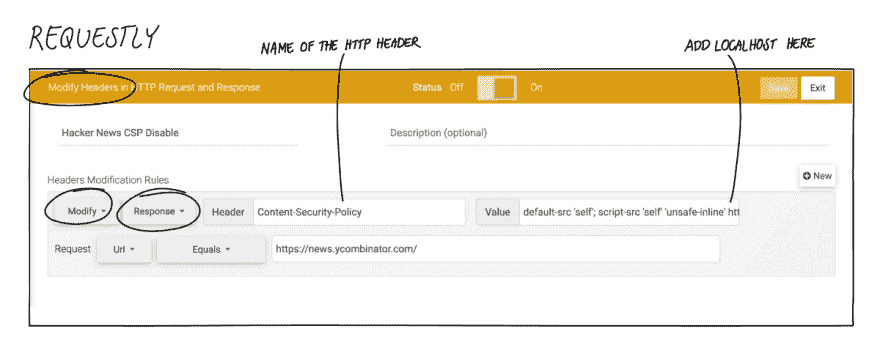
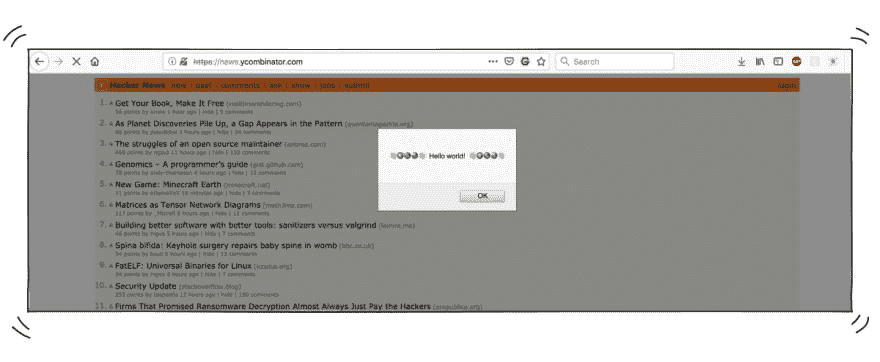

# 通过用本地文件替换远程文件来调试实时站点

> 原文：<https://dev.to/alexabruck/tricks-for-debugging-a-live-site-58ck>

在您的 web 开发人员生涯中，您可能会遇到以下情况:

您的站点正在运行，您需要修复 Javascript 文件中的一个问题。由于某些原因，你不能在本地设置和运行整个项目。或者，您可能希望在生产环境中针对实时数据库运行 Javascript。

## 能做什么？

我最近发现了一个名为[的浏览器扩展 Requestly](//app.requestly.io) (适用于 Firefox 和 Chrome)。它允许您拦截和重定向浏览器的网络请求，并用您自己机器的本地主机或任何其他远程服务器提供的资源替换所请求的远程资源(如 JS 文件)。

请记住，这只是为了在浏览器端进行调试和测试，它不会实际改变服务器上的原始文件！

让我们用一些随机的网站来练习这个场景。我会使用 https://news.ycombinator.com/的网站。作为概念的证明，我只是想在他们的脚本中添加一个警告，说“你好，世界”。

## 第一步:下载原始文件

在 Firefox 中，我所做的是打开 Devtools，进入网络面板，只过滤 JS 资源，右键单击相关的 JS 文件，选择“在新标签中打开”，然后从那里下载文件。

在我们的例子中(黑客新闻),我们想要替换的文件被命名为`hn.js`,后跟一个包含哈希的查询字符串`?2c3QnShZ2ErBfQjZ9gFC`

## 第二步:编辑文件

让我们用我们最喜欢的代码编辑器对下载的文件做一些修改。让我们只在文件的开头添加一行代码。显然，在现实中，你会在这里施展你狡猾的调试魔法！

## 第三步:服务文件

当您告诉 Requestly 设置重定向时，目的地必须是一个 URL。文件系统中的文件将不起作用。我使用超级方便的 VS 代码的 Live Server 插件直接从我的 IDE 中点击一下就能提供我的本地文件。开始了，我编辑的 JS 文件由 localhost 提供:[http://localhost:5500/HN . JS](http://localhost:5500/hn.js)

## 步骤 4:用 Requestly 配置重定向

 
当你安装了所需的浏览器扩展后，在浏览器工具栏中点击它，然后选择“打开应用”。选择“新规则”，然后从菜单中选择“重定向请求”选项。
输入您想要替换的文件的 Url(请求 Url)和您的替换文件的 URL(目标 URL)。如果原始 Url 包含(版本)哈希，您可能希望选择“包含”而不是“等于”。

现在在浏览器中刷新黑客新闻网站。我们看到“Hello world”警报了吗？没有。但是为什么呢？当我们打开浏览器控制台时，我们看到一个提示。

## 第五步:了解内容安全策略(CSP)

让我们更仔细地看看这个控制台错误:
`Content Security Policy: The page’s settings blocked the loading of a resource at http://localhost:5500/hn.js (“script-src”).`

该消息引用一个名为内容安全策略(CSP)的 HTTP 头，该头附加到原始站点的 HTTP 响应上。可以使用浏览器 Devtools 再次检查标题的确切内容:再次转到 Network 选项卡，按 HTML 过滤，单击文件，这将在右侧显示详细信息。选择“标题”选项卡。

下面是里面的内容:
`Content-Security-Policy: default-src 'self'; script-src 'self' 'unsafe-inline' https://www.google.com/recaptcha/ https://www.gstatic.com/recaptcha/ https://cdnjs.cloudflare.com/; frame-src 'self' https://www.google.com/recaptcha/; style-src 'self' 'unsafe-inline'`

这个 CSP 字符串有趣的部分是跟在关键字/指令`script-src`后面的部分。翻译过来就是:

*该站点被允许执行来自托管在同一域上的资源的脚本(`'self'`)，或者作为内嵌脚本嵌入(`'unsafe-inline'`)。此外，该网站将接受一些选定的外部提供商(谷歌，Gstatic，Cloudfare)的脚本。*

很明显，我们的 localhost 不是这个策略邀请的！这就是请求无法重定向到 localhost 的原因。幸运的是，我们也可以通过告诉 Requestly 修改网站的 HTTP 头来改变这一点。

## 第 6 步:修改 CSP HTTP 头以包含 localhost

创建新的请求规则。此规则应为“修改标题”类型。然后，在表单的“Header”输入字段中输入“Content-Security-Policy”(不带引号)。在“Value”输入字段中输入站点的原始 CSP 头，最后在 script-src 指令后添加 localhost。在请求 URL 的输入字段中输入您想要更改的站点的 Url(在我们的示例中是 Hacker News 的站点)。
选择“响应”，因为我们要改变响应的 HTTP 头。

在我们的例子中，更新后的 CSP 报头应该是:
`default-src 'self'; script-src 'self' 'unsafe-inline' http://localhost:5500 https://www.google.com/recaptcha/ https://www.gstatic.com/recaptcha/ https://cdnjs.cloudflare.com/; frame-src 'self' https://www.google.com/recaptcha/; style-src 'self' 'unsafe-inline'`

(请注意，您站点的现有 CSP HTTP 标头可能会有所不同。使用你的网站之一！)

⚠️ **给你一个忠告** ⚠️
请注意，如果你不知道自己在做什么，修补 HTTP 安全头可能会很危险。通过将 localhost 添加到可信主机来修改 CSP 头的风险相对较低(因为 localhost === you)。但是完全禁用一个站点的 CSP 头会给你带来安全风险。通过输入错误的参数(如 URL 模式的通配符*)，您可以轻松地禁用您访问的所有站点的重要安全机制。所以要非常非常小心！

## 第七步:HTTP + HTTPS =混合内容

这是最后一关。如果网站是通过 HTTPS 提供的，但是您的替换文件是通过 HTTP 提供的，那么您就会遇到一种称为“混合内容”的情况。大多数浏览器都会屏蔽混合内容，以保证你的安全。在这种情况下，您会在控制台中看到如下错误:

`Blocked loading mixed active content http://localhost:5500/hn.js`

要解决这个问题，你有两个选择:

*   [送达](https://medium.freecodecamp.org/how-to-get-https-working-on-your-local-development-environment-in-5-minutes-7af615770eec)HTTPS 上空你的替换文件
*   [告诉](https://support.mozilla.org/en-US/kb/mixed-content-blocking-firefox)您的浏览器(暂时)取消阻止混合内容

我在这个演示中使用了第二个选项(注意地址栏中带红线的锁图标)。瞧，我们看到了警报！

完成后，别忘了关闭你要求的规则！经验之谈！您将会忘记您设置了这个重定向，并会奇怪为什么事情表现得如此奇怪。那是因为网站上没有视觉提示提醒你已经篡改了(除非你在检查网络面板)！

**开心(现场)调试！**