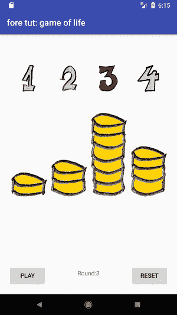
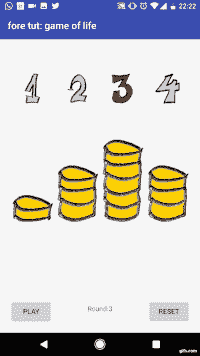

# 教程:安卓状态诉事件

> 原文：<https://dev.to/erdo/tutorial-android-state-v-event-3n31>

*这是 android 系列的一部分[fore](https://erdo.github.io/android-fore/)T3】*

| 系列教程 |
| --- |
| 1)教程:[发现故意的 bug](https://dev.to/erdo/tutorial-spot-the-deliberate-bug-165k) |
| 2)教程: [Android fore 基础知识](https://dev.to/erdo/tutorial-android-fore-basics-1155) |
| 3)教程: [Android 架构，全 todo app (MVO 版)](https://dev.to/erdo/tutorial-android-architecture-blueprints-full-todo-app-mvo-edition-259o) |
| 4)教程:[安卓状态诉事件](https://dev.to/erdo/tutorial-android-state-v-event-3n31) |
| 5)教程:[科特林协程，改型和前代](https://dev.to/erdo/tutorial-kotlin-coroutines-retrofit-and-fore-3874) |

GUI 可以由两种不同类型的数据驱动:**状态**或**事件**。这是一个普遍但不被重视的概念。让我们找出不同之处(无论我们使用 MVI，MVVM，MVO 还是其他什么都会很方便)...

我们将使用 [**fore**](https://erdo.github.io/android-fore/) 库和 [MVO](https://erdo.github.io/android-fore/00-architecture.html#shoom) 架构模式制作一个小游戏。我们还将涉及到 **SyncTrigger** 类，它是 fore 连接**状态**和**事件**两个世界的方式。

<figure>

[](https://res.cloudinary.com/practicaldev/image/fetch/s--xaePZSTy--/c_limit%2Cf_auto%2Cfl_progressive%2Cq_auto%2Cw_880/https://thepracticaldev.s3.amazonaws.com/i/3r1vg0xi2ym572ro87sj.png)

<figcaption>game of life</figcaption>

</figure>

* * *

## 游戏规则:

*   玩家从相同数量的硬币开始
*   每回合，一名玩家将他们的一枚硬币给另一名玩家，随机选择

**就这样**。当然，如果他们没有硬币可以给，他们会跳过他们的回合。我们突出显示将要玩的玩家(不是刚玩过的玩家)的号码。

* * *

## 型号

我们将像在 [**基础教程**](https://dev.to/erdo/tutorial-android-fore-basics-1155) 中一样先解决 MVO 中的 M(如果你没有读过那个教程，你可能应该先看看)。

我们游戏模型的完整源代码见下面的回购协议，但这些是我们的公共函数:

```
class GameModel() : Observable by ObservableImp(workMode) {

  fun next() {
    ...
  }

  fun clear() {
    ...
  }

  fun getPlayerAmount(playerNumber: Int): CashAmount {
    ...
  }

  fun isPlayersTurn(playerNumber: Int): Boolean {
    ...
  }

  fun getRound(): Int {
    ...
  }

} 
```

Enter fullscreen mode Exit fullscreen mode

*   该模型对 android 视图层类或上下文一无所知
*   每当我们的模型状态发生变化时，我们就调用 **notifyObservers()**
*   所有的公共函数都可以在 UI 线程上随时调用，我们保证它们的结果是一致的

当你使用 fore(或者类似 MVVM 的东西)时，写模型的清单在这里[维护](https://erdo.github.io/android-fore/02-models.html#model-checklist)。

## 视图

之前在这些教程中，我们已经为我们的视图层编写了自定义视图类，这次我们将为我们的视图层使用一个活动(只是因为)，我们将把它称为 **GameOfLifeActivity** 。

像往常一样，我们的视图层类(现在是一个活动)将处理以下事情:

*   获取我们需要的所有视图元素的**引用**
*   获取对**游戏模型**的引用，这样我们就可以基于它来绘制我们的用户界面
*   连接**按钮监听器**,以便它们与模型交互
*   同步我们的视图,以便它始终与游戏模型的状态相匹配(显示每个用户正确的硬币数量等)

```
class GameOfLifeActivity : AppCompatActivity {

    //models that we need
    private lateinit var gm: GameModel
    private lateinit var logger: Logger

    ...

    override fun onCreate(savedInstanceState: Bundle?) {
        super.onCreate(savedInstanceState)
        setContentView(R.layout.activity_main)

        //(get view references handled for us by kotlin tools)

        getModelReferences()

        setClickListeners()
    }

    private fun getModelReferences() {
        gm = App.inst.appComponent.gameModel
        logger = App.inst.appComponent.logger
    }

    private fun setClickListeners() {
        life_next_btn.setOnClickListener { gm.next() }
        life_reset_btn.setOnClickListener { gm.clear() }
    }

    ...

} 
```

Enter fullscreen mode Exit fullscreen mode

## 观察者

我们想要一个**反应视图**，它会在游戏模型改变时自动同步，而无需我们担心。因此，正如我们之前所做的，我们根据 android 生命周期方法添加和删除我们的观察者。

```
 class GameOfLifeActivity : AppCompatActivity() {

  ...

  override fun onStart() {
    super.onStart()
    gm.addObserver(observer)
    syncView() //  <- don't forget this
  }

  override fun onStop() {
    super.onStop()
    gm.removeObserver(observer)
  }

  override fun syncView() {    
    life_player1cash_img.setImageResource(gm.getPlayerAmount(0).resId)
    life_player2cash_img.setImageResource(gm.getPlayerAmount(1).resId)
    life_player3cash_img.setImageResource(gm.getPlayerAmount(2).resId)
    life_player4cash_img.setImageResource(gm.getPlayerAmount(3).resId)

    life_player1icon_img.setImageResource(if (gm.isPlayersTurn(0)) 
          R.drawable.player_01_highlight
       else
          R.drawable.player_01)
    life_player2icon_img.setImageResource(if (gm.isPlayersTurn(1)) 
          R.drawable.player_02_highlight
       else
          R.drawable.player_02)
    life_player3icon_img.setImageResource(if (gm.isPlayersTurn(2)) 
          R.drawable.player_03_highlight
       else
          R.drawable.player_03)
    life_player4icon_img.setImageResource(if (gm.isPlayersTurn(3)) 
          R.drawable.player_04_highlight
       else
          R.drawable.player_04)

    life_round_txt.text =
       resources.getString(R.string.round, gm.getRound())

  }

} 
```

Enter fullscreen mode Exit fullscreen mode

* * *

## 依赖注入

上次我们推出了自己的纯解决方案。这次我们用的是一个裸机匕首 2.0 实现，只是因为。

```
gameModel = App.inst.appComponent.gameModel 
```

Enter fullscreen mode Exit fullscreen mode

和以前一样，这为视图提供了每次都相同的模型实例，因此即使我们旋转屏幕，一切都保持一致。

<figure>

[](https://res.cloudinary.com/practicaldev/image/fetch/s--31lTI3----/c_limit%2Cf_auto%2Cfl_progressive%2Cq_66%2Cw_880/https://thepracticaldev.s3.amazonaws.com/i/fujmzsqfvfu6y3de7af9.gif)

<figcaption>rotation support as standard</figcaption>

</figure>

一如既往地与 MVO 和 fore: **旋转支持**和**可测性**来作为标准。

* * *

## 介绍一个事件

目前，我们的用户界面是由游戏模型中的状态驱动的。正是因为 MVO 的“状态性”,我们才可以如此容易地支持 android 上的旋转——我们所需要做的就是保持我们的 UI 完全一致，只要我们需要，就可以通过调用 syncView()来与模型重新同步。

但是让我们添加一个新的设计要求:

*当游戏过渡到一个至少有一个玩家没有硬币的经济时，我们希望显示一个 Snackbar 来表示这个过渡(或事件)发生了，反之亦然*。

我们可以很容易地将这个状态添加到我们的游戏模型中，并提供对它的访问，如下所示:*fun hasBankruptPlayers():Boolean*

但是 Snackbar UI 组件更适合于*事件*类型的数据，使用 syncView()触发 Snackbar 会给我们带来[问题](https://erdo.github.io/android-fore/05-extras.html#notification-counting)。syncView()的健壮实现不需要对它被调用的次数做任何假设，它被调用的次数可能比我们预期的要多——我们绝对不希望错误地显示 3 个重复的 Snackbars。

这是你在所有像 MVVM、MVO 和 MVI 这样的“国家级”架构中都会遇到的问题(与其说是 MVP，不如说是“事件性的”)。

这里我们需要的是一种将我们从**状态世界**(事物被设定，并保持这种状态直到再次被设定)带到**事件世界**(事物被分派然后消失，除非它们被再次分派)。有很多方法可以将这两个世界联系起来。在 **fore** 中，我们使用一种叫做 [**SyncTrigger**](https://erdo.github.io/android-fore/01-views.html#synctrigger) 的东西。

## 同步触发器

我们需要指定使用 SyncTrigger 的两个主要因素:

*   触发触发器所需的阈值(网络连接从连接->断开；错误状态从假->真；账户里的钱少于某个限额；定时器超过一定的持续时间等)
*   当它被触发时，我们希望发生什么(通常显示一个滚动条或一个对话框；开始一项活动；或者运行动画)

我们将向应用程序添加两个同步触发器:

```
 private fun setupTriggers() {

  showHasBankruptciesTrigger = SyncTrigger({ gameModel.hasBankruptPlayers() }){
    Snackbar.make(this, context.getString(R.string.bankruptcies_true), LENGTH_SHORT).show()
  }

  showNoBankruptciesTrigger = SyncTrigger({ !gameModel.hasBankruptPlayers() }){
    Snackbar.make(this, context.getString(R.string.bankruptcies_false), LENGTH_SHORT).show()
  }
} 
```

Enter fullscreen mode Exit fullscreen mode

我们还需要在每次运行 syncView():
时检查它们

```
override fun syncView() {

  ...

  showHasBankruptciesTrigger.checkLazy()
  showNoBankruptciesTrigger.checkLazy()
} 
```

Enter fullscreen mode Exit fullscreen mode

因为这些 SyncTriggers 存在于我们的视图层中，如果我们旋转视图，它们将被 android 销毁并重新创建。如果已经违反了它们的阈值条件，它们将在轮转时立即被激发(当调用 syncView()时)。如果设备再次旋转，它们将再次被发射等等。这可能不是我们想要的。因此， **checkLazy()** 忽略第一次检查新构造的 SyncTrigger 时发生的阈值突破。如果您确实希望触发器在第一次被检查时被触发，您可以调用 **check()** 而不是 checkLazy()。

### 复位行为

在重置之前，SyncTrigger 将仅触发一次，并且它将在触发条件第一次从假变为真时触发(选中时)。

默认情况下，SyncTrigger 根据 **ResetRule 复位。ONLY_AFTER_REVERSION** ，这意味着触发条件需要翻转回 false，才有资格重新触发。

或者，您可以用标志: **ResetRule 构造一个 SyncTrigger。立即**，这意味着 SyncTrigger 可以在每次检查并且触发条件为真时持续触发。*小心这一点，它可能会将你的代码依赖于 syncView()被调用一定的次数——这是一种编写[脆弱代码](https://erdo.github.io/android-fore/05-extras.html#notification-counting)的方式。*

### 亲吻

SyncTriggers 是一种响应模型中发生的状态变化而产生漂亮动画的好方法。

虽然你并不总是需要它们，例如，按钮点击监听器已经是基于事件的了。我建议看一看 [fore docs](https://erdo.github.io/android-fore/05-extras.html#state-versus-events) 中关于这个的讨论。

在 fore 文档网站[上有一个演示，检查将您的数据视为状态或事件的效果【这里](https://erdo.github.io/android-fore/05-extras.html#presentations)——点击**的**查看幻灯片注释，因为它们提供了更多的上下文

* * *

感谢阅读！如果你正在考虑在你的团队中使用 fore，fore 文档包含了易于理解的示例应用中的大部分基础知识，例如[适配器](https://erdo.github.io/android-fore/#fore-3-adapter-example)、[网络](https://erdo.github.io/android-fore/#fore-4-retrofit-example)或[数据库](https://erdo.github.io/android-fore/#fore-6-db-example-room-db-driven-to-do-list)。

这里是教程的完整代码