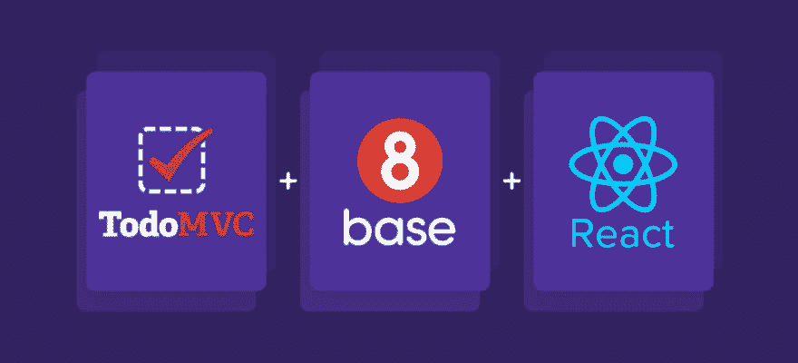
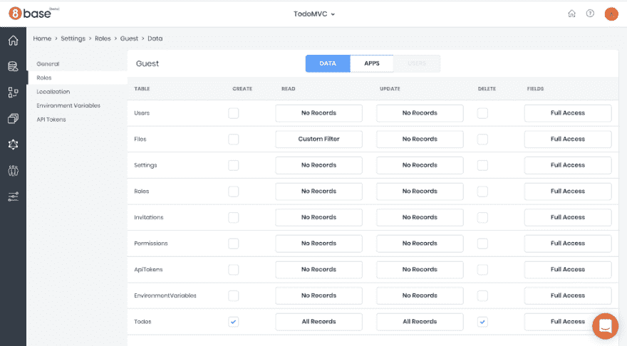
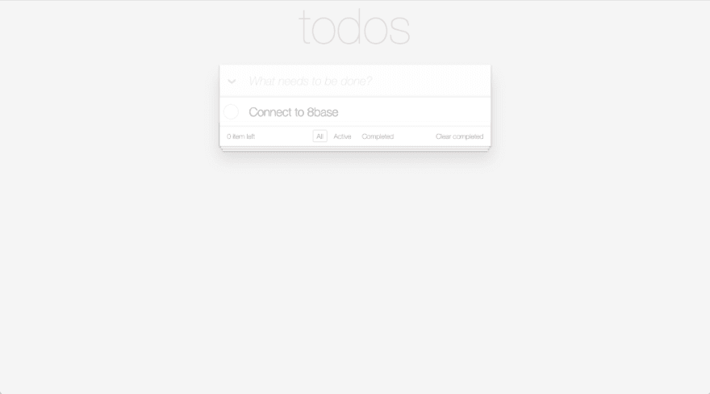
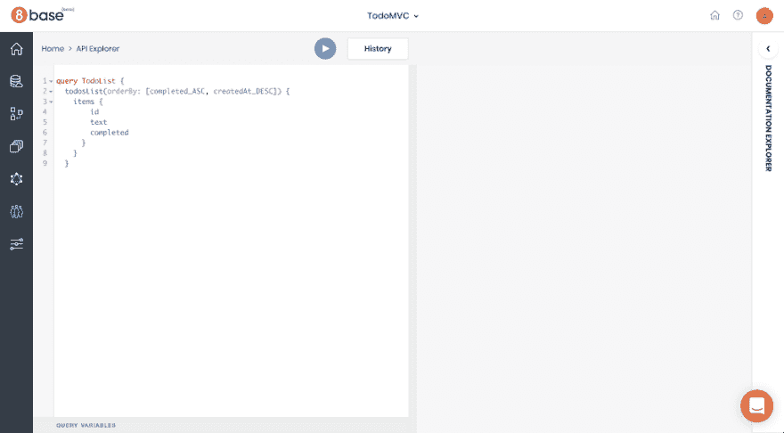
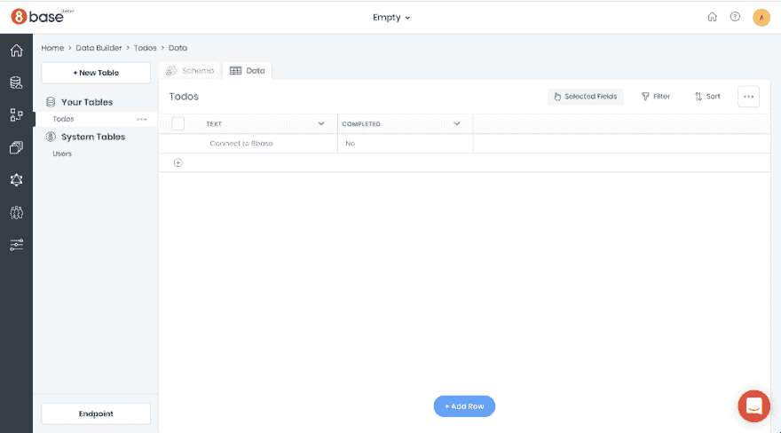

# 教程:使用 React 和 8base GraphQL API 构建 TodoMVC

> 原文：<https://dev.to/8base/tutorial-building-todomvc-with-8base-and-graphql-1nee>

[](https://res.cloudinary.com/practicaldev/image/fetch/s--jMkG7rVe--/c_limit%2Cf_auto%2Cfl_progressive%2Cq_auto%2Cw_880/https://cdn-images-1.medium.com/max/1024/1%2A2O1B3d5Pda95Isjc8OUN_w.png)

### 要求

*   [去](https://git-scm.com/downloads)
*   npm 或[纱线](https://yarnpkg.com/lang/en/docs/install/#mac-stable)(我们在这里使用纱线，但如果你喜欢，你也可以使用 npm)
*   熟悉 [React.js](https://reactjs.org/)

### 简介

在本教程中，我将向你展示如何使用 [8base](https://www.8base.com/) 快速创建一个 GraphQL API 并从 React 应用程序连接到它。8base 是一个开发人员加速平台，提供了大量的功能来帮助前端开发人员比以往更快更简单地构建应用程序。有了 8base，就不需要依赖后端开发者或者 DevOps 了！

使用 8base 平台，您可以使用简单的 GUI 构建您的后端，该 GUI 允许您执行以下操作:

*   定义您的模式:创建表/表关系
*   上传文件
*   定义角色
*   使用“工作区”管理各种项目
*   使用 API explorer 设计查询(基于 GraphQL)

我认为说明 8base 的效用的最好方式是向感兴趣的用户展示它如何与他们已经在做的项目集成。通过将一个简单的 Todo MVC 应用程序连接到 8base 后端，我们将学习如何:

*   导航 8base UI 以及创建新的工作区和表格
*   定义角色权限
*   使用 GraphQL 编写查询
*   使用 8base SDK 通过 React.js 前端访问您的数据

### 预期受众

本教程主要面向刚刚接触 8base 并且之前没有多少 GraphQL 经验的用户。如果您熟悉 GraphQL，那么连接到您的 8base 后端应该是一个比较熟悉的过程。否则，鼓励每个人按照本教程来查看 8base 推荐的使用 8base SDK 的实现。

### 准备环境/ 8base UI

8base 的开发人员创建这个平台的目的是制造一些他们想要使用的东西。当您浏览 8base UI 时，您会注意到在创建这个平台时投入了大量的时间和精力，以确保开发体验是令人愉快的直观，并且应用程序中的元素是以现代方式流动和响应的。在本教程中，我们将只使用 8base 提供的一些特性，但我强烈建议您探索整个平台并利用套件中的其他工具。

1.  **在 [8base](https://8base.com/) *上创建一个账户***(8 base 最初是一个免费使用的平台，随着使用量的增加，价格会发生变化。查看定价详情 [*此处*](https://www.8base.com/pricing) *。您将被要求验证您的电子邮件，然后重定向到 8base UI)。*
2.  进入 8base UI 后，只需**导航至“数据”并点击“新表”**即可开始构建后端。加载新表后，您将进入模式，以便开始定义字段。让我们四处看看，并注意一些事情。在左边，你会看到有系统表和你的表。每个新的 8base workspace 都自动预装了许多内置表格。这些表用于处理文件、设置和权限等事务，并且都可以通过 8base GraphQL API 进行访问。目前，通过 UI 显示的唯一系统表是 Users，但是您可以通过使用 API Explorer 中的查询表列表找到 8 个基本系统表的完整列表。
3.  继续操作，**创建一个包含字段文本(字段类型:文本)、已完成(字段类型:开关、格式:是/否)的表** Todo。*开关是一种特别有趣的场类型。起初，它可能看起来像一个布尔值，但是 switch 字段实际上能够处理多个选项，因此具有很大的灵活性。然而，为了这个项目，我们将简单地使用是/否*
4.  接下来，**复制 API 端点 URL** (在左下角可用)——这是您的前端和 8base 后端之间的主要通信线路(您稍后会需要它，因为它显示 8BASE_API_URL)。
5.  最后，出于本教程的目的，我们将默认**允许对来宾**开放访问，以便处理身份验证是可选的。要允许来宾访问您的新待办事项表，请导航至设置>角色>来宾，并选中待办事项下的相应框。*默认情况下，所有访问您的 API 端点的未经验证的用户都被赋予了* *来宾的角色。本教程不涉及身份验证。你可以在这里* 看到更详细的认证应该如何处理 [*。*](https://docs.8base.com/docs/authentication)

<figure>[](https://res.cloudinary.com/practicaldev/image/fetch/s--9oXpOK-M--/c_limit%2Cf_auto%2Cfl_progressive%2Cq_auto%2Cw_880/https://cdn-images-1.medium.com/max/1024/1%2AKd0z58jTVcR2oyT-BBiNIQ.png) 

<figcaption>*确保您的访客 Todos 权限与上面的权限相匹配*</figcaption>

</figure>

现在你已经准备好了你的后端，让我们去 8base [TodoMVC repo](https://github.com/8base-examples/todomvc) 准备我们的客户端应用程序。

*   克隆 TodoMVC repo 并运行 git checkout workshop 以切换到 workshop 分支。

主分支包含这个项目的完整代码，所以如果你不完成这个步骤，你将无法跟随教程。

*   安装依赖项:

```
yarn add @8base/app-provider graphql graphql-tag react-apollo && yarn 
```

*   测试该应用程序的工作没有后端:纱线开始

[](https://res.cloudinary.com/practicaldev/image/fetch/s--QyEriv8q--/c_limit%2Cf_auto%2Cfl_progressive%2Cq_auto%2Cw_880/https://cdn-images-1.medium.com/max/1024/1%2AqvTFzoUgTA-anWaPb9cqPA.png)

*   (可选)Setup VS Code[Apollo graph QL](https://marketplace.visualstudio.com/items?itemName=apollographql.vscode-apollo)扩展:在项目的根目录下创建 apollo.config.js 文件，内容如下(用您的 API 端点 URL 替换 8BASE_API_URL):

```
module.exports = {
  client: {
    service: {
      name: '8base',
      url: '8BASE\_API\_URL',
    },
    includes: [
      "src/\*.{ts,tsx,js,jsx}"
    ]
  },
}; 
```

VS 代码的 Apollo GraphQL 扩展为编写 GraphQL 查询提供了验证和自动完成功能。

### 连接后端

我们设置的应用程序 repo 内置了以下代码，因此您可以专注于了解正在发生的事情。在必须添加代码的情况下，只需取消对指定内容的注释。在必须删除代码的情况下，指定的代码会在代码库中附加注释//Remove this。

*请注意，本教程中的所有相关代码都将放在 src/App.js 文件中——这不是使用 React 的最佳做法，但这样做是为了简化教程。*

1.  **导入与 GraphQL 相关的依赖关系**

```
import gql from "graphql-tag";
import { graphql } from "react-apollo";
import { EightBaseAppProvider } from '@8base/app-provider'; 
```

你会看到我们不仅导入了 gql 和 graphql，还从 8base SDK 导入了 EightBaseAppProvider。8base SDK 简化了与 8base 和 GraphQL 的集成。我们已经通过获取大量样板/设置代码并将其打包到 SDK 中完成了这项工作，因此开发人员需要做的就是将他们的应用程序封装在<eightbaseappprovider>标签中，并向其传递适当的属性，以允许对所有子组件进行数据访问。EightBaseAppProvider 使用的是 [Apollo 客户端](https://www.apollographql.com/docs/react/)，所以如果你已经很熟悉了，就没有什么新东西需要学习了。</eightbaseappprovider>

**2。初始化**T2【EightBaseAppProvider】T4

```
<EightBaseAppProvider uri={ENDPOINT_URL} >
 {({ loading }) => loading ? <div>"Loading..."</div> : (
   <div className="todoapp">...</div>
 })}
</EightBaseAppProvider> 
```

您需要提供一个函数作为 EightBaseAppProvider 的子函数，它将告诉 React 我们想要呈现什么。我们可以使用 loading 属性在应用程序初始化时显示一个加载器。在初始化过程中，EightBaseAppProvider 加载 8base 表模式，该模式允许您访问前端代码中数据模型的所有属性。我们将在以后的教程中更深入地讨论这个特性。

**3。添加一个查询来获取 todos**

*   查询和特设[(高阶组件)](https://reactjs.org/docs/higher-order-components.html)

```
const TODO_LIST_QUERY = gql`
  query TodoList {
    todosList(orderBy: [completed_ASC, createdAt_DESC]) {
      items {
        id
        text
        completed
      }
    }
  }
`;

const withTodos = graphql(TODO_LIST_QUERY, {
  props: ({ data: { todosList: ({ items } = {}) } }) => {
    return {
      todos: items || []
    };
  },
}); 
```

在上面的代码中，我们使用由 [react-apollo](https://www.apollographql.com/docs/react/) 提供的 graphql()函数创建了一个高阶组件。

> 从[react-apollo](https://www.apollographql.com/docs/react/api/react-apollo.html#graphql)—graph QL()函数是 react-Apollo 导出的最重要的东西。使用这个函数，您可以创建更高阶的组件，这些组件可以执行查询，并根据 Apollo 存储中的数据进行反应式更新。函数的作用是:返回一个函数，该函数将“增强”任何具有反应式 graphql 功能的组件。这遵循 React 高阶组件模式，react-redux 的 connect 函数也使用该模式。

本质上，通过使用 graphql()，我们能够在一个地方编写代码来查询我们的后端，并将该功能注入多个组件，而不是在我们希望能够使用它的任何地方编写它。graphql 函数将一个查询作为其第一个参数，将 config 作为第二个参数，返回值是一个应该使用所需组件作为参数来执行的特设值。请注意，在我们的示例中，我们使用配置参数 ingraphql()来指定我们的数据将作为 props.todos 而不是 props.data.todosList.items 进行访问。至于我们的 TODO_LIST_QUERY，我们已经为您提供了适当的语法，但通常我们可能会在 *8base API Explorer* 中设计我们的查询。如果您导航到 API Explorer 并复制/粘贴 TODO_LIST_QUERY，您可以看到将返回什么数据。尝试这个查询，看看可以返回数据的其他方式。

<figure>[](https://res.cloudinary.com/practicaldev/image/fetch/s--y2SnUXIS--/c_limit%2Cf_auto%2Cfl_progressive%2Cq_auto%2Cw_880/https://cdn-images-1.medium.com/max/1024/1%2AWtuMwVMPyfXCgubcEw2c4Q.png)

<figcaption>*8 base API Explorer*</figcaption>

</figure>

*   将主页和页脚换行到 withTodos 中

```
Main = compose(
  withRouter,
  withTodos // Add this
)(Main); 
```

```
Footer = compose(
  withRouter,
  withTodos // Add this
)(Footer); 
```

最后，在我们的例子中，我们希望在主组件和页脚组件中显示来自 8base 后端的所有数据。在上面的代码中，我们使用 lodash 库提供的 compose()函数将多个高阶组件链接在一起，为我们的目标组件提供来自每个 HOC 的功能。你可以在这里阅读更多关于 compose()函数如何工作的内容。

*   删除将 todos 属性传递给 Main 和 Footer 组件的代码

```
<Main
   todos={ this.state.todos }  // Remove this
   ...

<Footer
   todos={ this.state.todos }  // Remove this 
```

当我们第一次设置我们的应用程序时，所有的 Todos 都处于保持状态，因为我们没有连接到后端。我们的组件仍然需要访问 todos props，但是我们不再需要显式地传递它，因为它们是由 withTodos 提供的。

**4。添加查询创建待办事宜**

```
const CREATE_TODO_MUTATION = gql`
  mutation TodoCreate($data: TodoCreateInput!) {
    todoCreate(data: $data) {
      id
      text
      completed
    }
  }
`;

const withCreateTodo = graphql(CREATE_TODO_MUTATION, {
  props: ({ mutate }) => ({
    createTodo: ({ text }) => {
      mutate({
        variables: { data: { text, completed: false } },
        refetchQueries: [{ query: TODO_LIST_QUERY }]
      });
    }
  })
}); 
```

在这里，我们重复之前用来查询 8base 后端的过程，只是这次我们使用 GraphQL mutation 来创建一个 Todo，然后调用 refetchQueries 来用我们新添加的数据更新应用程序的状态。这将允许新数据填充整个应用程序，而不必向我们的后端发出单独的请求。

*   包装标题

```
Header = withCreateTodo(Header); 
```

上面的语法说明了使用我们的 HOC 对 Header 组件的增强。请注意，withCreateTodo 充当一个函数，Header 组件作为一个参数传递给该函数，然后将增强的组件设置为要在我们的应用程序中使用的变量 Header。

*   从标题中删除 createtool

```
<Header
   createTodo={ this.createTodo }  // Remove this 
```

**5。添加一个查询来更新 todos**

*   突变和 HOC

```
const TOGGLE_TODO_MUTATION = gql`
  mutation TodoToggle($id: ID!, $completed: Boolean!) {
    todoUpdate(filter: { id: $id }, data: {
       completed: $completed
    }) {
      id
      text
      completed
    }
  }
`;

const withToggleTodo = graphql(TOGGLE_TODO_MUTATION, {
  props: ({ mutate }) => ({
    toggleTodo: ({ id, completed }) => {
      mutate({
        variables: { id, completed },
        refetchQueries: [{ query: TODO_LIST_QUERY }]
      });
    }
  })  
}); 
```

*   用 withToggleTodo 包装 Main

```
 Main = compose(
  withRouter,
  withTodos,
  withToggleTodo  // Add this
)(Main); 
```

*   从 Main 中移除 toggleTodo

```
<Main
   toggleTodo={ this.toggleTodo }  // Remove this
   ... 
```

上面我们已经重复了前面的模式，向主组件添加功能。这将使用户能够将待办事项切换为完成或未完成。

**6。添加查询以将所有待办事项标记为完成**

*   我们只需要一个新的 HOC，我们可以重复使用变异。循环中的所有突变将在单个请求中批量处理。

```
const withToggleAllTodos = graphql(TOGGLE_TODO_MUTATION, {
  props: ({ mutate, ownProps: { todos }}) => ({
    toggleAllTodos: ({ completed }) => {      
      todos.forEach((todo) => {
        mutate({
          variables: { id: todo.id, completed },
          refetchQueries: [{ query: TODO_LIST_QUERY }]
        });        
      });      
    }
  })
}); 
```

*   用 ToggleAllTodos 将 Main 包起来

```
 Main = compose(
  withRouter,
  withTodos,
  withToggleTodo,
  withToggleAllTodos // Add this
)(Main); 
```

*   从 Main 中移除 toggleAllTodos

```
<Main
   toggleAllTodos={ this.toggleAllTodos }  // Remove this
   ... 
```

7 .**。添加删除待办事项的查询**

*   突变和 HOC

```
const DELETE_TODO_MUTATION = gql`
  mutation TodoDelete($id: ID!) {
    todoDelete(filter: { id: $id }) {
      success
    }
  }
`;

const withRemoveTodo = graphql(DELETE_TODO_MUTATION, {
  props: ({ mutate }) => ({
    removeTodo: ( id ) => {
      mutate({
        variables: { id },
        refetchQueries: [{ query: TODO_LIST_QUERY }]
      });
    }
  })  
}); 
```

*   用 withRemoveTodo 包装 Main

```
 Main = compose(
  withRouter,
  withTodos,
  withToggleTodo,
  withRemoveTodo // Add this
)(Main); 
```

*   从 Main 中移除 removeTodo

```
<Main
   removeTodo={ this.removeTodo }  // Remove this
   ... 
```

正如您所看到的，一旦您理解了使用 graphql() HOC 增强组件的基本模式，编写可以在整个应用程序中轻松访问的新查询就变得相当简单了。

最后，通过导航到根目录并运行 yarn start 来测试您的应用程序是否正常工作。

现在，您应该能够创建、更新和销毁保存到数据库中的 Todos。

*   要查看 8base 的运行情况，请在单独的选项卡中打开您的 8base 工作区，并在 Todos 表上打开*数据查看器*。您应该会在这个窗口中看到应用程序的所有数据。在您的应用程序中创建新的待办事项，并刷新页面以在您的数据库中看到它们！

<figure>[](https://res.cloudinary.com/practicaldev/image/fetch/s--4scmZdga--/c_limit%2Cf_auto%2Cfl_progressive%2Cq_auto%2Cw_880/https://cdn-images-1.medium.com/max/1024/1%2AkYA02Tq9ob9pIkD8cdA43w.png) 

<figcaption>8base 数据查看器</figcaption>

</figure>

8base 目前正致力于使用其他框架和库来实现。我们目前有使用 [React](https://github.com/8base/app-example) 和 [React-Native](https://github.com/8base/react-native-app-example) 的例子，以及更多使用 CURL、Node 和 Vanilla JS 的[简单例子](https://docs.8base.com/docs/connecting-to-your-frontend)。请随时访问我们的[文档](https://docs.8base.com/)，在我们的[网站](https://www.8base.com/)上发送消息，或者亲自联系我，反馈您对 8base 的体验。

连接了 8base 后端的完整示例可以在[主](https://github.com/8base/todomvc)分支中找到。

### 联系我们！

要开始使用 8base 或简单地了解更多信息，请访问[**【www.8base.com】**](http://www.8base.com/)[**【docs.8base.com】**](https://docs.8base.com/docs)，在 Twitter 上关注我们，地址为**@**[**8 base Inc**](https://twitter.com/8baseinc)，或直接发送电子邮件至***[【info@8base.com](mailto:info@8base.com)****。*

* * *