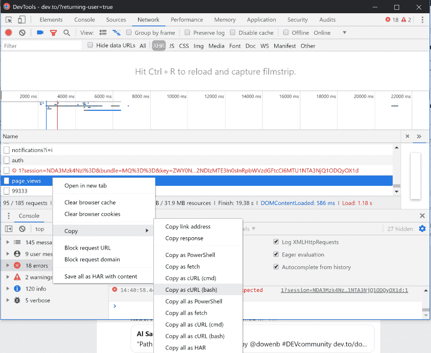
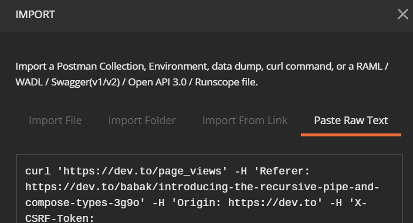
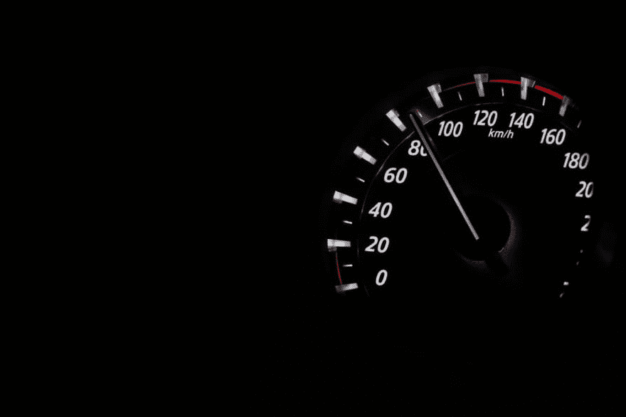

# 你应该对 Postman 使用的两个简单测试

> 原文：<https://dev.to/dowenb/two-simple-tests-you-should-be-using-with-postman-53hj>

## 增加一些测试

Postman 是您的测试工具箱中非常棒的一部分。我最近有理由使用它来帮助跟踪一个性能问题。我很快发现了一件事，那就是在测试跑步者中阅读一墙的“通过”结果，并试图挑出缓慢的反应是痛苦的。

那么，如何在不花费时间编写详细测试的情况下，从 Postman 获得更多呢？简单，用内置的例子！

## 捕获你想要测试的请求

首先，您需要捕获您想要测试的请求。如果你还不知道这是什么，你可以很容易地捕捉到它。

在 Chrome 等浏览器中加载开发工具，访问想要测试的页面，识别网络请求，右键单击复制请求(cURL Bash)。

现在使用 Postman 中的“导入”选项，作为“原始文本”导入，在复制的请求中传递。
[T3】](https://res.cloudinary.com/practicaldev/image/fetch/s--oVC_PFoh--/c_limit%2Cf_auto%2Cfl_progressive%2Cq_auto%2Cw_880/https://thepracticaldev.s3.amazonaws.com/i/wen5jyq7xet8gq0m9rbg.PNG)

提示:请注意，如果您的请求已经过身份验证，则只有当您的不记名令牌有效时，此操作才有效。

## 打开“测试”选项卡

根据您的请求打开“测试”选项卡，在这里您会看到，在右侧，有一个内置示例列表。
[T3】](https://res.cloudinary.com/practicaldev/image/fetch/s--1ySwgEu2--/c_limit%2Cf_auto%2Cfl_progressive%2Cq_auto%2Cw_880/https://thepracticaldev.s3.amazonaws.com/i/fcde2haptwv01v46u44i.PNG)

## 检查 HTTP 状态码

至少，您应该知道您期望什么样的返回代码。如果你希望这个请求成功，你可能要找“200”OK。

其他 HTTP 代码见: [HTTP 状态猫](//http.cat)或 [HTTP 状态狗](https://httpstatusdogs.com)

> pm.test("状态码为 200 "，function(){
> pm . response . to . have . Status(200)；
> })；

## 检查响应时间

有趣的是，设置一个预期的响应时间。这又是一个内置的例子，好好利用吧！

> pm.test("响应时间小于 200ms "，function(){
> pm . expect(pm . Response . Response time). to . be . below(200)；
> })；

## 使用收集运行器运行多次

现在，如果您想要多次检查请求的运行情况——将请求保存到一个“集合”中，并使用测试运行程序多次运行它！

对于额外的危险，在测试运行时，尝试注入故障或创建一个“更糟糕的情况场景”,以查看您的服务如何响应故障条件。

## 了解更多

我从 [Amber Race](https://twitter.com/ambertests) 关于[测试自动化大学](https://testautomationu.applitools.com) : [通过测试自动化探索服务 APIs】的精彩免费课程中学到了很多关于 Postman 的知识。](https://testautomationu.applitools.com/exploring-service-apis-through-test-automation/)