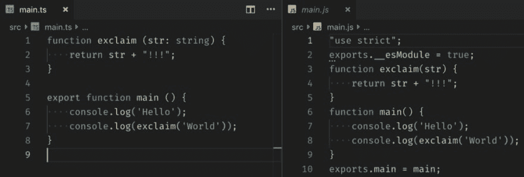
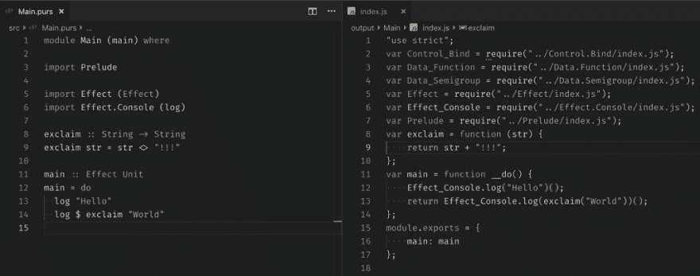

# TypeScript 与 PureScript:并非所有编译器都是平等的

> 原文：<https://dev.to/bnevilleoneill/typescript-vs-purescript-not-all-compilers-are-created-equal-3883>

[](https://res.cloudinary.com/practicaldev/image/fetch/s--pIeAHa7W--/c_limit%2Cf_auto%2Cfl_progressive%2Cq_auto%2Cw_880/https://cdn-images-1.medium.com/max/1024/1%2Ajemvx9kY-VXKlaSKGtqTlw.png)

有很多种方法可以剥一只猫的皮，每种方法都有一种静态类型语言可以编译成 JavaScript。其中最知名的我们有*打字稿(TS)* 、*纯脚本(PS)* 、*榆木*、*理*、*流*和*镖*。但是为什么有这么多呢？它们为什么存在，存在的理由是什么？在本帖中，我们将看看前两种语言。我们将分析它们的相似之处和不同之处，看看它们如何处理不同的情况，并了解它们提供了什么保证。

[](https://logrocket.com/signup/)

### 种类、限制和保证

所有语言都有类型，即使是最宽松的语言，比如 JavaScript (JS)。在某种程度上，程序的逻辑值和它们的物理表示之间有一个映射。知道它们是如何翻译的会帮助我们理解事情，比如为什么在某些语言中 0.1 + 0.2！= 0.3.像 *JavaScript* 、 *Python* 和 *PHP* 这样的语言都是**动态类型化的**，这意味着当代码被执行并且类型有问题时，解释器将需要决定是强制值还是抛出运行时错误。

```
"Hello" + 1 // "Hello1"
null.f()    // TypeError: Cannot read property 'f' of null 
```

在创建消息时，强制使用字符串和数字确实很方便，但正如 Gary Bernhardt 的史诗般的演讲 [WAT](https://www.destroyallsoftware.com/talks/wat) 所示，它可能会变得非常奇怪，从而导致意想不到的错误。

相比之下，静态类型语言，如 *TypeScript* 或 *PureScript* 让我们明确地考虑类型。大多数语言会推断出大多数类型，所以我们不必太啰嗦，但是在某些时候，我们必须提供一些关于我们想要计算的*数据*和*我们将如何*计算它的信息。这些信息将帮助其他程序员(甚至是我们未来的自己)理解代码，它将允许我们的工具向我们提供信息和警告，应用自动修复，甚至协助重构。如果程序有问题，我们会在编译时出错，所以反馈循环会更短。

每种语言都会引入不同的限制，影响我们的编程方式。这些限制将为我们提供一定的保证，增加我们对代码的信心。例如，如果语言不允许我们使用 *null* ，我们将保证不会有 *NullPointerExceptions，*十亿美元的错误，我们可能需要一个不同的概念来表示失败或空。

### 类型脚本 vs 纯脚本

[*TypeScript*](https://www.typescriptlang.org/) 是微软在 2012 年创造的一种语言，其理念是帮助开发人员处理大型应用程序。它是一个 *JavaScript* 超集，这意味着一个有效的 *JavaScript* 程序就是一个有效的 *TypeScript* 程序。这个决定告诉了我们很多关于他们的基本原理，而不是创建新的语言特性(例如，特征、管道操作符、模式匹配等) *TypeScript* 专注于添加方法来键入现有的 *JavaScript* ，紧跟规范更新。在他们最新的[路线图目标](https://github.com/Microsoft/TypeScript/issues/29288)中说得很清楚，当他们说“每张桌子上的类型，每个家庭，每个 JS 开发者”和“通过强大的工具提高生产力”。

PureScript 是 Phil Freeman 在 2013 年创造的一种语言，由社区维护。它是一种严格的纯函数式语言，灵感来自于*哈斯克尔*。因此，它提供了许多旨在提高代码正确性和开发人员生产率的功能和限制，例如*不变性*、*模式匹配*、 *currying* 、*类型类*和 *do 表达式*等等。它使用 *JavaScript* 作为主要编译目标是因为在 web、服务器、移动甚至 [google sheets](https://twitter.com/sherman3ero/status/970034089813315584) 上运行的好处，但它也可以编译成 C、C++甚至 Erlang。

*TypeScript* 于 2015 年起飞，当时 [Angular 宣布](https://devblogs.microsoft.com/typescript/angular-2-built-on-typescript/)正在用它建造第二个版本。紧跟 JS 的决定、使用 VSCode 等工具的开发经验以及接受其限制带来的信心，鼓励了其他团队重写 Vue、Jest 和 Yarn 等大型项目。根据 JS 2018 的[状态，从 2016 年到 2018 年，TypeScript 的采用翻了一番。所有这些导致了学习资源的爆炸式增长和一个大而健康的生态系统。](https://2018.stateofjs.com/javascript-flavors/typescript/)

[](https://res.cloudinary.com/practicaldev/image/fetch/s--gMVwSS9l--/c_limit%2Cf_auto%2Cfl_progressive%2Cq_auto%2Cw_880/https://cdn-images-1.medium.com/max/1024/0%2ARZ94nP6TEbnkmPkZ.png)

相比之下，PureScript 并不那么受欢迎，但函数式编程总体上吸引了许多开发人员的目光。像 PHP 或 Java 这样的语言增加了 [lambda 表达式](http://tutorials.jenkov.com/java/lambda-expressions.html)，这使得高阶模式的使用成为可能，像 *React* 或 *Redux* 这样的库的流行帮助人们采用纯函数和不变性。其他语言如 *Elm* 有更大的社区，是函数世界的一个很好的起点，但是 *PS* 有一些很好的特性，我们将在后面分析。尽管规模很小，PureScript 社区在函数式编程 slack(pure script 频道)和它的对话页面非常活跃。

### 解剖输出

编译器将高级语言转换成低级语言，例如， *C* 和 *GO* 编译成可以直接在设备上执行的*机器码*， *Scala* 和 *Kotlin* 编译成 *Java 字节码*，打算在 *Java 虚拟机* (JVM)中运行， *TypeScript* 和 *PureScript* 前面例子的不同之处在于，*机器码*和 *Java 字节码*都是非常低级的二进制语言，而 *JavaScript* 是一种高级语言，仍然需要像 Chrome 的 V8 或 Firefox 的 SpiderMonkey 这样的引擎来解释。

在这一节中，我们将分析一个简单的 hello world 模块的编译输出结果。在这两种情况下，我们将导出一个 *main* 函数，它在控制台中打印两行并使用一个 helper 私有函数。*类型脚本*源非常类似于编译后的输出。请注意，类型信息被删除，一些模块代码被添加，但除此之外，代码是相同的。

[](https://res.cloudinary.com/practicaldev/image/fetch/s--vO5mBgdr--/c_limit%2Cf_auto%2Cfl_progressive%2Cq_auto%2Cw_880/https://cdn-images-1.medium.com/max/1024/0%2A7YLP9fwFVgw06GG5.png) 

<figcaption>带 commonjs 模块和 es5 目标的打字稿</figcaption>

***TypeScript*** 有许多[编译器选项](https://www.typescriptlang.org/docs/handbook/compiler-options.html)，可以增加或降低严格级别，并改变输出的构造方式。例如，*目标选项，*默认为 *es5* ，允许我们使用较新的语言特性，如旧浏览器中的[箭头功能](https://developer.mozilla.org/en-US/docs/Web/JavaScript/Reference/Functions/Arrow_functions)、[异步等待](https://developer.mozilla.org/en-US/docs/Web/JavaScript/Reference/Statements/async_function)和[析构](https://developer.mozilla.org/en-US/docs/Web/JavaScript/Reference/Operators/Destructuring_assignment)。另一个选项是*模块，*我们可以使用它来最大程度地适应我们的构建过程。默认情况下，它使用 *commonjs* ，这是*节点*中的默认模块加载器，也可以作为 *Browserify、Webpack* 或*package*的输入。如果我们将选项设置为 *es6，*，那么输出将更类似于输入，因为我们使用的是 [es6 导入](https://developer.mozilla.org/en-US/docs/Web/JavaScript/Reference/Statements/import)，它可以在以后提供给 rollup 之类的工具。

即使两个例子做得完全一样，它们也不会太相似。这是因为 *PureScript* 试图看起来更像 *Haskell* 而不是 *JavaScript。*来自一种 *C 族*语言，这种语法看起来很奇怪，但是我们会边走边解释。现在，请注意，输出中还缺少类型信息。成为静态的意味着所有的类型检查都是在编译时执行的，不会导致运行时开销。默认情况下，PS 使用 *commonjs* 作为其模块定义，因此您可以直接在*节点*中使用它，或者将其提供给外部绑定器。您还可以指示编译器使用全局变量捆绑您的所有文件。

[](https://res.cloudinary.com/practicaldev/image/fetch/s--RBgAp2Tx--/c_limit%2Cf_auto%2Cfl_progressive%2Cq_auto%2Cw_880/https://cdn-images-1.medium.com/max/1024/0%2AekGV4J9Lzb3xlcFh.png)

<figcaption>pure script hello world 编译</figcaption>

编译后的代码看起来不像是我们的首选。它有许多奇怪的词，如*半群*、*绑定*和*效果*，我们可以看到它在*主*函数中有一个额外的间接层，我们首先使用*效果 _ 控制台. log("Hello")* 创建一个*计算*，然后立即使用 *()* 执行它。这种间接性是由于语言强加的限制。顾名思义，PureScript 代码必须是纯的。这在这里并不明显，但是这种限制将允许我们组合和扩展我们的计算，从简单的构建复杂的特征。

纯度限制给了我们强有力的保证。我们说过两个例子做的完全一样，此时它们什么也不做(至少它们自己不做)。在这两种情况下，我们都创建了一个模块，它导出了一个 *main* 函数，就这样。如果我们想要代码实际运行，我们应该在某个时候调用 *main()* 。在 *TypeScript* 中，我们可以在同一个文件中添加调用，毕竟，它没有对我们施加纯度限制。另一方面，PureScript，_，_ 禁止我们这样做，因此它向我们保证导入模块不会导致执行未知的副作用，比如连接到数据库。像 [colors](https://github.com/Marak/colors.js#usage) 这样的库可以使用 JS/TS 提供的自由来“改进其语法”,方法是在导入库时自动修补 *String.prototype* 。在 String.prototype 中引入新的属性起初看起来是无害的，但是正如 smoosh gate 向我们展示的那样，这可能会成为一个问题。

纯度保证是有代价的。为了与来自 *PureScript* 的现有 *JavaScript* 进行交互，我们需要使用[外部函数接口](https://github.com/purescript/documentation/blob/master/language/FFI.md)创建绑定，并确保所有不纯的代码都被包装。 *TypeScript* ，更接近金属(如果可以称 JS 为金属的话)，只是要求我们提供打字信息，我们有自由选择什么时候要纯，什么时候不纯。

### 表达类型

为了让其他用户和工具知道您的数据和函数是什么样子，我们需要提供类型信息。 *TypeScript* ，是 *JavaScript* 超集，属于 *C 族*语法，其中值、关键字和类型信息交织在同一个表达式中。在[基本类型](https://www.typescriptlang.org/docs/handbook/basic-types.html)中，我们有 *JS* 原始类型，它不区分浮点类型和整数类型，只有*数字*。

```
const PI: number = 3.1416

let age: number = 32 
```

另一个常见的 C 惯例是，像 *PI、SOME_REGEX 或 API_URL* 这样的标识符是大写的，以表明它们是常量值(好像 const 关键字还不够)。请记住，对于复杂类型，常量值不同于不可变值。这个例子过于冗长，可以简化。编译器可以从值中推断出类型是*数字，*，所以没有必要显式，这里我们只是展示完整的语法。

如果我们回忆一下 *exclaim* 函数，我们可以注意到只有输入被键入。在像这样的简单情况下，省略返回类型并让推理系统保存我们宝贵的击键是很常见的。但是我们可以显式地添加类型作为后置条件，确保如果我们有一些差异，编译器会失败。

```
function exclaim (str: string): string {
    return str + "!!!";
} 
```

我们需要为顶级函数的输入提供显式类型，如果我们不这样做，编译器将推断不安全类型 *any。*这可能会导致错误，因为 *any* 会静默传播，这就是为什么 TS 添加了一个名为 *no-implicit-any* 的严格选项，它会抛出一个错误。为了通过工具提高开发人员的生产力，在 3.2 版本中 *TypeScript* 为其语言服务添加了一个[快速修复](https://devblogs.microsoft.com/typescript/announcing-typescript-3-2/)，以从函数用法中建议一个类型。

鉴于其基本原理， *TypeScript* 在我们编写函数和表达其类型的方式上有很大的灵活性。在下面的例子中，*感叹词 1* 和*感叹词 2* 是类似的。有许多地方需要添加函数类型定义，并且不知道使用哪种语法可能会令人困惑。

```
interface Exclaimable {
    exclaim1 (str: string): string
    exclaim2: (str: string) => string
} 
```

如果我们使用 JavaScript 文件，我们可以避免使用特殊的语法，只需使用 JSDoc 编写类型。这些特性允许新来的人[体验一些*打字稿*的好处](https://www.typescriptlang.org/docs/handbook/type-checking-javascript-files.html)而不用完全投入，这种决定让我认为 ts 是一种工具，而不是一种新的语言(拥有特殊的语法只是为了更具表现力)。

```
/**
 * Adds two numbers together
 * @param {number} a The first number to add
 * @param {number} b The second number to add
 */
function add (a, b) {
    return a + b
} 
```

在下面的例子中，函数 *sub* 和 *div* 也是类似的，但是后者使用箭头函数编写，更加简洁。接收两个参数使得这些函数更难组合。所以对于 *mul* ，我们决定一次接受一个参数，这使我们能够从中创建新的函数，比如 *times2* 。

```
function sub (a: number, b: number) {
  return a - b
}

const div = (a: number, b: number) => a / b

const mul = (a: number) => (b: number) => a * b

const times2 = mul(2) 
```

这样写 *mul* 的缺点是，当我们想用两个参数来调用它时，它看起来很奇怪: *mul(2)(4)* 。如果我们想两全其美，我们可以像 ramda 一样使用一个[库里函数](https://medium.com/@hernanrajchert/creating-typings-for-curry-using-ts-3-x-956da2780bbf)，但是它在 TS 中也有一些限制，因为它不能与通用函数一起工作。

```
const mul = curry((a: number, b: number) => a * b)
mul(2, 2) // 4
mul(2)(2) // 4 
```

***PureScript*** ，像 *Elm* 和 *Haskell，*有一个基于 *Hindley-Milner* 的类型系统，它非常适合函数式语言，并使它们之间的转换更加容易。我们可以注意到，类型信息放在上面，使用“*:::*将标识符与其类型 _，_ 分开，在新的一行中，我们使用*“=”将标识符与其值分开。即使编译器可以正确推断类型，如果我们不为所有顶级表达式提供显式信息，PS 也会警告我们。* 

```
pi :: Number
pi = 3.1416

age :: Int
age = 32 
```

专注于正确性，[原语类型](https://github.com/purescript/documentation/blob/master/language/Types.md)区分了浮点数和整数。另外，注意我们不需要 *const* 或 *let* 关键字，我们用小写写 *pi* ，因为我们保证所有数据都是不可变的。

当我们描述函数时，类型也写在函数实现之上，将参数名与其类型解耦。我们使用一个箭头来分隔输入和输出，所以像" *String → String* 这样的类型意味着"给定一个字符串，返回一个字符串的函数"。如果我们不知道输出类型，我们可以使用下划线来产生类似“通配符类型定义具有推断的类型字符串”的警告。

```
exclaim :: String -> String
exclaim str = str <> "!!!"

what :: String -> _
what str = str 
```

**与 TypeScript** 不同，定义函数类型只有一种方式，类似于 TS 中的 arrow function 方式。所有的函数都是自动生成的，没有泛型的限制，所以我们可以像以前一样创建 *times2* 。通过将数字 2 部分应用于 *mul* ，我们将签名“*数字→数字→数字*”变为“*数字→数字*”。

```
add :: Number -> Number -> Number
add a b = a + b

sub :: Number -> Number -> Number
sub a b = a - b

div :: Number -> Number -> Number
div a b = a / b

mul :: Number -> Number -> Number
mul a b = a * b

times2 :: Number -> Number
times2 = mul 2 
```

与 *C* - *族*语言的一个很大的语法差异是，函数应用不是用括号将参数括起来，而是用空格将它们分开，因此 PS 表达式“ *mul 2 4* ”与 ts 表达式“ *mul(2)(4)* ”相同。一开始可能会令人困惑，但它使语法更加清晰，我们将在下一节看到这一点。

还要注意，在“ *times2* ”的两个版本中， *b* 参数是隐式的。这种技术被称为[无点编程](https://lucasmreis.github.io/blog/pointfree-javascript/)，它可以为我们省去做类似于“*const times 2 = b =>mul(2)(b)*”之类事情的击键。这是一个强大的技术，但它不应该被滥用，因为有时它会降低可读性。

### 为作文而作的语言

在这一节中，我们将让 *TypeScript* 休息一会儿，并专注于是什么使 *PureScript* 成为一种考虑到组合的语言。让我们回忆一下“剖析输出”一节中的*主*功能。有三个东西我们没讲过:一个特殊符号“ *do* ”，一个不那么特殊的符号“ *$ 【T9”)，还有一个 *main* 的类型，看起来不像函数。* 

```
main :: Effect Unit
main = do
  log "Hello"
  log $ exclaim "World" 
```

PureScript 有一个叫做 **do 符号**的语言特性，它根据底层类型做不同的事情。我们可以写一整篇文章来详细描述它，但是现在，我们只能说这是一种方式，让我们以类似命令式编程的方式一个接一个地调用一个有效的计算。

为了帮助我们研究 *$* 和*效果单元*，我们将使用 *REPL* 来查看表达式的类型和类型的种类。我们需要安装*纸浆*，然后执行"*纸浆复制"*。使用 *:t* 命令我们可以看到 *log* 是一个接收*字符串*并返回*效果单元的函数，*是我们 *main* 函数的类型。

```
$ pulp repl
PSCi, version 0.12.2
Type :? for help

import Prelude
import Effect
import Effect.Console

> :t log
String -> Effect Unit 
```

“ *do* 里面的所有表达式都必须返回一个*效果单元*。对 *log* 的第一次调用是微不足道的，但是第二次调用带来了一个问题，因为我们想要记录被惊呼的字符串。假设函数应用是使用空格完成的，如果我们编写表达式 *log exclaim "World"* ，编译器将抛出一个错误，因为它知道我们正在向一个只接受一个参数的函数传递两个参数。我们想要的表达式有三种常见的写法:带括号、带 *apply* ( *$* )和带*apply lipped*(*#*)。

```
> :t log "Hello"
Effect Unit

> :t log exclaim "World"
Error found:
  Could not match type                    
    String -> String                    
  with type          
    String

> :t log (exclaim "World")
Effect Unit
> :t log $ exclaim "World"
Effect Unit
> :t exclaim "World" # log
Effect Unit 
```

符号*、*和 *#* 不是语言特征，它们只是分别被称为 *apply* 和*apply lipped*的普通函数，它们在标准库 Prelude 中定义。特别之处在于，我们可以为任何两个参数的函数定义一个中缀运算符。正如[文档](https://pursuit.purescript.org/packages/purescript-prelude/4.1.0/docs/Data.Function#v:(%24))所说， *apply* 让你在某些情况下省略括号，使代码更容易阅读。

查看源代码，实现非常简单，但是类型可以使用一些解释，因为这些是我们看到的第一个抽象函数。如果我们看一下 *apply* ，第一部分声明了两个类型变量“*a”*和“*b”*，它们可以是任何具体的类型。然后我们收到两个参数，一个函数" *f"* ，它来自( *a* → *b)* 和一个类型为 *"a "的值" *x* "。*如果我们使用*测井*作为我们的 *f* ，我们可以替换类型，看到*a*将是类型*串*，*b*将是*效果单元。*这个实现只是将参数“ *x* ”应用于函数“ *f* ”。注意*apply lipped*是相同的，但是它首先接收值，然后接收函数。

```
apply :: forall a b. (a -> b) -> a -> b
apply f x = f x

infixr 0 apply as $

applyFlipped :: forall a b. a -> (a -> b) -> b
applyFlipped x f = f x

infixl 1 applyFlipped as # 
```

再说一次， *$* 和 *#* 并没有什么特别之处，使这成为可能的语言决定是:函数应用是用空格完成的，括号仅用于定义优先级，两个参数的任何函数都可以被嵌入。这是一个非常强大的概念，Guy Steele 在他的演讲 g[row a language](https://www.youtube.com/watch?v=_ahvzDzKdB0)中描述了这个概念，它涉及到经过深思熟虑的语法原语，这些原语可以组成更复杂的结构，最终可以用来定义一种特定的语言。

在*JavaScript*/*TypeScript*中，有许多语言特性可以在 *PureScript* userland 中实现，而无需通过委员会。[管道操作符](https://developer.mozilla.org/en-US/docs/Web/JavaScript/Reference/Operators/Pipeline_operator)是第 1 阶段的一个提议，它可以为函数式程序员提供更好的语法，这与 PS*apply lipped(#)的作用相同。Async await 是一个关于承诺的特性，它允许我们更强制性地编写代码，在 PS 中，我们可以将 do 符号与 Aff 类型结合起来。第 1 阶段的[可选链接操作符](https://github.com/tc39/proposal-optional-chaining)可以用 do 符号和 Maybe 类型替换。*

既然 *do* 中的所有表达式都返回相同的类型，让我们回到 REPL 来理解该类型的含义。我们可以使用 *:k* 命令来检查 a 类型的种类。比如*单元*和*编号*是常规类型，但是*效果*和*数组*是类型构造器。类型构造函数是类型而不是值的函数，因此有类似的语法“*类型→类型*”。构造函数可以应用于使用空格的类型(就像普通的函数应用一样)，所以*数组号*和*效果单元*会有同类的*类型*。类型*单位*来自单词“工作单位”,类似于打字稿中的*无效*。

```
> :k Number
Type

> :k Unit
Type

> :k Effect
Type -> Type

> :k Array
Type -> Type

> :k Effect Unit
Type
> :k Array Number
Type 
```

我们可以把*数组*看作一个简单的数据结构，或者我们可以把它看作一种表达多值计算的方式。同样，我们可以把*效应*想象成一种改变世界的计算。严格的函数式语言有纯语言的限制，这允许一整套保证，但是程序的主要目标是以某种方式改变世界，或者通过读取文件，改变 DOM，等等。我们可以通过使用表示有效计算的类型来解决这个限制。

正如我们在“剖析输出”一节中看到的，所有的*效果*都被编译成函数，增加了一个额外的间接层。这允许我们在实际运行之前组合这些计算。在他演讲的前八分钟“[约束解放，自由约束](https://www.youtube.com/watch?v=GqmsQeSzMdw&list=WL)”中，鲁纳·比雅纳松对这个概念给出了我所见过的最好的解释之一。

*   如果我们要用炸药，用 TNT 比用爆炸的碎片更容易。

它还引用了大卫·惠勒的话

*   我们可以通过引入额外的间接层来解决任何问题。

用这种方式表达你的计算的一个好处是，你可以在类型系统中对你想做的事情和你想如何做的想法进行编码。我们可以像这样把多种计算结合起来创建我们的程序:

*   **效果** *单元*:以某种方式改变世界的有效计算，向控制台同步写入文件，改变 DOM 等
*   **数组** *学生*:多个学生的计算
*   **也许是** *用户* **:** 一个可能在用户中解析或者可能是空的计算
*   **要么** *字符串* *质数*:可以解析为质数的同步计算，要么以字符串消息失败
*   **Aff** *BlogPost* :一种可以解析为一篇博客文章的异步有效计算
*   **State** *AST Number* :与 AST 一起工作并返回一个数字的有状态计算

在这篇文章中，我们看到了 *TypeScript* 和 *PureScript* 之间的一些差异，更值得注意的是它们的基本原理，存在的理由。和往常一样，决定使用它们而不是普通的 *JavaScript* 更多地取决于一些因素，比如你的团队喜欢什么，你有多关心开发的正确性和速度，等等。了解每种语言能提供什么将有助于你做出明智的决定。如果觉得有用请评论或分享。

* * *

### Plug: [LogRocket](https://logrocket.com/signup/) ，一款适用于网络应用的 DVR

[](https://logrocket.com/signup/)

<figcaption>[https://logrocket.com/signup/](https://logrocket.com/signup/)</figcaption>

LogRocket 是一个前端日志工具，可以让你回放问题，就像它们发生在你自己的浏览器中一样。LogRocket 不需要猜测错误发生的原因，也不需要向用户询问截图和日志转储，而是让您重放会话以快速了解哪里出错了。它可以与任何应用程序完美配合，不管是什么框架，并且有插件可以记录来自 Redux、Vuex 和@ngrx/store 的额外上下文。

除了记录 Redux 操作和状态，LogRocket 还记录控制台日志、JavaScript 错误、堆栈跟踪、带有头+正文的网络请求/响应、浏览器元数据和自定义日志。它还使用 DOM 来记录页面上的 HTML 和 CSS，甚至为最复杂的单页面应用程序重新创建像素级完美视频。

免费试用。

* * *

帖子 [TypeScript vs PureScript](https://blog.logrocket.com/typescript-vs-purescript-not-all-compilers-are-created-equal-c16dadaa7d3e/) 首先出现在 [LogRocket 博客](https://blog.logrocket.com)上。