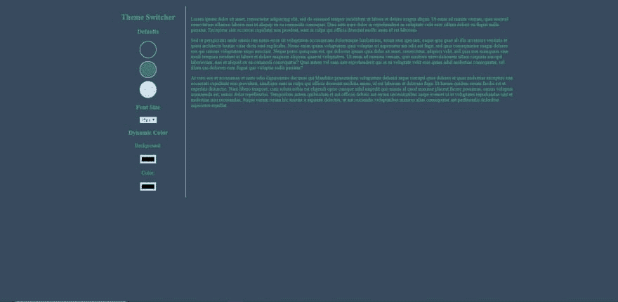

# 使用 CSS 变量的 UI 主题化

> 原文：<https://dev.to/proticm/ui-theming-with-css-variables-20mp>

> 最初发布于[我的博客](https://devinduct.com/blogpost/11/ui-theming-with-css-variables)

这篇文章是关于使用 CSS 变量来切换我们的 web 应用程序或站点的主题。它假设你已经阅读了我的前一篇文章， [CSS 变量备忘单](https://dev.to/proticm/css-variables-cheat-sheet-32id)，或者你对这个特性有一些了解。

# 我们将建造什么？

下面是本文中编写的代码的最终结果。为了实现它，我们将使用一些基本的 HTML、CSS 和 JavaScript 操作。

[](https://res.cloudinary.com/practicaldev/image/fetch/s--EqnAJyts--/c_limit%2Cf_auto%2Cfl_progressive%2Cq_auto%2Cw_880/https://thepracticaldev.s3.amazonaws.com/i/zpsnt1i1hynnkv0e2zft.png)

如你所见，在左侧我们将有可配置的主题选项。我认为改变背景颜色、颜色和字体就足以看到和理解如何为我们的网站或应用程序进行主题切换。

这个过程很简单。首先，我们将构建 HTML 布局，使用默认主题变量对其应用 CSS，并附加几个事件处理程序来动态更新主题。

**请注意，JS 代码是用下一代 JavaScript 编写的，因此请确保您使用的是支持它的最新浏览器。**

# HTML 设置

### 默认主题切换器

左上角的圆圈将负责切换分配给每个圆圈的预定义主题。我们将构建三个主题作为预定义的主题，并允许通过颜色输入进行动态着色，我们将在本文后面看到。默认的配色方案将是绿色(Vue)，蓝色(脸书)和蓝色(推特)。例如，为了创建按钮，我们可以使用三个`span`元素。

> *注意，你可以使用一个`button`或`input`元素，这没关系。我使用 span 元素没有特别的原因。这只是一个例子。*

好了，回到标记。看起来是这样的:

```
<span class="btn vue-green" data-bg-color="#42b883" data-color="#35495e">&nbsp;</span>
<span class="btn fb-blue" data-bg-color="#3b5998" data-color="#8b9dc3">&nbsp;</span>
<span class="btn tw-blue" data-bg-color="#0084b4" data-color="#00aced">&nbsp;</span> 
```

因为我们使用了一个`span`元素，我们需要在某个地方存储预定义的颜色。方法是使用`data`属性。这些属性的值将用于我们的主题，我们将在本文后面看到。

> 提示:你也可以在页面加载时通过 JavaScript 设置这些来保持整洁。例如，这些值可以定义为一个 CSS 变量，当页面最初加载时，您可以读取它们并相应地设置每个 span 数据属性。

### 字体切换器

字体切换器将是一个简单的`select`元素，其中有三个`option`元素。每个`option`都将有`value`用于`font-size`的更新:

```
<select>
    <option value="12">12px</option>
    <option value="15" selected>15px</option>
    <option value="25">25px</option>
</select> 
```

### 动态着色

对于用户定义的主题颜色，我们将利用类型为`color`的`input`元素。这非常简洁，使我们在网页上有了一个全功能的颜色选择器。

```
<label for="bg-color">Background:</label>
<input type="color" id="bg-color">
<label for="color">Color:</label>
<input type="color" id="color"> 
```

完整的左侧部分现在看起来像这样:

```
<aside>
    <h1>Theme Switcher</h1>
    <h3>Defaults</h3>
    <span class="btn vue-green" data-bg-color="#42b883" data-color="#35495e">&nbsp;</span>
    <span class="btn fb-blue" data-bg-color="#3b5998" data-color="#8b9dc3">&nbsp;</span>
    <span class="btn tw-blue" data-bg-color="#0084b4" data-color="#00aced">&nbsp;</span>
    <h3>Font Size</h3>
    <select>
        <option value="12px">12px</option>
        <option value="15px" selected>15px</option>
        <option value="25px">25px</option>
    </select>
    <h3>Dynamic Color</h3>
    <label for="bg-color">Background:</label>
    <input type="color" id="bg-color">
    <label for="color">Color:</label>
    <input type="color" id="color">
</aside> 
```

# 变量设置

既然 HTML 可配置部分已经完成，现在是我们设置 CSS 变量及其默认值的时候了。我们将在`:root`伪类:
上这样做

```
:root {
    --primary-color: #42b883;
    --primary-bg-color: #35495e;
    --primary-font-size: 15px;
    --color-white: #fff;
} 
```

这使我们能够在任何需要指定颜色或字体的地方重用该变量。例如，默认主题将是绿色。

# 使用变量

假设我们想要更改`body`元素上的`background-color`、`main`元素上的`color`和每个`p`元素上的`font-size`。

我们的 css 应该是这样的:

```
body {
    /* removed for brevity */
    background-color: var(--primary-bg-color);
}
main {
    /* removed for brevity */
    color: var(--primary-color);
}
p {
    font-size: var(--primary-font-size);
} 
```

CSS 变量通过使用`var`函数被设置为一个元素。CSS 属性的值是从 CSS 变量中解析和获取的。这非常简洁，因为每当我们改变变量时，这些属性的值都会更新。

# JavaScript 设置

好了，现在我们准备引入 JavaScript 部分。没有它，主题切换是不可能的。我们需要一种方法来改变 CSS 变量的值，这需要一点 JavaScript 代码。几个简单的步骤就可以完成:

1.  创建更新 CSS 变量的逻辑
2.  找到我们需要的元素
3.  附加事件处理程序
4.  执行负责变量更新的代码

负责变量更新的函数:

```
const handleThemeUpdate = (cssVars) => {
    const root = document.querySelector(':root');
    const keys = Object.keys(cssVars);
    keys.forEach(key => {
        root.style.setProperty(key, cssVars[key]);
    });
} 
```

简而言之，这个函数将一个对象作为参数，并为每个键更新在`:root`伪类上定义的相应 CSS 变量。为了实现这一点，我们需要以这样一种方式定义对象，其中每个键代表 CSS 变量名，每个键值代表我们想要应用的实际 CSS 值。

示例:

```
{
    '--primary-bg-color': 'green'
} 
```

接下来，我们需要找到元素并附加事件处理程序:

```
const themeSwitchers = document.querySelectorAll('span');
const fontSwitcher = document.querySelector('select');
const dynamicInputs = document.querySelectorAll('input');

themeSwitchers.forEach((item) => {
    item.addEventListener('click', (e) => {
        handleThemeUpdate({
            '--primary-bg-color': e.target.getAttribute('data-bg-color'),
            '--primary-color': e.target.getAttribute('data-color')
        });
    });
});

fontSwitcher.addEventListener('change', (e) => {
    handleThemeUpdate({
        '--primary-font-size': `${e.target.value}px`
    });
});

dynamicInputs.forEach((item) => {
    item.addEventListener('change', (e) => {
        const cssPropName = `--primary-${e.target.id}`;
        handleThemeUpdate({
            [cssPropName]: e.target.value
        });
    });
}); 
```

希望现在你能看到 HTML、CSS 和 JS 之间的联系。当用户点击一个 span 元素时，我们的`data`属性被读取，来自它的值被设置为相应的 CSS 变量。

此外，当用户更改颜色选择器元素的值或选择新的字体大小时，选定的值将被设置为相应的 CSS 变量。

如果你想稍微摆弄一下代码，请查看一下 [live fiddle](https://jsfiddle.net/proticm/wdn164fr/) 。

感谢您的阅读，下一篇文章再见。

# 进一步阅读

如果你没看过我之前的帖子， [CSS 变量备忘单](https://devinduct.com/blogpost/10/css-variables-cheat-sheet)，去看看吧。

如果你对 CSS flexbox 模块感兴趣，可以看看[这篇文章](https://devinduct.com/blogpost/4/a-quick-and-easy-guide-to-css-flexbox)。它提供了简单的解释和有趣的方法来学习如何使用它。