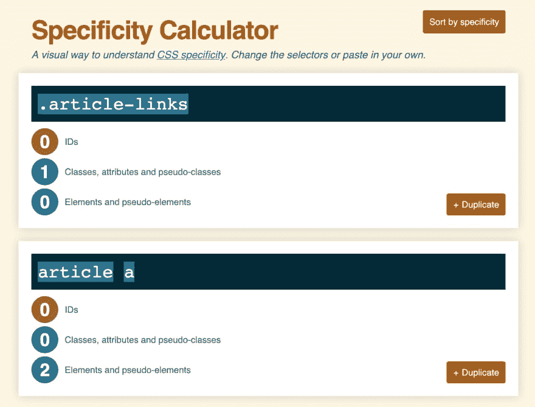
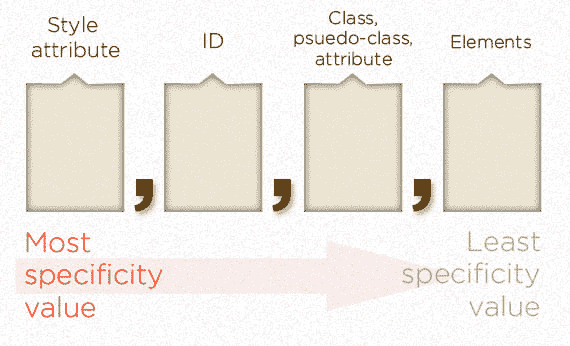
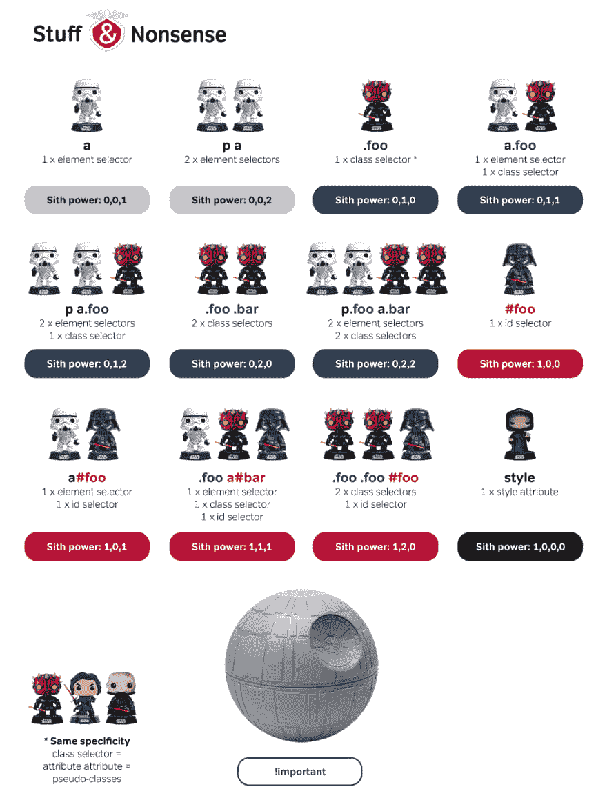
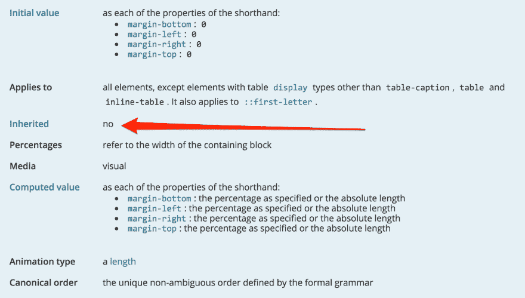
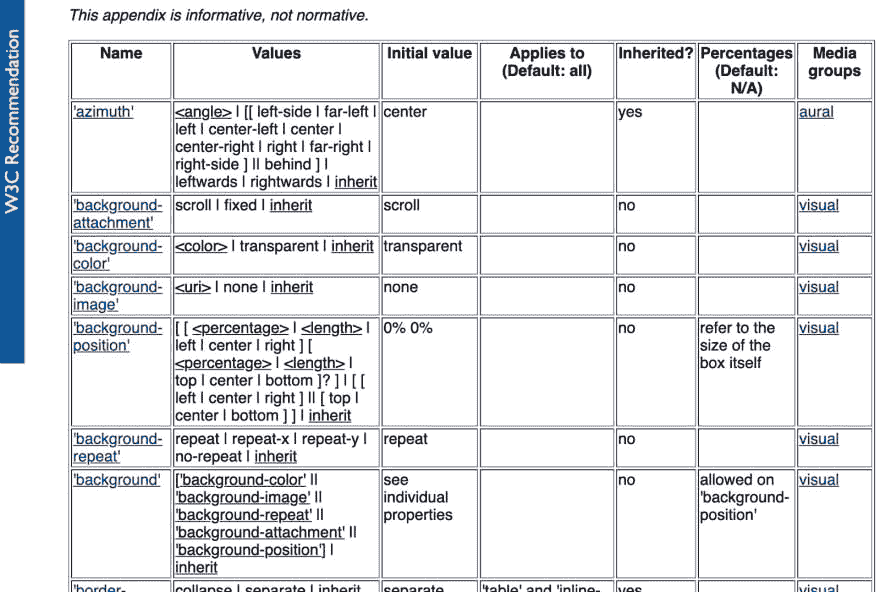
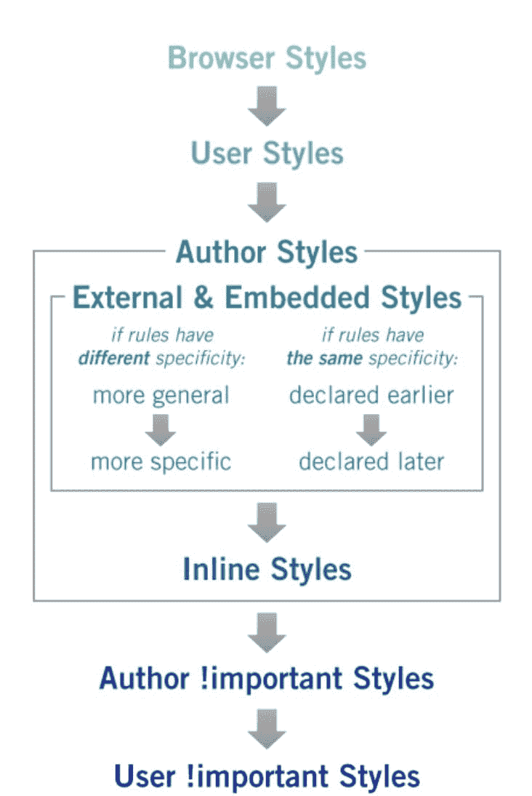
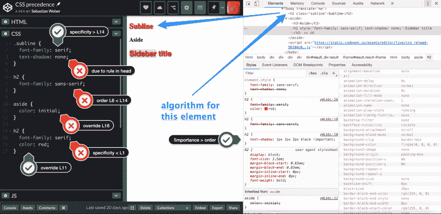

# CSS 样式如何应用于 HTML 元素？了解级联！

> 原文：<https://dev.to/doppelmutzi/understand-how-css-styles-are-applied-to-html-elements-by-learning-the-fundamentals-precedence-specificity-cascade-de4>

通常，从 CSS 开始你的旅程需要一个陡峭的学习曲线。然而，掌握 CSS 是困难的，因为它本身是一个如此广泛的话题。应用领域是多样化的，因此理解基础知识有助于您成为一名更有生产力的开发人员。

当然，在大多数情况下，有一个或多或少的了解就足够了。在大多数情况下，应用试错法直到你的选择器达到你的要求。然而，在大型项目中，如果不理解 CSS 中的优先级，你迟早会遇到副作用或其他奇怪的错误。

[](https://i.giphy.com/media/yYSSBtDgbbRzq/giphy.gif)

# 优先

作为提醒，看一下 CSS 规则的结构。
[T3】](https://res.cloudinary.com/practicaldev/image/fetch/s--9iijopr4--/c_limit%2Cf_auto%2Cfl_progressive%2Cq_auto%2Cw_880/https://developer.mozilla.org/%40api/deki/files/6167/%3Dcss_syntax_-_ruleset.png)

如果多个 CSS 规则针对同一个 HTML 元素，并且这些规则构成了具有一个或多个相互 CSS 属性的定义，那么浏览器最终会应用哪些样式呢？这就是 CSS 优先级发挥作用的地方。

例子有助于使复杂的情况更容易理解。看看下面的代码片段(或者使用 [Codepen](https://codepen.io/doppelmutzi/pen/yWLbbL) )。

```
<!-- HTML template code -->

<h2 class="subline">subline</h2>
<aside>
  <h2>sidebar title</h2>
</aside> 
```

```
/* some styles to target h2 elements */

.subline {
  font-family: serif;
}
h2 {
  font-family: sans-serif;
}
aside {
  color: red;
} 
```

最后，侧边栏标题元素应用了无衬线和红色字体。subline 元素具有黑色衬线字体。

这里发生了几件有趣的事情。没有选择器明确地以`h2`元素为目标来分配字体颜色。然而，工具条标题的红色被它的父元素(`aside`)继承了。subline 元素没有应用第二个 CSS `font-family`声明(`h2`选择器)，因为浏览器认为`.subline`选择器更具体。

所有这些方面都被考虑在内，以确定每个 DOM 元素必须应用哪些 CSS 声明。如果发现具有相同 CSS 属性(`color`)的多个 CSS 声明(例如`font-family: serif;`和`font-family: sans-serif;`)以特定 DOM 元素(例如侧边栏标题)为目标，则浏览器创建优先顺序。因此，具有最高优先级的属性值被应用。

从这个简单的例子中可以看出，在决定实际 CSS 样式的浏览器过程中，许多方面都发挥了作用。更具体地说，以下概念是优先算法的一部分:

*   特征
*   遗产
*   瀑布

# 特异性

看看下面的 [CSS 片段](https://codepen.io/doppelmutzi/pen/WZavOm)。它显示了一组选择器来设计`li`元素的样式。

```
 .challenge li::before {
  content: '😃';
  margin-right: .25em;
  vertical-align: middle;
}

.challenge > ul li::before {
  content: '😴';
}

ul[data-smiley='crying'] > li::before {
  content: '😭';
} 
```

相应的 HTML 元素如下所示。

```
<main class="challenge">
  <ul class="list">
    <li>1.1</li>
      <ul class="list">
        <li>2.1</li>
        <li>2.2</li>
        <ul class="list" data-smiley="crying">
          <li>3.1</li>
          <li>3.2</li>
          <li>3.3</li>
        </ul>
        <li>2.3</li>
      </ul>
    <li>1.2</li>
    <li>1.3</li>
  </ul>
</main> 
```

如果指定多个选择器来定位同一个 HTML 元素，浏览器会选择具有最高[特异性](https://www.w3.org/TR/selectors-3/#specificity)值的选择器。

选择器特异性是什么？特异性构成了每个 CSS 声明块相对于其他声明块的重要性，这是基于它的选择器是由什么组成的。理解特异性仅与选择器相关是很重要的。这意味着，实际的 CSS 声明块与特定性的上下文无关。然而，特异性值是由级联算法计算的，以将这些 CSS 声明块按某种重要性顺序排列。基于此，确定应用于 HTML 元素的样式。

[特异性计算器](https://specificity.keegan.st/)是一个很好的在线工具，构成了理解这一概念的可视化方式。

[](https://res.cloudinary.com/practicaldev/image/fetch/s--NMxyALjf--/c_limit%2Cf_auto%2Cfl_progressive%2Cq_auto%2Cw_880/https://thepracticaldev.s3.amazonaws.com/i/y1azmd2bqqd6wq51i3iy.jpg)

第一个选择器具有更高的特异性，因为类比元素更具体。

你可以把选择器特异性想象成一个由 4 个元素组成的行向量，如 CSS 技巧的[图所示。](https://css-tricks.com/wp-content/csstricks-uploads/specificity-calculationbase.png)

[](https://res.cloudinary.com/practicaldev/image/fetch/s--TIfsgPwL--/c_limit%2Cf_auto%2Cfl_progressive%2Cq_auto%2Cw_880/https://css-tricks.com/wp-content/csstricks-uploads/specificity-calculationbase.png)

考虑下面的例子:

*   选择器 1 (0，1，0，0)赢了选择器 2 (0，0，0，41)
*   选择器 1 (0，2，0，1)赢了选择器 2 (0，1，2，15)

看一下下面的例子，它包含两个特例。

```
 * {
    color: red;
  }

  h1#title {
    color: blue;
  }

  h1 {
    color: green !important;
  } 
```

通用选择器(`*`)的特异性为(0，0，0，0)。`!important`关键字胜过一切，因此要小心使用(或者最好不要使用)。在这个例子中，每个`h1`元素都是绿色的，即使是 id 为`title`的元素也是如此。要覆盖这样的声明，您唯一的机会是用`!important`指定另一个声明，因此顺序是相关的。

10 年前，安迪·克拉克发表了一篇很棒的文章，通过《星球大战》解释了选择者特异性。

[](https://res.cloudinary.com/practicaldev/image/fetch/s--MbG9zBMp--/c_limit%2Cf_auto%2Cfl_progressive%2Cq_auto%2Cw_880/https://thepracticaldev.s3.amazonaws.com/i/3dms0tmqdmqp43j30mj7.jpg)

这是一种学习特异性概念的有趣方式。我也推荐 Emma Wedekind 的[关于 CSS 特异性的深度讲解](https://dev.to/emmawedekind/css-specificity-1kca)。

# 继承

继承控制如果没有为元素定义 CSS 属性值时会发生什么。更准确地说，继承机制将 CSS 属性值从父元素传播到其子元素。然而，并不是每个属性值都会被继承。MDN 的 CSS 属性引用可用于确定特定属性的值是否被继承。从下面的截图可以看出，`margin`在默认情况下不会被继承。

[](https://res.cloudinary.com/practicaldev/image/fetch/s--jz4T2Ys3--/c_limit%2Cf_auto%2Cfl_progressive%2Cq_auto%2Cw_880/https://thepracticaldev.s3.amazonaws.com/i/vhpat6ktn8xz0julo6my.png)

W3C 提供了一个包含所有 CSS 属性和继承信息的综合列表。

[](https://res.cloudinary.com/practicaldev/image/fetch/s--ikyHb1xW--/c_limit%2Cf_auto%2Cfl_progressive%2Cq_auto%2Cw_880/https://thepracticaldev.s3.amazonaws.com/i/nsbjfhgi86n0eaylzbdm.jpg)

考虑下面的例子。

```
<article>
  <h2>Title</h2>
  <p>Lorem Ipsum</p>
</article> 
```

```
article {
  margin: 10px;
}

p {
  margin: inherit;
} 
```

通过使用`inherit`关键字，`article`元素的`margin`属性值被传播到`p`元素。相反，`h2`元素不会继承其父元素的`margin`值，因为默认情况下`margin`不会被继承。

下面的 [Codepen](https://codepen.io/doppelmutzi/pen/NaOGER?editors=1100) 构成了一个更全面的 CSS 继承的例子。

[https://codepen.io/doppelmutzi/embed/NaOGER?height=600&default-tab=result&embed-version=2](https://codepen.io/doppelmutzi/embed/NaOGER?height=600&default-tab=result&embed-version=2)

# 梯级

CSS 代表*级联样式表*，所以级联发挥重要作用也就不足为奇了。该算法为所有 CSS 声明计算上述优先级。因此，它还考虑了特殊性和继承性，以确定将哪些样式应用于 HTML 文档的每个 HTML 元素。

简化的算法看起来是这样的(完整的细节参考 [W3C 规范](https://www.w3.org/TR/CSS2/cascade.html#cascade))。对每个 HTML 元素执行该算法:

*   收集每个与当前 HTML 元素相关的 CSS 声明。
*   按照*原产地*和*重量*对这些申报单进行分类。
    *   原点指的是指定声明的位置(例如，作为`style`属性的内联样式或在外部定义的样式表文件中)。
    *   权重等于声明的重要性，即作者风格(我们开发人员提供的风格) >用户风格(最终用户指定的风格，如火狐中的[)>浏览器默认(如大多数桌面浏览器将`16px`定义为`html`元素的默认`font-size`)。](https://davidwalsh.name/firefox-user-stylesheet)
    *   以下规则对*作者样式*有效:内嵌样式>在外部文件的`head`元素>样式部分中定义的样式
    *   `!importance`(例如`p { color: red !important; }`)构成了比普通 CSS 声明更高的权重。
*   按照特性值(列表顶部的最高值)对所有以当前 HTML 元素为目标的选择器进行排序。
*   如果两个 CSS 声明对于上述所有规则都是相等的，那么在文档流方面，后面指定的声明获胜。所以*命令*在这种情况下起到了平局决胜的作用。顺序包括集成样式的位置:集成在`head`元素中的外部样式表，以及从外部样式表文件中导入的样式表(带有`@import`声明)。

下面的[图](https://srjcstaff.santarosa.edu/~tfleming/htmlb/CSS_Cheat_Sheet_Inheritance_Cascade_Specificity.pdf)简单解释了算法。

[](https://res.cloudinary.com/practicaldev/image/fetch/s--uO9rb1pM--/c_limit%2Cf_auto%2Cfl_progressive%2Cq_auto%2Cw_880/https://thepracticaldev.s3.amazonaws.com/i/hjvljlbpjwp83y9bavcd.png)

让我们简单讨论一下级联效应对继承的影响。如果一个元素的两个祖先具有相同的属性，并且由于继承而沿着文档树向下传播，会发生什么情况？最后，应用最接近该元素的祖先的属性值。

如果你想从另一个角度看这个瀑布，我推荐本杰明·约翰逊的文章。

# 利用浏览器开发工具

现代浏览器的开发工具对于理解本文中阐述的概念非常有帮助。下一个带注释的屏幕截图显示了关于继承和优先级的信息(划掉的声明，样式的起源，等等。)是由 Chrome 开发工具可视化的。

[](https://res.cloudinary.com/practicaldev/image/fetch/s--m7PeluzN--/c_limit%2Cf_auto%2Cfl_progressive%2Cq_auto%2Cw_880/https://thepracticaldev.s3.amazonaws.com/i/zpscnw37lc6adq8y9wfj.jpg)

这张图片构成了一个带有注释的 Codepen 的截屏，以显示算法应用或不应用哪个 CSS 声明的原因。具体来说，注释表示对`<h2 class=”subline”>Subline</h2>`元素的分析(用蓝色箭头标记)。

# 总结经验教训

cascade 是管理来自多个来源的样式的系统，并确定在冲突的情况下什么声明优先。级联算法考虑直接应用于 HTML 元素的样式以及未显式定义的 HTML 元素的样式(即，继承的样式)。

尤其对于初学者来说，可能不清楚级联从不同的来源“收集”样式:显式定义的、继承的、默认的样式等等。

在我看来，对级联算法的深刻理解是成为一名优秀 Web 开发人员的关键。如果您了解浏览器如何将样式应用于 HTML 元素，您可以避免开发项目中的挫折(例如，不需要的应用样式或副作用)。

事实证明，级联算法其实很好理解和记忆。大多数时候，您只需要处理作者风格，因此需要记住的规则数量并不多。如果你熟悉*特异性*和*遗传性*，你就可以开始了。此外，如果你有一个好的 CSS 设计，你不需要考虑太多的文档流，因为你很可能不会在你的样式表文件中散布样式。